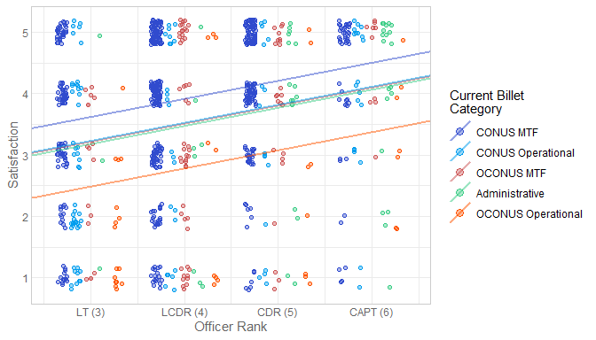
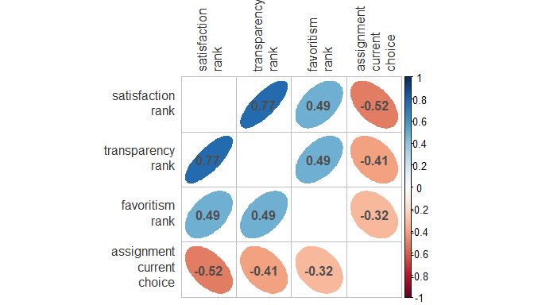

Code repository for the article,

## Attitudes Regarding the Position Assignment Process Among Active-Duty Navy Physicians

[Richard Childers](hhttps://www.researchgate.net/profile/Richard_Childers3)[1](https://emergencymed.ucsd.edu/faculty/index.html)[2](https://emergencymed.ucsd.edu/faculty/index.html),
[William H. Beasley](http://scholar.google.com/citations?user=ffsJTC0AAAAJ&hl=en)[3](https://ouhsc.edu/bbmc/)

Organization 1: [Department of Emergency Medicine](https://emergencymed.ucsd.edu/faculty/index.html), San Diego;
Organization 2: Retired [US Navy ....]()
Organization 3: [Biomedical & Behavioral Methodology Core](https://ouhsc.edu/bbmc/), [University of Oklahoma College of Medicine](https://medicine.ouhsc.edu/), Oklahoma City.

> *Abstract* The process of assigning positions to officers in the military is complex. While general guidance is available, there is no prescribed formalized decision-making process when making assignments. We completed a survey of the Navy Medical Corps to obtain baseline perceptions about the assignment process prior to initiating a quality improvement project. On a five-point Likert scale, with 5 being the most satisfied, the mean for overall satisfaction with the assignment process for the entire cohort, weighted for specialty, was 3.4. In regression analysis, physician specialty, current billet, and rank were found to predict overall satisfaction. The highest priority positions to fill in the Navy are overseas and with operational units, yet these are the least popular among Navy physicians. This survey provides a baseline measure which can be used for comparison after future interventions and provides descriptive insight into attitudes among officers into the assignment system.

**Figure 1**

**Figure 2**

**Correlation among Outcomes**

View the entire [analysis report](https://raw.githack.com/OuhscBbmc/usnavy-assignment-survey-1/master/analysis/survey-response-2/survey-response-2.html) that includes additional graphs and model diagnostics that didn't fit in the article.
