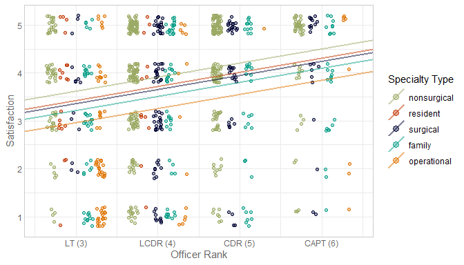

Code repository for the article,

## Attitudes Regarding the Position Assignment Process Among Active-Duty Navy Physicians

Richard Childers 1, 
Alicea Mingo 2, 
Joel Schofer 3, 
Naomi Utgoff 4, 
[William Howard Beasley](https://orcid.org/0000-0002-5613-5006) 5

> *Abstract* The United States Navy (USN) assigns personnel to jobs via assignments officers;
> placement guidance exists but the process is decentralized.
> Participant attitudes towards and limited experience with market design are possible impediments to its incorporation into the assignment process.
> We investigate the appetite for the use of the deferred acceptance during the assignment process.
> We implemented a pilot project incorporating deferred acceptance into 231 assignments of 174 USN physicians to 23 commands.
> Pre-intervention, we surveyed physicians to obtain baseline perceptions of the traditional assignment process;
> post-intervention we surveyed pilot project participants.
> Only 38.2% of pre-pilot survey respondents said they preferred assignment via deferred acceptance;
> in the post-pilot survey 78.7% of participating physicians and 87.8% of participating commands reported a desire to keep using deferred acceptance.
> Our study suggests that attitudes towards using market design in personnel assignment may improve with experience,
> facilitating broader acceptance of its usage in the future.

*Organizations*:

1. University of California, San Diego, USA <rchilders@health.ucsd.edu>
2. Bureau of Medicine and Surgery, United States Navy, USA <aliceamingo@yahoo.com>
3. US Navy Medicine Readiness and Training Command Guam Captain, Medical Corps, United States Navy <jschofer@gmail.com>
4. United States Naval Academy, USA <utgoff@usna.edu>
5. College of Medicine, University of Oklahoma Health Campus, USA <william-beasley@ou.edu>

**Figure 1**

**Figure 2**

**Correlation among Outcomes**

### Additional Resources

* The entire [analysis report](https://raw.githack.com/OuhscBbmc/usnavy-assignment-survey-1/master/analysis/survey-response-2/survey-response-2.html), which includes additional graphs and model diagnostics that didn't fit in the article.
* The [survey questionnaire](documentation/survey-with-univariate-stats.pdf), including the responses and response rates for the following items:

  1. What is your primary specialty?
  1. What is your rank?
  1. What year did you execute orders for your current billet? (Consider retour orders the same as a PCS set of orders.)
  1. How would you describe your current billet?
  1. For your last set of orders, how many months prior to your move were your orders released? That is, how many months did you have to prepare for your PCS?
  1. On a scale of 1 to 5, with 1 being not transparent and 5 being very transparent, how would you rate the transparency of your detailing experience for your last set of orders?
  1. On a scale of 1 to 5, with 1 being unsatisfied and 5 being very satisfied, how would you rate your overall detailing experience for your last set of orders?
  1. On a scale of 1 to 5, with 1 representing a significant problem and 5 being not a problem at all, how would you rank the problem of favoritism in the billet assignment process?
  1. Describe your current assignment:
  1. Please rank your desired billet locations with the top level being the most desireable, and the bottom being the least desireable. [Ranking 1, 2, ..., 9]
  1. Which career path do you want to pursue in the next 5-10 years?
  1. Neither the Army nor the Air Force have physicians in the detailer role. Instead, they have nurses or medical administrators work with specialty leaders to determine assignments. This is different from the current Navy Medical Corps billet assignment process where the detailer is a physician*. Would you approve if the detailer position was filled by a non-physician?
  1. How long should an individual be allowed to remain at one command?
  1. Do you think that there is a problem in the Medical Corps with members not moving? That is, are there too many physicians who get to stay in one place too long?
  1. Civilian medical residency positions are assigned using the National Residency Match Program where members submit a preference list, residency directors submit a preference list, and a computer algorithm optimizes a match. This is different from the current Navy Medical Corps billet assignment process where the detailer and specialty leader take input from medical officers and then make a decision. Of these two options, which would you prefer for your military billet assignment?
  1. The later the match day, the more information one has before creating their rank list. The earlier the match day, the sooner one can have certainty and prepare. Assuming your were scheduled to execute new orders in July of 2017, what month would you want the match to occur in?
  1. Do you think members who are coming from operational or OCONUS assignments should be given preference in billet assignment?
  1. Do you think members with more seniority (as defined by time in service or rank) should be given preference in billet assignment?
  1. Any last thoughts or input regarding the billet assignment process?
