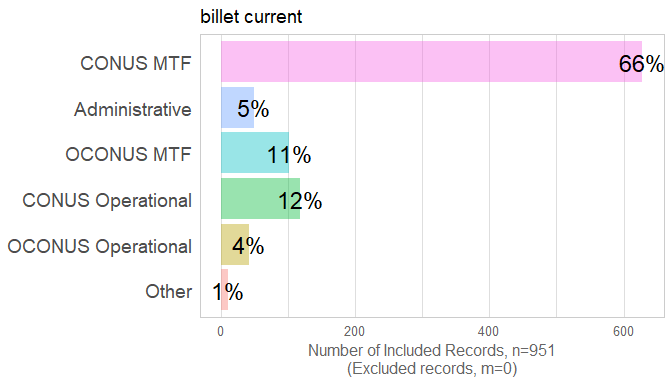
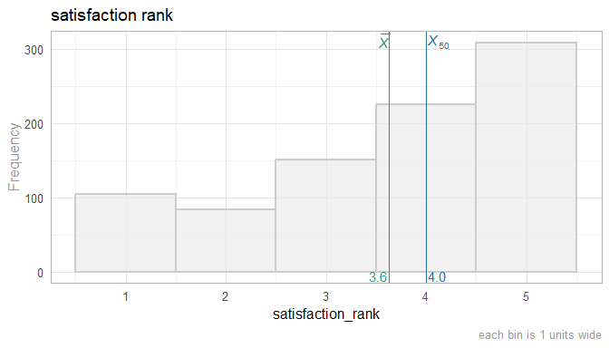
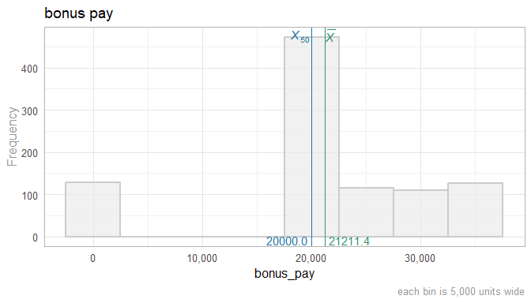
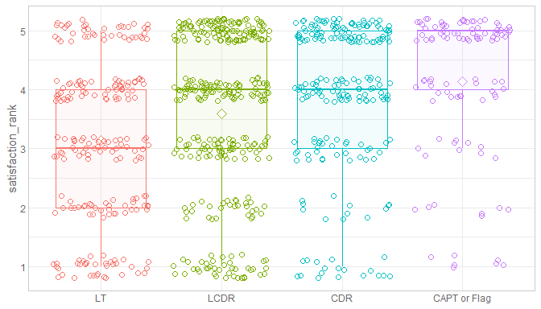
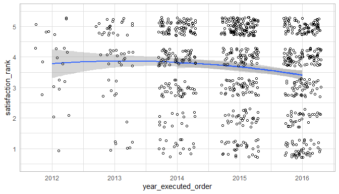

This report covers the survey about attitudes collected by Richard Childers, MD and Joel Schofer, MD.

<!--  Set the working directory to the repository's base directory; this assumes the report is nested inside of two directories.-->


<!-- Set the report-wide options, and point to the external code file. -->


<!-- Load 'sourced' R files.  Suppress the output when loading sources. --> 


<!-- Load packages, or at least verify they're available on the local machine.  Suppress the output when loading packages. --> 


<!-- Load any global functions and variables declared in the R file.  Suppress the output. --> 


<!-- Declare any global functions specific to a Rmd output.  Suppress the output. --> 


<!-- Load the datasets.   -->


<!-- Tweak the datasets.   -->


# Summary {.tabset .tabset-fade .tabset-pills}

## Notes 
1. The current report covers 951 responses.
1. We excluded 17 cases because their orders preceded the year 2012 and 26 cases because the `year_executed_order` value was missing.

## Unanswered Questions

## Answered Questions

# Graphs

## Marginals
<!-- --><!-- --><!-- --><!-- --><!-- --><!-- --><!-- --><!-- --><!-- --><!-- --><!-- --><!-- --><!-- -->

## Scatterplots


Analyses
============================================

By Rank
-----------------------------------


```
### satistfaction_rank
```

<!-- -->

```

Call:
lm(formula = satistfaction_rank ~ 1 + officer_rate_f, data = ds)

Residuals:
    Min      1Q  Median      3Q     Max 
-3.1296 -0.9315  0.4091  1.0685  1.8639 

Coefficients:
                Estimate Std. Error t value Pr(>|t|)
(Intercept)      3.13615    0.09033  34.720  < 2e-16
officer_rate_f4  0.45476    0.11587   3.925 9.37e-05
officer_rate_f5  0.79536    0.12686   6.269 5.71e-10
officer_rate_f6  0.99348    0.15572   6.380 2.89e-10

Residual standard error: 1.318 on 866 degrees of freedom
  (81 observations deleted due to missingness)
Multiple R-squared:  0.06191,	Adjusted R-squared:  0.05866 
F-statistic: 19.05 on 3 and 866 DF,  p-value: 5.713e-12
```

```
### transparency_rank
```

<!-- -->

```

Call:
lm(formula = transparency_rank ~ 1 + officer_rate_f, data = ds)

Residuals:
    Min      1Q  Median      3Q     Max 
-2.9444 -0.9019  0.2009  1.2009  2.0981 

Coefficients:
                Estimate Std. Error t value Pr(>|t|)
(Intercept)       2.9019     0.0924  31.407  < 2e-16
officer_rate_f4   0.5921     0.1183   5.003 6.82e-07
officer_rate_f5   0.8972     0.1299   6.906 9.61e-12
officer_rate_f6   1.0426     0.1595   6.535 1.08e-10

Residual standard error: 1.352 on 871 degrees of freedom
  (76 observations deleted due to missingness)
Multiple R-squared:  0.06859,	Adjusted R-squared:  0.06538 
F-statistic: 21.38 on 3 and 871 DF,  p-value: 2.278e-13
```

```
### favoritism_rank
```

<!-- -->

```

Call:
lm(formula = favoritism_rank ~ 1 + officer_rate_f, data = ds)

Residuals:
    Min      1Q  Median      3Q     Max 
-2.4190 -1.1216 -0.1216  1.2297  1.8784 

Coefficients:
                Estimate Std. Error t value Pr(>|t|)
(Intercept)       3.1216     0.1092  28.575   <2e-16
officer_rate_f4   0.2029     0.1334   1.521   0.1286
officer_rate_f5   0.2582     0.1429   1.807   0.0712
officer_rate_f6   0.2974     0.1696   1.754   0.0798

Residual standard error: 1.329 on 759 degrees of freedom
  (188 observations deleted due to missingness)
Multiple R-squared:  0.005615,	Adjusted R-squared:  0.001685 
F-statistic: 1.429 on 3 and 759 DF,  p-value: 0.2331
```

```
### assignment_current_choice
```

<!-- -->

```

Call:
lm(formula = assignment_current_choice ~ 1 + officer_rate_f, 
    data = ds)

Residuals:
    Min      1Q  Median      3Q     Max 
-0.8177 -0.6507 -0.4040  0.3493  3.6080 

Coefficients:
                Estimate Std. Error t value Pr(>|t|)
(Intercept)      1.81771    0.08084  22.484  < 2e-16
officer_rate_f4 -0.16702    0.10408  -1.605 0.108957
officer_rate_f5 -0.42575    0.11332  -3.757 0.000185
officer_rate_f6 -0.41367    0.13860  -2.985 0.002929

Residual standard error: 1.12 on 778 degrees of freedom
  (169 observations deleted due to missingness)
Multiple R-squared:  0.02228,	Adjusted R-squared:  0.01851 
F-statistic: 5.908 on 3 and 778 DF,  p-value: 0.0005478
```

By Year
-----------------------------------


```
### satistfaction_rank
```

<!-- -->


# Session Information
For the sake of documentation and reproducibility, the current report was rendered in the following environment.  Click the line below to expand.

<details>
  <summary>Environment <span class="glyphicon glyphicon-plus-sign"></span></summary>

```
Session info --------------------------------------------------------------------------------------
```

```
 setting  value                                      
 version  R version 3.5.0 Patched (2018-05-14 r74725)
 system   x86_64, mingw32                            
 ui       RTerm                                      
 language (EN)                                       
 collate  English_United States.1252                 
 tz       America/Chicago                            
 date     2018-06-10                                 
```

```
Packages ------------------------------------------------------------------------------------------
```

```
 package         * version     date       source                                  
 assertthat        0.2.0       2017-04-11 CRAN (R 3.5.0)                          
 backports         1.1.2       2017-12-13 CRAN (R 3.5.0)                          
 base            * 3.5.0       2018-05-15 local                                   
 bindr             0.1.1       2018-03-13 CRAN (R 3.5.0)                          
 bindrcpp        * 0.2.2       2018-03-29 CRAN (R 3.5.0)                          
 colorspace        1.3-2       2016-12-14 CRAN (R 3.5.0)                          
 compiler          3.5.0       2018-05-15 local                                   
 datasets        * 3.5.0       2018-05-15 local                                   
 devtools          1.13.5      2018-02-18 CRAN (R 3.5.0)                          
 digest            0.6.15      2018-01-28 CRAN (R 3.5.0)                          
 dplyr             0.7.5       2018-05-19 CRAN (R 3.5.0)                          
 evaluate          0.10.1      2017-06-24 CRAN (R 3.5.0)                          
 ggplot2         * 2.2.1       2016-12-30 CRAN (R 3.5.0)                          
 glue              1.2.0       2017-10-29 CRAN (R 3.5.0)                          
 graphics        * 3.5.0       2018-05-15 local                                   
 grDevices       * 3.5.0       2018-05-15 local                                   
 grid              3.5.0       2018-05-15 local                                   
 gtable            0.2.0       2016-02-26 CRAN (R 3.5.0)                          
 hms               0.4.2.9000  2018-05-30 Github (tidyverse/hms@14e74ab)          
 htmltools         0.3.6       2017-04-28 CRAN (R 3.5.0)                          
 knitr           * 1.20        2018-02-20 CRAN (R 3.5.0)                          
 labeling          0.3         2014-08-23 CRAN (R 3.5.0)                          
 lazyeval          0.2.1       2017-10-29 CRAN (R 3.5.0)                          
 magrittr        * 1.5         2014-11-22 CRAN (R 3.5.0)                          
 memoise           1.1.0       2017-04-21 CRAN (R 3.5.0)                          
 methods         * 3.5.0       2018-05-15 local                                   
 munsell           0.4.3       2016-02-13 CRAN (R 3.5.0)                          
 pillar            1.2.3       2018-05-25 CRAN (R 3.5.0)                          
 pkgconfig         2.0.1       2017-03-21 CRAN (R 3.5.0)                          
 plyr              1.8.4       2016-06-08 CRAN (R 3.5.0)                          
 purrr             0.2.5       2018-05-29 CRAN (R 3.5.0)                          
 R6                2.2.2       2017-06-17 CRAN (R 3.5.0)                          
 Rcpp              0.12.17     2018-05-18 CRAN (R 3.5.0)                          
 readr             1.2.0       2018-05-30 Github (tidyverse/readr@d6d622b)        
 rlang             0.2.1       2018-05-30 CRAN (R 3.5.0)                          
 rmarkdown         1.9         2018-03-01 CRAN (R 3.5.0)                          
 rprojroot         1.3-2       2018-01-03 CRAN (R 3.5.0)                          
 scales            0.5.0       2017-08-24 CRAN (R 3.5.0)                          
 stats           * 3.5.0       2018-05-15 local                                   
 stringi           1.2.2       2018-05-02 CRAN (R 3.5.0)                          
 stringr           1.3.1       2018-05-10 CRAN (R 3.5.0)                          
 TabularManifest   0.1-16.9003 2018-05-23 Github (Melinae/TabularManifest@c2bdddb)
 tibble            1.4.2       2018-01-22 CRAN (R 3.5.0)                          
 tidyr             0.8.1       2018-05-18 CRAN (R 3.5.0)                          
 tidyselect        0.2.4       2018-02-26 CRAN (R 3.5.0)                          
 tools             3.5.0       2018-05-15 local                                   
 utils           * 3.5.0       2018-05-15 local                                   
 withr             2.1.2       2018-03-15 CRAN (R 3.5.0)                          
 yaml              2.1.19      2018-05-01 CRAN (R 3.5.0)                          
```
</details>


Report rendered by Will at 2018-06-10, 13:31 -0500 in 8 seconds.

