This report covers the survey about attitudes collected by Richard Childers, MD and Joel Schofer, MD.

<!--  Set the working directory to the repository's base directory; this assumes the report is nested inside of two directories.-->


<!-- Set the report-wide options, and point to the external code file. -->


<!-- Load 'sourced' R files.  Suppress the output when loading sources. --> 


<!-- Load packages, or at least verify they're available on the local machine.  Suppress the output when loading packages. --> 


<!-- Load any global functions and variables declared in the R file.  Suppress the output. --> 


<!-- Declare any global functions specific to a Rmd output.  Suppress the output. --> 


<!-- Load the datasets.   -->


<!-- Tweak the datasets.   -->


Summary {.tabset .tabset-fade .tabset-pills}
============================================

Notes 
-----------------------------------

1. The current report covers 951 responses.
1. We excluded 17 cases because their orders preceded the year 2012 and 26 cases because the `year_executed_order` value was missing.

Unanswered Questions
-----------------------------------

Answered Questions
-----------------------------------

Histograms
============================================

Univariate
-----------------------------------


```
Warning: Factor `iv` contains implicit NA, consider using `forcats::fct_explicit_na`
```


```
Warning: Factor `iv` contains implicit NA, consider using `forcats::fct_explicit_na`
```

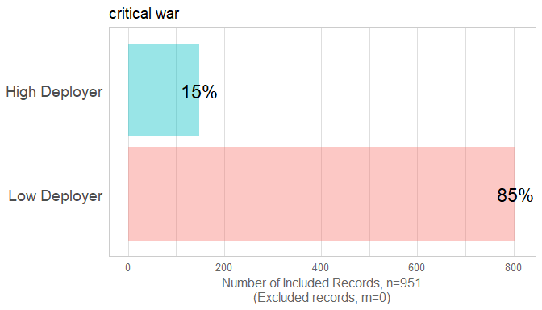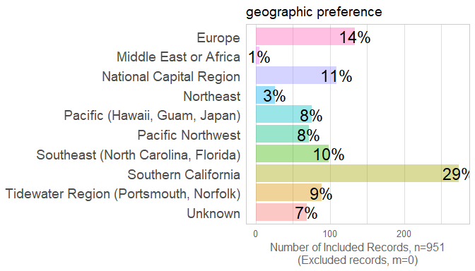

```
Warning: Factor `iv` contains implicit NA, consider using `forcats::fct_explicit_na`
```

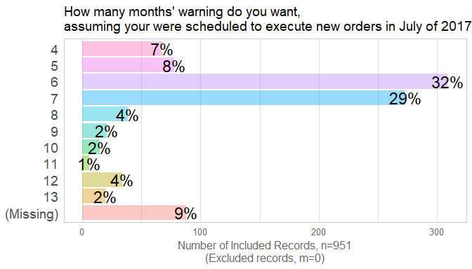

Frequency: homestead_length_in_years by officer_rank
-----------------------------------
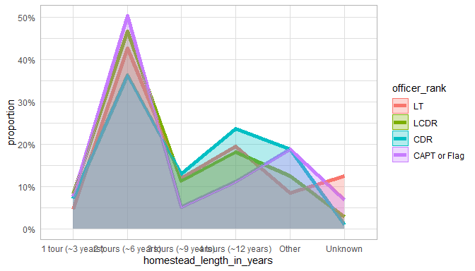

Frequency: homestead_length_in_years by specialty_type
-----------------------------------


Frequency: homestead_problem by officer_rank
-----------------------------------


Frequency: homestead_problem by specialty_type
-----------------------------------
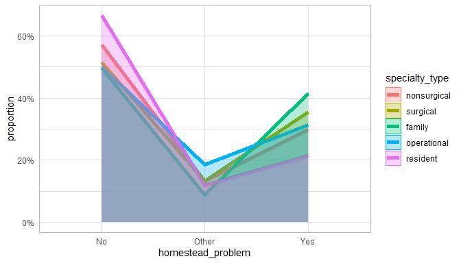

Frequency: Assignment_priority by Specialty_type
-----------------------------------
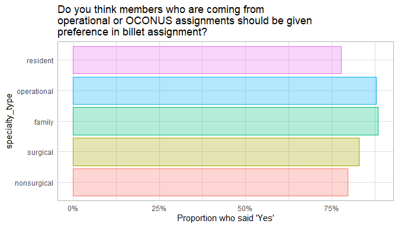<br/>Data:<code> ds </code><br/>Formula:<code> ~ assignment_priority 1 + specialty_type </code><table class="table table-striped table-hover table-condensed table-responsive" style="width: auto !important; ">
 <thead>
  <tr>
   <th style="text-align:left;"> term </th>
   <th style="text-align:right;"> estimate </th>
   <th style="text-align:right;"> std.error </th>
   <th style="text-align:right;"> statistic </th>
   <th style="text-align:right;"> p.value </th>
  </tr>
 </thead>
<tbody>
  <tr>
   <td style="text-align:left;"> (Intercept) </td>
   <td style="text-align:right;"> 1.3588117 </td>
   <td style="text-align:right;"> 0.1230616 </td>
   <td style="text-align:right;"> 11.0417196 </td>
   <td style="text-align:right;"> 0.0000000 </td>
  </tr>
  <tr>
   <td style="text-align:left;"> specialty_typesurgical </td>
   <td style="text-align:right;"> 0.2241929 </td>
   <td style="text-align:right;"> 0.2599057 </td>
   <td style="text-align:right;"> 0.8625933 </td>
   <td style="text-align:right;"> 0.3883611 </td>
  </tr>
  <tr>
   <td style="text-align:left;"> specialty_typefamily </td>
   <td style="text-align:right;"> 0.6780702 </td>
   <td style="text-align:right;"> 0.2791850 </td>
   <td style="text-align:right;"> 2.4287484 </td>
   <td style="text-align:right;"> 0.0151510 </td>
  </tr>
  <tr>
   <td style="text-align:left;"> specialty_typeoperational </td>
   <td style="text-align:right;"> 0.6290626 </td>
   <td style="text-align:right;"> 0.3589444 </td>
   <td style="text-align:right;"> 1.7525349 </td>
   <td style="text-align:right;"> 0.0796819 </td>
  </tr>
  <tr>
   <td style="text-align:left;"> specialty_typeresident </td>
   <td style="text-align:right;"> -0.1060487 </td>
   <td style="text-align:right;"> 0.4193546 </td>
   <td style="text-align:right;"> -0.2528856 </td>
   <td style="text-align:right;"> 0.8003566 </td>
  </tr>
</tbody>
</table>

<table class="table table-striped table-hover table-condensed table-responsive" style="width: auto !important; ">
 <thead>
  <tr>
   <th style="text-align:right;"> null.deviance </th>
   <th style="text-align:right;"> df.null </th>
   <th style="text-align:right;"> logLik </th>
   <th style="text-align:right;"> AIC </th>
   <th style="text-align:right;"> BIC </th>
   <th style="text-align:right;"> deviance </th>
   <th style="text-align:right;"> df.residual </th>
  </tr>
 </thead>
<tbody>
  <tr>
   <td style="text-align:right;"> 754.3152 </td>
   <td style="text-align:right;"> 815 </td>
   <td style="text-align:right;"> -372.6514 </td>
   <td style="text-align:right;"> 755.3028 </td>
   <td style="text-align:right;"> 778.8249 </td>
   <td style="text-align:right;"> 745.3028 </td>
   <td style="text-align:right;"> 811 </td>
  </tr>
</tbody>
</table>

Frequency: Officer_rank_priority by Officer_rank
-----------------------------------
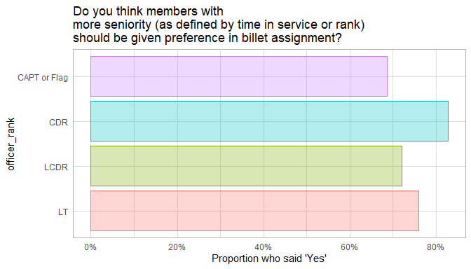<br/>Data:<code> ds </code><br/>Formula:<code> ~ officer_rank_priority 1 + officer_rank </code><table class="table table-striped table-hover table-condensed table-responsive" style="width: auto !important; ">
 <thead>
  <tr>
   <th style="text-align:left;"> term </th>
   <th style="text-align:right;"> estimate </th>
   <th style="text-align:right;"> std.error </th>
   <th style="text-align:right;"> statistic </th>
   <th style="text-align:right;"> p.value </th>
  </tr>
 </thead>
<tbody>
  <tr>
   <td style="text-align:left;"> (Intercept) </td>
   <td style="text-align:right;"> 1.1526795 </td>
   <td style="text-align:right;"> 0.1655664 </td>
   <td style="text-align:right;"> 6.9620373 </td>
   <td style="text-align:right;"> 0.0000000 </td>
  </tr>
  <tr>
   <td style="text-align:left;"> officer_rankLCDR </td>
   <td style="text-align:right;"> -0.2043494 </td>
   <td style="text-align:right;"> 0.2086735 </td>
   <td style="text-align:right;"> -0.9792783 </td>
   <td style="text-align:right;"> 0.3274425 </td>
  </tr>
  <tr>
   <td style="text-align:left;"> officer_rankCDR </td>
   <td style="text-align:right;"> 0.4159364 </td>
   <td style="text-align:right;"> 0.2488695 </td>
   <td style="text-align:right;"> 1.6713030 </td>
   <td style="text-align:right;"> 0.0946618 </td>
  </tr>
  <tr>
   <td style="text-align:left;"> officer_rankCAPT or Flag </td>
   <td style="text-align:right;"> -0.3671590 </td>
   <td style="text-align:right;"> 0.2727199 </td>
   <td style="text-align:right;"> -1.3462860 </td>
   <td style="text-align:right;"> 0.1782103 </td>
  </tr>
</tbody>
</table>

<table class="table table-striped table-hover table-condensed table-responsive" style="width: auto !important; ">
 <thead>
  <tr>
   <th style="text-align:right;"> null.deviance </th>
   <th style="text-align:right;"> df.null </th>
   <th style="text-align:right;"> logLik </th>
   <th style="text-align:right;"> AIC </th>
   <th style="text-align:right;"> BIC </th>
   <th style="text-align:right;"> deviance </th>
   <th style="text-align:right;"> df.residual </th>
  </tr>
 </thead>
<tbody>
  <tr>
   <td style="text-align:right;"> 905.4486 </td>
   <td style="text-align:right;"> 809 </td>
   <td style="text-align:right;"> -447.4729 </td>
   <td style="text-align:right;"> 902.9458 </td>
   <td style="text-align:right;"> 921.7339 </td>
   <td style="text-align:right;"> 894.9458 </td>
   <td style="text-align:right;"> 806 </td>
  </tr>
</tbody>
</table>


Multivariate
-----------------------------------


Relationships between Outcomes
============================================
<table>
 <thead>
  <tr>
   <th style="text-align:left;">   </th>
   <th style="text-align:right;"> satisfaction rank </th>
   <th style="text-align:right;"> transparency rank </th>
   <th style="text-align:right;"> favoritism rank </th>
   <th style="text-align:right;"> assignment current choice </th>
  </tr>
 </thead>
<tbody>
  <tr>
   <td style="text-align:left;"> satisfaction_rank </td>
   <td style="text-align:right;"> 1.000 </td>
   <td style="text-align:right;"> 0.771 </td>
   <td style="text-align:right;"> 0.486 </td>
   <td style="text-align:right;"> -0.519 </td>
  </tr>
  <tr>
   <td style="text-align:left;"> transparency_rank </td>
   <td style="text-align:right;"> 0.771 </td>
   <td style="text-align:right;"> 1.000 </td>
   <td style="text-align:right;"> 0.488 </td>
   <td style="text-align:right;"> -0.405 </td>
  </tr>
  <tr>
   <td style="text-align:left;"> favoritism_rank </td>
   <td style="text-align:right;"> 0.486 </td>
   <td style="text-align:right;"> 0.488 </td>
   <td style="text-align:right;"> 1.000 </td>
   <td style="text-align:right;"> -0.325 </td>
  </tr>
  <tr>
   <td style="text-align:left;"> assignment_current_choice </td>
   <td style="text-align:right;"> -0.519 </td>
   <td style="text-align:right;"> -0.405 </td>
   <td style="text-align:right;"> -0.325 </td>
   <td style="text-align:right;"> 1.000 </td>
  </tr>
</tbody>
</table>

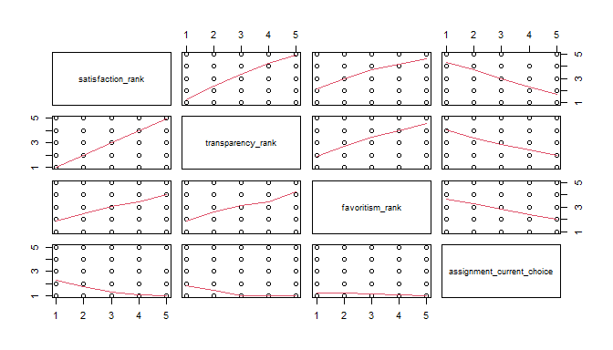


Analyses - 1 Predictor
============================================

By Rank
-----------------------------------
### satisfaction_rank

<br/>Data:<code> ds </code><br/>Formula:<code> ~ satisfaction_rank 1 + officer_rate_f </code><table class="table table-striped table-hover table-condensed table-responsive" style="width: auto !important; ">
 <thead>
  <tr>
   <th style="text-align:left;"> term </th>
   <th style="text-align:right;"> estimate </th>
   <th style="text-align:right;"> std.error </th>
   <th style="text-align:right;"> statistic </th>
   <th style="text-align:right;"> p.value </th>
  </tr>
 </thead>
<tbody>
  <tr>
   <td style="text-align:left;"> (Intercept) </td>
   <td style="text-align:right;"> 3.1361502 </td>
   <td style="text-align:right;"> 0.0903269 </td>
   <td style="text-align:right;"> 34.720017 </td>
   <td style="text-align:right;"> 0.00e+00 </td>
  </tr>
  <tr>
   <td style="text-align:left;"> officer_rate_f4 </td>
   <td style="text-align:right;"> 0.4547589 </td>
   <td style="text-align:right;"> 0.1158670 </td>
   <td style="text-align:right;"> 3.924834 </td>
   <td style="text-align:right;"> 9.37e-05 </td>
  </tr>
  <tr>
   <td style="text-align:left;"> officer_rate_f5 </td>
   <td style="text-align:right;"> 0.7953566 </td>
   <td style="text-align:right;"> 0.1268635 </td>
   <td style="text-align:right;"> 6.269388 </td>
   <td style="text-align:right;"> 0.00e+00 </td>
  </tr>
  <tr>
   <td style="text-align:left;"> officer_rate_f6 </td>
   <td style="text-align:right;"> 0.9934794 </td>
   <td style="text-align:right;"> 0.1557247 </td>
   <td style="text-align:right;"> 6.379715 </td>
   <td style="text-align:right;"> 0.00e+00 </td>
  </tr>
</tbody>
</table>

<table class="table table-striped table-hover table-condensed table-responsive" style="width: auto !important; ">
 <thead>
  <tr>
   <th style="text-align:right;"> r.squared </th>
   <th style="text-align:right;"> adj.r.squared </th>
   <th style="text-align:right;"> sigma </th>
   <th style="text-align:right;"> statistic </th>
   <th style="text-align:right;"> p.value </th>
   <th style="text-align:right;"> df </th>
   <th style="text-align:right;"> logLik </th>
   <th style="text-align:right;"> AIC </th>
   <th style="text-align:right;"> BIC </th>
   <th style="text-align:right;"> deviance </th>
   <th style="text-align:right;"> df.residual </th>
  </tr>
 </thead>
<tbody>
  <tr>
   <td style="text-align:right;"> 0.0619066 </td>
   <td style="text-align:right;"> 0.0586569 </td>
   <td style="text-align:right;"> 1.318277 </td>
   <td style="text-align:right;"> 19.04967 </td>
   <td style="text-align:right;"> 0 </td>
   <td style="text-align:right;"> 4 </td>
   <td style="text-align:right;"> -1472.875 </td>
   <td style="text-align:right;"> 2955.751 </td>
   <td style="text-align:right;"> 2979.593 </td>
   <td style="text-align:right;"> 1504.982 </td>
   <td style="text-align:right;"> 866 </td>
  </tr>
</tbody>
</table>### transparency_rank

<br/>Data:<code> ds </code><br/>Formula:<code> ~ transparency_rank 1 + officer_rate_f </code><table class="table table-striped table-hover table-condensed table-responsive" style="width: auto !important; ">
 <thead>
  <tr>
   <th style="text-align:left;"> term </th>
   <th style="text-align:right;"> estimate </th>
   <th style="text-align:right;"> std.error </th>
   <th style="text-align:right;"> statistic </th>
   <th style="text-align:right;"> p.value </th>
  </tr>
 </thead>
<tbody>
  <tr>
   <td style="text-align:left;"> (Intercept) </td>
   <td style="text-align:right;"> 2.9018692 </td>
   <td style="text-align:right;"> 0.0923961 </td>
   <td style="text-align:right;"> 31.406827 </td>
   <td style="text-align:right;"> 0e+00 </td>
  </tr>
  <tr>
   <td style="text-align:left;"> officer_rate_f4 </td>
   <td style="text-align:right;"> 0.5921428 </td>
   <td style="text-align:right;"> 0.1183507 </td>
   <td style="text-align:right;"> 5.003290 </td>
   <td style="text-align:right;"> 7e-07 </td>
  </tr>
  <tr>
   <td style="text-align:left;"> officer_rate_f5 </td>
   <td style="text-align:right;"> 0.8972176 </td>
   <td style="text-align:right;"> 0.1299199 </td>
   <td style="text-align:right;"> 6.905929 </td>
   <td style="text-align:right;"> 0e+00 </td>
  </tr>
  <tr>
   <td style="text-align:left;"> officer_rate_f6 </td>
   <td style="text-align:right;"> 1.0425753 </td>
   <td style="text-align:right;"> 0.1595401 </td>
   <td style="text-align:right;"> 6.534880 </td>
   <td style="text-align:right;"> 0e+00 </td>
  </tr>
</tbody>
</table>

<table class="table table-striped table-hover table-condensed table-responsive" style="width: auto !important; ">
 <thead>
  <tr>
   <th style="text-align:right;"> r.squared </th>
   <th style="text-align:right;"> adj.r.squared </th>
   <th style="text-align:right;"> sigma </th>
   <th style="text-align:right;"> statistic </th>
   <th style="text-align:right;"> p.value </th>
   <th style="text-align:right;"> df </th>
   <th style="text-align:right;"> logLik </th>
   <th style="text-align:right;"> AIC </th>
   <th style="text-align:right;"> BIC </th>
   <th style="text-align:right;"> deviance </th>
   <th style="text-align:right;"> df.residual </th>
  </tr>
 </thead>
<tbody>
  <tr>
   <td style="text-align:right;"> 0.0685919 </td>
   <td style="text-align:right;"> 0.0653839 </td>
   <td style="text-align:right;"> 1.351639 </td>
   <td style="text-align:right;"> 21.38109 </td>
   <td style="text-align:right;"> 0 </td>
   <td style="text-align:right;"> 4 </td>
   <td style="text-align:right;"> -1503.22 </td>
   <td style="text-align:right;"> 3016.439 </td>
   <td style="text-align:right;"> 3040.31 </td>
   <td style="text-align:right;"> 1591.254 </td>
   <td style="text-align:right;"> 871 </td>
  </tr>
</tbody>
</table>### favoritism_rank

<br/>Data:<code> ds </code><br/>Formula:<code> ~ favoritism_rank 1 + officer_rate_f </code><table class="table table-striped table-hover table-condensed table-responsive" style="width: auto !important; ">
 <thead>
  <tr>
   <th style="text-align:left;"> term </th>
   <th style="text-align:right;"> estimate </th>
   <th style="text-align:right;"> std.error </th>
   <th style="text-align:right;"> statistic </th>
   <th style="text-align:right;"> p.value </th>
  </tr>
 </thead>
<tbody>
  <tr>
   <td style="text-align:left;"> (Intercept) </td>
   <td style="text-align:right;"> 3.1216216 </td>
   <td style="text-align:right;"> 0.1092427 </td>
   <td style="text-align:right;"> 28.575103 </td>
   <td style="text-align:right;"> 0.0000000 </td>
  </tr>
  <tr>
   <td style="text-align:left;"> officer_rate_f4 </td>
   <td style="text-align:right;"> 0.2028817 </td>
   <td style="text-align:right;"> 0.1333507 </td>
   <td style="text-align:right;"> 1.521415 </td>
   <td style="text-align:right;"> 0.1285723 </td>
  </tr>
  <tr>
   <td style="text-align:left;"> officer_rate_f5 </td>
   <td style="text-align:right;"> 0.2581861 </td>
   <td style="text-align:right;"> 0.1429176 </td>
   <td style="text-align:right;"> 1.806538 </td>
   <td style="text-align:right;"> 0.0712303 </td>
  </tr>
  <tr>
   <td style="text-align:left;"> officer_rate_f6 </td>
   <td style="text-align:right;"> 0.2974260 </td>
   <td style="text-align:right;"> 0.1695735 </td>
   <td style="text-align:right;"> 1.753965 </td>
   <td style="text-align:right;"> 0.0798401 </td>
  </tr>
</tbody>
</table>

<table class="table table-striped table-hover table-condensed table-responsive" style="width: auto !important; ">
 <thead>
  <tr>
   <th style="text-align:right;"> r.squared </th>
   <th style="text-align:right;"> adj.r.squared </th>
   <th style="text-align:right;"> sigma </th>
   <th style="text-align:right;"> statistic </th>
   <th style="text-align:right;"> p.value </th>
   <th style="text-align:right;"> df </th>
   <th style="text-align:right;"> logLik </th>
   <th style="text-align:right;"> AIC </th>
   <th style="text-align:right;"> BIC </th>
   <th style="text-align:right;"> deviance </th>
   <th style="text-align:right;"> df.residual </th>
  </tr>
 </thead>
<tbody>
  <tr>
   <td style="text-align:right;"> 0.005615 </td>
   <td style="text-align:right;"> 0.0016846 </td>
   <td style="text-align:right;"> 1.328995 </td>
   <td style="text-align:right;"> 1.428604 </td>
   <td style="text-align:right;"> 0.2331066 </td>
   <td style="text-align:right;"> 4 </td>
   <td style="text-align:right;"> -1297.66 </td>
   <td style="text-align:right;"> 2605.319 </td>
   <td style="text-align:right;"> 2628.505 </td>
   <td style="text-align:right;"> 1340.567 </td>
   <td style="text-align:right;"> 759 </td>
  </tr>
</tbody>
</table>### assignment_current_choice

<br/>Data:<code> ds </code><br/>Formula:<code> ~ assignment_current_choice 1 + officer_rate_f </code><table class="table table-striped table-hover table-condensed table-responsive" style="width: auto !important; ">
 <thead>
  <tr>
   <th style="text-align:left;"> term </th>
   <th style="text-align:right;"> estimate </th>
   <th style="text-align:right;"> std.error </th>
   <th style="text-align:right;"> statistic </th>
   <th style="text-align:right;"> p.value </th>
  </tr>
 </thead>
<tbody>
  <tr>
   <td style="text-align:left;"> (Intercept) </td>
   <td style="text-align:right;"> 1.8177083 </td>
   <td style="text-align:right;"> 0.0808428 </td>
   <td style="text-align:right;"> 22.484485 </td>
   <td style="text-align:right;"> 0.0000000 </td>
  </tr>
  <tr>
   <td style="text-align:left;"> officer_rate_f4 </td>
   <td style="text-align:right;"> -0.1670234 </td>
   <td style="text-align:right;"> 0.1040813 </td>
   <td style="text-align:right;"> -1.604740 </td>
   <td style="text-align:right;"> 0.1089568 </td>
  </tr>
  <tr>
   <td style="text-align:left;"> officer_rate_f5 </td>
   <td style="text-align:right;"> -0.4257485 </td>
   <td style="text-align:right;"> 0.1133191 </td>
   <td style="text-align:right;"> -3.757077 </td>
   <td style="text-align:right;"> 0.0001848 </td>
  </tr>
  <tr>
   <td style="text-align:left;"> officer_rate_f6 </td>
   <td style="text-align:right;"> -0.4136679 </td>
   <td style="text-align:right;"> 0.1386022 </td>
   <td style="text-align:right;"> -2.984570 </td>
   <td style="text-align:right;"> 0.0029287 </td>
  </tr>
</tbody>
</table>

<table class="table table-striped table-hover table-condensed table-responsive" style="width: auto !important; ">
 <thead>
  <tr>
   <th style="text-align:right;"> r.squared </th>
   <th style="text-align:right;"> adj.r.squared </th>
   <th style="text-align:right;"> sigma </th>
   <th style="text-align:right;"> statistic </th>
   <th style="text-align:right;"> p.value </th>
   <th style="text-align:right;"> df </th>
   <th style="text-align:right;"> logLik </th>
   <th style="text-align:right;"> AIC </th>
   <th style="text-align:right;"> BIC </th>
   <th style="text-align:right;"> deviance </th>
   <th style="text-align:right;"> df.residual </th>
  </tr>
 </thead>
<tbody>
  <tr>
   <td style="text-align:right;"> 0.0222757 </td>
   <td style="text-align:right;"> 0.0185056 </td>
   <td style="text-align:right;"> 1.120191 </td>
   <td style="text-align:right;"> 5.908457 </td>
   <td style="text-align:right;"> 0.0005478 </td>
   <td style="text-align:right;"> 4 </td>
   <td style="text-align:right;"> -1196.361 </td>
   <td style="text-align:right;"> 2402.722 </td>
   <td style="text-align:right;"> 2426.031 </td>
   <td style="text-align:right;"> 976.2552 </td>
   <td style="text-align:right;"> 778 </td>
  </tr>
</tbody>
</table>

By Specialty Type
-----------------------------------
### satisfaction_rank

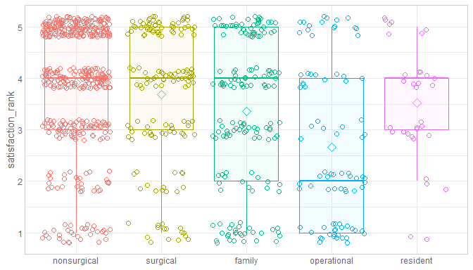<br/>Data:<code> [ ds ds$specialty_type != "unknown"  </code><br/>Formula:<code> ~ satisfaction_rank 1 + specialty_type </code><table class="table table-striped table-hover table-condensed table-responsive" style="width: auto !important; ">
 <thead>
  <tr>
   <th style="text-align:left;"> term </th>
   <th style="text-align:right;"> estimate </th>
   <th style="text-align:right;"> std.error </th>
   <th style="text-align:right;"> statistic </th>
   <th style="text-align:right;"> p.value </th>
  </tr>
 </thead>
<tbody>
  <tr>
   <td style="text-align:left;"> (Intercept) </td>
   <td style="text-align:right;"> 3.9172414 </td>
   <td style="text-align:right;"> 0.0625729 </td>
   <td style="text-align:right;"> 62.602823 </td>
   <td style="text-align:right;"> 0.0000000 </td>
  </tr>
  <tr>
   <td style="text-align:left;"> specialty_typesurgical </td>
   <td style="text-align:right;"> -0.2326776 </td>
   <td style="text-align:right;"> 0.1238796 </td>
   <td style="text-align:right;"> -1.878257 </td>
   <td style="text-align:right;"> 0.0606834 </td>
  </tr>
  <tr>
   <td style="text-align:left;"> specialty_typefamily </td>
   <td style="text-align:right;"> -0.5635828 </td>
   <td style="text-align:right;"> 0.1195853 </td>
   <td style="text-align:right;"> -4.712809 </td>
   <td style="text-align:right;"> 0.0000028 </td>
  </tr>
  <tr>
   <td style="text-align:left;"> specialty_typeoperational </td>
   <td style="text-align:right;"> -1.2544507 </td>
   <td style="text-align:right;"> 0.1540125 </td>
   <td style="text-align:right;"> -8.145121 </td>
   <td style="text-align:right;"> 0.0000000 </td>
  </tr>
  <tr>
   <td style="text-align:left;"> specialty_typeresident </td>
   <td style="text-align:right;"> -0.4020899 </td>
   <td style="text-align:right;"> 0.2356418 </td>
   <td style="text-align:right;"> -1.706360 </td>
   <td style="text-align:right;"> 0.0883012 </td>
  </tr>
</tbody>
</table>

<table class="table table-striped table-hover table-condensed table-responsive" style="width: auto !important; ">
 <thead>
  <tr>
   <th style="text-align:right;"> r.squared </th>
   <th style="text-align:right;"> adj.r.squared </th>
   <th style="text-align:right;"> sigma </th>
   <th style="text-align:right;"> statistic </th>
   <th style="text-align:right;"> p.value </th>
   <th style="text-align:right;"> df </th>
   <th style="text-align:right;"> logLik </th>
   <th style="text-align:right;"> AIC </th>
   <th style="text-align:right;"> BIC </th>
   <th style="text-align:right;"> deviance </th>
   <th style="text-align:right;"> df.residual </th>
  </tr>
 </thead>
<tbody>
  <tr>
   <td style="text-align:right;"> 0.0811978 </td>
   <td style="text-align:right;"> 0.0769342 </td>
   <td style="text-align:right;"> 1.305062 </td>
   <td style="text-align:right;"> 19.04449 </td>
   <td style="text-align:right;"> 0 </td>
   <td style="text-align:right;"> 5 </td>
   <td style="text-align:right;"> -1458.551 </td>
   <td style="text-align:right;"> 2929.103 </td>
   <td style="text-align:right;"> 2957.693 </td>
   <td style="text-align:right;"> 1468.146 </td>
   <td style="text-align:right;"> 862 </td>
  </tr>
</tbody>
</table>### transparency_rank

<br/>Data:<code> [ ds ds$specialty_type != "unknown"  </code><br/>Formula:<code> ~ transparency_rank 1 + specialty_type </code><table class="table table-striped table-hover table-condensed table-responsive" style="width: auto !important; ">
 <thead>
  <tr>
   <th style="text-align:left;"> term </th>
   <th style="text-align:right;"> estimate </th>
   <th style="text-align:right;"> std.error </th>
   <th style="text-align:right;"> statistic </th>
   <th style="text-align:right;"> p.value </th>
  </tr>
 </thead>
<tbody>
  <tr>
   <td style="text-align:left;"> (Intercept) </td>
   <td style="text-align:right;"> 3.7214612 </td>
   <td style="text-align:right;"> 0.0646380 </td>
   <td style="text-align:right;"> 57.5738850 </td>
   <td style="text-align:right;"> 0.0000000 </td>
  </tr>
  <tr>
   <td style="text-align:left;"> specialty_typesurgical </td>
   <td style="text-align:right;"> -0.0888081 </td>
   <td style="text-align:right;"> 0.1289458 </td>
   <td style="text-align:right;"> -0.6887244 </td>
   <td style="text-align:right;"> 0.4911810 </td>
  </tr>
  <tr>
   <td style="text-align:left;"> specialty_typefamily </td>
   <td style="text-align:right;"> -0.4850976 </td>
   <td style="text-align:right;"> 0.1235676 </td>
   <td style="text-align:right;"> -3.9257663 </td>
   <td style="text-align:right;"> 0.0000933 </td>
  </tr>
  <tr>
   <td style="text-align:left;"> specialty_typeoperational </td>
   <td style="text-align:right;"> -1.1051821 </td>
   <td style="text-align:right;"> 0.1595528 </td>
   <td style="text-align:right;"> -6.9267494 </td>
   <td style="text-align:right;"> 0.0000000 </td>
  </tr>
  <tr>
   <td style="text-align:left;"> specialty_typeresident </td>
   <td style="text-align:right;"> -0.5825723 </td>
   <td style="text-align:right;"> 0.2345448 </td>
   <td style="text-align:right;"> -2.4838419 </td>
   <td style="text-align:right;"> 0.0131853 </td>
  </tr>
</tbody>
</table>

<table class="table table-striped table-hover table-condensed table-responsive" style="width: auto !important; ">
 <thead>
  <tr>
   <th style="text-align:right;"> r.squared </th>
   <th style="text-align:right;"> adj.r.squared </th>
   <th style="text-align:right;"> sigma </th>
   <th style="text-align:right;"> statistic </th>
   <th style="text-align:right;"> p.value </th>
   <th style="text-align:right;"> df </th>
   <th style="text-align:right;"> logLik </th>
   <th style="text-align:right;"> AIC </th>
   <th style="text-align:right;"> BIC </th>
   <th style="text-align:right;"> deviance </th>
   <th style="text-align:right;"> df.residual </th>
  </tr>
 </thead>
<tbody>
  <tr>
   <td style="text-align:right;"> 0.0632343 </td>
   <td style="text-align:right;"> 0.0589124 </td>
   <td style="text-align:right;"> 1.352773 </td>
   <td style="text-align:right;"> 14.63123 </td>
   <td style="text-align:right;"> 0 </td>
   <td style="text-align:right;"> 5 </td>
   <td style="text-align:right;"> -1498.288 </td>
   <td style="text-align:right;"> 3008.576 </td>
   <td style="text-align:right;"> 3037.201 </td>
   <td style="text-align:right;"> 1586.606 </td>
   <td style="text-align:right;"> 867 </td>
  </tr>
</tbody>
</table>### favoritism_rank

<br/>Data:<code> [ ds ds$specialty_type != "unknown"  </code><br/>Formula:<code> ~ favoritism_rank 1 + specialty_type </code><table class="table table-striped table-hover table-condensed table-responsive" style="width: auto !important; ">
 <thead>
  <tr>
   <th style="text-align:left;"> term </th>
   <th style="text-align:right;"> estimate </th>
   <th style="text-align:right;"> std.error </th>
   <th style="text-align:right;"> statistic </th>
   <th style="text-align:right;"> p.value </th>
  </tr>
 </thead>
<tbody>
  <tr>
   <td style="text-align:left;"> (Intercept) </td>
   <td style="text-align:right;"> 3.4692308 </td>
   <td style="text-align:right;"> 0.0662709 </td>
   <td style="text-align:right;"> 52.3492083 </td>
   <td style="text-align:right;"> 0.0000000 </td>
  </tr>
  <tr>
   <td style="text-align:left;"> specialty_typesurgical </td>
   <td style="text-align:right;"> -0.1358974 </td>
   <td style="text-align:right;"> 0.1296285 </td>
   <td style="text-align:right;"> -1.0483608 </td>
   <td style="text-align:right;"> 0.2948074 </td>
  </tr>
  <tr>
   <td style="text-align:left;"> specialty_typefamily </td>
   <td style="text-align:right;"> -0.3889388 </td>
   <td style="text-align:right;"> 0.1299775 </td>
   <td style="text-align:right;"> -2.9923554 </td>
   <td style="text-align:right;"> 0.0028584 </td>
  </tr>
  <tr>
   <td style="text-align:left;"> specialty_typeoperational </td>
   <td style="text-align:right;"> -0.7633484 </td>
   <td style="text-align:right;"> 0.1719893 </td>
   <td style="text-align:right;"> -4.4383491 </td>
   <td style="text-align:right;"> 0.0000104 </td>
  </tr>
  <tr>
   <td style="text-align:left;"> specialty_typeresident </td>
   <td style="text-align:right;"> 0.1021978 </td>
   <td style="text-align:right;"> 0.2560544 </td>
   <td style="text-align:right;"> 0.3991254 </td>
   <td style="text-align:right;"> 0.6899135 </td>
  </tr>
</tbody>
</table>

<table class="table table-striped table-hover table-condensed table-responsive" style="width: auto !important; ">
 <thead>
  <tr>
   <th style="text-align:right;"> r.squared </th>
   <th style="text-align:right;"> adj.r.squared </th>
   <th style="text-align:right;"> sigma </th>
   <th style="text-align:right;"> statistic </th>
   <th style="text-align:right;"> p.value </th>
   <th style="text-align:right;"> df </th>
   <th style="text-align:right;"> logLik </th>
   <th style="text-align:right;"> AIC </th>
   <th style="text-align:right;"> BIC </th>
   <th style="text-align:right;"> deviance </th>
   <th style="text-align:right;"> df.residual </th>
  </tr>
 </thead>
<tbody>
  <tr>
   <td style="text-align:right;"> 0.0328075 </td>
   <td style="text-align:right;"> 0.0276901 </td>
   <td style="text-align:right;"> 1.308746 </td>
   <td style="text-align:right;"> 6.410944 </td>
   <td style="text-align:right;"> 4.48e-05 </td>
   <td style="text-align:right;"> 5 </td>
   <td style="text-align:right;"> -1282.066 </td>
   <td style="text-align:right;"> 2576.132 </td>
   <td style="text-align:right;"> 2603.939 </td>
   <td style="text-align:right;"> 1294.889 </td>
   <td style="text-align:right;"> 756 </td>
  </tr>
</tbody>
</table>### assignment_current_choice

<br/>Data:<code> [ ds ds$specialty_type != "unknown"  </code><br/>Formula:<code> ~ assignment_current_choice 1 + specialty_type </code><table class="table table-striped table-hover table-condensed table-responsive" style="width: auto !important; ">
 <thead>
  <tr>
   <th style="text-align:left;"> term </th>
   <th style="text-align:right;"> estimate </th>
   <th style="text-align:right;"> std.error </th>
   <th style="text-align:right;"> statistic </th>
   <th style="text-align:right;"> p.value </th>
  </tr>
 </thead>
<tbody>
  <tr>
   <td style="text-align:left;"> (Intercept) </td>
   <td style="text-align:right;"> 1.4912281 </td>
   <td style="text-align:right;"> 0.0561207 </td>
   <td style="text-align:right;"> 26.5718057 </td>
   <td style="text-align:right;"> 0.0000000 </td>
  </tr>
  <tr>
   <td style="text-align:left;"> specialty_typesurgical </td>
   <td style="text-align:right;"> 0.3361101 </td>
   <td style="text-align:right;"> 0.1104096 </td>
   <td style="text-align:right;"> 3.0442111 </td>
   <td style="text-align:right;"> 0.0024118 </td>
  </tr>
  <tr>
   <td style="text-align:left;"> specialty_typefamily </td>
   <td style="text-align:right;"> 0.0957285 </td>
   <td style="text-align:right;"> 0.1107059 </td>
   <td style="text-align:right;"> 0.8647099 </td>
   <td style="text-align:right;"> 0.3874656 </td>
  </tr>
  <tr>
   <td style="text-align:left;"> specialty_typeoperational </td>
   <td style="text-align:right;"> 0.4933873 </td>
   <td style="text-align:right;"> 0.1499427 </td>
   <td style="text-align:right;"> 3.2905058 </td>
   <td style="text-align:right;"> 0.0010453 </td>
  </tr>
  <tr>
   <td style="text-align:left;"> specialty_typeresident </td>
   <td style="text-align:right;"> -0.2091768 </td>
   <td style="text-align:right;"> 0.1880736 </td>
   <td style="text-align:right;"> -1.1122073 </td>
   <td style="text-align:right;"> 0.2663939 </td>
  </tr>
</tbody>
</table>

<table class="table table-striped table-hover table-condensed table-responsive" style="width: auto !important; ">
 <thead>
  <tr>
   <th style="text-align:right;"> r.squared </th>
   <th style="text-align:right;"> adj.r.squared </th>
   <th style="text-align:right;"> sigma </th>
   <th style="text-align:right;"> statistic </th>
   <th style="text-align:right;"> p.value </th>
   <th style="text-align:right;"> df </th>
   <th style="text-align:right;"> logLik </th>
   <th style="text-align:right;"> AIC </th>
   <th style="text-align:right;"> BIC </th>
   <th style="text-align:right;"> deviance </th>
   <th style="text-align:right;"> df.residual </th>
  </tr>
 </thead>
<tbody>
  <tr>
   <td style="text-align:right;"> 0.0255001 </td>
   <td style="text-align:right;"> 0.0204704 </td>
   <td style="text-align:right;"> 1.12101 </td>
   <td style="text-align:right;"> 5.069921 </td>
   <td style="text-align:right;"> 0.0004894 </td>
   <td style="text-align:right;"> 5 </td>
   <td style="text-align:right;"> -1193.363 </td>
   <td style="text-align:right;"> 2398.727 </td>
   <td style="text-align:right;"> 2426.683 </td>
   <td style="text-align:right;"> 973.914 </td>
   <td style="text-align:right;"> 775 </td>
  </tr>
</tbody>
</table>

By Bonus Pay
-----------------------------------
### satisfaction_rank

<br/>Data:<code> ds </code><br/>Formula:<code> ~ satisfaction_rank 1 + bonus_pay_cut4 </code><table class="table table-striped table-hover table-condensed table-responsive" style="width: auto !important; ">
 <thead>
  <tr>
   <th style="text-align:left;"> term </th>
   <th style="text-align:right;"> estimate </th>
   <th style="text-align:right;"> std.error </th>
   <th style="text-align:right;"> statistic </th>
   <th style="text-align:right;"> p.value </th>
  </tr>
 </thead>
<tbody>
  <tr>
   <td style="text-align:left;"> (Intercept) </td>
   <td style="text-align:right;"> 2.8411215 </td>
   <td style="text-align:right;"> 0.1285699 </td>
   <td style="text-align:right;"> 22.097867 </td>
   <td style="text-align:right;"> 0e+00 </td>
  </tr>
  <tr>
   <td style="text-align:left;"> bonus_pay_cut4$20-24k </td>
   <td style="text-align:right;"> 0.8846169 </td>
   <td style="text-align:right;"> 0.1423437 </td>
   <td style="text-align:right;"> 6.214653 </td>
   <td style="text-align:right;"> 0e+00 </td>
  </tr>
  <tr>
   <td style="text-align:left;"> bonus_pay_cut4$24-32k </td>
   <td style="text-align:right;"> 0.9289934 </td>
   <td style="text-align:right;"> 0.1633872 </td>
   <td style="text-align:right;"> 5.685841 </td>
   <td style="text-align:right;"> 0e+00 </td>
  </tr>
  <tr>
   <td style="text-align:left;"> bonus_pay_cut432k+ </td>
   <td style="text-align:right;"> 0.9110153 </td>
   <td style="text-align:right;"> 0.1778978 </td>
   <td style="text-align:right;"> 5.121004 </td>
   <td style="text-align:right;"> 4e-07 </td>
  </tr>
</tbody>
</table>

<table class="table table-striped table-hover table-condensed table-responsive" style="width: auto !important; ">
 <thead>
  <tr>
   <th style="text-align:right;"> r.squared </th>
   <th style="text-align:right;"> adj.r.squared </th>
   <th style="text-align:right;"> sigma </th>
   <th style="text-align:right;"> statistic </th>
   <th style="text-align:right;"> p.value </th>
   <th style="text-align:right;"> df </th>
   <th style="text-align:right;"> logLik </th>
   <th style="text-align:right;"> AIC </th>
   <th style="text-align:right;"> BIC </th>
   <th style="text-align:right;"> deviance </th>
   <th style="text-align:right;"> df.residual </th>
  </tr>
 </thead>
<tbody>
  <tr>
   <td style="text-align:right;"> 0.0472242 </td>
   <td style="text-align:right;"> 0.0439312 </td>
   <td style="text-align:right;"> 1.329938 </td>
   <td style="text-align:right;"> 14.34077 </td>
   <td style="text-align:right;"> 0 </td>
   <td style="text-align:right;"> 4 </td>
   <td style="text-align:right;"> -1483.945 </td>
   <td style="text-align:right;"> 2977.89 </td>
   <td style="text-align:right;"> 3001.744 </td>
   <td style="text-align:right;"> 1535.262 </td>
   <td style="text-align:right;"> 868 </td>
  </tr>
</tbody>
</table>### transparency_rank

<br/>Data:<code> ds </code><br/>Formula:<code> ~ transparency_rank 1 + bonus_pay_cut4 </code><table class="table table-striped table-hover table-condensed table-responsive" style="width: auto !important; ">
 <thead>
  <tr>
   <th style="text-align:left;"> term </th>
   <th style="text-align:right;"> estimate </th>
   <th style="text-align:right;"> std.error </th>
   <th style="text-align:right;"> statistic </th>
   <th style="text-align:right;"> p.value </th>
  </tr>
 </thead>
<tbody>
  <tr>
   <td style="text-align:left;"> (Intercept) </td>
   <td style="text-align:right;"> 2.6363636 </td>
   <td style="text-align:right;"> 0.1296906 </td>
   <td style="text-align:right;"> 20.328104 </td>
   <td style="text-align:right;"> 0e+00 </td>
  </tr>
  <tr>
   <td style="text-align:left;"> bonus_pay_cut4$20-24k </td>
   <td style="text-align:right;"> 0.9138456 </td>
   <td style="text-align:right;"> 0.1438411 </td>
   <td style="text-align:right;"> 6.353158 </td>
   <td style="text-align:right;"> 0e+00 </td>
  </tr>
  <tr>
   <td style="text-align:left;"> bonus_pay_cut4$24-32k </td>
   <td style="text-align:right;"> 1.1324225 </td>
   <td style="text-align:right;"> 0.1658741 </td>
   <td style="text-align:right;"> 6.827000 </td>
   <td style="text-align:right;"> 0e+00 </td>
  </tr>
  <tr>
   <td style="text-align:left;"> bonus_pay_cut432k+ </td>
   <td style="text-align:right;"> 0.9153605 </td>
   <td style="text-align:right;"> 0.1810230 </td>
   <td style="text-align:right;"> 5.056599 </td>
   <td style="text-align:right;"> 5e-07 </td>
  </tr>
</tbody>
</table>

<table class="table table-striped table-hover table-condensed table-responsive" style="width: auto !important; ">
 <thead>
  <tr>
   <th style="text-align:right;"> r.squared </th>
   <th style="text-align:right;"> adj.r.squared </th>
   <th style="text-align:right;"> sigma </th>
   <th style="text-align:right;"> statistic </th>
   <th style="text-align:right;"> p.value </th>
   <th style="text-align:right;"> df </th>
   <th style="text-align:right;"> logLik </th>
   <th style="text-align:right;"> AIC </th>
   <th style="text-align:right;"> BIC </th>
   <th style="text-align:right;"> deviance </th>
   <th style="text-align:right;"> df.residual </th>
  </tr>
 </thead>
<tbody>
  <tr>
   <td style="text-align:right;"> 0.0559187 </td>
   <td style="text-align:right;"> 0.0526745 </td>
   <td style="text-align:right;"> 1.360206 </td>
   <td style="text-align:right;"> 17.23618 </td>
   <td style="text-align:right;"> 0 </td>
   <td style="text-align:right;"> 4 </td>
   <td style="text-align:right;"> -1512.202 </td>
   <td style="text-align:right;"> 3034.403 </td>
   <td style="text-align:right;"> 3058.286 </td>
   <td style="text-align:right;"> 1615.191 </td>
   <td style="text-align:right;"> 873 </td>
  </tr>
</tbody>
</table>### favoritism_rank

<br/>Data:<code> ds </code><br/>Formula:<code> ~ favoritism_rank 1 + bonus_pay_cut4 </code><table class="table table-striped table-hover table-condensed table-responsive" style="width: auto !important; ">
 <thead>
  <tr>
   <th style="text-align:left;"> term </th>
   <th style="text-align:right;"> estimate </th>
   <th style="text-align:right;"> std.error </th>
   <th style="text-align:right;"> statistic </th>
   <th style="text-align:right;"> p.value </th>
  </tr>
 </thead>
<tbody>
  <tr>
   <td style="text-align:left;"> (Intercept) </td>
   <td style="text-align:right;"> 3.0119048 </td>
   <td style="text-align:right;"> 0.1448614 </td>
   <td style="text-align:right;"> 20.791630 </td>
   <td style="text-align:right;"> 0.0000000 </td>
  </tr>
  <tr>
   <td style="text-align:left;"> bonus_pay_cut4$20-24k </td>
   <td style="text-align:right;"> 0.3295587 </td>
   <td style="text-align:right;"> 0.1590099 </td>
   <td style="text-align:right;"> 2.072567 </td>
   <td style="text-align:right;"> 0.0385488 </td>
  </tr>
  <tr>
   <td style="text-align:left;"> bonus_pay_cut4$24-32k </td>
   <td style="text-align:right;"> 0.4111722 </td>
   <td style="text-align:right;"> 0.1796785 </td>
   <td style="text-align:right;"> 2.288378 </td>
   <td style="text-align:right;"> 0.0223888 </td>
  </tr>
  <tr>
   <td style="text-align:left;"> bonus_pay_cut432k+ </td>
   <td style="text-align:right;"> 0.2489648 </td>
   <td style="text-align:right;"> 0.1905594 </td>
   <td style="text-align:right;"> 1.306495 </td>
   <td style="text-align:right;"> 0.1917791 </td>
  </tr>
</tbody>
</table>

<table class="table table-striped table-hover table-condensed table-responsive" style="width: auto !important; ">
 <thead>
  <tr>
   <th style="text-align:right;"> r.squared </th>
   <th style="text-align:right;"> adj.r.squared </th>
   <th style="text-align:right;"> sigma </th>
   <th style="text-align:right;"> statistic </th>
   <th style="text-align:right;"> p.value </th>
   <th style="text-align:right;"> df </th>
   <th style="text-align:right;"> logLik </th>
   <th style="text-align:right;"> AIC </th>
   <th style="text-align:right;"> BIC </th>
   <th style="text-align:right;"> deviance </th>
   <th style="text-align:right;"> df.residual </th>
  </tr>
 </thead>
<tbody>
  <tr>
   <td style="text-align:right;"> 0.0075041 </td>
   <td style="text-align:right;"> 0.0035915 </td>
   <td style="text-align:right;"> 1.327677 </td>
   <td style="text-align:right;"> 1.917942 </td>
   <td style="text-align:right;"> 0.1251881 </td>
   <td style="text-align:right;"> 4 </td>
   <td style="text-align:right;"> -1300.307 </td>
   <td style="text-align:right;"> 2610.614 </td>
   <td style="text-align:right;"> 2633.814 </td>
   <td style="text-align:right;"> 1341.434 </td>
   <td style="text-align:right;"> 761 </td>
  </tr>
</tbody>
</table>### assignment_current_choice

<br/>Data:<code> ds </code><br/>Formula:<code> ~ assignment_current_choice 1 + bonus_pay_cut4 </code><table class="table table-striped table-hover table-condensed table-responsive" style="width: auto !important; ">
 <thead>
  <tr>
   <th style="text-align:left;"> term </th>
   <th style="text-align:right;"> estimate </th>
   <th style="text-align:right;"> std.error </th>
   <th style="text-align:right;"> statistic </th>
   <th style="text-align:right;"> p.value </th>
  </tr>
 </thead>
<tbody>
  <tr>
   <td style="text-align:left;"> (Intercept) </td>
   <td style="text-align:right;"> 1.7978723 </td>
   <td style="text-align:right;"> 0.1164006 </td>
   <td style="text-align:right;"> 15.445565 </td>
   <td style="text-align:right;"> 0.0000000 </td>
  </tr>
  <tr>
   <td style="text-align:left;"> bonus_pay_cut4$20-24k </td>
   <td style="text-align:right;"> -0.2789150 </td>
   <td style="text-align:right;"> 0.1287134 </td>
   <td style="text-align:right;"> -2.166946 </td>
   <td style="text-align:right;"> 0.0305410 </td>
  </tr>
  <tr>
   <td style="text-align:left;"> bonus_pay_cut4$24-32k </td>
   <td style="text-align:right;"> -0.1312057 </td>
   <td style="text-align:right;"> 0.1468307 </td>
   <td style="text-align:right;"> -0.893585 </td>
   <td style="text-align:right;"> 0.3718196 </td>
  </tr>
  <tr>
   <td style="text-align:left;"> bonus_pay_cut432k+ </td>
   <td style="text-align:right;"> -0.1740191 </td>
   <td style="text-align:right;"> 0.1588510 </td>
   <td style="text-align:right;"> -1.095487 </td>
   <td style="text-align:right;"> 0.2736415 </td>
  </tr>
</tbody>
</table>

<table class="table table-striped table-hover table-condensed table-responsive" style="width: auto !important; ">
 <thead>
  <tr>
   <th style="text-align:right;"> r.squared </th>
   <th style="text-align:right;"> adj.r.squared </th>
   <th style="text-align:right;"> sigma </th>
   <th style="text-align:right;"> statistic </th>
   <th style="text-align:right;"> p.value </th>
   <th style="text-align:right;"> df </th>
   <th style="text-align:right;"> logLik </th>
   <th style="text-align:right;"> AIC </th>
   <th style="text-align:right;"> BIC </th>
   <th style="text-align:right;"> deviance </th>
   <th style="text-align:right;"> df.residual </th>
  </tr>
 </thead>
<tbody>
  <tr>
   <td style="text-align:right;"> 0.0072089 </td>
   <td style="text-align:right;"> 0.0033904 </td>
   <td style="text-align:right;"> 1.128545 </td>
   <td style="text-align:right;"> 1.887914 </td>
   <td style="text-align:right;"> 0.1301122 </td>
   <td style="text-align:right;"> 4 </td>
   <td style="text-align:right;"> -1205.251 </td>
   <td style="text-align:right;"> 2420.503 </td>
   <td style="text-align:right;"> 2443.825 </td>
   <td style="text-align:right;"> 993.4192 </td>
   <td style="text-align:right;"> 780 </td>
  </tr>
</tbody>
</table>

By Assignment Current Choice
-----------------------------------
### satisfaction_rank

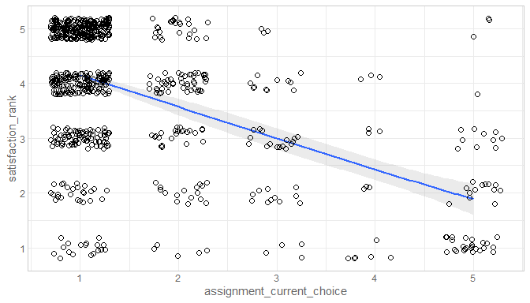<br/>Data:<code> ds </code><br/>Formula:<code> ~ satisfaction_rank 1 + assignment_current_choice </code><table class="table table-striped table-hover table-condensed table-responsive" style="width: auto !important; ">
 <thead>
  <tr>
   <th style="text-align:left;"> term </th>
   <th style="text-align:right;"> estimate </th>
   <th style="text-align:right;"> std.error </th>
   <th style="text-align:right;"> statistic </th>
   <th style="text-align:right;"> p.value </th>
  </tr>
 </thead>
<tbody>
  <tr>
   <td style="text-align:left;"> (Intercept) </td>
   <td style="text-align:right;"> 4.7192430 </td>
   <td style="text-align:right;"> 0.0674241 </td>
   <td style="text-align:right;"> 69.99342 </td>
   <td style="text-align:right;"> 0 </td>
  </tr>
  <tr>
   <td style="text-align:left;"> assignment_current_choice </td>
   <td style="text-align:right;"> -0.5721764 </td>
   <td style="text-align:right;"> 0.0342102 </td>
   <td style="text-align:right;"> -16.72533 </td>
   <td style="text-align:right;"> 0 </td>
  </tr>
</tbody>
</table>

<table class="table table-striped table-hover table-condensed table-responsive" style="width: auto !important; ">
 <thead>
  <tr>
   <th style="text-align:right;"> r.squared </th>
   <th style="text-align:right;"> adj.r.squared </th>
   <th style="text-align:right;"> sigma </th>
   <th style="text-align:right;"> statistic </th>
   <th style="text-align:right;"> p.value </th>
   <th style="text-align:right;"> df </th>
   <th style="text-align:right;"> logLik </th>
   <th style="text-align:right;"> AIC </th>
   <th style="text-align:right;"> BIC </th>
   <th style="text-align:right;"> deviance </th>
   <th style="text-align:right;"> df.residual </th>
  </tr>
 </thead>
<tbody>
  <tr>
   <td style="text-align:right;"> 0.2693047 </td>
   <td style="text-align:right;"> 0.268342 </td>
   <td style="text-align:right;"> 1.074932 </td>
   <td style="text-align:right;"> 279.7366 </td>
   <td style="text-align:right;"> 0 </td>
   <td style="text-align:right;"> 2 </td>
   <td style="text-align:right;"> -1133.799 </td>
   <td style="text-align:right;"> 2273.598 </td>
   <td style="text-align:right;"> 2287.502 </td>
   <td style="text-align:right;"> 877.0091 </td>
   <td style="text-align:right;"> 759 </td>
  </tr>
</tbody>
</table>### transparency_rank

<br/>Data:<code> ds </code><br/>Formula:<code> ~ transparency_rank 1 + assignment_current_choice </code><table class="table table-striped table-hover table-condensed table-responsive" style="width: auto !important; ">
 <thead>
  <tr>
   <th style="text-align:left;"> term </th>
   <th style="text-align:right;"> estimate </th>
   <th style="text-align:right;"> std.error </th>
   <th style="text-align:right;"> statistic </th>
   <th style="text-align:right;"> p.value </th>
  </tr>
 </thead>
<tbody>
  <tr>
   <td style="text-align:left;"> (Intercept) </td>
   <td style="text-align:right;"> 4.3945478 </td>
   <td style="text-align:right;"> 0.0758513 </td>
   <td style="text-align:right;"> 57.93639 </td>
   <td style="text-align:right;"> 0 </td>
  </tr>
  <tr>
   <td style="text-align:left;"> assignment_current_choice </td>
   <td style="text-align:right;"> -0.4738032 </td>
   <td style="text-align:right;"> 0.0387336 </td>
   <td style="text-align:right;"> -12.23236 </td>
   <td style="text-align:right;"> 0 </td>
  </tr>
</tbody>
</table>

<table class="table table-striped table-hover table-condensed table-responsive" style="width: auto !important; ">
 <thead>
  <tr>
   <th style="text-align:right;"> r.squared </th>
   <th style="text-align:right;"> adj.r.squared </th>
   <th style="text-align:right;"> sigma </th>
   <th style="text-align:right;"> statistic </th>
   <th style="text-align:right;"> p.value </th>
   <th style="text-align:right;"> df </th>
   <th style="text-align:right;"> logLik </th>
   <th style="text-align:right;"> AIC </th>
   <th style="text-align:right;"> BIC </th>
   <th style="text-align:right;"> deviance </th>
   <th style="text-align:right;"> df.residual </th>
  </tr>
 </thead>
<tbody>
  <tr>
   <td style="text-align:right;"> 0.1643153 </td>
   <td style="text-align:right;"> 0.1632172 </td>
   <td style="text-align:right;"> 1.209629 </td>
   <td style="text-align:right;"> 149.6306 </td>
   <td style="text-align:right;"> 0 </td>
   <td style="text-align:right;"> 2 </td>
   <td style="text-align:right;"> -1226.858 </td>
   <td style="text-align:right;"> 2459.717 </td>
   <td style="text-align:right;"> 2473.629 </td>
   <td style="text-align:right;"> 1113.498 </td>
   <td style="text-align:right;"> 761 </td>
  </tr>
</tbody>
</table>### favoritism_rank

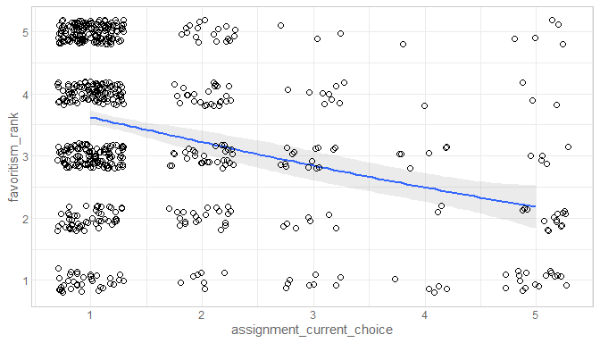<br/>Data:<code> ds </code><br/>Formula:<code> ~ favoritism_rank 1 + assignment_current_choice </code><table class="table table-striped table-hover table-condensed table-responsive" style="width: auto !important; ">
 <thead>
  <tr>
   <th style="text-align:left;"> term </th>
   <th style="text-align:right;"> estimate </th>
   <th style="text-align:right;"> std.error </th>
   <th style="text-align:right;"> statistic </th>
   <th style="text-align:right;"> p.value </th>
  </tr>
 </thead>
<tbody>
  <tr>
   <td style="text-align:left;"> (Intercept) </td>
   <td style="text-align:right;"> 3.9860828 </td>
   <td style="text-align:right;"> 0.0822266 </td>
   <td style="text-align:right;"> 48.476775 </td>
   <td style="text-align:right;"> 0 </td>
  </tr>
  <tr>
   <td style="text-align:left;"> assignment_current_choice </td>
   <td style="text-align:right;"> -0.3706206 </td>
   <td style="text-align:right;"> 0.0416331 </td>
   <td style="text-align:right;"> -8.902061 </td>
   <td style="text-align:right;"> 0 </td>
  </tr>
</tbody>
</table>

<table class="table table-striped table-hover table-condensed table-responsive" style="width: auto !important; ">
 <thead>
  <tr>
   <th style="text-align:right;"> r.squared </th>
   <th style="text-align:right;"> adj.r.squared </th>
   <th style="text-align:right;"> sigma </th>
   <th style="text-align:right;"> statistic </th>
   <th style="text-align:right;"> p.value </th>
   <th style="text-align:right;"> df </th>
   <th style="text-align:right;"> logLik </th>
   <th style="text-align:right;"> AIC </th>
   <th style="text-align:right;"> BIC </th>
   <th style="text-align:right;"> deviance </th>
   <th style="text-align:right;"> df.residual </th>
  </tr>
 </thead>
<tbody>
  <tr>
   <td style="text-align:right;"> 0.1053467 </td>
   <td style="text-align:right;"> 0.1040173 </td>
   <td style="text-align:right;"> 1.232284 </td>
   <td style="text-align:right;"> 79.24669 </td>
   <td style="text-align:right;"> 0 </td>
   <td style="text-align:right;"> 2 </td>
   <td style="text-align:right;"> -1097.769 </td>
   <td style="text-align:right;"> 2201.538 </td>
   <td style="text-align:right;"> 2215.082 </td>
   <td style="text-align:right;"> 1021.967 </td>
   <td style="text-align:right;"> 673 </td>
  </tr>
</tbody>
</table>

By Year
-----------------------------------
### satisfaction_rank


By Survey Lag
-----------------------------------
### satisfaction_rank

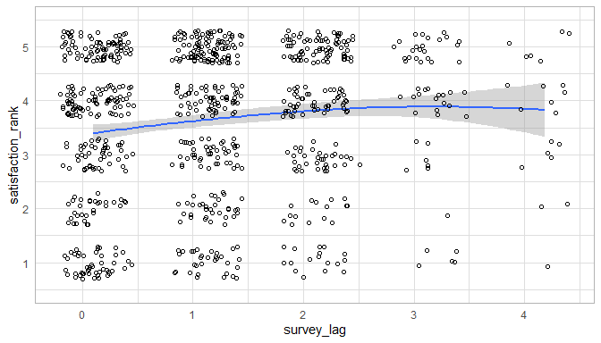


By Manning Proportion
-----------------------------------
### manning_proportion

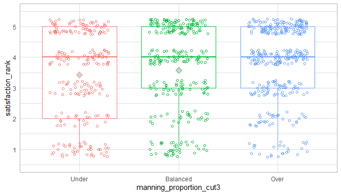

By Crtical War
-----------------------------------


By Billet Current
-----------------------------------
<br/>Data:<code> ds </code><br/>Formula:<code> ~ satisfaction_rank 1 + billet_current </code><table class="table table-striped table-hover table-condensed table-responsive" style="width: auto !important; ">
 <thead>
  <tr>
   <th style="text-align:left;"> term </th>
   <th style="text-align:right;"> estimate </th>
   <th style="text-align:right;"> std.error </th>
   <th style="text-align:right;"> statistic </th>
   <th style="text-align:right;"> p.value </th>
  </tr>
 </thead>
<tbody>
  <tr>
   <td style="text-align:left;"> (Intercept) </td>
   <td style="text-align:right;"> 3.8472469 </td>
   <td style="text-align:right;"> 0.0553450 </td>
   <td style="text-align:right;"> 69.5139096 </td>
   <td style="text-align:right;"> 0.0000000 </td>
  </tr>
  <tr>
   <td style="text-align:left;"> billet_currentNon-Operational/Clinical </td>
   <td style="text-align:right;"> -0.2014136 </td>
   <td style="text-align:right;"> 0.1974596 </td>
   <td style="text-align:right;"> -1.0200240 </td>
   <td style="text-align:right;"> 0.3080020 </td>
  </tr>
  <tr>
   <td style="text-align:left;"> billet_currentOCONUS MTF </td>
   <td style="text-align:right;"> -0.4372469 </td>
   <td style="text-align:right;"> 0.1425066 </td>
   <td style="text-align:right;"> -3.0682562 </td>
   <td style="text-align:right;"> 0.0022201 </td>
  </tr>
  <tr>
   <td style="text-align:left;"> billet_currentCONUS Operational </td>
   <td style="text-align:right;"> -0.7311755 </td>
   <td style="text-align:right;"> 0.1358693 </td>
   <td style="text-align:right;"> -5.3814634 </td>
   <td style="text-align:right;"> 0.0000001 </td>
  </tr>
  <tr>
   <td style="text-align:left;"> billet_currentOCONUS Operational </td>
   <td style="text-align:right;"> -1.3972469 </td>
   <td style="text-align:right;"> 0.2148854 </td>
   <td style="text-align:right;"> -6.5022872 </td>
   <td style="text-align:right;"> 0.0000000 </td>
  </tr>
  <tr>
   <td style="text-align:left;"> billet_currentOther </td>
   <td style="text-align:right;"> 0.1527531 </td>
   <td style="text-align:right;"> 0.4412199 </td>
   <td style="text-align:right;"> 0.3462063 </td>
   <td style="text-align:right;"> 0.7292718 </td>
  </tr>
</tbody>
</table>

<table class="table table-striped table-hover table-condensed table-responsive" style="width: auto !important; ">
 <thead>
  <tr>
   <th style="text-align:right;"> r.squared </th>
   <th style="text-align:right;"> adj.r.squared </th>
   <th style="text-align:right;"> sigma </th>
   <th style="text-align:right;"> statistic </th>
   <th style="text-align:right;"> p.value </th>
   <th style="text-align:right;"> df </th>
   <th style="text-align:right;"> logLik </th>
   <th style="text-align:right;"> AIC </th>
   <th style="text-align:right;"> BIC </th>
   <th style="text-align:right;"> deviance </th>
   <th style="text-align:right;"> df.residual </th>
  </tr>
 </thead>
<tbody>
  <tr>
   <td style="text-align:right;"> 0.0731888 </td>
   <td style="text-align:right;"> 0.0678376 </td>
   <td style="text-align:right;"> 1.313205 </td>
   <td style="text-align:right;"> 13.67732 </td>
   <td style="text-align:right;"> 0 </td>
   <td style="text-align:right;"> 6 </td>
   <td style="text-align:right;"> -1471.899 </td>
   <td style="text-align:right;"> 2957.797 </td>
   <td style="text-align:right;"> 2991.193 </td>
   <td style="text-align:right;"> 1493.423 </td>
   <td style="text-align:right;"> 866 </td>
  </tr>
</tbody>
</table>

By Geographic Preference
-----------------------------------
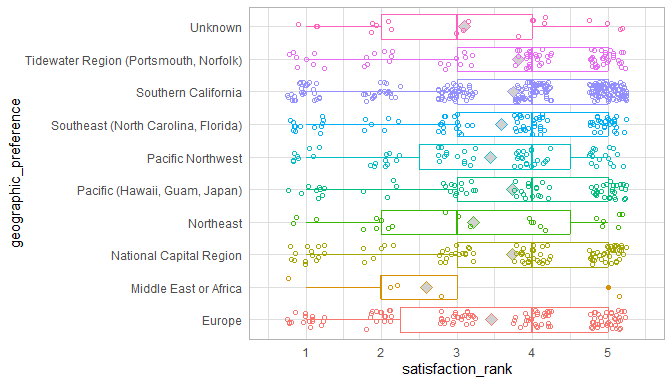<br/>Data:<code> ds </code><br/>Formula:<code> ~ satisfaction_rank 1 + geographic_preference </code><table class="table table-striped table-hover table-condensed table-responsive" style="width: auto !important; ">
 <thead>
  <tr>
   <th style="text-align:left;"> term </th>
   <th style="text-align:right;"> estimate </th>
   <th style="text-align:right;"> std.error </th>
   <th style="text-align:right;"> statistic </th>
   <th style="text-align:right;"> p.value </th>
  </tr>
 </thead>
<tbody>
  <tr>
   <td style="text-align:left;"> (Intercept) </td>
   <td style="text-align:right;"> 3.4523810 </td>
   <td style="text-align:right;"> 0.1206561 </td>
   <td style="text-align:right;"> 28.6133918 </td>
   <td style="text-align:right;"> 0.0000000 </td>
  </tr>
  <tr>
   <td style="text-align:left;"> geographic_preferenceMiddle East or Africa </td>
   <td style="text-align:right;"> -0.8523810 </td>
   <td style="text-align:right;"> 0.6175897 </td>
   <td style="text-align:right;"> -1.3801736 </td>
   <td style="text-align:right;"> 0.1678910 </td>
  </tr>
  <tr>
   <td style="text-align:left;"> geographic_preferenceNational Capital Region </td>
   <td style="text-align:right;"> 0.2765910 </td>
   <td style="text-align:right;"> 0.1780473 </td>
   <td style="text-align:right;"> 1.5534691 </td>
   <td style="text-align:right;"> 0.1206782 </td>
  </tr>
  <tr>
   <td style="text-align:left;"> geographic_preferenceNortheast </td>
   <td style="text-align:right;"> -0.2349896 </td>
   <td style="text-align:right;"> 0.3070991 </td>
   <td style="text-align:right;"> -0.7651915 </td>
   <td style="text-align:right;"> 0.4443670 </td>
  </tr>
  <tr>
   <td style="text-align:left;"> geographic_preferencePacific (Hawaii, Guam, Japan) </td>
   <td style="text-align:right;"> 0.2800134 </td>
   <td style="text-align:right;"> 0.2009802 </td>
   <td style="text-align:right;"> 1.3932387 </td>
   <td style="text-align:right;"> 0.1639068 </td>
  </tr>
  <tr>
   <td style="text-align:left;"> geographic_preferencePacific Northwest </td>
   <td style="text-align:right;"> -0.0157612 </td>
   <td style="text-align:right;"> 0.2009802 </td>
   <td style="text-align:right;"> -0.0784218 </td>
   <td style="text-align:right;"> 0.9375107 </td>
  </tr>
  <tr>
   <td style="text-align:left;"> geographic_preferenceSoutheast (North Carolina, Florida) </td>
   <td style="text-align:right;"> 0.1309524 </td>
   <td style="text-align:right;"> 0.1834806 </td>
   <td style="text-align:right;"> 0.7137123 </td>
   <td style="text-align:right;"> 0.4755983 </td>
  </tr>
  <tr>
   <td style="text-align:left;"> geographic_preferenceSouthern California </td>
   <td style="text-align:right;"> 0.2957393 </td>
   <td style="text-align:right;"> 0.1464710 </td>
   <td style="text-align:right;"> 2.0190986 </td>
   <td style="text-align:right;"> 0.0437861 </td>
  </tr>
  <tr>
   <td style="text-align:left;"> geographic_preferenceTidewater Region (Portsmouth, Norfolk) </td>
   <td style="text-align:right;"> 0.3637110 </td>
   <td style="text-align:right;"> 0.1887902 </td>
   <td style="text-align:right;"> 1.9265350 </td>
   <td style="text-align:right;"> 0.0543661 </td>
  </tr>
  <tr>
   <td style="text-align:left;"> geographic_preferenceUnknown </td>
   <td style="text-align:right;"> -0.3523810 </td>
   <td style="text-align:right;"> 0.3259949 </td>
   <td style="text-align:right;"> -1.0809401 </td>
   <td style="text-align:right;"> 0.2800261 </td>
  </tr>
</tbody>
</table>

<table class="table table-striped table-hover table-condensed table-responsive" style="width: auto !important; ">
 <thead>
  <tr>
   <th style="text-align:right;"> r.squared </th>
   <th style="text-align:right;"> adj.r.squared </th>
   <th style="text-align:right;"> sigma </th>
   <th style="text-align:right;"> statistic </th>
   <th style="text-align:right;"> p.value </th>
   <th style="text-align:right;"> df </th>
   <th style="text-align:right;"> logLik </th>
   <th style="text-align:right;"> AIC </th>
   <th style="text-align:right;"> BIC </th>
   <th style="text-align:right;"> deviance </th>
   <th style="text-align:right;"> df.residual </th>
  </tr>
 </thead>
<tbody>
  <tr>
   <td style="text-align:right;"> 0.0187382 </td>
   <td style="text-align:right;"> 0.008493 </td>
   <td style="text-align:right;"> 1.354362 </td>
   <td style="text-align:right;"> 1.828979 </td>
   <td style="text-align:right;"> 0.0595147 </td>
   <td style="text-align:right;"> 10 </td>
   <td style="text-align:right;"> -1496.789 </td>
   <td style="text-align:right;"> 3015.579 </td>
   <td style="text-align:right;"> 3068.058 </td>
   <td style="text-align:right;"> 1581.163 </td>
   <td style="text-align:right;"> 862 </td>
  </tr>
</tbody>
</table>


Analyses - 2 Predictors
============================================


By Rank and Specialty Type
-----------------------------------
### satisfaction_rank

<br/>Data:<code> [ ds ds$specialty_type != "unknown"  </code><br/>Formula:<code> ~ satisfaction_rank 1 + officer_rate_f * specialty_type </code><table class="table table-striped table-hover table-condensed table-responsive" style="width: auto !important; ">
 <thead>
  <tr>
   <th style="text-align:left;"> term </th>
   <th style="text-align:right;"> estimate </th>
   <th style="text-align:right;"> std.error </th>
   <th style="text-align:right;"> statistic </th>
   <th style="text-align:right;"> p.value </th>
  </tr>
 </thead>
<tbody>
  <tr>
   <td style="text-align:left;"> (Intercept) </td>
   <td style="text-align:right;"> 3.7794118 </td>
   <td style="text-align:right;"> 0.1553781 </td>
   <td style="text-align:right;"> 24.3239628 </td>
   <td style="text-align:right;"> 0.0000000 </td>
  </tr>
  <tr>
   <td style="text-align:left;"> officer_rate_f4 </td>
   <td style="text-align:right;"> -0.0092968 </td>
   <td style="text-align:right;"> 0.1832411 </td>
   <td style="text-align:right;"> -0.0507355 </td>
   <td style="text-align:right;"> 0.9595483 </td>
  </tr>
  <tr>
   <td style="text-align:left;"> officer_rate_f5 </td>
   <td style="text-align:right;"> 0.2560492 </td>
   <td style="text-align:right;"> 0.1891705 </td>
   <td style="text-align:right;"> 1.3535366 </td>
   <td style="text-align:right;"> 0.1762449 </td>
  </tr>
  <tr>
   <td style="text-align:left;"> officer_rate_f6 </td>
   <td style="text-align:right;"> 0.5539216 </td>
   <td style="text-align:right;"> 0.2373440 </td>
   <td style="text-align:right;"> 2.3338342 </td>
   <td style="text-align:right;"> 0.0198372 </td>
  </tr>
  <tr>
   <td style="text-align:left;"> specialty_typesurgical </td>
   <td style="text-align:right;"> -0.1127451 </td>
   <td style="text-align:right;"> 0.3654966 </td>
   <td style="text-align:right;"> -0.3084710 </td>
   <td style="text-align:right;"> 0.7577997 </td>
  </tr>
  <tr>
   <td style="text-align:left;"> specialty_typefamily </td>
   <td style="text-align:right;"> -0.9315857 </td>
   <td style="text-align:right;"> 0.2446039 </td>
   <td style="text-align:right;"> -3.8085478 </td>
   <td style="text-align:right;"> 0.0001499 </td>
  </tr>
  <tr>
   <td style="text-align:left;"> specialty_typeoperational </td>
   <td style="text-align:right;"> -1.3667134 </td>
   <td style="text-align:right;"> 0.2240553 </td>
   <td style="text-align:right;"> -6.0998925 </td>
   <td style="text-align:right;"> 0.0000000 </td>
  </tr>
  <tr>
   <td style="text-align:left;"> specialty_typeresident </td>
   <td style="text-align:right;"> -0.2294118 </td>
   <td style="text-align:right;"> 0.3259239 </td>
   <td style="text-align:right;"> -0.7038814 </td>
   <td style="text-align:right;"> 0.4816999 </td>
  </tr>
  <tr>
   <td style="text-align:left;"> officer_rate_f4:specialty_typesurgical </td>
   <td style="text-align:right;"> -0.2384509 </td>
   <td style="text-align:right;"> 0.4064573 </td>
   <td style="text-align:right;"> -0.5866567 </td>
   <td style="text-align:right;"> 0.5575904 </td>
  </tr>
  <tr>
   <td style="text-align:left;"> officer_rate_f5:specialty_typesurgical </td>
   <td style="text-align:right;"> 0.0516431 </td>
   <td style="text-align:right;"> 0.4328109 </td>
   <td style="text-align:right;"> 0.1193202 </td>
   <td style="text-align:right;"> 0.9050499 </td>
  </tr>
  <tr>
   <td style="text-align:left;"> officer_rate_f6:specialty_typesurgical </td>
   <td style="text-align:right;"> -0.1253501 </td>
   <td style="text-align:right;"> 0.4939158 </td>
   <td style="text-align:right;"> -0.2537885 </td>
   <td style="text-align:right;"> 0.7997205 </td>
  </tr>
  <tr>
   <td style="text-align:left;"> officer_rate_f4:specialty_typefamily </td>
   <td style="text-align:right;"> 0.6244337 </td>
   <td style="text-align:right;"> 0.3157016 </td>
   <td style="text-align:right;"> 1.9779237 </td>
   <td style="text-align:right;"> 0.0482607 </td>
  </tr>
  <tr>
   <td style="text-align:left;"> officer_rate_f5:specialty_typefamily </td>
   <td style="text-align:right;"> 0.3285571 </td>
   <td style="text-align:right;"> 0.3403586 </td>
   <td style="text-align:right;"> 0.9653265 </td>
   <td style="text-align:right;"> 0.3346565 </td>
  </tr>
  <tr>
   <td style="text-align:left;"> officer_rate_f6:specialty_typefamily </td>
   <td style="text-align:right;"> 0.4871412 </td>
   <td style="text-align:right;"> 0.3909269 </td>
   <td style="text-align:right;"> 1.2461183 </td>
   <td style="text-align:right;"> 0.2130651 </td>
  </tr>
  <tr>
   <td style="text-align:left;"> officer_rate_f4:specialty_typeoperational </td>
   <td style="text-align:right;"> 0.6680270 </td>
   <td style="text-align:right;"> 0.4205932 </td>
   <td style="text-align:right;"> 1.5882972 </td>
   <td style="text-align:right;"> 0.1125919 </td>
  </tr>
  <tr>
   <td style="text-align:left;"> officer_rate_f5:specialty_typeoperational </td>
   <td style="text-align:right;"> 2.3312524 </td>
   <td style="text-align:right;"> 1.3051914 </td>
   <td style="text-align:right;"> 1.7861383 </td>
   <td style="text-align:right;"> 0.0744341 </td>
  </tr>
  <tr>
   <td style="text-align:left;"> officer_rate_f6:specialty_typeoperational </td>
   <td style="text-align:right;"> 0.6583800 </td>
   <td style="text-align:right;"> 0.5362841 </td>
   <td style="text-align:right;"> 1.2276701 </td>
   <td style="text-align:right;"> 0.2199115 </td>
  </tr>
  <tr>
   <td style="text-align:left;"> officer_rate_f4:specialty_typeresident </td>
   <td style="text-align:right;"> -0.0791647 </td>
   <td style="text-align:right;"> 0.4918785 </td>
   <td style="text-align:right;"> -0.1609436 </td>
   <td style="text-align:right;"> 0.8721761 </td>
  </tr>
</tbody>
</table>

<table class="table table-striped table-hover table-condensed table-responsive" style="width: auto !important; ">
 <thead>
  <tr>
   <th style="text-align:right;"> r.squared </th>
   <th style="text-align:right;"> adj.r.squared </th>
   <th style="text-align:right;"> sigma </th>
   <th style="text-align:right;"> statistic </th>
   <th style="text-align:right;"> p.value </th>
   <th style="text-align:right;"> df </th>
   <th style="text-align:right;"> logLik </th>
   <th style="text-align:right;"> AIC </th>
   <th style="text-align:right;"> BIC </th>
   <th style="text-align:right;"> deviance </th>
   <th style="text-align:right;"> df.residual </th>
  </tr>
 </thead>
<tbody>
  <tr>
   <td style="text-align:right;"> 0.1249664 </td>
   <td style="text-align:right;"> 0.1074244 </td>
   <td style="text-align:right;"> 1.281281 </td>
   <td style="text-align:right;"> 7.123859 </td>
   <td style="text-align:right;"> 0 </td>
   <td style="text-align:right;"> 18 </td>
   <td style="text-align:right;"> -1434.353 </td>
   <td style="text-align:right;"> 2906.706 </td>
   <td style="text-align:right;"> 2997.22 </td>
   <td style="text-align:right;"> 1392.145 </td>
   <td style="text-align:right;"> 848 </td>
  </tr>
</tbody>
</table><br/>Data:<code> [ ds ds$specialty_type != "unknown"  </code><br/>Formula:<code> ~ satisfaction_rank 1 + officer_rate_f + specialty_type </code><table class="table table-striped table-hover table-condensed table-responsive" style="width: auto !important; ">
 <thead>
  <tr>
   <th style="text-align:left;"> term </th>
   <th style="text-align:right;"> estimate </th>
   <th style="text-align:right;"> std.error </th>
   <th style="text-align:right;"> statistic </th>
   <th style="text-align:right;"> p.value </th>
  </tr>
 </thead>
<tbody>
  <tr>
   <td style="text-align:left;"> (Intercept) </td>
   <td style="text-align:right;"> 3.6060419 </td>
   <td style="text-align:right;"> 0.1138533 </td>
   <td style="text-align:right;"> 31.6726901 </td>
   <td style="text-align:right;"> 0.0000000 </td>
  </tr>
  <tr>
   <td style="text-align:left;"> officer_rate_f4 </td>
   <td style="text-align:right;"> 0.1894040 </td>
   <td style="text-align:right;"> 0.1227398 </td>
   <td style="text-align:right;"> 1.5431344 </td>
   <td style="text-align:right;"> 0.1231669 </td>
  </tr>
  <tr>
   <td style="text-align:left;"> officer_rate_f5 </td>
   <td style="text-align:right;"> 0.4624532 </td>
   <td style="text-align:right;"> 0.1364136 </td>
   <td style="text-align:right;"> 3.3900819 </td>
   <td style="text-align:right;"> 0.0007306 </td>
  </tr>
  <tr>
   <td style="text-align:left;"> officer_rate_f6 </td>
   <td style="text-align:right;"> 0.7806986 </td>
   <td style="text-align:right;"> 0.1587342 </td>
   <td style="text-align:right;"> 4.9182747 </td>
   <td style="text-align:right;"> 0.0000010 </td>
  </tr>
  <tr>
   <td style="text-align:left;"> specialty_typesurgical </td>
   <td style="text-align:right;"> -0.2466207 </td>
   <td style="text-align:right;"> 0.1222314 </td>
   <td style="text-align:right;"> -2.0176535 </td>
   <td style="text-align:right;"> 0.0439382 </td>
  </tr>
  <tr>
   <td style="text-align:left;"> specialty_typefamily </td>
   <td style="text-align:right;"> -0.5476117 </td>
   <td style="text-align:right;"> 0.1188297 </td>
   <td style="text-align:right;"> -4.6083747 </td>
   <td style="text-align:right;"> 0.0000047 </td>
  </tr>
  <tr>
   <td style="text-align:left;"> specialty_typeoperational </td>
   <td style="text-align:right;"> -1.0520849 </td>
   <td style="text-align:right;"> 0.1656575 </td>
   <td style="text-align:right;"> -6.3509630 </td>
   <td style="text-align:right;"> 0.0000000 </td>
  </tr>
  <tr>
   <td style="text-align:left;"> specialty_typeresident </td>
   <td style="text-align:right;"> -0.1655041 </td>
   <td style="text-align:right;"> 0.2383040 </td>
   <td style="text-align:right;"> -0.6945081 </td>
   <td style="text-align:right;"> 0.4875516 </td>
  </tr>
</tbody>
</table>

<table class="table table-striped table-hover table-condensed table-responsive" style="width: auto !important; ">
 <thead>
  <tr>
   <th style="text-align:right;"> r.squared </th>
   <th style="text-align:right;"> adj.r.squared </th>
   <th style="text-align:right;"> sigma </th>
   <th style="text-align:right;"> statistic </th>
   <th style="text-align:right;"> p.value </th>
   <th style="text-align:right;"> df </th>
   <th style="text-align:right;"> logLik </th>
   <th style="text-align:right;"> AIC </th>
   <th style="text-align:right;"> BIC </th>
   <th style="text-align:right;"> deviance </th>
   <th style="text-align:right;"> df.residual </th>
  </tr>
 </thead>
<tbody>
  <tr>
   <td style="text-align:right;"> 0.113058 </td>
   <td style="text-align:right;"> 0.1058219 </td>
   <td style="text-align:right;"> 1.282431 </td>
   <td style="text-align:right;"> 15.62411 </td>
   <td style="text-align:right;"> 0 </td>
   <td style="text-align:right;"> 8 </td>
   <td style="text-align:right;"> -1440.206 </td>
   <td style="text-align:right;"> 2898.412 </td>
   <td style="text-align:right;"> 2941.287 </td>
   <td style="text-align:right;"> 1411.091 </td>
   <td style="text-align:right;"> 858 </td>
  </tr>
</tbody>
</table>### transparency_rank

<br/>Data:<code> ds </code><br/>Formula:<code> ~ transparency_rank 1 + specialty_type </code><table class="table table-striped table-hover table-condensed table-responsive" style="width: auto !important; ">
 <thead>
  <tr>
   <th style="text-align:left;"> term </th>
   <th style="text-align:right;"> estimate </th>
   <th style="text-align:right;"> std.error </th>
   <th style="text-align:right;"> statistic </th>
   <th style="text-align:right;"> p.value </th>
  </tr>
 </thead>
<tbody>
  <tr>
   <td style="text-align:left;"> (Intercept) </td>
   <td style="text-align:right;"> 3.7214612 </td>
   <td style="text-align:right;"> 0.0648138 </td>
   <td style="text-align:right;"> 57.4177578 </td>
   <td style="text-align:right;"> 0.0000000 </td>
  </tr>
  <tr>
   <td style="text-align:left;"> specialty_typesurgical </td>
   <td style="text-align:right;"> -0.0888081 </td>
   <td style="text-align:right;"> 0.1292964 </td>
   <td style="text-align:right;"> -0.6868568 </td>
   <td style="text-align:right;"> 0.4923558 </td>
  </tr>
  <tr>
   <td style="text-align:left;"> specialty_typefamily </td>
   <td style="text-align:right;"> -0.4850976 </td>
   <td style="text-align:right;"> 0.1239036 </td>
   <td style="text-align:right;"> -3.9151205 </td>
   <td style="text-align:right;"> 0.0000974 </td>
  </tr>
  <tr>
   <td style="text-align:left;"> specialty_typeoperational </td>
   <td style="text-align:right;"> -1.1051821 </td>
   <td style="text-align:right;"> 0.1599866 </td>
   <td style="text-align:right;"> -6.9079656 </td>
   <td style="text-align:right;"> 0.0000000 </td>
  </tr>
  <tr>
   <td style="text-align:left;"> specialty_typeresident </td>
   <td style="text-align:right;"> -0.5825723 </td>
   <td style="text-align:right;"> 0.2351826 </td>
   <td style="text-align:right;"> -2.4771063 </td>
   <td style="text-align:right;"> 0.0134340 </td>
  </tr>
  <tr>
   <td style="text-align:left;"> specialty_typeunknown </td>
   <td style="text-align:right;"> -0.7214612 </td>
   <td style="text-align:right;"> 0.6100763 </td>
   <td style="text-align:right;"> -1.1825754 </td>
   <td style="text-align:right;"> 0.2373002 </td>
  </tr>
</tbody>
</table>

<table class="table table-striped table-hover table-condensed table-responsive" style="width: auto !important; ">
 <thead>
  <tr>
   <th style="text-align:right;"> r.squared </th>
   <th style="text-align:right;"> adj.r.squared </th>
   <th style="text-align:right;"> sigma </th>
   <th style="text-align:right;"> statistic </th>
   <th style="text-align:right;"> p.value </th>
   <th style="text-align:right;"> df </th>
   <th style="text-align:right;"> logLik </th>
   <th style="text-align:right;"> AIC </th>
   <th style="text-align:right;"> BIC </th>
   <th style="text-align:right;"> deviance </th>
   <th style="text-align:right;"> df.residual </th>
  </tr>
 </thead>
<tbody>
  <tr>
   <td style="text-align:right;"> 0.0632744 </td>
   <td style="text-align:right;"> 0.0578971 </td>
   <td style="text-align:right;"> 1.356452 </td>
   <td style="text-align:right;"> 11.76695 </td>
   <td style="text-align:right;"> 0 </td>
   <td style="text-align:right;"> 6 </td>
   <td style="text-align:right;"> -1508.772 </td>
   <td style="text-align:right;"> 3031.543 </td>
   <td style="text-align:right;"> 3064.979 </td>
   <td style="text-align:right;"> 1602.606 </td>
   <td style="text-align:right;"> 871 </td>
  </tr>
</tbody>
</table>### favoritism_rank

<br/>Data:<code> ds </code><br/>Formula:<code> ~ favoritism_rank 1 + specialty_type </code><table class="table table-striped table-hover table-condensed table-responsive" style="width: auto !important; ">
 <thead>
  <tr>
   <th style="text-align:left;"> term </th>
   <th style="text-align:right;"> estimate </th>
   <th style="text-align:right;"> std.error </th>
   <th style="text-align:right;"> statistic </th>
   <th style="text-align:right;"> p.value </th>
  </tr>
 </thead>
<tbody>
  <tr>
   <td style="text-align:left;"> (Intercept) </td>
   <td style="text-align:right;"> 3.4692308 </td>
   <td style="text-align:right;"> 0.0664647 </td>
   <td style="text-align:right;"> 52.1966278 </td>
   <td style="text-align:right;"> 0.0000000 </td>
  </tr>
  <tr>
   <td style="text-align:left;"> specialty_typesurgical </td>
   <td style="text-align:right;"> -0.1358974 </td>
   <td style="text-align:right;"> 0.1300074 </td>
   <td style="text-align:right;"> -1.0453052 </td>
   <td style="text-align:right;"> 0.2962147 </td>
  </tr>
  <tr>
   <td style="text-align:left;"> specialty_typefamily </td>
   <td style="text-align:right;"> -0.3889388 </td>
   <td style="text-align:right;"> 0.1303574 </td>
   <td style="text-align:right;"> -2.9836337 </td>
   <td style="text-align:right;"> 0.0029398 </td>
  </tr>
  <tr>
   <td style="text-align:left;"> specialty_typeoperational </td>
   <td style="text-align:right;"> -0.7633484 </td>
   <td style="text-align:right;"> 0.1724920 </td>
   <td style="text-align:right;"> -4.4254128 </td>
   <td style="text-align:right;"> 0.0000110 </td>
  </tr>
  <tr>
   <td style="text-align:left;"> specialty_typeresident </td>
   <td style="text-align:right;"> 0.1021978 </td>
   <td style="text-align:right;"> 0.2568029 </td>
   <td style="text-align:right;"> 0.3979621 </td>
   <td style="text-align:right;"> 0.6907700 </td>
  </tr>
  <tr>
   <td style="text-align:left;"> specialty_typeunknown </td>
   <td style="text-align:right;"> -0.2192308 </td>
   <td style="text-align:right;"> 0.6596428 </td>
   <td style="text-align:right;"> -0.3323477 </td>
   <td style="text-align:right;"> 0.7397185 </td>
  </tr>
</tbody>
</table>

<table class="table table-striped table-hover table-condensed table-responsive" style="width: auto !important; ">
 <thead>
  <tr>
   <th style="text-align:right;"> r.squared </th>
   <th style="text-align:right;"> adj.r.squared </th>
   <th style="text-align:right;"> sigma </th>
   <th style="text-align:right;"> statistic </th>
   <th style="text-align:right;"> p.value </th>
   <th style="text-align:right;"> df </th>
   <th style="text-align:right;"> logLik </th>
   <th style="text-align:right;"> AIC </th>
   <th style="text-align:right;"> BIC </th>
   <th style="text-align:right;"> deviance </th>
   <th style="text-align:right;"> df.residual </th>
  </tr>
 </thead>
<tbody>
  <tr>
   <td style="text-align:right;"> 0.0325083 </td>
   <td style="text-align:right;"> 0.0261348 </td>
   <td style="text-align:right;"> 1.312572 </td>
   <td style="text-align:right;"> 5.100571 </td>
   <td style="text-align:right;"> 0.0001313 </td>
   <td style="text-align:right;"> 6 </td>
   <td style="text-align:right;"> -1290.547 </td>
   <td style="text-align:right;"> 2595.095 </td>
   <td style="text-align:right;"> 2627.574 </td>
   <td style="text-align:right;"> 1307.639 </td>
   <td style="text-align:right;"> 759 </td>
  </tr>
</tbody>
</table>### assignment_current_choice

<br/>Data:<code> ds </code><br/>Formula:<code> ~ assignment_current_choice 1 + specialty_type </code><table class="table table-striped table-hover table-condensed table-responsive" style="width: auto !important; ">
 <thead>
  <tr>
   <th style="text-align:left;"> term </th>
   <th style="text-align:right;"> estimate </th>
   <th style="text-align:right;"> std.error </th>
   <th style="text-align:right;"> statistic </th>
   <th style="text-align:right;"> p.value </th>
  </tr>
 </thead>
<tbody>
  <tr>
   <td style="text-align:left;"> (Intercept) </td>
   <td style="text-align:right;"> 1.4912281 </td>
   <td style="text-align:right;"> 0.0560339 </td>
   <td style="text-align:right;"> 26.6129401 </td>
   <td style="text-align:right;"> 0.0000000 </td>
  </tr>
  <tr>
   <td style="text-align:left;"> specialty_typesurgical </td>
   <td style="text-align:right;"> 0.3361101 </td>
   <td style="text-align:right;"> 0.1102389 </td>
   <td style="text-align:right;"> 3.0489237 </td>
   <td style="text-align:right;"> 0.0023744 </td>
  </tr>
  <tr>
   <td style="text-align:left;"> specialty_typefamily </td>
   <td style="text-align:right;"> 0.0957285 </td>
   <td style="text-align:right;"> 0.1105347 </td>
   <td style="text-align:right;"> 0.8660485 </td>
   <td style="text-align:right;"> 0.3867305 </td>
  </tr>
  <tr>
   <td style="text-align:left;"> specialty_typeoperational </td>
   <td style="text-align:right;"> 0.4933873 </td>
   <td style="text-align:right;"> 0.1497109 </td>
   <td style="text-align:right;"> 3.2955997 </td>
   <td style="text-align:right;"> 0.0010266 </td>
  </tr>
  <tr>
   <td style="text-align:left;"> specialty_typeresident </td>
   <td style="text-align:right;"> -0.2091768 </td>
   <td style="text-align:right;"> 0.1877829 </td>
   <td style="text-align:right;"> -1.1139290 </td>
   <td style="text-align:right;"> 0.2656536 </td>
  </tr>
  <tr>
   <td style="text-align:left;"> specialty_typeunknown </td>
   <td style="text-align:right;"> -0.2412281 </td>
   <td style="text-align:right;"> 0.5624368 </td>
   <td style="text-align:right;"> -0.4288981 </td>
   <td style="text-align:right;"> 0.6681161 </td>
  </tr>
</tbody>
</table>

<table class="table table-striped table-hover table-condensed table-responsive" style="width: auto !important; ">
 <thead>
  <tr>
   <th style="text-align:right;"> r.squared </th>
   <th style="text-align:right;"> adj.r.squared </th>
   <th style="text-align:right;"> sigma </th>
   <th style="text-align:right;"> statistic </th>
   <th style="text-align:right;"> p.value </th>
   <th style="text-align:right;"> df </th>
   <th style="text-align:right;"> logLik </th>
   <th style="text-align:right;"> AIC </th>
   <th style="text-align:right;"> BIC </th>
   <th style="text-align:right;"> deviance </th>
   <th style="text-align:right;"> df.residual </th>
  </tr>
 </thead>
<tbody>
  <tr>
   <td style="text-align:right;"> 0.0259522 </td>
   <td style="text-align:right;"> 0.0196923 </td>
   <td style="text-align:right;"> 1.119277 </td>
   <td style="text-align:right;"> 4.145762 </td>
   <td style="text-align:right;"> 0.0010079 </td>
   <td style="text-align:right;"> 6 </td>
   <td style="text-align:right;"> -1197.78 </td>
   <td style="text-align:right;"> 2409.56 </td>
   <td style="text-align:right;"> 2442.211 </td>
   <td style="text-align:right;"> 974.664 </td>
   <td style="text-align:right;"> 778 </td>
  </tr>
</tbody>
</table>

By Rank and Assignment Current Choice
-----------------------------------
### satisfaction_rank

<br/>Data:<code> ds </code><br/>Formula:<code> ~ satisfaction_rank 1 + officer_rate_f + assignment_current_choice </code><table class="table table-striped table-hover table-condensed table-responsive" style="width: auto !important; ">
 <thead>
  <tr>
   <th style="text-align:left;"> term </th>
   <th style="text-align:right;"> estimate </th>
   <th style="text-align:right;"> std.error </th>
   <th style="text-align:right;"> statistic </th>
   <th style="text-align:right;"> p.value </th>
  </tr>
 </thead>
<tbody>
  <tr>
   <td style="text-align:left;"> (Intercept) </td>
   <td style="text-align:right;"> 4.2860493 </td>
   <td style="text-align:right;"> 0.0996705 </td>
   <td style="text-align:right;"> 43.002177 </td>
   <td style="text-align:right;"> 0.0000000 </td>
  </tr>
  <tr>
   <td style="text-align:left;"> officer_rate_f4 </td>
   <td style="text-align:right;"> 0.3900905 </td>
   <td style="text-align:right;"> 0.0997785 </td>
   <td style="text-align:right;"> 3.909563 </td>
   <td style="text-align:right;"> 0.0001008 </td>
  </tr>
  <tr>
   <td style="text-align:left;"> officer_rate_f5 </td>
   <td style="text-align:right;"> 0.5345137 </td>
   <td style="text-align:right;"> 0.1088637 </td>
   <td style="text-align:right;"> 4.909937 </td>
   <td style="text-align:right;"> 0.0000011 </td>
  </tr>
  <tr>
   <td style="text-align:left;"> officer_rate_f6 </td>
   <td style="text-align:right;"> 0.7636977 </td>
   <td style="text-align:right;"> 0.1325867 </td>
   <td style="text-align:right;"> 5.759988 </td>
   <td style="text-align:right;"> 0.0000000 </td>
  </tr>
  <tr>
   <td style="text-align:left;"> assignment_current_choice </td>
   <td style="text-align:right;"> -0.5388720 </td>
   <td style="text-align:right;"> 0.0338151 </td>
   <td style="text-align:right;"> -15.935829 </td>
   <td style="text-align:right;"> 0.0000000 </td>
  </tr>
</tbody>
</table>

<table class="table table-striped table-hover table-condensed table-responsive" style="width: auto !important; ">
 <thead>
  <tr>
   <th style="text-align:right;"> r.squared </th>
   <th style="text-align:right;"> adj.r.squared </th>
   <th style="text-align:right;"> sigma </th>
   <th style="text-align:right;"> statistic </th>
   <th style="text-align:right;"> p.value </th>
   <th style="text-align:right;"> df </th>
   <th style="text-align:right;"> logLik </th>
   <th style="text-align:right;"> AIC </th>
   <th style="text-align:right;"> BIC </th>
   <th style="text-align:right;"> deviance </th>
   <th style="text-align:right;"> df.residual </th>
  </tr>
 </thead>
<tbody>
  <tr>
   <td style="text-align:right;"> 0.3052065 </td>
   <td style="text-align:right;"> 0.3015205 </td>
   <td style="text-align:right;"> 1.048202 </td>
   <td style="text-align:right;"> 82.80361 </td>
   <td style="text-align:right;"> 0 </td>
   <td style="text-align:right;"> 5 </td>
   <td style="text-align:right;"> -1110.197 </td>
   <td style="text-align:right;"> 2232.395 </td>
   <td style="text-align:right;"> 2260.187 </td>
   <td style="text-align:right;"> 828.4411 </td>
   <td style="text-align:right;"> 754 </td>
  </tr>
</tbody>
</table><br/>Data:<code> ds </code><br/>Formula:<code> ~ satisfaction_rank 1 + officer_rate_f * assignment_current_choice </code><table class="table table-striped table-hover table-condensed table-responsive" style="width: auto !important; ">
 <thead>
  <tr>
   <th style="text-align:left;"> term </th>
   <th style="text-align:right;"> estimate </th>
   <th style="text-align:right;"> std.error </th>
   <th style="text-align:right;"> statistic </th>
   <th style="text-align:right;"> p.value </th>
  </tr>
 </thead>
<tbody>
  <tr>
   <td style="text-align:left;"> (Intercept) </td>
   <td style="text-align:right;"> 4.2547092 </td>
   <td style="text-align:right;"> 0.1334327 </td>
   <td style="text-align:right;"> 31.8865648 </td>
   <td style="text-align:right;"> 0.0000000 </td>
  </tr>
  <tr>
   <td style="text-align:left;"> officer_rate_f4 </td>
   <td style="text-align:right;"> 0.4158921 </td>
   <td style="text-align:right;"> 0.1724797 </td>
   <td style="text-align:right;"> 2.4112525 </td>
   <td style="text-align:right;"> 0.0161369 </td>
  </tr>
  <tr>
   <td style="text-align:left;"> officer_rate_f5 </td>
   <td style="text-align:right;"> 0.6520120 </td>
   <td style="text-align:right;"> 0.1918718 </td>
   <td style="text-align:right;"> 3.3981645 </td>
   <td style="text-align:right;"> 0.0007142 </td>
  </tr>
  <tr>
   <td style="text-align:left;"> officer_rate_f6 </td>
   <td style="text-align:right;"> 0.7511815 </td>
   <td style="text-align:right;"> 0.2254399 </td>
   <td style="text-align:right;"> 3.3320701 </td>
   <td style="text-align:right;"> 0.0009042 </td>
  </tr>
  <tr>
   <td style="text-align:left;"> assignment_current_choice </td>
   <td style="text-align:right;"> -0.5218961 </td>
   <td style="text-align:right;"> 0.0587130 </td>
   <td style="text-align:right;"> -8.8889425 </td>
   <td style="text-align:right;"> 0.0000000 </td>
  </tr>
  <tr>
   <td style="text-align:left;"> officer_rate_f4:assignment_current_choice </td>
   <td style="text-align:right;"> -0.0136552 </td>
   <td style="text-align:right;"> 0.0796330 </td>
   <td style="text-align:right;"> -0.1714763 </td>
   <td style="text-align:right;"> 0.8638954 </td>
  </tr>
  <tr>
   <td style="text-align:left;"> officer_rate_f5:assignment_current_choice </td>
   <td style="text-align:right;"> -0.0789217 </td>
   <td style="text-align:right;"> 0.1018947 </td>
   <td style="text-align:right;"> -0.7745421 </td>
   <td style="text-align:right;"> 0.4388541 </td>
  </tr>
  <tr>
   <td style="text-align:left;"> officer_rate_f6:assignment_current_choice </td>
   <td style="text-align:right;"> 0.0140756 </td>
   <td style="text-align:right;"> 0.1196004 </td>
   <td style="text-align:right;"> 0.1176887 </td>
   <td style="text-align:right;"> 0.9063458 </td>
  </tr>
</tbody>
</table>

<table class="table table-striped table-hover table-condensed table-responsive" style="width: auto !important; ">
 <thead>
  <tr>
   <th style="text-align:right;"> r.squared </th>
   <th style="text-align:right;"> adj.r.squared </th>
   <th style="text-align:right;"> sigma </th>
   <th style="text-align:right;"> statistic </th>
   <th style="text-align:right;"> p.value </th>
   <th style="text-align:right;"> df </th>
   <th style="text-align:right;"> logLik </th>
   <th style="text-align:right;"> AIC </th>
   <th style="text-align:right;"> BIC </th>
   <th style="text-align:right;"> deviance </th>
   <th style="text-align:right;"> df.residual </th>
  </tr>
 </thead>
<tbody>
  <tr>
   <td style="text-align:right;"> 0.3058807 </td>
   <td style="text-align:right;"> 0.2994109 </td>
   <td style="text-align:right;"> 1.049784 </td>
   <td style="text-align:right;"> 47.27809 </td>
   <td style="text-align:right;"> 0 </td>
   <td style="text-align:right;"> 8 </td>
   <td style="text-align:right;"> -1109.829 </td>
   <td style="text-align:right;"> 2237.658 </td>
   <td style="text-align:right;"> 2279.346 </td>
   <td style="text-align:right;"> 827.6371 </td>
   <td style="text-align:right;"> 751 </td>
  </tr>
</tbody>
</table><br/><code>Analysis of Variance Table

Model 1: satisfaction_rank ~ 1 + officer_rate_f + assignment_current_choice
Model 2: satisfaction_rank ~ 1 + officer_rate_f * assignment_current_choice
  Res.Df    RSS Df Sum of Sq      F Pr(>F)
1    754 828.44                           
2    751 827.64  3   0.80396 0.2432 0.8662
</code>### transparency_rank

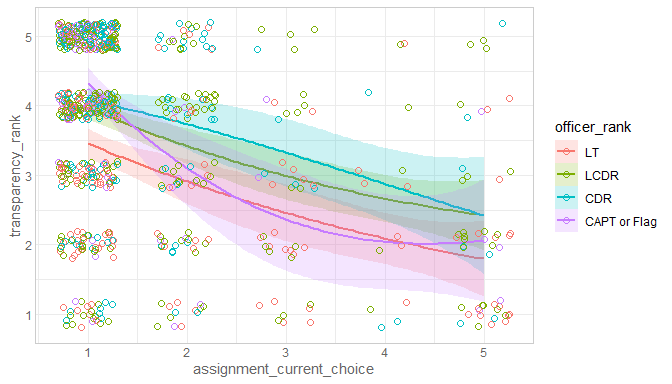<br/>Data:<code> ds </code><br/>Formula:<code> ~ transparency_rank 1 + officer_rate_f * assignment_current_choice </code><table class="table table-striped table-hover table-condensed table-responsive" style="width: auto !important; ">
 <thead>
  <tr>
   <th style="text-align:left;"> term </th>
   <th style="text-align:right;"> estimate </th>
   <th style="text-align:right;"> std.error </th>
   <th style="text-align:right;"> statistic </th>
   <th style="text-align:right;"> p.value </th>
  </tr>
 </thead>
<tbody>
  <tr>
   <td style="text-align:left;"> (Intercept) </td>
   <td style="text-align:right;"> 3.8638632 </td>
   <td style="text-align:right;"> 0.1499297 </td>
   <td style="text-align:right;"> 25.7711726 </td>
   <td style="text-align:right;"> 0.0000000 </td>
  </tr>
  <tr>
   <td style="text-align:left;"> officer_rate_f4 </td>
   <td style="text-align:right;"> 0.4825983 </td>
   <td style="text-align:right;"> 0.1937144 </td>
   <td style="text-align:right;"> 2.4912871 </td>
   <td style="text-align:right;"> 0.0129424 </td>
  </tr>
  <tr>
   <td style="text-align:left;"> officer_rate_f5 </td>
   <td style="text-align:right;"> 0.6305539 </td>
   <td style="text-align:right;"> 0.2161270 </td>
   <td style="text-align:right;"> 2.9175158 </td>
   <td style="text-align:right;"> 0.0036333 </td>
  </tr>
  <tr>
   <td style="text-align:left;"> officer_rate_f6 </td>
   <td style="text-align:right;"> 1.0465560 </td>
   <td style="text-align:right;"> 0.2579506 </td>
   <td style="text-align:right;"> 4.0571960 </td>
   <td style="text-align:right;"> 0.0000548 </td>
  </tr>
  <tr>
   <td style="text-align:left;"> assignment_current_choice </td>
   <td style="text-align:right;"> -0.4305167 </td>
   <td style="text-align:right;"> 0.0660775 </td>
   <td style="text-align:right;"> -6.5153323 </td>
   <td style="text-align:right;"> 0.0000000 </td>
  </tr>
  <tr>
   <td style="text-align:left;"> officer_rate_f4:assignment_current_choice </td>
   <td style="text-align:right;"> 0.0217793 </td>
   <td style="text-align:right;"> 0.0896179 </td>
   <td style="text-align:right;"> 0.2430244 </td>
   <td style="text-align:right;"> 0.8080527 </td>
  </tr>
  <tr>
   <td style="text-align:left;"> officer_rate_f5:assignment_current_choice </td>
   <td style="text-align:right;"> 0.0254252 </td>
   <td style="text-align:right;"> 0.1147065 </td>
   <td style="text-align:right;"> 0.2216542 </td>
   <td style="text-align:right;"> 0.8246432 </td>
  </tr>
  <tr>
   <td style="text-align:left;"> officer_rate_f6:assignment_current_choice </td>
   <td style="text-align:right;"> -0.2130761 </td>
   <td style="text-align:right;"> 0.1435839 </td>
   <td style="text-align:right;"> -1.4839828 </td>
   <td style="text-align:right;"> 0.1382319 </td>
  </tr>
</tbody>
</table>

<table class="table table-striped table-hover table-condensed table-responsive" style="width: auto !important; ">
 <thead>
  <tr>
   <th style="text-align:right;"> r.squared </th>
   <th style="text-align:right;"> adj.r.squared </th>
   <th style="text-align:right;"> sigma </th>
   <th style="text-align:right;"> statistic </th>
   <th style="text-align:right;"> p.value </th>
   <th style="text-align:right;"> df </th>
   <th style="text-align:right;"> logLik </th>
   <th style="text-align:right;"> AIC </th>
   <th style="text-align:right;"> BIC </th>
   <th style="text-align:right;"> deviance </th>
   <th style="text-align:right;"> df.residual </th>
  </tr>
 </thead>
<tbody>
  <tr>
   <td style="text-align:right;"> 0.2076297 </td>
   <td style="text-align:right;"> 0.2002637 </td>
   <td style="text-align:right;"> 1.18273 </td>
   <td style="text-align:right;"> 28.1876 </td>
   <td style="text-align:right;"> 0 </td>
   <td style="text-align:right;"> 8 </td>
   <td style="text-align:right;"> -1203.506 </td>
   <td style="text-align:right;"> 2425.012 </td>
   <td style="text-align:right;"> 2466.724 </td>
   <td style="text-align:right;"> 1053.334 </td>
   <td style="text-align:right;"> 753 </td>
  </tr>
</tbody>
</table>### favoritism_rank

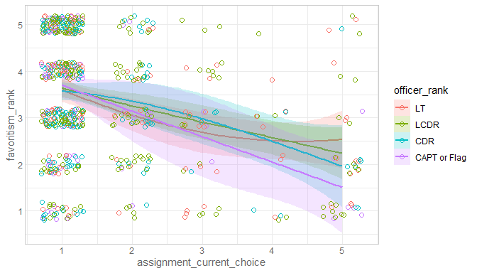<br/>Data:<code> ds </code><br/>Formula:<code> ~ favoritism_rank 1 + officer_rate_f * assignment_current_choice </code><table class="table table-striped table-hover table-condensed table-responsive" style="width: auto !important; ">
 <thead>
  <tr>
   <th style="text-align:left;"> term </th>
   <th style="text-align:right;"> estimate </th>
   <th style="text-align:right;"> std.error </th>
   <th style="text-align:right;"> statistic </th>
   <th style="text-align:right;"> p.value </th>
  </tr>
 </thead>
<tbody>
  <tr>
   <td style="text-align:left;"> (Intercept) </td>
   <td style="text-align:right;"> 3.8687050 </td>
   <td style="text-align:right;"> 0.1889326 </td>
   <td style="text-align:right;"> 20.4766424 </td>
   <td style="text-align:right;"> 0.0000000 </td>
  </tr>
  <tr>
   <td style="text-align:left;"> officer_rate_f4 </td>
   <td style="text-align:right;"> 0.1174241 </td>
   <td style="text-align:right;"> 0.2324391 </td>
   <td style="text-align:right;"> 0.5051821 </td>
   <td style="text-align:right;"> 0.6135983 </td>
  </tr>
  <tr>
   <td style="text-align:left;"> officer_rate_f5 </td>
   <td style="text-align:right;"> 0.0937283 </td>
   <td style="text-align:right;"> 0.2502167 </td>
   <td style="text-align:right;"> 0.3745885 </td>
   <td style="text-align:right;"> 0.7080859 </td>
  </tr>
  <tr>
   <td style="text-align:left;"> officer_rate_f6 </td>
   <td style="text-align:right;"> 0.3797836 </td>
   <td style="text-align:right;"> 0.2860813 </td>
   <td style="text-align:right;"> 1.3275372 </td>
   <td style="text-align:right;"> 0.1847866 </td>
  </tr>
  <tr>
   <td style="text-align:left;"> assignment_current_choice </td>
   <td style="text-align:right;"> -0.3171891 </td>
   <td style="text-align:right;"> 0.0798386 </td>
   <td style="text-align:right;"> -3.9728796 </td>
   <td style="text-align:right;"> 0.0000788 </td>
  </tr>
  <tr>
   <td style="text-align:left;"> officer_rate_f4:assignment_current_choice </td>
   <td style="text-align:right;"> -0.0355036 </td>
   <td style="text-align:right;"> 0.1036411 </td>
   <td style="text-align:right;"> -0.3425626 </td>
   <td style="text-align:right;"> 0.7320358 </td>
  </tr>
  <tr>
   <td style="text-align:left;"> officer_rate_f5:assignment_current_choice </td>
   <td style="text-align:right;"> -0.0549110 </td>
   <td style="text-align:right;"> 0.1273840 </td>
   <td style="text-align:right;"> -0.4310667 </td>
   <td style="text-align:right;"> 0.6665595 </td>
  </tr>
  <tr>
   <td style="text-align:left;"> officer_rate_f6:assignment_current_choice </td>
   <td style="text-align:right;"> -0.2321125 </td>
   <td style="text-align:right;"> 0.1465992 </td>
   <td style="text-align:right;"> -1.5833140 </td>
   <td style="text-align:right;"> 0.1138253 </td>
  </tr>
</tbody>
</table>

<table class="table table-striped table-hover table-condensed table-responsive" style="width: auto !important; ">
 <thead>
  <tr>
   <th style="text-align:right;"> r.squared </th>
   <th style="text-align:right;"> adj.r.squared </th>
   <th style="text-align:right;"> sigma </th>
   <th style="text-align:right;"> statistic </th>
   <th style="text-align:right;"> p.value </th>
   <th style="text-align:right;"> df </th>
   <th style="text-align:right;"> logLik </th>
   <th style="text-align:right;"> AIC </th>
   <th style="text-align:right;"> BIC </th>
   <th style="text-align:right;"> deviance </th>
   <th style="text-align:right;"> df.residual </th>
  </tr>
 </thead>
<tbody>
  <tr>
   <td style="text-align:right;"> 0.108222 </td>
   <td style="text-align:right;"> 0.0988349 </td>
   <td style="text-align:right;"> 1.235585 </td>
   <td style="text-align:right;"> 11.52876 </td>
   <td style="text-align:right;"> 0 </td>
   <td style="text-align:right;"> 8 </td>
   <td style="text-align:right;"> -1093.291 </td>
   <td style="text-align:right;"> 2204.582 </td>
   <td style="text-align:right;"> 2245.188 </td>
   <td style="text-align:right;"> 1015.236 </td>
   <td style="text-align:right;"> 665 </td>
  </tr>
</tbody>
</table>

By Rank and Bonus Pay
-----------------------------------
### satisfaction_rank

<br/>Data:<code> ds </code><br/>Formula:<code> ~ satisfaction_rank 1 + officer_rate_f + bonus_pay </code><table class="table table-striped table-hover table-condensed table-responsive" style="width: auto !important; ">
 <thead>
  <tr>
   <th style="text-align:left;"> term </th>
   <th style="text-align:right;"> estimate </th>
   <th style="text-align:right;"> std.error </th>
   <th style="text-align:right;"> statistic </th>
   <th style="text-align:right;"> p.value </th>
  </tr>
 </thead>
<tbody>
  <tr>
   <td style="text-align:left;"> (Intercept) </td>
   <td style="text-align:right;"> 2.9244122 </td>
   <td style="text-align:right;"> 0.1132714 </td>
   <td style="text-align:right;"> 25.817747 </td>
   <td style="text-align:right;"> 0.0000000 </td>
  </tr>
  <tr>
   <td style="text-align:left;"> officer_rate_f4 </td>
   <td style="text-align:right;"> 0.2934115 </td>
   <td style="text-align:right;"> 0.1267040 </td>
   <td style="text-align:right;"> 2.315724 </td>
   <td style="text-align:right;"> 0.0208064 </td>
  </tr>
  <tr>
   <td style="text-align:left;"> officer_rate_f5 </td>
   <td style="text-align:right;"> 0.6032909 </td>
   <td style="text-align:right;"> 0.1408814 </td>
   <td style="text-align:right;"> 4.282261 </td>
   <td style="text-align:right;"> 0.0000206 </td>
  </tr>
  <tr>
   <td style="text-align:left;"> officer_rate_f6 </td>
   <td style="text-align:right;"> 0.8478220 </td>
   <td style="text-align:right;"> 0.1620620 </td>
   <td style="text-align:right;"> 5.231467 </td>
   <td style="text-align:right;"> 0.0000002 </td>
  </tr>
  <tr>
   <td style="text-align:left;"> bonus_pay </td>
   <td style="text-align:right;"> 0.0000158 </td>
   <td style="text-align:right;"> 0.0000051 </td>
   <td style="text-align:right;"> 3.072155 </td>
   <td style="text-align:right;"> 0.0021917 </td>
  </tr>
</tbody>
</table>

<table class="table table-striped table-hover table-condensed table-responsive" style="width: auto !important; ">
 <thead>
  <tr>
   <th style="text-align:right;"> r.squared </th>
   <th style="text-align:right;"> adj.r.squared </th>
   <th style="text-align:right;"> sigma </th>
   <th style="text-align:right;"> statistic </th>
   <th style="text-align:right;"> p.value </th>
   <th style="text-align:right;"> df </th>
   <th style="text-align:right;"> logLik </th>
   <th style="text-align:right;"> AIC </th>
   <th style="text-align:right;"> BIC </th>
   <th style="text-align:right;"> deviance </th>
   <th style="text-align:right;"> df.residual </th>
  </tr>
 </thead>
<tbody>
  <tr>
   <td style="text-align:right;"> 0.0720318 </td>
   <td style="text-align:right;"> 0.0677406 </td>
   <td style="text-align:right;"> 1.311901 </td>
   <td style="text-align:right;"> 16.786 </td>
   <td style="text-align:right;"> 0 </td>
   <td style="text-align:right;"> 5 </td>
   <td style="text-align:right;"> -1468.155 </td>
   <td style="text-align:right;"> 2948.309 </td>
   <td style="text-align:right;"> 2976.92 </td>
   <td style="text-align:right;"> 1488.738 </td>
   <td style="text-align:right;"> 865 </td>
  </tr>
</tbody>
</table><br/>Data:<code> ds </code><br/>Formula:<code> ~ satisfaction_rank 1 + officer_rate_f * bonus_pay </code><table class="table table-striped table-hover table-condensed table-responsive" style="width: auto !important; ">
 <thead>
  <tr>
   <th style="text-align:left;"> term </th>
   <th style="text-align:right;"> estimate </th>
   <th style="text-align:right;"> std.error </th>
   <th style="text-align:right;"> statistic </th>
   <th style="text-align:right;"> p.value </th>
  </tr>
 </thead>
<tbody>
  <tr>
   <td style="text-align:left;"> (Intercept) </td>
   <td style="text-align:right;"> 2.6738295 </td>
   <td style="text-align:right;"> 0.1412220 </td>
   <td style="text-align:right;"> 18.933520 </td>
   <td style="text-align:right;"> 0.0000000 </td>
  </tr>
  <tr>
   <td style="text-align:left;"> officer_rate_f4 </td>
   <td style="text-align:right;"> 0.9876528 </td>
   <td style="text-align:right;"> 0.2498733 </td>
   <td style="text-align:right;"> 3.952615 </td>
   <td style="text-align:right;"> 0.0000836 </td>
  </tr>
  <tr>
   <td style="text-align:left;"> officer_rate_f5 </td>
   <td style="text-align:right;"> 0.8154021 </td>
   <td style="text-align:right;"> 0.3806246 </td>
   <td style="text-align:right;"> 2.142274 </td>
   <td style="text-align:right;"> 0.0324510 </td>
  </tr>
  <tr>
   <td style="text-align:left;"> officer_rate_f6 </td>
   <td style="text-align:right;"> 1.1783927 </td>
   <td style="text-align:right;"> 0.4842708 </td>
   <td style="text-align:right;"> 2.433334 </td>
   <td style="text-align:right;"> 0.0151628 </td>
  </tr>
  <tr>
   <td style="text-align:left;"> bonus_pay </td>
   <td style="text-align:right;"> 0.0000345 </td>
   <td style="text-align:right;"> 0.0000081 </td>
   <td style="text-align:right;"> 4.232110 </td>
   <td style="text-align:right;"> 0.0000256 </td>
  </tr>
  <tr>
   <td style="text-align:left;"> officer_rate_f4:bonus_pay </td>
   <td style="text-align:right;"> -0.0000374 </td>
   <td style="text-align:right;"> 0.0000115 </td>
   <td style="text-align:right;"> -3.245845 </td>
   <td style="text-align:right;"> 0.0012162 </td>
  </tr>
  <tr>
   <td style="text-align:left;"> officer_rate_f5:bonus_pay </td>
   <td style="text-align:right;"> -0.0000172 </td>
   <td style="text-align:right;"> 0.0000157 </td>
   <td style="text-align:right;"> -1.096670 </td>
   <td style="text-align:right;"> 0.2730919 </td>
  </tr>
  <tr>
   <td style="text-align:left;"> officer_rate_f6:bonus_pay </td>
   <td style="text-align:right;"> -0.0000222 </td>
   <td style="text-align:right;"> 0.0000213 </td>
   <td style="text-align:right;"> -1.042449 </td>
   <td style="text-align:right;"> 0.2974956 </td>
  </tr>
</tbody>
</table>

<table class="table table-striped table-hover table-condensed table-responsive" style="width: auto !important; ">
 <thead>
  <tr>
   <th style="text-align:right;"> r.squared </th>
   <th style="text-align:right;"> adj.r.squared </th>
   <th style="text-align:right;"> sigma </th>
   <th style="text-align:right;"> statistic </th>
   <th style="text-align:right;"> p.value </th>
   <th style="text-align:right;"> df </th>
   <th style="text-align:right;"> logLik </th>
   <th style="text-align:right;"> AIC </th>
   <th style="text-align:right;"> BIC </th>
   <th style="text-align:right;"> deviance </th>
   <th style="text-align:right;"> df.residual </th>
  </tr>
 </thead>
<tbody>
  <tr>
   <td style="text-align:right;"> 0.0832837 </td>
   <td style="text-align:right;"> 0.0758394 </td>
   <td style="text-align:right;"> 1.30619 </td>
   <td style="text-align:right;"> 11.18754 </td>
   <td style="text-align:right;"> 0 </td>
   <td style="text-align:right;"> 8 </td>
   <td style="text-align:right;"> -1462.848 </td>
   <td style="text-align:right;"> 2943.696 </td>
   <td style="text-align:right;"> 2986.612 </td>
   <td style="text-align:right;"> 1470.687 </td>
   <td style="text-align:right;"> 862 </td>
  </tr>
</tbody>
</table><br/><code>Analysis of Variance Table

Model 1: satisfaction_rank ~ 1 + officer_rate_f + bonus_pay
Model 2: satisfaction_rank ~ 1 + officer_rate_f * bonus_pay
  Res.Df    RSS Df Sum of Sq      F  Pr(>F)
1    865 1488.7                            
2    862 1470.7  3    18.052 3.5268 0.01461
</code>### transparency_rank

<br/>Data:<code> ds </code><br/>Formula:<code> ~ transparency_rank 1 + officer_rate_f * bonus_pay </code><table class="table table-striped table-hover table-condensed table-responsive" style="width: auto !important; ">
 <thead>
  <tr>
   <th style="text-align:left;"> term </th>
   <th style="text-align:right;"> estimate </th>
   <th style="text-align:right;"> std.error </th>
   <th style="text-align:right;"> statistic </th>
   <th style="text-align:right;"> p.value </th>
  </tr>
 </thead>
<tbody>
  <tr>
   <td style="text-align:left;"> (Intercept) </td>
   <td style="text-align:right;"> 2.4796068 </td>
   <td style="text-align:right;"> 0.1432849 </td>
   <td style="text-align:right;"> 17.3054341 </td>
   <td style="text-align:right;"> 0.0000000 </td>
  </tr>
  <tr>
   <td style="text-align:left;"> officer_rate_f4 </td>
   <td style="text-align:right;"> 1.0075219 </td>
   <td style="text-align:right;"> 0.2531992 </td>
   <td style="text-align:right;"> 3.9791673 </td>
   <td style="text-align:right;"> 0.0000749 </td>
  </tr>
  <tr>
   <td style="text-align:left;"> officer_rate_f5 </td>
   <td style="text-align:right;"> 0.8584585 </td>
   <td style="text-align:right;"> 0.3901640 </td>
   <td style="text-align:right;"> 2.2002504 </td>
   <td style="text-align:right;"> 0.0280522 </td>
  </tr>
  <tr>
   <td style="text-align:left;"> officer_rate_f6 </td>
   <td style="text-align:right;"> 0.8102031 </td>
   <td style="text-align:right;"> 0.5006221 </td>
   <td style="text-align:right;"> 1.6183927 </td>
   <td style="text-align:right;"> 0.1059417 </td>
  </tr>
  <tr>
   <td style="text-align:left;"> bonus_pay </td>
   <td style="text-align:right;"> 0.0000318 </td>
   <td style="text-align:right;"> 0.0000083 </td>
   <td style="text-align:right;"> 3.8335875 </td>
   <td style="text-align:right;"> 0.0001354 </td>
  </tr>
  <tr>
   <td style="text-align:left;"> officer_rate_f4:bonus_pay </td>
   <td style="text-align:right;"> -0.0000315 </td>
   <td style="text-align:right;"> 0.0000117 </td>
   <td style="text-align:right;"> -2.6878622 </td>
   <td style="text-align:right;"> 0.0073290 </td>
  </tr>
  <tr>
   <td style="text-align:left;"> officer_rate_f5:bonus_pay </td>
   <td style="text-align:right;"> -0.0000138 </td>
   <td style="text-align:right;"> 0.0000161 </td>
   <td style="text-align:right;"> -0.8554228 </td>
   <td style="text-align:right;"> 0.3925535 </td>
  </tr>
  <tr>
   <td style="text-align:left;"> officer_rate_f6:bonus_pay </td>
   <td style="text-align:right;"> -0.0000028 </td>
   <td style="text-align:right;"> 0.0000221 </td>
   <td style="text-align:right;"> -0.1257225 </td>
   <td style="text-align:right;"> 0.8999807 </td>
  </tr>
</tbody>
</table>

<table class="table table-striped table-hover table-condensed table-responsive" style="width: auto !important; ">
 <thead>
  <tr>
   <th style="text-align:right;"> r.squared </th>
   <th style="text-align:right;"> adj.r.squared </th>
   <th style="text-align:right;"> sigma </th>
   <th style="text-align:right;"> statistic </th>
   <th style="text-align:right;"> p.value </th>
   <th style="text-align:right;"> df </th>
   <th style="text-align:right;"> logLik </th>
   <th style="text-align:right;"> AIC </th>
   <th style="text-align:right;"> BIC </th>
   <th style="text-align:right;"> deviance </th>
   <th style="text-align:right;"> df.residual </th>
  </tr>
 </thead>
<tbody>
  <tr>
   <td style="text-align:right;"> 0.0879753 </td>
   <td style="text-align:right;"> 0.0806117 </td>
   <td style="text-align:right;"> 1.340582 </td>
   <td style="text-align:right;"> 11.94744 </td>
   <td style="text-align:right;"> 0 </td>
   <td style="text-align:right;"> 8 </td>
   <td style="text-align:right;"> -1494.019 </td>
   <td style="text-align:right;"> 3006.038 </td>
   <td style="text-align:right;"> 3049.006 </td>
   <td style="text-align:right;"> 1558.138 </td>
   <td style="text-align:right;"> 867 </td>
  </tr>
</tbody>
</table>### favoritism_rank

<br/>Data:<code> ds </code><br/>Formula:<code> ~ favoritism_rank 1 + officer_rate_f * bonus_pay </code><table class="table table-striped table-hover table-condensed table-responsive" style="width: auto !important; ">
 <thead>
  <tr>
   <th style="text-align:left;"> term </th>
   <th style="text-align:right;"> estimate </th>
   <th style="text-align:right;"> std.error </th>
   <th style="text-align:right;"> statistic </th>
   <th style="text-align:right;"> p.value </th>
  </tr>
 </thead>
<tbody>
  <tr>
   <td style="text-align:left;"> (Intercept) </td>
   <td style="text-align:right;"> 2.8463186 </td>
   <td style="text-align:right;"> 0.1678880 </td>
   <td style="text-align:right;"> 16.9536708 </td>
   <td style="text-align:right;"> 0.0000000 </td>
  </tr>
  <tr>
   <td style="text-align:left;"> officer_rate_f4 </td>
   <td style="text-align:right;"> 0.6600801 </td>
   <td style="text-align:right;"> 0.2736657 </td>
   <td style="text-align:right;"> 2.4119942 </td>
   <td style="text-align:right;"> 0.0161031 </td>
  </tr>
  <tr>
   <td style="text-align:left;"> officer_rate_f5 </td>
   <td style="text-align:right;"> 0.2419408 </td>
   <td style="text-align:right;"> 0.4029886 </td>
   <td style="text-align:right;"> 0.6003664 </td>
   <td style="text-align:right;"> 0.5484422 </td>
  </tr>
  <tr>
   <td style="text-align:left;"> officer_rate_f6 </td>
   <td style="text-align:right;"> 0.6359086 </td>
   <td style="text-align:right;"> 0.5053006 </td>
   <td style="text-align:right;"> 1.2584759 </td>
   <td style="text-align:right;"> 0.2086087 </td>
  </tr>
  <tr>
   <td style="text-align:left;"> bonus_pay </td>
   <td style="text-align:right;"> 0.0000211 </td>
   <td style="text-align:right;"> 0.0000098 </td>
   <td style="text-align:right;"> 2.1572493 </td>
   <td style="text-align:right;"> 0.0313011 </td>
  </tr>
  <tr>
   <td style="text-align:left;"> officer_rate_f4:bonus_pay </td>
   <td style="text-align:right;"> -0.0000288 </td>
   <td style="text-align:right;"> 0.0000130 </td>
   <td style="text-align:right;"> -2.2189548 </td>
   <td style="text-align:right;"> 0.0267864 </td>
  </tr>
  <tr>
   <td style="text-align:left;"> officer_rate_f5:bonus_pay </td>
   <td style="text-align:right;"> -0.0000098 </td>
   <td style="text-align:right;"> 0.0000169 </td>
   <td style="text-align:right;"> -0.5808773 </td>
   <td style="text-align:right;"> 0.5614965 </td>
  </tr>
  <tr>
   <td style="text-align:left;"> officer_rate_f6:bonus_pay </td>
   <td style="text-align:right;"> -0.0000239 </td>
   <td style="text-align:right;"> 0.0000225 </td>
   <td style="text-align:right;"> -1.0656273 </td>
   <td style="text-align:right;"> 0.2869328 </td>
  </tr>
</tbody>
</table>

<table class="table table-striped table-hover table-condensed table-responsive" style="width: auto !important; ">
 <thead>
  <tr>
   <th style="text-align:right;"> r.squared </th>
   <th style="text-align:right;"> adj.r.squared </th>
   <th style="text-align:right;"> sigma </th>
   <th style="text-align:right;"> statistic </th>
   <th style="text-align:right;"> p.value </th>
   <th style="text-align:right;"> df </th>
   <th style="text-align:right;"> logLik </th>
   <th style="text-align:right;"> AIC </th>
   <th style="text-align:right;"> BIC </th>
   <th style="text-align:right;"> deviance </th>
   <th style="text-align:right;"> df.residual </th>
  </tr>
 </thead>
<tbody>
  <tr>
   <td style="text-align:right;"> 0.01366 </td>
   <td style="text-align:right;"> 0.0045151 </td>
   <td style="text-align:right;"> 1.327109 </td>
   <td style="text-align:right;"> 1.493731 </td>
   <td style="text-align:right;"> 0.1660622 </td>
   <td style="text-align:right;"> 8 </td>
   <td style="text-align:right;"> -1294.56 </td>
   <td style="text-align:right;"> 2607.121 </td>
   <td style="text-align:right;"> 2648.856 </td>
   <td style="text-align:right;"> 1329.721 </td>
   <td style="text-align:right;"> 755 </td>
  </tr>
</tbody>
</table>

By Billet Current and Critical War
-----------------------------------
### satisfaction_rank

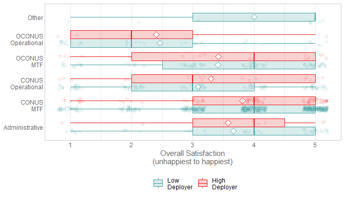<br/>Data:<code> ds </code><br/>Formula:<code> ~ satisfaction_rank 1 + billet_current + critical_war </code><table class="table table-striped table-hover table-condensed table-responsive" style="width: auto !important; ">
 <thead>
  <tr>
   <th style="text-align:left;"> term </th>
   <th style="text-align:right;"> estimate </th>
   <th style="text-align:right;"> std.error </th>
   <th style="text-align:right;"> statistic </th>
   <th style="text-align:right;"> p.value </th>
  </tr>
 </thead>
<tbody>
  <tr>
   <td style="text-align:left;"> (Intercept) </td>
   <td style="text-align:right;"> 3.8377622 </td>
   <td style="text-align:right;"> 0.1180247 </td>
   <td style="text-align:right;"> 32.5166107 </td>
   <td style="text-align:right;"> 0.0000000 </td>
  </tr>
  <tr>
   <td style="text-align:left;"> billet_currentNon-Operational/Clinical </td>
   <td style="text-align:right;"> -0.2015313 </td>
   <td style="text-align:right;"> 0.1975770 </td>
   <td style="text-align:right;"> -1.0200137 </td>
   <td style="text-align:right;"> 0.3080071 </td>
  </tr>
  <tr>
   <td style="text-align:left;"> billet_currentOCONUS MTF </td>
   <td style="text-align:right;"> -0.4370929 </td>
   <td style="text-align:right;"> 0.1425983 </td>
   <td style="text-align:right;"> -3.0652035 </td>
   <td style="text-align:right;"> 0.0022428 </td>
  </tr>
  <tr>
   <td style="text-align:left;"> billet_currentCONUS Operational </td>
   <td style="text-align:right;"> -0.7312263 </td>
   <td style="text-align:right;"> 0.1359483 </td>
   <td style="text-align:right;"> -5.3787096 </td>
   <td style="text-align:right;"> 0.0000001 </td>
  </tr>
  <tr>
   <td style="text-align:left;"> billet_currentOCONUS Operational </td>
   <td style="text-align:right;"> -1.3975988 </td>
   <td style="text-align:right;"> 0.2150434 </td>
   <td style="text-align:right;"> -6.4991486 </td>
   <td style="text-align:right;"> 0.0000000 </td>
  </tr>
  <tr>
   <td style="text-align:left;"> billet_currentOther </td>
   <td style="text-align:right;"> 0.1509960 </td>
   <td style="text-align:right;"> 0.4418948 </td>
   <td style="text-align:right;"> 0.3417011 </td>
   <td style="text-align:right;"> 0.7326588 </td>
  </tr>
  <tr>
   <td style="text-align:left;"> critical_warLow Deployer </td>
   <td style="text-align:right;"> 0.0112418 </td>
   <td style="text-align:right;"> 0.1235363 </td>
   <td style="text-align:right;"> 0.0910001 </td>
   <td style="text-align:right;"> 0.9275136 </td>
  </tr>
</tbody>
</table>

<table class="table table-striped table-hover table-condensed table-responsive" style="width: auto !important; ">
 <thead>
  <tr>
   <th style="text-align:right;"> r.squared </th>
   <th style="text-align:right;"> adj.r.squared </th>
   <th style="text-align:right;"> sigma </th>
   <th style="text-align:right;"> statistic </th>
   <th style="text-align:right;"> p.value </th>
   <th style="text-align:right;"> df </th>
   <th style="text-align:right;"> logLik </th>
   <th style="text-align:right;"> AIC </th>
   <th style="text-align:right;"> BIC </th>
   <th style="text-align:right;"> deviance </th>
   <th style="text-align:right;"> df.residual </th>
  </tr>
 </thead>
<tbody>
  <tr>
   <td style="text-align:right;"> 0.0731976 </td>
   <td style="text-align:right;"> 0.0667689 </td>
   <td style="text-align:right;"> 1.313958 </td>
   <td style="text-align:right;"> 11.38609 </td>
   <td style="text-align:right;"> 0 </td>
   <td style="text-align:right;"> 7 </td>
   <td style="text-align:right;"> -1471.894 </td>
   <td style="text-align:right;"> 2959.789 </td>
   <td style="text-align:right;"> 2997.955 </td>
   <td style="text-align:right;"> 1493.409 </td>
   <td style="text-align:right;"> 865 </td>
  </tr>
</tbody>
</table>

By Bonus_pay and Manning_proportion
-----------------------------------
### satisfaction_rank

<br/>Data:<code> ds </code><br/>Formula:<code> ~ satisfaction_rank 1 + manning_proportion_cut3 + bonus_pay_cut3 </code><table class="table table-striped table-hover table-condensed table-responsive" style="width: auto !important; ">
 <thead>
  <tr>
   <th style="text-align:left;"> term </th>
   <th style="text-align:right;"> estimate </th>
   <th style="text-align:right;"> std.error </th>
   <th style="text-align:right;"> statistic </th>
   <th style="text-align:right;"> p.value </th>
  </tr>
 </thead>
<tbody>
  <tr>
   <td style="text-align:left;"> (Intercept) </td>
   <td style="text-align:right;"> 2.4680836 </td>
   <td style="text-align:right;"> 0.1647969 </td>
   <td style="text-align:right;"> 14.976514 </td>
   <td style="text-align:right;"> 0.0000000 </td>
  </tr>
  <tr>
   <td style="text-align:left;"> manning_proportion_cut3Balanced </td>
   <td style="text-align:right;"> 0.3928698 </td>
   <td style="text-align:right;"> 0.1259855 </td>
   <td style="text-align:right;"> 3.118373 </td>
   <td style="text-align:right;"> 0.0018786 </td>
  </tr>
  <tr>
   <td style="text-align:left;"> manning_proportion_cut3Over </td>
   <td style="text-align:right;"> 0.4651373 </td>
   <td style="text-align:right;"> 0.1209922 </td>
   <td style="text-align:right;"> 3.844358 </td>
   <td style="text-align:right;"> 0.0001297 </td>
  </tr>
  <tr>
   <td style="text-align:left;"> bonus_pay_cut3$20-24k </td>
   <td style="text-align:right;"> 1.0172580 </td>
   <td style="text-align:right;"> 0.1493703 </td>
   <td style="text-align:right;"> 6.810311 </td>
   <td style="text-align:right;"> 0.0000000 </td>
  </tr>
  <tr>
   <td style="text-align:left;"> bonus_pay_cut3$24k+ </td>
   <td style="text-align:right;"> 0.8796862 </td>
   <td style="text-align:right;"> 0.1546106 </td>
   <td style="text-align:right;"> 5.689687 </td>
   <td style="text-align:right;"> 0.0000000 </td>
  </tr>
</tbody>
</table>

<table class="table table-striped table-hover table-condensed table-responsive" style="width: auto !important; ">
 <thead>
  <tr>
   <th style="text-align:right;"> r.squared </th>
   <th style="text-align:right;"> adj.r.squared </th>
   <th style="text-align:right;"> sigma </th>
   <th style="text-align:right;"> statistic </th>
   <th style="text-align:right;"> p.value </th>
   <th style="text-align:right;"> df </th>
   <th style="text-align:right;"> logLik </th>
   <th style="text-align:right;"> AIC </th>
   <th style="text-align:right;"> BIC </th>
   <th style="text-align:right;"> deviance </th>
   <th style="text-align:right;"> df.residual </th>
  </tr>
 </thead>
<tbody>
  <tr>
   <td style="text-align:right;"> 0.0642006 </td>
   <td style="text-align:right;"> 0.0598832 </td>
   <td style="text-align:right;"> 1.318796 </td>
   <td style="text-align:right;"> 14.87015 </td>
   <td style="text-align:right;"> 0 </td>
   <td style="text-align:right;"> 5 </td>
   <td style="text-align:right;"> -1476.106 </td>
   <td style="text-align:right;"> 2964.213 </td>
   <td style="text-align:right;"> 2992.838 </td>
   <td style="text-align:right;"> 1507.907 </td>
   <td style="text-align:right;"> 867 </td>
  </tr>
</tbody>
</table>No interaction between manning_proportion_cut3 & bonus_pay_cut3<br/><code>Analysis of Variance Table

Model 1: satisfaction_rank ~ 1 + manning_proportion_cut3 * bonus_pay_cut3
Model 2: satisfaction_rank ~ 1 + manning_proportion_cut3 + bonus_pay_cut3
  Res.Df    RSS Df Sum of Sq      F Pr(>F)
1    863 1499.7                           
2    867 1507.9 -4   -8.1779 1.1765 0.3197
</code><br/>Data:<code> ds </code><br/>Formula:<code> ~ satisfaction_rank 1 + billet_current + critical_war </code><table class="table table-striped table-hover table-condensed table-responsive" style="width: auto !important; ">
 <thead>
  <tr>
   <th style="text-align:left;"> term </th>
   <th style="text-align:right;"> estimate </th>
   <th style="text-align:right;"> std.error </th>
   <th style="text-align:right;"> statistic </th>
   <th style="text-align:right;"> p.value </th>
  </tr>
 </thead>
<tbody>
  <tr>
   <td style="text-align:left;"> (Intercept) </td>
   <td style="text-align:right;"> 3.8377622 </td>
   <td style="text-align:right;"> 0.1180247 </td>
   <td style="text-align:right;"> 32.5166107 </td>
   <td style="text-align:right;"> 0.0000000 </td>
  </tr>
  <tr>
   <td style="text-align:left;"> billet_currentNon-Operational/Clinical </td>
   <td style="text-align:right;"> -0.2015313 </td>
   <td style="text-align:right;"> 0.1975770 </td>
   <td style="text-align:right;"> -1.0200137 </td>
   <td style="text-align:right;"> 0.3080071 </td>
  </tr>
  <tr>
   <td style="text-align:left;"> billet_currentOCONUS MTF </td>
   <td style="text-align:right;"> -0.4370929 </td>
   <td style="text-align:right;"> 0.1425983 </td>
   <td style="text-align:right;"> -3.0652035 </td>
   <td style="text-align:right;"> 0.0022428 </td>
  </tr>
  <tr>
   <td style="text-align:left;"> billet_currentCONUS Operational </td>
   <td style="text-align:right;"> -0.7312263 </td>
   <td style="text-align:right;"> 0.1359483 </td>
   <td style="text-align:right;"> -5.3787096 </td>
   <td style="text-align:right;"> 0.0000001 </td>
  </tr>
  <tr>
   <td style="text-align:left;"> billet_currentOCONUS Operational </td>
   <td style="text-align:right;"> -1.3975988 </td>
   <td style="text-align:right;"> 0.2150434 </td>
   <td style="text-align:right;"> -6.4991486 </td>
   <td style="text-align:right;"> 0.0000000 </td>
  </tr>
  <tr>
   <td style="text-align:left;"> billet_currentOther </td>
   <td style="text-align:right;"> 0.1509960 </td>
   <td style="text-align:right;"> 0.4418948 </td>
   <td style="text-align:right;"> 0.3417011 </td>
   <td style="text-align:right;"> 0.7326588 </td>
  </tr>
  <tr>
   <td style="text-align:left;"> critical_warLow Deployer </td>
   <td style="text-align:right;"> 0.0112418 </td>
   <td style="text-align:right;"> 0.1235363 </td>
   <td style="text-align:right;"> 0.0910001 </td>
   <td style="text-align:right;"> 0.9275136 </td>
  </tr>
</tbody>
</table>

<table class="table table-striped table-hover table-condensed table-responsive" style="width: auto !important; ">
 <thead>
  <tr>
   <th style="text-align:right;"> r.squared </th>
   <th style="text-align:right;"> adj.r.squared </th>
   <th style="text-align:right;"> sigma </th>
   <th style="text-align:right;"> statistic </th>
   <th style="text-align:right;"> p.value </th>
   <th style="text-align:right;"> df </th>
   <th style="text-align:right;"> logLik </th>
   <th style="text-align:right;"> AIC </th>
   <th style="text-align:right;"> BIC </th>
   <th style="text-align:right;"> deviance </th>
   <th style="text-align:right;"> df.residual </th>
  </tr>
 </thead>
<tbody>
  <tr>
   <td style="text-align:right;"> 0.0731976 </td>
   <td style="text-align:right;"> 0.0667689 </td>
   <td style="text-align:right;"> 1.313958 </td>
   <td style="text-align:right;"> 11.38609 </td>
   <td style="text-align:right;"> 0 </td>
   <td style="text-align:right;"> 7 </td>
   <td style="text-align:right;"> -1471.894 </td>
   <td style="text-align:right;"> 2959.789 </td>
   <td style="text-align:right;"> 2997.955 </td>
   <td style="text-align:right;"> 1493.409 </td>
   <td style="text-align:right;"> 865 </td>
  </tr>
</tbody>
</table>

By Rank and Billet Type
-----------------------------------
### satisfaction_rank


Call:
lm(formula = satisfaction_rank ~ 1 + billet_current + officer_rate, 
    data = ds_no_other_or_unknown)

Residuals:
    Min      1Q  Median      3Q     Max 
-3.4636 -0.7754  0.2246  0.9947  2.6016 

Coefficients:
                                       Estimate Std. Error t value Pr(>|t|)
(Intercept)                             2.39905    0.20237  11.855  < 2e-16
billet_currentNon-Operational/Clinical -0.52516    0.19724  -2.663 0.007902
billet_currentOCONUS MTF               -0.45834    0.13776  -3.327 0.000915
billet_currentCONUS Operational        -0.67101    0.13202  -5.083 4.57e-07
billet_currentOCONUS Operational       -1.37705    0.20769  -6.630 5.94e-11
officer_rate                            0.34410    0.04627   7.436 2.52e-13

Residual standard error: 1.269 on 853 degrees of freedom
  (77 observations deleted due to missingness)
Multiple R-squared:  0.1299,	Adjusted R-squared:  0.1248 
F-statistic: 25.46 on 5 and 853 DF,  p-value: < 2.2e-16


Call:
lm(formula = satisfaction_rank ~ 1 + billet_current + officer_rate + 
    specialty_type, data = ds_no_other_or_unknown)

Residuals:
    Min      1Q  Median      3Q     Max 
-3.5180 -0.8131  0.1883  1.0431  2.8817 

Coefficients:
                                       Estimate Std. Error t value Pr(>|t|)
(Intercept)                             2.74494    0.22167  12.383  < 2e-16
billet_currentNon-Operational/Clinical -0.44492    0.19850  -2.241 0.025258
billet_currentOCONUS MTF               -0.40357    0.13807  -2.923 0.003559
billet_currentCONUS Operational        -0.39353    0.15497  -2.539 0.011283
billet_currentOCONUS Operational       -1.14521    0.21495  -5.328 1.27e-07
officer_rate                            0.29551    0.04919   6.008 2.78e-09
specialty_typesurgical                 -0.26554    0.12029  -2.208 0.027545
specialty_typefamily                   -0.40943    0.11886  -3.445 0.000600
specialty_typeoperational              -0.66349    0.18554  -3.576 0.000369
specialty_typeresident                 -0.19873    0.23598  -0.842 0.399932

Residual standard error: 1.257 on 849 degrees of freedom
  (77 observations deleted due to missingness)
Multiple R-squared:  0.1506,	Adjusted R-squared:  0.1416 
F-statistic: 16.73 on 9 and 849 DF,  p-value: < 2.2e-16

<br/>Data:<code> ds_no_other_or_unknown </code><br/>Formula:<code> ~ satisfaction_rank 1 + billet_current + officer_rate + specialty_type </code><table class="table table-striped table-hover table-condensed table-responsive" style="width: auto !important; ">
 <thead>
  <tr>
   <th style="text-align:left;"> term </th>
   <th style="text-align:right;"> estimate </th>
   <th style="text-align:right;"> std.error </th>
   <th style="text-align:right;"> statistic </th>
   <th style="text-align:right;"> p.value </th>
  </tr>
 </thead>
<tbody>
  <tr>
   <td style="text-align:left;"> (Intercept) </td>
   <td style="text-align:right;"> 2.7449416 </td>
   <td style="text-align:right;"> 0.2216697 </td>
   <td style="text-align:right;"> 12.3830259 </td>
   <td style="text-align:right;"> 0.0000000 </td>
  </tr>
  <tr>
   <td style="text-align:left;"> billet_currentNon-Operational/Clinical </td>
   <td style="text-align:right;"> -0.4449198 </td>
   <td style="text-align:right;"> 0.1985010 </td>
   <td style="text-align:right;"> -2.2413979 </td>
   <td style="text-align:right;"> 0.0252580 </td>
  </tr>
  <tr>
   <td style="text-align:left;"> billet_currentOCONUS MTF </td>
   <td style="text-align:right;"> -0.4035686 </td>
   <td style="text-align:right;"> 0.1380693 </td>
   <td style="text-align:right;"> -2.9229432 </td>
   <td style="text-align:right;"> 0.0035595 </td>
  </tr>
  <tr>
   <td style="text-align:left;"> billet_currentCONUS Operational </td>
   <td style="text-align:right;"> -0.3935332 </td>
   <td style="text-align:right;"> 0.1549743 </td>
   <td style="text-align:right;"> -2.5393446 </td>
   <td style="text-align:right;"> 0.0112834 </td>
  </tr>
  <tr>
   <td style="text-align:left;"> billet_currentOCONUS Operational </td>
   <td style="text-align:right;"> -1.1452059 </td>
   <td style="text-align:right;"> 0.2149465 </td>
   <td style="text-align:right;"> -5.3278645 </td>
   <td style="text-align:right;"> 0.0000001 </td>
  </tr>
  <tr>
   <td style="text-align:left;"> officer_rate </td>
   <td style="text-align:right;"> 0.2955084 </td>
   <td style="text-align:right;"> 0.0491857 </td>
   <td style="text-align:right;"> 6.0080167 </td>
   <td style="text-align:right;"> 0.0000000 </td>
  </tr>
  <tr>
   <td style="text-align:left;"> specialty_typesurgical </td>
   <td style="text-align:right;"> -0.2655425 </td>
   <td style="text-align:right;"> 0.1202900 </td>
   <td style="text-align:right;"> -2.2075190 </td>
   <td style="text-align:right;"> 0.0275446 </td>
  </tr>
  <tr>
   <td style="text-align:left;"> specialty_typefamily </td>
   <td style="text-align:right;"> -0.4094283 </td>
   <td style="text-align:right;"> 0.1188588 </td>
   <td style="text-align:right;"> -3.4446620 </td>
   <td style="text-align:right;"> 0.0005998 </td>
  </tr>
  <tr>
   <td style="text-align:left;"> specialty_typeoperational </td>
   <td style="text-align:right;"> -0.6634897 </td>
   <td style="text-align:right;"> 0.1855377 </td>
   <td style="text-align:right;"> -3.5760380 </td>
   <td style="text-align:right;"> 0.0003686 </td>
  </tr>
  <tr>
   <td style="text-align:left;"> specialty_typeresident </td>
   <td style="text-align:right;"> -0.1987343 </td>
   <td style="text-align:right;"> 0.2359798 </td>
   <td style="text-align:right;"> -0.8421669 </td>
   <td style="text-align:right;"> 0.3999317 </td>
  </tr>
</tbody>
</table>

<table class="table table-striped table-hover table-condensed table-responsive" style="width: auto !important; ">
 <thead>
  <tr>
   <th style="text-align:right;"> r.squared </th>
   <th style="text-align:right;"> adj.r.squared </th>
   <th style="text-align:right;"> sigma </th>
   <th style="text-align:right;"> statistic </th>
   <th style="text-align:right;"> p.value </th>
   <th style="text-align:right;"> df </th>
   <th style="text-align:right;"> logLik </th>
   <th style="text-align:right;"> AIC </th>
   <th style="text-align:right;"> BIC </th>
   <th style="text-align:right;"> deviance </th>
   <th style="text-align:right;"> df.residual </th>
  </tr>
 </thead>
<tbody>
  <tr>
   <td style="text-align:right;"> 0.1506291 </td>
   <td style="text-align:right;"> 0.1416252 </td>
   <td style="text-align:right;"> 1.256672 </td>
   <td style="text-align:right;"> 16.72926 </td>
   <td style="text-align:right;"> 0 </td>
   <td style="text-align:right;"> 10 </td>
   <td style="text-align:right;"> -1410.092 </td>
   <td style="text-align:right;"> 2842.184 </td>
   <td style="text-align:right;"> 2894.498 </td>
   <td style="text-align:right;"> 1340.762 </td>
   <td style="text-align:right;"> 849 </td>
  </tr>
</tbody>
</table>Analysis of Variance Table

Model 1: satisfaction_rank ~ 1 + billet_current + officer_rate
Model 2: satisfaction_rank ~ 1 + billet_current + officer_rate + specialty_type
  Res.Df    RSS Df Sum of Sq      F    Pr(>F)
1    853 1373.5                              
2    849 1340.8  4    32.789 5.1907 0.0003911


Experimental
-----------------------------------
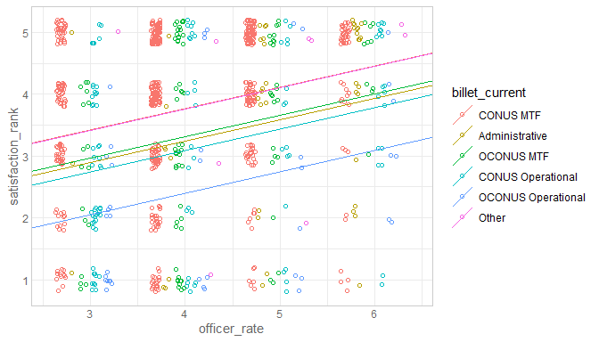


Session Information
============================================

For the sake of documentation and reproducibility, the current report was rendered in the following environment.  Click the line below to expand.

<details>
  <summary>Environment <span class="glyphicon glyphicon-plus-sign"></span></summary>

```
 Session info 
 setting  value                       
 version  R version 3.6.2 (2019-12-12)
 os       Ubuntu 19.10                
 system   x86_64, linux-gnu           
 ui       RStudio                     
 language (EN)                        
 collate  en_US.UTF-8                 
 ctype    en_US.UTF-8                 
 tz       America/Chicago             
 date     2020-01-25                  

 Packages 
 package         * version     date       lib source                                  
 assertthat        0.2.1       2019-03-21 [1] CRAN (R 3.6.2)                          
 backports         1.1.5       2019-10-02 [1] CRAN (R 3.6.2)                          
 broom             0.5.3       2019-12-14 [1] CRAN (R 3.6.2)                          
 callr             3.4.0       2019-12-09 [1] CRAN (R 3.6.2)                          
 checkmate         1.9.4       2019-07-04 [1] CRAN (R 3.6.2)                          
 cli               2.0.1       2020-01-08 [1] CRAN (R 3.6.2)                          
 colorspace        1.4-1       2019-03-18 [1] CRAN (R 3.6.2)                          
 config            0.3         2018-03-27 [1] CRAN (R 3.6.2)                          
 corrplot          0.84        2017-10-16 [1] CRAN (R 3.6.2)                          
 crayon            1.3.4       2017-09-16 [1] CRAN (R 3.6.2)                          
 DBI               1.1.0       2019-12-15 [1] CRAN (R 3.6.2)                          
 desc              1.2.0       2018-05-01 [1] CRAN (R 3.6.2)                          
 devtools          2.2.1       2019-09-24 [1] CRAN (R 3.6.2)                          
 digest            0.6.23      2019-11-23 [1] CRAN (R 3.6.2)                          
 dplyr             0.8.3       2019-07-04 [1] CRAN (R 3.6.2)                          
 ellipsis          0.3.0       2019-09-20 [1] CRAN (R 3.6.2)                          
 evaluate          0.14        2019-05-28 [1] CRAN (R 3.6.2)                          
 fansi             0.4.1       2020-01-08 [1] CRAN (R 3.6.2)                          
 farver            2.0.3       2020-01-16 [1] CRAN (R 3.6.2)                          
 fs                1.3.1       2019-05-06 [1] CRAN (R 3.6.2)                          
 generics          0.0.2       2018-11-29 [1] CRAN (R 3.6.2)                          
 ggplot2         * 3.2.1       2019-08-10 [1] CRAN (R 3.6.2)                          
 glue              1.3.1       2019-03-12 [1] CRAN (R 3.6.2)                          
 gtable            0.3.0       2019-03-25 [1] CRAN (R 3.6.2)                          
 highr             0.8         2019-03-20 [1] CRAN (R 3.6.2)                          
 hms               0.5.3       2020-01-08 [1] CRAN (R 3.6.2)                          
 htmltools         0.4.0       2019-10-04 [1] CRAN (R 3.6.2)                          
 httr              1.4.1       2019-08-05 [1] CRAN (R 3.6.2)                          
 import            1.1.0       2015-06-22 [1] CRAN (R 3.6.2)                          
 kableExtra        1.1.0       2019-03-16 [1] CRAN (R 3.6.2)                          
 knitr           * 1.27        2020-01-16 [1] CRAN (R 3.6.2)                          
 labeling          0.3         2014-08-23 [1] CRAN (R 3.6.2)                          
 lattice           0.20-38     2018-11-04 [4] CRAN (R 3.6.1)                          
 lazyeval          0.2.2       2019-03-15 [1] CRAN (R 3.6.2)                          
 lifecycle         0.1.0       2019-08-01 [1] CRAN (R 3.6.2)                          
 magrittr          1.5         2014-11-22 [1] CRAN (R 3.6.2)                          
 markdown          1.1         2019-08-07 [1] CRAN (R 3.6.2)                          
 Matrix            1.2-18      2019-11-27 [4] CRAN (R 3.6.1)                          
 memoise           1.1.0       2017-04-21 [1] CRAN (R 3.6.2)                          
 mitools           2.4         2019-04-26 [1] CRAN (R 3.6.2)                          
 munsell           0.5.0       2018-06-12 [1] CRAN (R 3.6.2)                          
 nlme              3.1-143     2019-12-10 [1] CRAN (R 3.6.2)                          
 OuhscMunge        0.1.9.9012  2020-01-13 [1] local                                   
 packrat           0.5.0       2018-11-14 [1] CRAN (R 3.6.2)                          
 pillar            1.4.3       2019-12-20 [1] CRAN (R 3.6.2)                          
 pkgbuild          1.0.6       2019-10-09 [1] CRAN (R 3.6.2)                          
 pkgconfig         2.0.3       2019-09-22 [1] CRAN (R 3.6.2)                          
 pkgload           1.0.2       2018-10-29 [1] CRAN (R 3.6.2)                          
 prettyunits       1.1.0       2020-01-09 [1] CRAN (R 3.6.2)                          
 processx          3.4.1       2019-07-18 [1] CRAN (R 3.6.2)                          
 ps                1.3.0       2018-12-21 [1] CRAN (R 3.6.2)                          
 purrr             0.3.3       2019-10-18 [1] CRAN (R 3.6.2)                          
 R6                2.4.1       2019-11-12 [1] CRAN (R 3.6.2)                          
 Rcpp              1.0.3       2019-11-08 [1] CRAN (R 3.6.2)                          
 readr             1.3.1       2018-12-21 [1] CRAN (R 3.6.2)                          
 remotes           2.1.0       2019-06-24 [1] CRAN (R 3.6.2)                          
 rlang             0.4.2       2019-11-23 [1] CRAN (R 3.6.2)                          
 rmarkdown         2.1         2020-01-20 [1] CRAN (R 3.6.2)                          
 rprojroot         1.3-2       2018-01-03 [1] CRAN (R 3.6.2)                          
 rsconnect         0.8.16      2019-12-13 [1] CRAN (R 3.6.2)                          
 rstudioapi        0.10        2019-03-19 [1] CRAN (R 3.6.2)                          
 rvest             0.3.5       2019-11-08 [1] CRAN (R 3.6.2)                          
 scales            1.1.0       2019-11-18 [1] CRAN (R 3.6.2)                          
 sessioninfo       1.1.1       2018-11-05 [1] CRAN (R 3.6.2)                          
 stringi           1.4.5       2020-01-11 [1] CRAN (R 3.6.2)                          
 stringr           1.4.0       2019-02-10 [1] CRAN (R 3.6.2)                          
 survey            3.37        2020-01-21 [1] CRAN (R 3.6.2)                          
 survival          3.1-8       2019-12-03 [1] CRAN (R 3.6.2)                          
 TabularManifest   0.1-16.9003 2019-12-15 [1] Github (Melinae/TabularManifest@4cbc21c)
 testit            0.11.1      2020-01-09 [1] Github (yihui/testit@c1c19f8)           
 testthat          2.3.1       2019-12-01 [1] CRAN (R 3.6.2)                          
 tibble            2.1.3       2019-06-06 [1] CRAN (R 3.6.2)                          
 tidyr             1.0.0       2019-09-11 [1] CRAN (R 3.6.2)                          
 tidyselect        0.2.5       2018-10-11 [1] CRAN (R 3.6.2)                          
 usethis           1.5.1       2019-07-04 [1] CRAN (R 3.6.2)                          
 utf8              1.1.4       2018-05-24 [1] CRAN (R 3.6.2)                          
 vctrs             0.2.1       2019-12-17 [1] CRAN (R 3.6.2)                          
 viridisLite       0.3.0       2018-02-01 [1] CRAN (R 3.6.2)                          
 webshot           0.5.2       2019-11-22 [1] CRAN (R 3.6.2)                          
 withr             2.1.2       2018-03-15 [1] CRAN (R 3.6.2)                          
 xfun              0.12        2020-01-13 [1] CRAN (R 3.6.2)                          
 xml2              1.2.2       2019-08-09 [1] CRAN (R 3.6.2)                          
 yaml              2.2.0       2018-07-25 [1] CRAN (R 3.6.2)                          
 zeallot           0.1.0       2018-01-28 [1] CRAN (R 3.6.2)                          

[1] /home/wibeasley/R/x86_64-pc-linux-gnu-library/3.6
[2] /usr/local/lib/R/site-library
[3] /usr/lib/R/site-library
[4] /usr/lib/R/library
```
</details>


Report rendered by wibeasley at 2020-01-25, 01:49 -0600 in 26 seconds.
