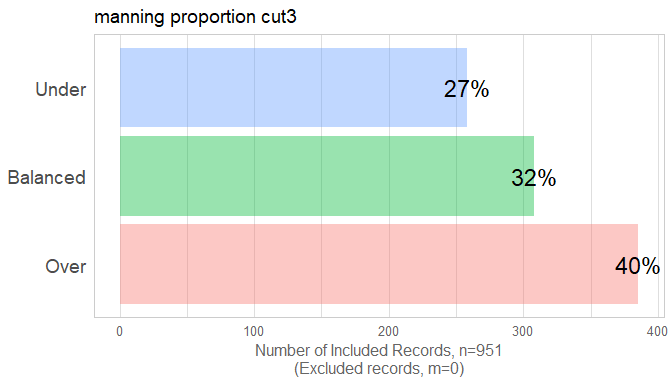
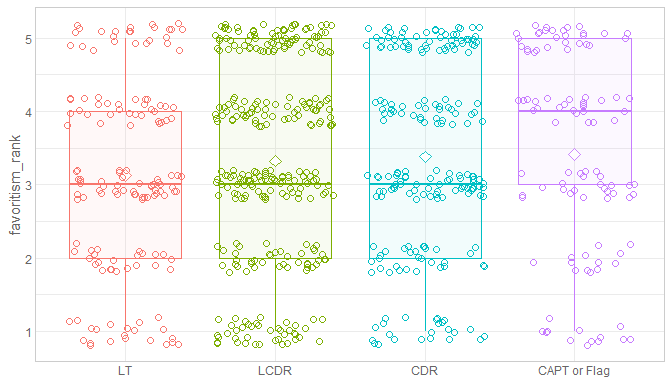
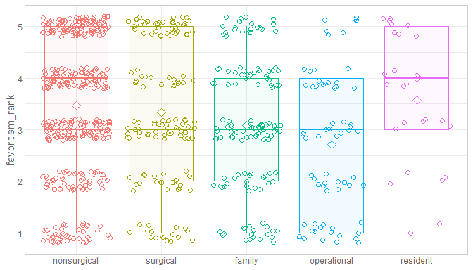
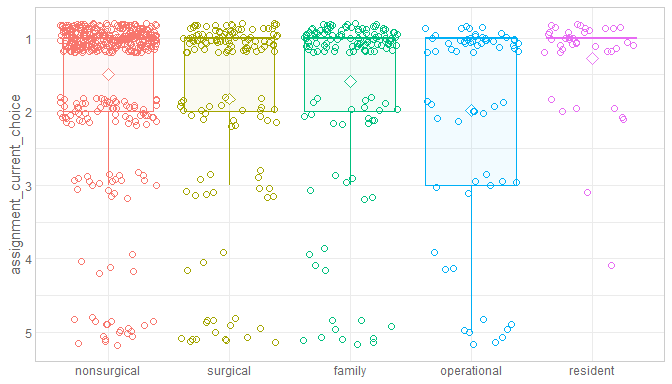
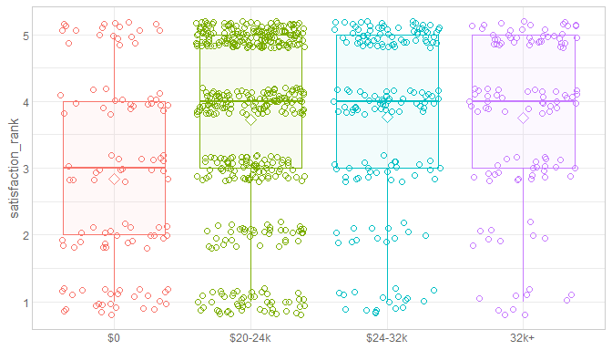
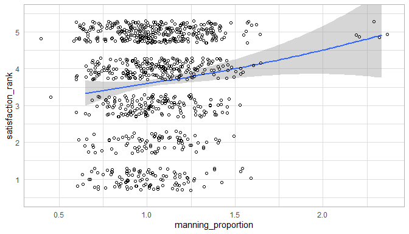
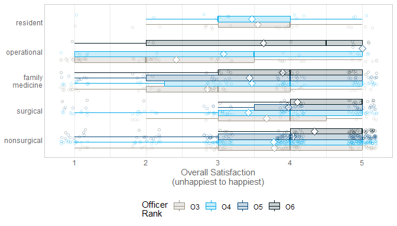
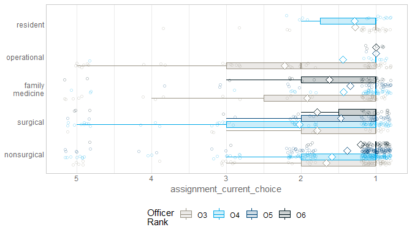

This report covers the survey about attitudes collected by Richard Childers, MD and Joel Schofer, MD.

<!--  Set the working directory to the repository's base directory; this assumes the report is nested inside of two directories.-->


<!-- Set the report-wide options, and point to the external code file. -->


<!-- Load 'sourced' R files.  Suppress the output when loading sources. --> 


<!-- Load packages, or at least verify they're available on the local machine.  Suppress the output when loading packages. --> 


<!-- Load any global functions and variables declared in the R file.  Suppress the output. --> 


<!-- Declare any global functions specific to a Rmd output.  Suppress the output. --> 


<!-- Load the datasets.   -->


<!-- Tweak the datasets.   -->


Summary {.tabset .tabset-fade .tabset-pills}
============================================

Notes 
-----------------------------------

1. The current report covers 951 responses.
1. We excluded 17 cases because their orders preceded the year 2012 and 26 cases because the `year_executed_order` value was missing.

Unanswered Questions
-----------------------------------

Answered Questions
-----------------------------------

Graphs
============================================

Marginals


-----------------------------------

<!-- --><!-- --><!-- --><!-- --><!-- --><!-- --><!-- --><!-- --><!-- --><!-- --><!-- --><!-- --><!-- --><!-- --><!-- --><!-- --><!-- --><!-- -->

Scatterplots
-----------------------------------


Relationships between Outcomes
============================================


                             satistfaction_rank   transparency_rank   favoritism_rank   assignment_current_choice
--------------------------  -------------------  ------------------  ----------------  --------------------------
satistfaction_rank                    1.0000000           0.7711209         0.4859620                  -0.5189457
transparency_rank                     0.7711209           1.0000000         0.4877154                  -0.4053583
favoritism_rank                       0.4859620           0.4877154         1.0000000                  -0.3245715
assignment_current_choice            -0.5189457          -0.4053583        -0.3245715                   1.0000000

<!-- --><!-- -->


Analyses - 1 Predictor
============================================

By Rank
-----------------------------------


```
### satistfaction_rank
```

<!-- -->

```

Call:
lm(formula = satistfaction_rank ~ 1 + officer_rate_f, data = ds)

Residuals:
    Min      1Q  Median      3Q     Max 
-3.1296 -0.9315  0.4091  1.0685  1.8639 

Coefficients:
                Estimate Std. Error t value Pr(>|t|)
(Intercept)      3.13615    0.09033  34.720  < 2e-16
officer_rate_f4  0.45476    0.11587   3.925 9.37e-05
officer_rate_f5  0.79536    0.12686   6.269 5.71e-10
officer_rate_f6  0.99348    0.15572   6.380 2.89e-10

Residual standard error: 1.318 on 866 degrees of freedom
  (81 observations deleted due to missingness)
Multiple R-squared:  0.06191,	Adjusted R-squared:  0.05866 
F-statistic: 19.05 on 3 and 866 DF,  p-value: 5.713e-12
```

```
### transparency_rank
```

<!-- -->

```

Call:
lm(formula = transparency_rank ~ 1 + officer_rate_f, data = ds)

Residuals:
    Min      1Q  Median      3Q     Max 
-2.9444 -0.9019  0.2009  1.2009  2.0981 

Coefficients:
                Estimate Std. Error t value Pr(>|t|)
(Intercept)       2.9019     0.0924  31.407  < 2e-16
officer_rate_f4   0.5921     0.1183   5.003 6.82e-07
officer_rate_f5   0.8972     0.1299   6.906 9.61e-12
officer_rate_f6   1.0426     0.1595   6.535 1.08e-10

Residual standard error: 1.352 on 871 degrees of freedom
  (76 observations deleted due to missingness)
Multiple R-squared:  0.06859,	Adjusted R-squared:  0.06538 
F-statistic: 21.38 on 3 and 871 DF,  p-value: 2.278e-13
```

```
### favoritism_rank
```

<!-- -->

```

Call:
lm(formula = favoritism_rank ~ 1 + officer_rate_f, data = ds)

Residuals:
    Min      1Q  Median      3Q     Max 
-2.4190 -1.1216 -0.1216  1.2297  1.8784 

Coefficients:
                Estimate Std. Error t value Pr(>|t|)
(Intercept)       3.1216     0.1092  28.575   <2e-16
officer_rate_f4   0.2029     0.1334   1.521   0.1286
officer_rate_f5   0.2582     0.1429   1.807   0.0712
officer_rate_f6   0.2974     0.1696   1.754   0.0798

Residual standard error: 1.329 on 759 degrees of freedom
  (188 observations deleted due to missingness)
Multiple R-squared:  0.005615,	Adjusted R-squared:  0.001685 
F-statistic: 1.429 on 3 and 759 DF,  p-value: 0.2331
```

```
### assignment_current_choice
```

<!-- -->

```

Call:
lm(formula = assignment_current_choice ~ 1 + officer_rate_f, 
    data = ds)

Residuals:
    Min      1Q  Median      3Q     Max 
-0.8177 -0.6507 -0.4040  0.3493  3.6080 

Coefficients:
                Estimate Std. Error t value Pr(>|t|)
(Intercept)      1.81771    0.08084  22.484  < 2e-16
officer_rate_f4 -0.16702    0.10408  -1.605 0.108957
officer_rate_f5 -0.42575    0.11332  -3.757 0.000185
officer_rate_f6 -0.41367    0.13860  -2.985 0.002929

Residual standard error: 1.12 on 778 degrees of freedom
  (169 observations deleted due to missingness)
Multiple R-squared:  0.02228,	Adjusted R-squared:  0.01851 
F-statistic: 5.908 on 3 and 778 DF,  p-value: 0.0005478
```

By Specialty Type
-----------------------------------


```
### satistfaction_rank
```

<!-- -->

```

Call:
lm(formula = satistfaction_rank ~ 1 + specialty_type, data = ds[ds$specialty_type != 
    "unknown", ])

Residuals:
     Min       1Q   Median       3Q      Max 
-2.91724 -0.91724  0.08276  1.08276  2.33721 

Coefficients:
                          Estimate Std. Error t value Pr(>|t|)
(Intercept)                3.91724    0.06257  62.603  < 2e-16
specialty_typesurgical    -0.23268    0.12388  -1.878   0.0607
specialty_typefamily      -0.56358    0.11959  -4.713 2.85e-06
specialty_typeoperational -1.25445    0.15401  -8.145 1.32e-15
specialty_typeresident    -0.40209    0.23564  -1.706   0.0883

Residual standard error: 1.305 on 862 degrees of freedom
  (78 observations deleted due to missingness)
Multiple R-squared:  0.0812,	Adjusted R-squared:  0.07693 
F-statistic: 19.04 on 4 and 862 DF,  p-value: 5.069e-15
```

```
### transparency_rank
```

<!-- -->

```

Call:
lm(formula = transparency_rank ~ 1 + specialty_type, data = ds[ds$specialty_type != 
    "unknown", ])

Residuals:
    Min      1Q  Median      3Q     Max 
-2.7215 -0.7215  0.2785  1.2785  2.3837 

Coefficients:
                          Estimate Std. Error t value Pr(>|t|)
(Intercept)                3.72146    0.06464  57.574  < 2e-16
specialty_typesurgical    -0.08881    0.12895  -0.689   0.4912
specialty_typefamily      -0.48510    0.12357  -3.926 9.33e-05
specialty_typeoperational -1.10518    0.15955  -6.927 8.39e-12
specialty_typeresident    -0.58257    0.23454  -2.484   0.0132

Residual standard error: 1.353 on 867 degrees of freedom
  (73 observations deleted due to missingness)
Multiple R-squared:  0.06323,	Adjusted R-squared:  0.05891 
F-statistic: 14.63 on 4 and 867 DF,  p-value: 1.431e-11
```

```
### favoritism_rank
```

<!-- -->

```

Call:
lm(formula = favoritism_rank ~ 1 + specialty_type, data = ds[ds$specialty_type != 
    "unknown", ])

Residuals:
     Min       1Q   Median       3Q      Max 
-2.57143 -1.08029 -0.08029  1.29412  2.29412 

Coefficients:
                          Estimate Std. Error t value Pr(>|t|)
(Intercept)                3.46923    0.06627  52.349  < 2e-16
specialty_typesurgical    -0.13590    0.12963  -1.048  0.29481
specialty_typefamily      -0.38894    0.12998  -2.992  0.00286
specialty_typeoperational -0.76335    0.17199  -4.438 1.04e-05
specialty_typeresident     0.10220    0.25605   0.399  0.68991

Residual standard error: 1.309 on 756 degrees of freedom
  (184 observations deleted due to missingness)
Multiple R-squared:  0.03281,	Adjusted R-squared:  0.02769 
F-statistic: 6.411 on 4 and 756 DF,  p-value: 4.477e-05
```

```
### assignment_current_choice
```

<!-- -->

```

Call:
lm(formula = assignment_current_choice ~ 1 + specialty_type, 
    data = ds[ds$specialty_type != "unknown", ])

Residuals:
    Min      1Q  Median      3Q     Max 
-0.9846 -0.5870 -0.4912  0.4130  3.5088 

Coefficients:
                          Estimate Std. Error t value Pr(>|t|)
(Intercept)                1.49123    0.05612  26.572  < 2e-16
specialty_typesurgical     0.33611    0.11041   3.044  0.00241
specialty_typefamily       0.09573    0.11071   0.865  0.38747
specialty_typeoperational  0.49339    0.14994   3.291  0.00105
specialty_typeresident    -0.20918    0.18807  -1.112  0.26639

Residual standard error: 1.121 on 775 degrees of freedom
  (165 observations deleted due to missingness)
Multiple R-squared:  0.0255,	Adjusted R-squared:  0.02047 
F-statistic:  5.07 on 4 and 775 DF,  p-value: 0.0004894
```

By Bonus Pay
-----------------------------------


```
### satistfaction_rank
```

<!-- -->

```

Call:
lm(formula = satistfaction_rank ~ 1 + bonus_pay_cut4, data = ds)

Residuals:
    Min      1Q  Median      3Q     Max 
-2.7701 -0.7521  0.2743  1.2479  2.1589 

Coefficients:
                      Estimate Std. Error t value Pr(>|t|)
(Intercept)             2.8411     0.1286  22.098  < 2e-16
bonus_pay_cut4$20-24k   0.8846     0.1423   6.215 7.98e-10
bonus_pay_cut4$24-32k   0.9290     0.1634   5.686 1.78e-08
bonus_pay_cut432k+      0.9110     0.1779   5.121 3.74e-07

Residual standard error: 1.33 on 868 degrees of freedom
  (79 observations deleted due to missingness)
Multiple R-squared:  0.04722,	Adjusted R-squared:  0.04393 
F-statistic: 14.34 on 3 and 868 DF,  p-value: 3.984e-09
```

```
### transparency_rank
```

<!-- -->

```

Call:
lm(formula = transparency_rank ~ 1 + bonus_pay_cut4, data = ds)

Residuals:
    Min      1Q  Median      3Q     Max 
-2.7688 -0.7688  0.4483  1.2312  2.3636 

Coefficients:
                      Estimate Std. Error t value Pr(>|t|)
(Intercept)             2.6364     0.1297  20.328  < 2e-16
bonus_pay_cut4$20-24k   0.9138     0.1438   6.353 3.39e-10
bonus_pay_cut4$24-32k   1.1324     0.1659   6.827 1.62e-11
bonus_pay_cut432k+      0.9154     0.1810   5.057 5.20e-07

Residual standard error: 1.36 on 873 degrees of freedom
  (74 observations deleted due to missingness)
Multiple R-squared:  0.05592,	Adjusted R-squared:  0.05267 
F-statistic: 17.24 on 3 and 873 DF,  p-value: 7.02e-11
```

```
### favoritism_rank
```

<!-- -->

```

Call:
lm(formula = favoritism_rank ~ 1 + bonus_pay_cut4, data = ds)

Residuals:
    Min      1Q  Median      3Q     Max 
-2.4231 -1.0119 -0.2609  0.9881  1.9881 

Coefficients:
                      Estimate Std. Error t value Pr(>|t|)
(Intercept)             3.0119     0.1449  20.792   <2e-16
bonus_pay_cut4$20-24k   0.3296     0.1590   2.073   0.0385
bonus_pay_cut4$24-32k   0.4112     0.1797   2.288   0.0224
bonus_pay_cut432k+      0.2490     0.1906   1.306   0.1918

Residual standard error: 1.328 on 761 degrees of freedom
  (186 observations deleted due to missingness)
Multiple R-squared:  0.007504,	Adjusted R-squared:  0.003592 
F-statistic: 1.918 on 3 and 761 DF,  p-value: 0.1252
```

```
### assignment_current_choice
```

<!-- -->

```

Call:
lm(formula = assignment_current_choice ~ 1 + bonus_pay_cut4, 
    data = ds)

Residuals:
    Min      1Q  Median      3Q     Max 
-0.7979 -0.6239 -0.5190  0.3761  3.4810 

Coefficients:
                      Estimate Std. Error t value Pr(>|t|)
(Intercept)             1.7979     0.1164  15.446   <2e-16
bonus_pay_cut4$20-24k  -0.2789     0.1287  -2.167   0.0305
bonus_pay_cut4$24-32k  -0.1312     0.1468  -0.894   0.3718
bonus_pay_cut432k+     -0.1740     0.1589  -1.095   0.2736

Residual standard error: 1.129 on 780 degrees of freedom
  (167 observations deleted due to missingness)
Multiple R-squared:  0.007209,	Adjusted R-squared:  0.00339 
F-statistic: 1.888 on 3 and 780 DF,  p-value: 0.1301
```

By Assignment Current Choice
-----------------------------------


```
### satistfaction_rank
```

<!-- -->

```

Call:
lm(formula = satistfaction_rank ~ 1 + assignment_current_choice, 
    data = ds)

Residuals:
    Min      1Q  Median      3Q     Max 
-3.1471 -0.8584  0.1416  0.8529  3.1416 

Coefficients:
                          Estimate Std. Error t value Pr(>|t|)
(Intercept)                4.71924    0.06742   69.99   <2e-16
assignment_current_choice -0.57218    0.03421  -16.73   <2e-16

Residual standard error: 1.075 on 759 degrees of freedom
  (190 observations deleted due to missingness)
Multiple R-squared:  0.2693,	Adjusted R-squared:  0.2683 
F-statistic: 279.7 on 1 and 759 DF,  p-value: < 2.2e-16
```

```
### transparency_rank
```

<!-- -->

```

Call:
lm(formula = transparency_rank ~ 1 + assignment_current_choice, 
    data = ds)

Residuals:
     Min       1Q   Median       3Q      Max 
-2.92074 -0.92074  0.07926  1.07926  2.97447 

Coefficients:
                          Estimate Std. Error t value Pr(>|t|)
(Intercept)                4.39455    0.07585   57.94   <2e-16
assignment_current_choice -0.47380    0.03873  -12.23   <2e-16

Residual standard error: 1.21 on 761 degrees of freedom
  (188 observations deleted due to missingness)
Multiple R-squared:  0.1643,	Adjusted R-squared:  0.1632 
F-statistic: 149.6 on 1 and 761 DF,  p-value: < 2.2e-16
```

```
### favoritism_rank
```

<!-- -->

```

Call:
lm(formula = favoritism_rank ~ 1 + assignment_current_choice, 
    data = ds)

Residuals:
    Min      1Q  Median      3Q     Max 
-2.6155 -0.6155  0.1258  1.3845  2.8670 

Coefficients:
                          Estimate Std. Error t value Pr(>|t|)
(Intercept)                3.98608    0.08223  48.477   <2e-16
assignment_current_choice -0.37062    0.04163  -8.902   <2e-16

Residual standard error: 1.232 on 673 degrees of freedom
  (276 observations deleted due to missingness)
Multiple R-squared:  0.1053,	Adjusted R-squared:  0.104 
F-statistic: 79.25 on 1 and 673 DF,  p-value: < 2.2e-16
```


By Year
-----------------------------------


```
### satistfaction_rank
```

<!-- -->


By Survey Lag
-----------------------------------


```
### satistfaction_rank
```

<!-- -->


By Manning Proportion
-----------------------------------


```
### manning_proportion
```

<!-- --><!-- -->


By Crtical War
-----------------------------------

<!-- -->

By Billet Current
-----------------------------------

<!-- -->

```

Call:
lm(formula = satistfaction_rank ~ 1 + billet_current, data = ds)

Residuals:
    Min      1Q  Median      3Q     Max 
-3.0000 -0.8565  0.1435  1.1435  2.5500 

Coefficients:
                                           Estimate Std. Error t value Pr(>|t|)
(Intercept)                                 3.85651    0.06173  62.473  < 2e-16
billet_currentGME                          -0.04742    0.13966  -0.340  0.73427
billet_currentNon-Operational/Non-Clinical -0.21068    0.19944  -1.056  0.29109
billet_currentOCONUS MTF                   -0.44651    0.14517  -3.076  0.00217
billet_currentCONUS Operational            -0.74044    0.13865  -5.340 1.19e-07
billet_currentOCONUS Operational           -1.40651    0.21672  -6.490 1.44e-10
billet_currentOther                         0.14349    0.44229   0.324  0.74570

Residual standard error: 1.314 on 865 degrees of freedom
  (79 observations deleted due to missingness)
Multiple R-squared:  0.07331,	Adjusted R-squared:  0.06688 
F-statistic: 11.41 on 6 and 865 DF,  p-value: 2.681e-12
```


Analyses - 2 Predictors
============================================


By Rank and Specialty Type
-----------------------------------


```
### satistfaction_rank
```

<!-- -->

```

Call:
lm(formula = satistfaction_rank ~ 1 + officer_rate_f * specialty_type, 
    data = ds[ds$specialty_type != "unknown", ])

Residuals:
    Min      1Q  Median      3Q     Max 
-3.3333 -0.7794  0.2299  1.0104  2.5873 

Coefficients: (2 not defined because of singularities)
                                           Estimate Std. Error t value Pr(>|t|)
(Intercept)                                3.779412   0.155378  24.324  < 2e-16
officer_rate_f4                           -0.009297   0.183241  -0.051  0.95955
officer_rate_f5                            0.256049   0.189171   1.354  0.17624
officer_rate_f6                            0.553922   0.237344   2.334  0.01984
specialty_typesurgical                    -0.112745   0.365497  -0.308  0.75780
specialty_typefamily                      -0.931586   0.244604  -3.809  0.00015
specialty_typeoperational                 -1.366713   0.224055  -6.100 1.61e-09
specialty_typeresident                    -0.229412   0.325924  -0.704  0.48170
officer_rate_f4:specialty_typesurgical    -0.238451   0.406457  -0.587  0.55759
officer_rate_f5:specialty_typesurgical     0.051643   0.432811   0.119  0.90505
officer_rate_f6:specialty_typesurgical    -0.125350   0.493916  -0.254  0.79972
officer_rate_f4:specialty_typefamily       0.624434   0.315702   1.978  0.04826
officer_rate_f5:specialty_typefamily       0.328557   0.340359   0.965  0.33466
officer_rate_f6:specialty_typefamily       0.487141   0.390927   1.246  0.21307
officer_rate_f4:specialty_typeoperational  0.668027   0.420593   1.588  0.11259
officer_rate_f5:specialty_typeoperational  2.331252   1.305191   1.786  0.07443
officer_rate_f6:specialty_typeoperational  0.658380   0.536284   1.228  0.21991
officer_rate_f4:specialty_typeresident    -0.079165   0.491879  -0.161  0.87218
officer_rate_f5:specialty_typeresident           NA         NA      NA       NA
officer_rate_f6:specialty_typeresident           NA         NA      NA       NA

Residual standard error: 1.281 on 848 degrees of freedom
  (79 observations deleted due to missingness)
Multiple R-squared:  0.125,	Adjusted R-squared:  0.1074 
F-statistic: 7.124 on 17 and 848 DF,  p-value: < 2.2e-16
```

```

Call:
lm(formula = satistfaction_rank ~ 1 + officer_rate_f + specialty_type, 
    data = ds[ds$specialty_type != "unknown", ])

Residuals:
    Min      1Q  Median      3Q     Max 
-3.3867 -0.7954  0.2046  0.9416  2.4460 

Coefficients:
                          Estimate Std. Error t value Pr(>|t|)
(Intercept)                 3.6060     0.1139  31.673  < 2e-16
officer_rate_f4             0.1894     0.1227   1.543 0.123167
officer_rate_f5             0.4625     0.1364   3.390 0.000731
officer_rate_f6             0.7807     0.1587   4.918 1.05e-06
specialty_typesurgical     -0.2466     0.1222  -2.018 0.043938
specialty_typefamily       -0.5476     0.1188  -4.608 4.67e-06
specialty_typeoperational  -1.0521     0.1657  -6.351 3.47e-10
specialty_typeresident     -0.1655     0.2383  -0.695 0.487552

Residual standard error: 1.282 on 858 degrees of freedom
  (79 observations deleted due to missingness)
Multiple R-squared:  0.1131,	Adjusted R-squared:  0.1058 
F-statistic: 15.62 on 7 and 858 DF,  p-value: < 2.2e-16
```

```
TODO: examine if the interaction term significantly improves fit.
```

```
### transparency_rank
```

<!-- -->

```

Call:
lm(formula = transparency_rank ~ 1 + specialty_type, data = ds)

Residuals:
    Min      1Q  Median      3Q     Max 
-2.7215 -0.7215  0.2785  1.2785  2.3837 

Coefficients:
                          Estimate Std. Error t value Pr(>|t|)
(Intercept)                3.72146    0.06481  57.418  < 2e-16
specialty_typesurgical    -0.08881    0.12930  -0.687   0.4924
specialty_typefamily      -0.48510    0.12390  -3.915 9.74e-05
specialty_typeoperational -1.10518    0.15999  -6.908 9.48e-12
specialty_typeresident    -0.58257    0.23518  -2.477   0.0134
specialty_typeunknown     -0.72146    0.61008  -1.183   0.2373

Residual standard error: 1.356 on 871 degrees of freedom
  (74 observations deleted due to missingness)
Multiple R-squared:  0.06327,	Adjusted R-squared:  0.0579 
F-statistic: 11.77 on 5 and 871 DF,  p-value: 4.985e-11
```

```
### favoritism_rank
```

<!-- -->

```

Call:
lm(formula = favoritism_rank ~ 1 + specialty_type, data = ds)

Residuals:
     Min       1Q   Median       3Q      Max 
-2.57143 -1.08029 -0.08029  1.29412  2.29412 

Coefficients:
                          Estimate Std. Error t value Pr(>|t|)
(Intercept)                3.46923    0.06646  52.197  < 2e-16
specialty_typesurgical    -0.13590    0.13001  -1.045  0.29621
specialty_typefamily      -0.38894    0.13036  -2.984  0.00294
specialty_typeoperational -0.76335    0.17249  -4.425  1.1e-05
specialty_typeresident     0.10220    0.25680   0.398  0.69077
specialty_typeunknown     -0.21923    0.65964  -0.332  0.73972

Residual standard error: 1.313 on 759 degrees of freedom
  (186 observations deleted due to missingness)
Multiple R-squared:  0.03251,	Adjusted R-squared:  0.02613 
F-statistic: 5.101 on 5 and 759 DF,  p-value: 0.0001313
```

```
### assignment_current_choice
```

<!-- -->

```

Call:
lm(formula = assignment_current_choice ~ 1 + specialty_type, 
    data = ds)

Residuals:
    Min      1Q  Median      3Q     Max 
-0.9846 -0.5870 -0.4912  0.4130  3.5088 

Coefficients:
                          Estimate Std. Error t value Pr(>|t|)
(Intercept)                1.49123    0.05603  26.613  < 2e-16
specialty_typesurgical     0.33611    0.11024   3.049  0.00237
specialty_typefamily       0.09573    0.11053   0.866  0.38673
specialty_typeoperational  0.49339    0.14971   3.296  0.00103
specialty_typeresident    -0.20918    0.18778  -1.114  0.26565
specialty_typeunknown     -0.24123    0.56244  -0.429  0.66812

Residual standard error: 1.119 on 778 degrees of freedom
  (167 observations deleted due to missingness)
Multiple R-squared:  0.02595,	Adjusted R-squared:  0.01969 
F-statistic: 4.146 on 5 and 778 DF,  p-value: 0.001008
```

By Rank and Assignment Current Choice
-----------------------------------


```
### satistfaction_rank
```

<!-- -->

```

Call:
lm(formula = satistfaction_rank ~ 1 + officer_rate_f + assignment_current_choice, 
    data = ds)

Residuals:
    Min      1Q  Median      3Q     Max 
-3.5109 -0.6317  0.2528  0.7550  3.4083 

Coefficients:
                          Estimate Std. Error t value Pr(>|t|)
(Intercept)                4.28605    0.09967   43.00  < 2e-16
officer_rate_f4            0.39009    0.09978    3.91 0.000101
officer_rate_f5            0.53451    0.10886    4.91 1.12e-06
officer_rate_f6            0.76370    0.13259    5.76 1.22e-08
assignment_current_choice -0.53887    0.03382  -15.94  < 2e-16

Residual standard error: 1.048 on 754 degrees of freedom
  (192 observations deleted due to missingness)
Multiple R-squared:  0.3052,	Adjusted R-squared:  0.3015 
F-statistic:  82.8 on 4 and 754 DF,  p-value: < 2.2e-16
```

```

Call:
lm(formula = satistfaction_rank ~ 1 + officer_rate_f * assignment_current_choice, 
    data = ds)

Residuals:
    Min      1Q  Median      3Q     Max 
-3.4981 -0.6452  0.2672  0.7416  3.3548 

Coefficients:
                                          Estimate Std. Error t value Pr(>|t|)
(Intercept)                                4.25471    0.13343  31.887  < 2e-16
officer_rate_f4                            0.41589    0.17248   2.411 0.016137
officer_rate_f5                            0.65201    0.19187   3.398 0.000714
officer_rate_f6                            0.75118    0.22544   3.332 0.000904
assignment_current_choice                 -0.52190    0.05871  -8.889  < 2e-16
officer_rate_f4:assignment_current_choice -0.01366    0.07963  -0.171 0.863895
officer_rate_f5:assignment_current_choice -0.07892    0.10189  -0.775 0.438854
officer_rate_f6:assignment_current_choice  0.01408    0.11960   0.118 0.906346

Residual standard error: 1.05 on 751 degrees of freedom
  (192 observations deleted due to missingness)
Multiple R-squared:  0.3059,	Adjusted R-squared:  0.2994 
F-statistic: 47.28 on 7 and 751 DF,  p-value: < 2.2e-16
```

```
Analysis of Variance Table

Model 1: satistfaction_rank ~ 1 + officer_rate_f + assignment_current_choice
Model 2: satistfaction_rank ~ 1 + officer_rate_f * assignment_current_choice
  Res.Df    RSS Df Sum of Sq      F Pr(>F)
1    754 828.44                           
2    751 827.64  3   0.80396 0.2432 0.8662
```

```
### transparency_rank
```

<!-- -->

```

Call:
lm(formula = transparency_rank ~ 1 + officer_rate_f * assignment_current_choice, 
    data = ds)

Residuals:
    Min      1Q  Median      3Q     Max 
-3.2668 -0.7113  0.0623  0.9107  2.8582 

Coefficients:
                                          Estimate Std. Error t value Pr(>|t|)
(Intercept)                                3.86386    0.14993  25.771  < 2e-16
officer_rate_f4                            0.48260    0.19371   2.491  0.01294
officer_rate_f5                            0.63055    0.21613   2.918  0.00363
officer_rate_f6                            1.04656    0.25795   4.057 5.48e-05
assignment_current_choice                 -0.43052    0.06608  -6.515 1.33e-10
officer_rate_f4:assignment_current_choice  0.02178    0.08962   0.243  0.80805
officer_rate_f5:assignment_current_choice  0.02543    0.11471   0.222  0.82464
officer_rate_f6:assignment_current_choice -0.21308    0.14358  -1.484  0.13823

Residual standard error: 1.183 on 753 degrees of freedom
  (190 observations deleted due to missingness)
Multiple R-squared:  0.2076,	Adjusted R-squared:  0.2003 
F-statistic: 28.19 on 7 and 753 DF,  p-value: < 2.2e-16
```

```
### favoritism_rank
```

<!-- -->

```

Call:
lm(formula = favoritism_rank ~ 1 + officer_rate_f * assignment_current_choice, 
    data = ds)

Residuals:
    Min      1Q  Median      3Q     Max 
-2.6992 -0.6334  0.3008  1.3008  2.8981 

Coefficients:
                                          Estimate Std. Error t value Pr(>|t|)
(Intercept)                                3.86871    0.18893  20.477  < 2e-16
officer_rate_f4                            0.11742    0.23244   0.505    0.614
officer_rate_f5                            0.09373    0.25022   0.375    0.708
officer_rate_f6                            0.37978    0.28608   1.328    0.185
assignment_current_choice                 -0.31719    0.07984  -3.973 7.88e-05
officer_rate_f4:assignment_current_choice -0.03550    0.10364  -0.343    0.732
officer_rate_f5:assignment_current_choice -0.05491    0.12738  -0.431    0.667
officer_rate_f6:assignment_current_choice -0.23211    0.14660  -1.583    0.114

Residual standard error: 1.236 on 665 degrees of freedom
  (278 observations deleted due to missingness)
Multiple R-squared:  0.1082,	Adjusted R-squared:  0.09883 
F-statistic: 11.53 on 7 and 665 DF,  p-value: 7.273e-14
```

By Rank and Bonus Pay
-----------------------------------


```
### satistfaction_rank
```

<!-- -->

```

Call:
lm(formula = satistfaction_rank ~ 1 + officer_rate_f + bonus_pay, 
    data = ds)

Residuals:
    Min      1Q  Median      3Q     Max 
-3.2614 -0.8433  0.2141  1.0756  2.0756 

Coefficients:
                 Estimate Std. Error t value Pr(>|t|)
(Intercept)     2.924e+00  1.133e-01  25.818  < 2e-16
officer_rate_f4 2.934e-01  1.267e-01   2.316  0.02081
officer_rate_f5 6.033e-01  1.409e-01   4.282 2.06e-05
officer_rate_f6 8.478e-01  1.621e-01   5.231 2.11e-07
bonus_pay       1.578e-05  5.137e-06   3.072  0.00219

Residual standard error: 1.312 on 865 degrees of freedom
  (81 observations deleted due to missingness)
Multiple R-squared:  0.07203,	Adjusted R-squared:  0.06774 
F-statistic: 16.79 on 4 and 865 DF,  p-value: 2.919e-13
```

```

Call:
lm(formula = satistfaction_rank ~ 1 + officer_rate_f * bonus_pay, 
    data = ds)

Residuals:
    Min      1Q  Median      3Q     Max 
-3.2319 -0.6738  0.3982  1.1132  2.3262 

Coefficients:
                            Estimate Std. Error t value Pr(>|t|)
(Intercept)                2.674e+00  1.412e-01  18.934  < 2e-16
officer_rate_f4            9.877e-01  2.499e-01   3.953 8.36e-05
officer_rate_f5            8.154e-01  3.806e-01   2.142  0.03245
officer_rate_f6            1.178e+00  4.843e-01   2.433  0.01516
bonus_pay                  3.446e-05  8.141e-06   4.232 2.56e-05
officer_rate_f4:bonus_pay -3.744e-05  1.154e-05  -3.246  0.00122
officer_rate_f5:bonus_pay -1.717e-05  1.566e-05  -1.097  0.27309
officer_rate_f6:bonus_pay -2.221e-05  2.130e-05  -1.042  0.29750

Residual standard error: 1.306 on 862 degrees of freedom
  (81 observations deleted due to missingness)
Multiple R-squared:  0.08328,	Adjusted R-squared:  0.07584 
F-statistic: 11.19 on 7 and 862 DF,  p-value: 1.323e-13
```

```
Analysis of Variance Table

Model 1: satistfaction_rank ~ 1 + officer_rate_f + bonus_pay
Model 2: satistfaction_rank ~ 1 + officer_rate_f * bonus_pay
  Res.Df    RSS Df Sum of Sq      F  Pr(>F)
1    865 1488.7                            
2    862 1470.7  3    18.052 3.5268 0.01461
```

```
### transparency_rank
```

<!-- -->

```

Call:
lm(formula = transparency_rank ~ 1 + officer_rate_f * bonus_pay, 
    data = ds)

Residuals:
    Min      1Q  Median      3Q     Max 
-3.1906 -1.1164  0.3004  1.1290  2.5204 

Coefficients:
                            Estimate Std. Error t value Pr(>|t|)
(Intercept)                2.480e+00  1.433e-01  17.305  < 2e-16
officer_rate_f4            1.008e+00  2.532e-01   3.979 7.49e-05
officer_rate_f5            8.585e-01  3.902e-01   2.200 0.028052
officer_rate_f6            8.102e-01  5.006e-01   1.618 0.105942
bonus_pay                  3.184e-05  8.306e-06   3.834 0.000135
officer_rate_f4:bonus_pay -3.155e-05  1.174e-05  -2.688 0.007329
officer_rate_f5:bonus_pay -1.376e-05  1.609e-05  -0.855 0.392553
officer_rate_f6:bonus_pay -2.782e-06  2.213e-05  -0.126 0.899981

Residual standard error: 1.341 on 867 degrees of freedom
  (76 observations deleted due to missingness)
Multiple R-squared:  0.08798,	Adjusted R-squared:  0.08061 
F-statistic: 11.95 on 7 and 867 DF,  p-value: 1.334e-14
```

```
### favoritism_rank
```

<!-- -->

```

Call:
lm(formula = favoritism_rank ~ 1 + officer_rate_f * bonus_pay, 
    data = ds)

Residuals:
    Min      1Q  Median      3Q     Max 
-2.5064 -1.2309 -0.2692  1.3236  2.1537 

Coefficients:
                            Estimate Std. Error t value Pr(>|t|)
(Intercept)                2.846e+00  1.679e-01  16.954   <2e-16
officer_rate_f4            6.601e-01  2.737e-01   2.412   0.0161
officer_rate_f5            2.419e-01  4.030e-01   0.600   0.5484
officer_rate_f6            6.359e-01  5.053e-01   1.258   0.2086
bonus_pay                  2.114e-05  9.801e-06   2.157   0.0313
officer_rate_f4:bonus_pay -2.880e-05  1.298e-05  -2.219   0.0268
officer_rate_f5:bonus_pay -9.820e-06  1.691e-05  -0.581   0.5615
officer_rate_f6:bonus_pay -2.393e-05  2.245e-05  -1.066   0.2869

Residual standard error: 1.327 on 755 degrees of freedom
  (188 observations deleted due to missingness)
Multiple R-squared:  0.01366,	Adjusted R-squared:  0.004515 
F-statistic: 1.494 on 7 and 755 DF,  p-value: 0.1661
```


Session Information
============================================

For the sake of documentation and reproducibility, the current report was rendered in the following environment.  Click the line below to expand.

<details>
  <summary>Environment <span class="glyphicon glyphicon-plus-sign"></span></summary>

```
Session info --------------------------------------------------------------------------------------
```

```
 setting  value                       
 version  R version 3.4.4 (2018-03-15)
 system   x86_64, linux-gnu           
 ui       X11                         
 language (EN)                        
 collate  en_US.UTF-8                 
 tz       America/Chicago             
 date     2018-06-30                  
```

```
Packages ------------------------------------------------------------------------------------------
```

```
 package         * version     date       source                                  
 assertthat        0.2.0       2017-04-11 cran (@0.2.0)                           
 backports         1.1.2       2017-12-13 cran (@1.1.2)                           
 base            * 3.4.4       2018-04-21 local                                   
 bindr             0.1.1       2018-03-13 CRAN (R 3.4.3)                          
 bindrcpp        * 0.2.2       2018-03-29 CRAN (R 3.4.3)                          
 colorspace        1.3-2       2016-12-14 CRAN (R 3.4.3)                          
 compiler          3.4.4       2018-04-21 local                                   
 corrplot          0.84        2017-10-16 CRAN (R 3.4.3)                          
 datasets        * 3.4.4       2018-04-21 local                                   
 devtools          1.13.5      2018-02-18 CRAN (R 3.4.3)                          
 digest            0.6.15      2018-01-28 CRAN (R 3.4.3)                          
 dplyr             0.7.5       2018-05-19 CRAN (R 3.4.4)                          
 evaluate          0.10.1      2017-06-24 CRAN (R 3.4.3)                          
 ggplot2         * 2.2.1       2016-12-30 CRAN (R 3.4.4)                          
 glue              1.2.0       2017-10-29 cran (@1.2.0)                           
 graphics        * 3.4.4       2018-04-21 local                                   
 grDevices       * 3.4.4       2018-04-21 local                                   
 grid              3.4.4       2018-04-21 local                                   
 gtable            0.2.0       2016-02-26 CRAN (R 3.4.3)                          
 highr             0.7         2018-06-09 CRAN (R 3.4.4)                          
 hms               0.4.2.9000  2018-05-26 Github (tidyverse/hms@14e74ab)          
 htmltools         0.3.6       2017-04-28 CRAN (R 3.4.3)                          
 knitr           * 1.20        2018-02-20 CRAN (R 3.4.3)                          
 labeling          0.3         2014-08-23 CRAN (R 3.4.3)                          
 lazyeval          0.2.1       2017-10-29 CRAN (R 3.4.3)                          
 magrittr        * 1.5         2014-11-22 cran (@1.5)                             
 memoise           1.1.0       2017-04-21 CRAN (R 3.4.3)                          
 methods         * 3.4.4       2018-04-21 local                                   
 munsell           0.5.0       2018-06-12 CRAN (R 3.4.4)                          
 pillar            1.2.3       2018-05-25 CRAN (R 3.4.4)                          
 pkgconfig         2.0.1       2017-03-21 cran (@2.0.1)                           
 plyr              1.8.4       2016-06-08 CRAN (R 3.4.3)                          
 purrr             0.2.5       2018-05-29 CRAN (R 3.4.4)                          
 R6                2.2.2       2017-06-17 CRAN (R 3.4.3)                          
 Rcpp              0.12.17     2018-05-18 CRAN (R 3.4.4)                          
 readr             1.2.0       2018-05-26 Github (tidyverse/readr@d6d622b)        
 rlang             0.2.1       2018-05-30 CRAN (R 3.4.4)                          
 rmarkdown         1.10        2018-06-11 CRAN (R 3.4.4)                          
 rprojroot         1.3-2       2018-01-03 CRAN (R 3.4.3)                          
 scales            0.5.0.9000  2018-03-29 Github (hadley/scales@d767915)          
 stats           * 3.4.4       2018-04-21 local                                   
 stringi           1.2.3       2018-06-12 CRAN (R 3.4.4)                          
 stringr           1.3.1       2018-05-10 CRAN (R 3.4.4)                          
 TabularManifest   0.1-16.9003 2018-03-29 Github (Melinae/TabularManifest@c2bdddb)
 tibble            1.4.2       2018-01-22 CRAN (R 3.4.3)                          
 tidyr             0.8.1       2018-05-18 CRAN (R 3.4.4)                          
 tidyselect        0.2.4       2018-02-26 CRAN (R 3.4.3)                          
 tools             3.4.4       2018-04-21 local                                   
 utils           * 3.4.4       2018-04-21 local                                   
 withr             2.1.2       2018-03-29 Github (jimhester/withr@79d7b0d)        
 yaml              2.1.19      2018-05-01 CRAN (R 3.4.4)                          
```
</details>


Report rendered by wibeasley at 2018-06-30, 22:03 -0500 in 52 seconds.
