This report covers the survey about attitudes collected by Richard Childers, MD and Joel Schofer, MD.

<!--  Set the working directory to the repository's base directory; this assumes the report is nested inside of two directories.-->


<!-- Set the report-wide options, and point to the external code file. -->


<!-- Load 'sourced' R files.  Suppress the output when loading sources. --> 


<!-- Load packages, or at least verify they're available on the local machine.  Suppress the output when loading packages. --> 


<!-- Load any global functions and variables declared in the R file.  Suppress the output. --> 


<!-- Declare any global functions specific to a Rmd output.  Suppress the output. --> 


<!-- Load the datasets.   -->


<!-- Tweak the datasets.   -->


Summary {.tabset .tabset-fade .tabset-pills}
============================================

Notes 
-----------------------------------

1. The current report covers 951 responses.
1. We excluded 17 cases because their orders preceded the year 2012 and 26 cases because the `year_executed_order` value was missing.

Unanswered Questions
-----------------------------------

Answered Questions
-----------------------------------

Histograms
============================================

Univariate
-----------------------------------
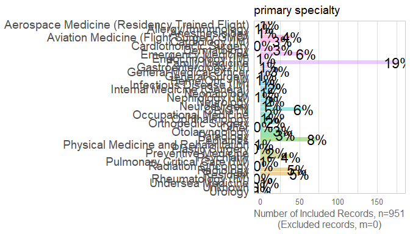<!-- --><!-- -->

```
Warning: Factor `iv` contains implicit NA, consider using `forcats::fct_explicit_na`
```

<!-- --><!-- --><!-- --><!-- -->

```
Warning: Factor `iv` contains implicit NA, consider using `forcats::fct_explicit_na`
```

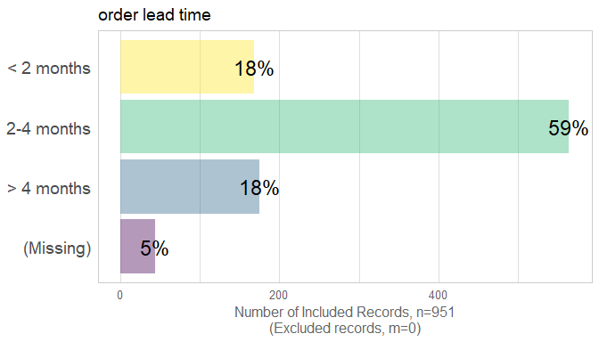<!-- -->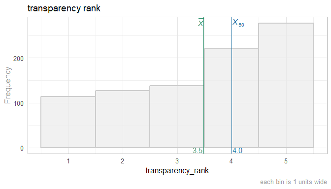<!-- --><!-- --><!-- -->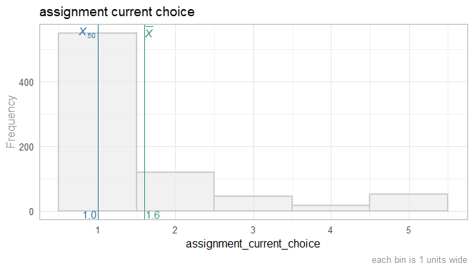<!-- --><!-- -->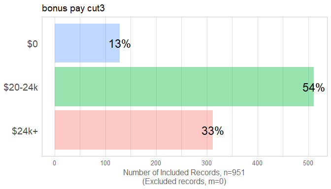<!-- -->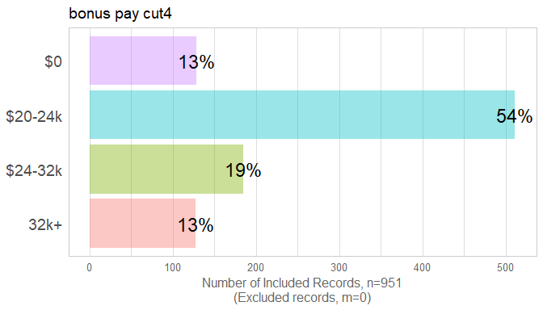<!-- --><!-- --><!-- --><!-- --><!-- --><!-- -->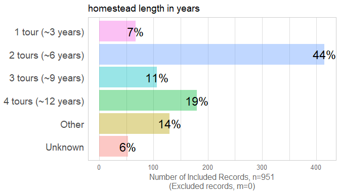<!-- -->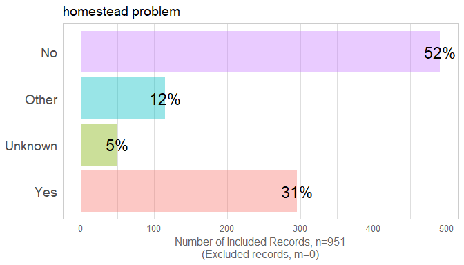<!-- -->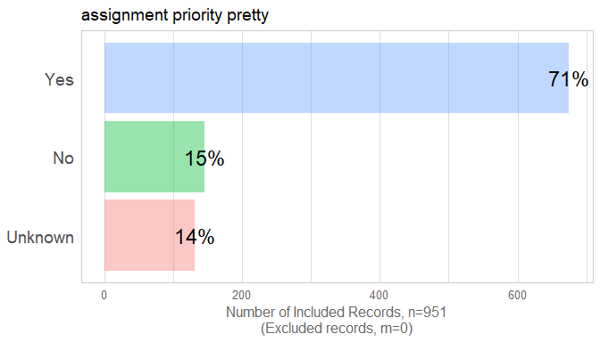<!-- --><!-- --><!-- -->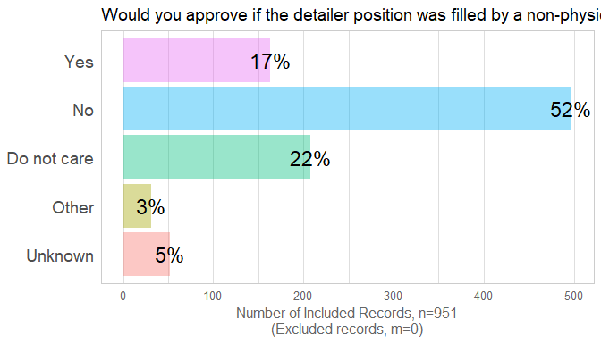<!-- --><!-- --><!-- -->

```
Warning: Factor `iv` contains implicit NA, consider using `forcats::fct_explicit_na`
```

<!-- --><!-- -->

Frequency: homestead_length_in_years by officer_rank
-----------------------------------
<!-- -->

Frequency: homestead_length_in_years by specialty_type
-----------------------------------
<!-- -->

Frequency: homestead_problem by officer_rank
-----------------------------------
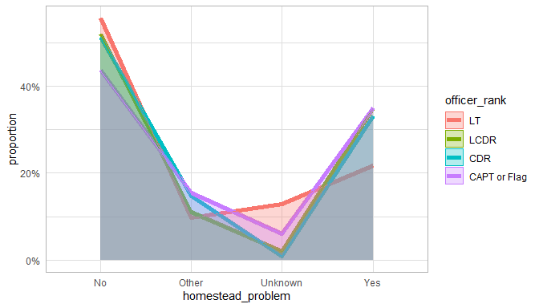<!-- -->

Frequency: homestead_problem by specialty_type
-----------------------------------
<!-- -->

Frequency: Assignment_priority by Specialty_type
-----------------------------------
<!-- --><br/>Data:<code> ds </code><br/>Formula:<code> ~ assignment_priority 1 + specialty_type </code>

Frequency: Officer_rank_priority by Officer_rank
-----------------------------------
<!-- --><br/>Data:<code> ds </code><br/>Formula:<code> ~ officer_rank_priority 1 + officer_rank </code>


Multivariate
-----------------------------------
<!-- -->

Relationships between Outcomes
============================================
<table>
 <thead>
  <tr>
   <th style="text-align:left;">   </th>
   <th style="text-align:right;"> satisfaction rank </th>
   <th style="text-align:right;"> transparency rank </th>
   <th style="text-align:right;"> favoritism rank </th>
   <th style="text-align:right;"> assignment current choice </th>
  </tr>
 </thead>
<tbody>
  <tr>
   <td style="text-align:left;"> satisfaction_rank </td>
   <td style="text-align:right;"> 1.000 </td>
   <td style="text-align:right;"> 0.771 </td>
   <td style="text-align:right;"> 0.486 </td>
   <td style="text-align:right;"> -0.519 </td>
  </tr>
  <tr>
   <td style="text-align:left;"> transparency_rank </td>
   <td style="text-align:right;"> 0.771 </td>
   <td style="text-align:right;"> 1.000 </td>
   <td style="text-align:right;"> 0.488 </td>
   <td style="text-align:right;"> -0.405 </td>
  </tr>
  <tr>
   <td style="text-align:left;"> favoritism_rank </td>
   <td style="text-align:right;"> 0.486 </td>
   <td style="text-align:right;"> 0.488 </td>
   <td style="text-align:right;"> 1.000 </td>
   <td style="text-align:right;"> -0.325 </td>
  </tr>
  <tr>
   <td style="text-align:left;"> assignment_current_choice </td>
   <td style="text-align:right;"> -0.519 </td>
   <td style="text-align:right;"> -0.405 </td>
   <td style="text-align:right;"> -0.325 </td>
   <td style="text-align:right;"> 1.000 </td>
  </tr>
</tbody>
</table>

<!-- --><!-- -->


Analyses - 1 Predictor
============================================

By Rank
-----------------------------------
### satisfaction_rank

<!-- --><br/>Data:<code> ds </code><br/>Formula:<code> ~ satisfaction_rank 1 + officer_rate_f </code>

### transparency_rank

<!-- --><br/>Data:<code> ds </code><br/>Formula:<code> ~ transparency_rank 1 + officer_rate_f </code>

### favoritism_rank

<!-- --><br/>Data:<code> ds </code><br/>Formula:<code> ~ favoritism_rank 1 + officer_rate_f </code>

### assignment_current_choice

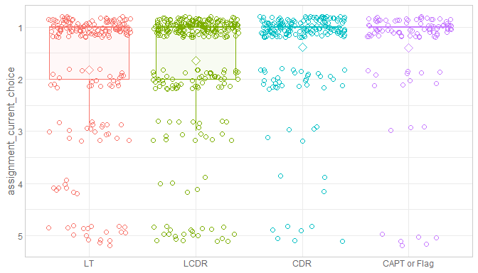<!-- --><br/>Data:<code> ds </code><br/>Formula:<code> ~ assignment_current_choice 1 + officer_rate_f </code>

By Specialty Type
-----------------------------------
### satisfaction_rank

<!-- --><br/>Data:<code> [ ds ds$specialty_type != "unknown"  </code><br/>Formula:<code> ~ satisfaction_rank 1 + specialty_type </code>

### transparency_rank

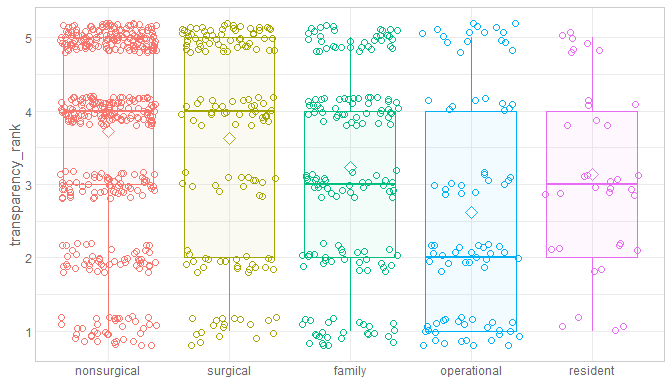<!-- --><br/>Data:<code> [ ds ds$specialty_type != "unknown"  </code><br/>Formula:<code> ~ transparency_rank 1 + specialty_type </code>

### favoritism_rank

<!-- --><br/>Data:<code> [ ds ds$specialty_type != "unknown"  </code><br/>Formula:<code> ~ favoritism_rank 1 + specialty_type </code>

### assignment_current_choice

<!-- --><br/>Data:<code> [ ds ds$specialty_type != "unknown"  </code><br/>Formula:<code> ~ assignment_current_choice 1 + specialty_type </code>

By Bonus Pay
-----------------------------------
### satisfaction_rank

<!-- --><br/>Data:<code> ds </code><br/>Formula:<code> ~ satisfaction_rank 1 + bonus_pay_cut4 </code>

### transparency_rank

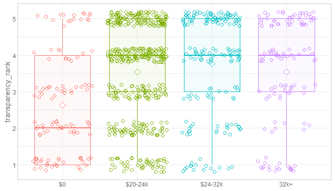<!-- --><br/>Data:<code> ds </code><br/>Formula:<code> ~ transparency_rank 1 + bonus_pay_cut4 </code>

### favoritism_rank

<!-- --><br/>Data:<code> ds </code><br/>Formula:<code> ~ favoritism_rank 1 + bonus_pay_cut4 </code>

### assignment_current_choice

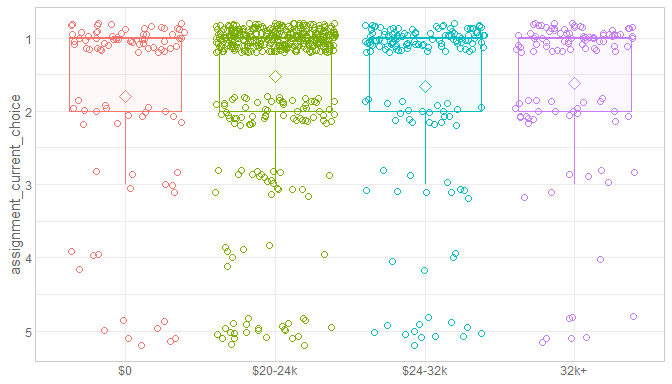<!-- --><br/>Data:<code> ds </code><br/>Formula:<code> ~ assignment_current_choice 1 + bonus_pay_cut4 </code>

By Assignment Current Choice
-----------------------------------
### satisfaction_rank

<!-- --><br/>Data:<code> ds </code><br/>Formula:<code> ~ satisfaction_rank 1 + assignment_current_choice </code>

### transparency_rank

<!-- --><br/>Data:<code> ds </code><br/>Formula:<code> ~ transparency_rank 1 + assignment_current_choice </code>

### favoritism_rank

<!-- --><br/>Data:<code> ds </code><br/>Formula:<code> ~ favoritism_rank 1 + assignment_current_choice </code>

By Year
-----------------------------------
### satisfaction_rank

<!-- -->

By Survey Lag
-----------------------------------
### satisfaction_rank

<!-- -->


By Manning Proportion
-----------------------------------
### manning_proportion

<!-- --><!-- -->

By Crtical War
-----------------------------------
<!-- -->

By Billet Current
-----------------------------------
<!-- --><br/>Data:<code> ds </code><br/>Formula:<code> ~ satisfaction_rank 1 + billet_current </code>

By Geographic Preference
-----------------------------------
<!-- --><br/>Data:<code> ds </code><br/>Formula:<code> ~ satisfaction_rank 1 + geographic_preference </code>


Analyses - 2 Predictors
============================================


By Rank and Specialty Type
-----------------------------------
### satisfaction_rank

<!-- --><br/>Data:<code> [ ds ds$specialty_type != "unknown"  </code><br/>Formula:<code> ~ satisfaction_rank 1 + officer_rate_f * specialty_type </code>

<br/>Data:<code> [ ds ds$specialty_type != "unknown"  </code><br/>Formula:<code> ~ satisfaction_rank 1 + officer_rate_f + specialty_type </code>

### transparency_rank

<!-- --><br/>Data:<code> ds </code><br/>Formula:<code> ~ transparency_rank 1 + specialty_type </code>

### favoritism_rank

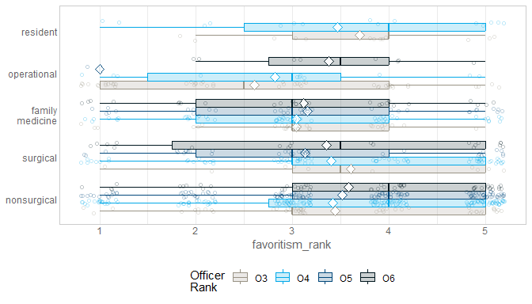<!-- --><br/>Data:<code> ds </code><br/>Formula:<code> ~ favoritism_rank 1 + specialty_type </code>

### assignment_current_choice

<!-- --><br/>Data:<code> ds </code><br/>Formula:<code> ~ assignment_current_choice 1 + specialty_type </code>

By Rank and Assignment Current Choice
-----------------------------------
### satisfaction_rank

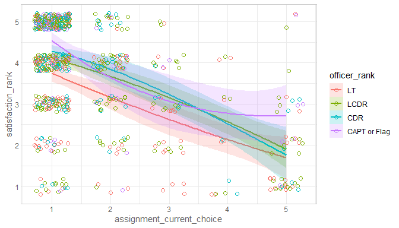<!-- --><br/>Data:<code> ds </code><br/>Formula:<code> ~ satisfaction_rank 1 + officer_rate_f + assignment_current_choice </code>

<br/>Data:<code> ds </code><br/>Formula:<code> ~ satisfaction_rank 1 + officer_rate_f * assignment_current_choice </code>

Analysis of Variance Table

Model 1: satisfaction_rank ~ 1 + officer_rate_f + assignment_current_choice
Model 2: satisfaction_rank ~ 1 + officer_rate_f * assignment_current_choice
  Res.Df    RSS Df Sum of Sq      F Pr(>F)
1    754 828.44                           
2    751 827.64  3   0.80396 0.2432 0.8662
### transparency_rank

<!-- --><br/>Data:<code> ds </code><br/>Formula:<code> ~ transparency_rank 1 + officer_rate_f * assignment_current_choice </code>

### favoritism_rank

<!-- --><br/>Data:<code> ds </code><br/>Formula:<code> ~ favoritism_rank 1 + officer_rate_f * assignment_current_choice </code>

By Rank and Bonus Pay
-----------------------------------
### satisfaction_rank

<!-- --><br/>Data:<code> ds </code><br/>Formula:<code> ~ satisfaction_rank 1 + officer_rate_f + bonus_pay </code>

<br/>Data:<code> ds </code><br/>Formula:<code> ~ satisfaction_rank 1 + officer_rate_f * bonus_pay </code>

Analysis of Variance Table

Model 1: satisfaction_rank ~ 1 + officer_rate_f + bonus_pay
Model 2: satisfaction_rank ~ 1 + officer_rate_f * bonus_pay
  Res.Df    RSS Df Sum of Sq      F  Pr(>F)
1    865 1488.7                            
2    862 1470.7  3    18.052 3.5268 0.01461
### transparency_rank

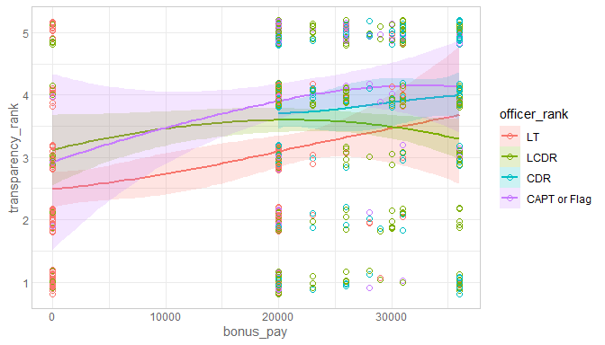<!-- --><br/>Data:<code> ds </code><br/>Formula:<code> ~ transparency_rank 1 + officer_rate_f * bonus_pay </code>

### favoritism_rank

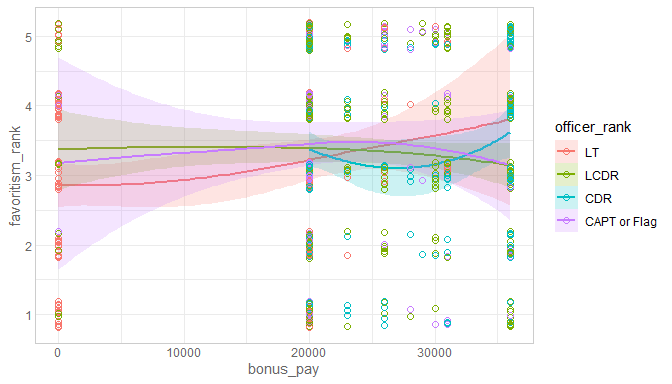<!-- --><br/>Data:<code> ds </code><br/>Formula:<code> ~ favoritism_rank 1 + officer_rate_f * bonus_pay </code>

By Billet Current and Critical War
-----------------------------------
### satisfaction_rank

<!-- --><br/>Data:<code> ds </code><br/>Formula:<code> ~ satisfaction_rank 1 + billet_current + critical_war </code>

By Bonus_pay and Manning_proportion
-----------------------------------
### satisfaction_rank

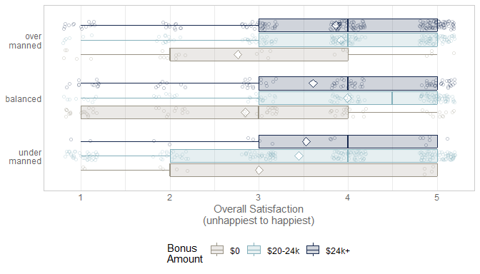<!-- --><br/>Data:<code> ds </code><br/>Formula:<code> ~ satisfaction_rank 1 + manning_proportion_cut3 + bonus_pay_cut3 </code>

No interaction between manning_proportion_cut3 & bonus_pay_cut3Analysis of Variance Table

Model 1: satisfaction_rank ~ 1 + manning_proportion_cut3 * bonus_pay_cut3
Model 2: satisfaction_rank ~ 1 + manning_proportion_cut3 + bonus_pay_cut3
  Res.Df    RSS Df Sum of Sq      F Pr(>F)
1    863 1499.7                           
2    867 1507.9 -4   -8.1779 1.1765 0.3197
<br/>Data:<code> ds </code><br/>Formula:<code> ~ satisfaction_rank 1 + billet_current + critical_war </code>


Session Information
============================================

For the sake of documentation and reproducibility, the current report was rendered in the following environment.  Click the line below to expand.

<details>
  <summary>Environment <span class="glyphicon glyphicon-plus-sign"></span></summary>

```
─ Session info ───────────────────────────────────────────────────────────────────────────────────
 setting  value                       
 version  R version 3.6.1 (2019-07-05)
 os       Ubuntu 18.04.2 LTS          
 system   x86_64, linux-gnu           
 ui       X11                         
 language (EN)                        
 collate  en_US.UTF-8                 
 ctype    en_US.UTF-8                 
 tz       America/Chicago             
 date     2019-07-14                  

─ Packages ───────────────────────────────────────────────────────────────────────────────────────
 package         * version     date       lib source                                  
 assertthat        0.2.1       2019-03-21 [1] CRAN (R 3.6.0)                          
 backports         1.1.4       2019-04-10 [1] CRAN (R 3.6.0)                          
 broom             0.5.2       2019-04-07 [1] CRAN (R 3.6.0)                          
 callr             3.3.0       2019-07-04 [1] CRAN (R 3.6.0)                          
 cli               1.1.0       2019-03-19 [1] CRAN (R 3.6.0)                          
 colorspace        1.4-1       2019-03-18 [1] CRAN (R 3.6.0)                          
 corrplot          0.84        2017-10-16 [1] CRAN (R 3.6.0)                          
 crayon            1.3.4       2017-09-16 [1] CRAN (R 3.6.0)                          
 desc              1.2.0       2018-05-01 [1] CRAN (R 3.6.0)                          
 devtools          2.1.0       2019-07-06 [1] CRAN (R 3.6.0)                          
 digest            0.6.20      2019-07-04 [1] CRAN (R 3.6.0)                          
 dplyr             0.8.3       2019-07-04 [1] CRAN (R 3.6.0)                          
 ellipsis          0.2.0.1     2019-07-02 [1] CRAN (R 3.6.0)                          
 evaluate          0.14        2019-05-28 [1] CRAN (R 3.6.0)                          
 fs                1.3.1       2019-05-06 [1] CRAN (R 3.6.0)                          
 generics          0.0.2       2018-11-29 [1] CRAN (R 3.6.0)                          
 ggplot2         * 3.2.0       2019-06-16 [1] CRAN (R 3.6.0)                          
 glue              1.3.1       2019-03-12 [1] CRAN (R 3.6.0)                          
 gtable            0.3.0       2019-03-25 [1] CRAN (R 3.6.0)                          
 highr             0.8         2019-03-20 [1] CRAN (R 3.6.0)                          
 hms               0.5.0       2019-07-09 [1] CRAN (R 3.6.0)                          
 htmltools         0.3.6       2017-04-28 [1] CRAN (R 3.6.0)                          
 httr              1.4.0       2018-12-11 [1] CRAN (R 3.6.0)                          
 kableExtra        1.1.0.9001  2019-05-18 [1] local                                   
 knitr           * 1.23        2019-05-18 [1] CRAN (R 3.6.0)                          
 labeling          0.3         2014-08-23 [1] CRAN (R 3.6.0)                          
 lattice           0.20-38     2018-11-04 [1] CRAN (R 3.6.0)                          
 lazyeval          0.2.2       2019-03-15 [1] CRAN (R 3.6.0)                          
 magrittr        * 1.5         2014-11-22 [1] CRAN (R 3.6.0)                          
 memoise           1.1.0       2017-04-21 [1] CRAN (R 3.6.0)                          
 munsell           0.5.0       2018-06-12 [1] CRAN (R 3.6.0)                          
 nlme              3.1-140     2019-05-12 [1] CRAN (R 3.6.0)                          
 pillar            1.4.2       2019-06-29 [1] CRAN (R 3.6.0)                          
 pkgbuild          1.0.3       2019-03-20 [1] CRAN (R 3.6.0)                          
 pkgconfig         2.0.2       2018-08-16 [1] CRAN (R 3.6.0)                          
 pkgload           1.0.2       2018-10-29 [1] CRAN (R 3.6.0)                          
 prettyunits       1.0.2       2015-07-13 [1] CRAN (R 3.6.0)                          
 processx          3.4.0       2019-07-03 [1] CRAN (R 3.6.0)                          
 ps                1.3.0       2018-12-21 [1] CRAN (R 3.6.0)                          
 purrr             0.3.2       2019-03-15 [1] CRAN (R 3.6.0)                          
 R6                2.4.0       2019-02-14 [1] CRAN (R 3.6.0)                          
 Rcpp              1.0.1       2019-03-17 [1] CRAN (R 3.6.0)                          
 readr             1.3.1       2018-12-21 [1] CRAN (R 3.6.0)                          
 remotes           2.1.0       2019-06-24 [1] CRAN (R 3.6.0)                          
 rlang             0.4.0       2019-06-25 [1] CRAN (R 3.6.0)                          
 rmarkdown         1.14        2019-07-12 [1] CRAN (R 3.6.1)                          
 rprojroot         1.3-2       2018-01-03 [1] CRAN (R 3.6.0)                          
 rstudioapi        0.10        2019-03-19 [1] CRAN (R 3.6.0)                          
 rvest             0.3.4       2019-05-15 [1] CRAN (R 3.6.0)                          
 scales            1.0.0       2018-08-09 [1] CRAN (R 3.6.0)                          
 sessioninfo       1.1.1       2018-11-05 [1] CRAN (R 3.6.0)                          
 stringi           1.4.3       2019-03-12 [1] CRAN (R 3.6.0)                          
 stringr           1.4.0       2019-02-10 [1] CRAN (R 3.6.0)                          
 TabularManifest   0.1-16.9003 2019-05-02 [1] Github (Melinae/TabularManifest@4cbc21c)
 testthat          2.1.1       2019-04-23 [1] CRAN (R 3.6.0)                          
 tibble            2.1.3       2019-06-06 [1] CRAN (R 3.6.0)                          
 tidyr             0.8.3.9000  2019-07-10 [1] Github (tidyverse/tidyr@c6e291c)        
 tidyselect        0.2.5       2018-10-11 [1] CRAN (R 3.6.0)                          
 usethis           1.5.1       2019-07-04 [1] CRAN (R 3.6.0)                          
 vctrs             0.2.0       2019-07-05 [1] CRAN (R 3.6.0)                          
 viridisLite       0.3.0       2018-02-01 [1] CRAN (R 3.6.0)                          
 webshot           0.5.1       2018-09-28 [1] CRAN (R 3.6.0)                          
 withr             2.1.2       2018-03-15 [1] CRAN (R 3.6.0)                          
 xfun              0.8         2019-06-25 [1] CRAN (R 3.6.0)                          
 xml2              1.2.0.9000  2019-06-19 [1] Github (HenrikBengtsson/xml2@618bc74)   
 yaml              2.2.0       2018-07-25 [1] CRAN (R 3.6.0)                          
 zeallot           0.1.0       2018-01-28 [1] CRAN (R 3.6.0)                          

[1] /home/wibeasley/R/x86_64-pc-linux-gnu-library/3.6
[2] /usr/local/lib/R/site-library
[3] /usr/lib/R/site-library
[4] /usr/lib/R/library
```
</details>


Report rendered by wibeasley at 2019-07-14, 12:46 -0500 in 118 seconds.
