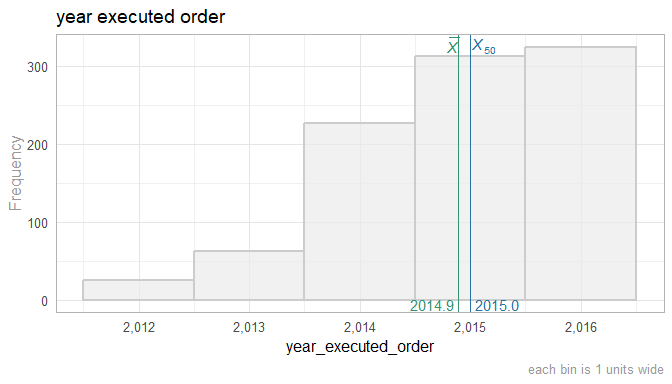

This report covers the survey about attitudes collected by Richard Childers, MD and Joel Schofer, MD.

<!--  Set the working directory to the repository's base directory; this assumes the report is nested inside of two directories.-->


<!-- Set the report-wide options, and point to the external code file. -->


<!-- Load 'sourced' R files.  Suppress the output when loading sources. --> 


<!-- Load packages, or at least verify they're available on the local machine.  Suppress the output when loading packages. --> 


<!-- Load any global functions and variables declared in the R file.  Suppress the output. --> 


<!-- Declare any global functions specific to a Rmd output.  Suppress the output. --> 


<!-- Load the datasets.   -->


<!-- Tweak the datasets.   -->


# Summary {.tabset .tabset-fade .tabset-pills}

## Notes 
1. The current report covers 994 responses.

## Unanswered Questions

## Answered Questions

# Graphs

## Marginals
<!-- --><!-- --><!-- --><!-- --><!-- --><!-- --><!-- --><!-- --><!-- -->

## Scatterplots
<!-- --><!-- --><!-- --><!-- -->

# Models
## Model Exploration


## Final Model


# Session Information
For the sake of documentation and reproducibility, the current report was rendered in the following environment.  Click the line below to expand.

<details>
  <summary>Environment <span class="glyphicon glyphicon-plus-sign"></span></summary>

```
Session info --------------------------------------------------------------------------------------
```

```
 setting  value                                      
 version  R version 3.5.0 Patched (2018-05-14 r74725)
 system   x86_64, mingw32                            
 ui       RTerm                                      
 language (EN)                                       
 collate  English_United States.1252                 
 tz       America/Chicago                            
 date     2018-06-09                                 
```

```
Packages ------------------------------------------------------------------------------------------
```

```
 package         * version     date       source                                  
 assertthat        0.2.0       2017-04-11 CRAN (R 3.5.0)                          
 backports         1.1.2       2017-12-13 CRAN (R 3.5.0)                          
 base            * 3.5.0       2018-05-15 local                                   
 bindr             0.1.1       2018-03-13 CRAN (R 3.5.0)                          
 bindrcpp        * 0.2.2       2018-03-29 CRAN (R 3.5.0)                          
 colorspace        1.3-2       2016-12-14 CRAN (R 3.5.0)                          
 compiler          3.5.0       2018-05-15 local                                   
 datasets        * 3.5.0       2018-05-15 local                                   
 devtools          1.13.5      2018-02-18 CRAN (R 3.5.0)                          
 digest            0.6.15      2018-01-28 CRAN (R 3.5.0)                          
 dplyr             0.7.5       2018-05-19 CRAN (R 3.5.0)                          
 evaluate          0.10.1      2017-06-24 CRAN (R 3.5.0)                          
 ggplot2         * 2.2.1       2016-12-30 CRAN (R 3.5.0)                          
 glue              1.2.0       2017-10-29 CRAN (R 3.5.0)                          
 graphics        * 3.5.0       2018-05-15 local                                   
 grDevices       * 3.5.0       2018-05-15 local                                   
 grid              3.5.0       2018-05-15 local                                   
 gtable            0.2.0       2016-02-26 CRAN (R 3.5.0)                          
 hms               0.4.2.9000  2018-05-30 Github (tidyverse/hms@14e74ab)          
 htmltools         0.3.6       2017-04-28 CRAN (R 3.5.0)                          
 knitr           * 1.20        2018-02-20 CRAN (R 3.5.0)                          
 labeling          0.3         2014-08-23 CRAN (R 3.5.0)                          
 lazyeval          0.2.1       2017-10-29 CRAN (R 3.5.0)                          
 magrittr        * 1.5         2014-11-22 CRAN (R 3.5.0)                          
 memoise           1.1.0       2017-04-21 CRAN (R 3.5.0)                          
 methods         * 3.5.0       2018-05-15 local                                   
 munsell           0.4.3       2016-02-13 CRAN (R 3.5.0)                          
 pillar            1.2.3       2018-05-25 CRAN (R 3.5.0)                          
 pkgconfig         2.0.1       2017-03-21 CRAN (R 3.5.0)                          
 plyr              1.8.4       2016-06-08 CRAN (R 3.5.0)                          
 purrr             0.2.5       2018-05-29 CRAN (R 3.5.0)                          
 R6                2.2.2       2017-06-17 CRAN (R 3.5.0)                          
 Rcpp              0.12.17     2018-05-18 CRAN (R 3.5.0)                          
 readr             1.2.0       2018-05-30 Github (tidyverse/readr@d6d622b)        
 rlang             0.2.1       2018-05-30 CRAN (R 3.5.0)                          
 rmarkdown         1.9         2018-03-01 CRAN (R 3.5.0)                          
 rprojroot         1.3-2       2018-01-03 CRAN (R 3.5.0)                          
 scales            0.5.0       2017-08-24 CRAN (R 3.5.0)                          
 stats           * 3.5.0       2018-05-15 local                                   
 stringi           1.2.2       2018-05-02 CRAN (R 3.5.0)                          
 stringr           1.3.1       2018-05-10 CRAN (R 3.5.0)                          
 TabularManifest   0.1-16.9003 2018-05-23 Github (Melinae/TabularManifest@c2bdddb)
 tibble            1.4.2       2018-01-22 CRAN (R 3.5.0)                          
 tidyselect        0.2.4       2018-02-26 CRAN (R 3.5.0)                          
 tools             3.5.0       2018-05-15 local                                   
 utils           * 3.5.0       2018-05-15 local                                   
 withr             2.1.2       2018-03-15 CRAN (R 3.5.0)                          
 yaml              2.1.19      2018-05-01 CRAN (R 3.5.0)                          
```
</details>


Report rendered by Will at 2018-06-09, 14:43 -0500 in 5 seconds.

