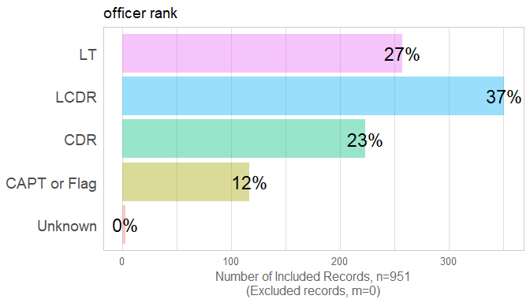
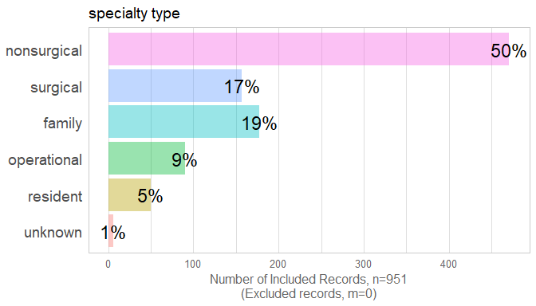
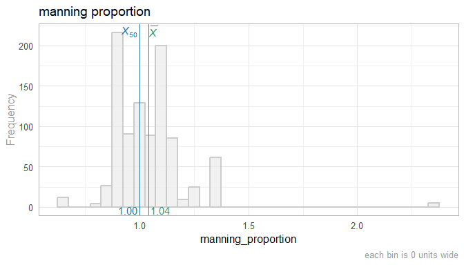
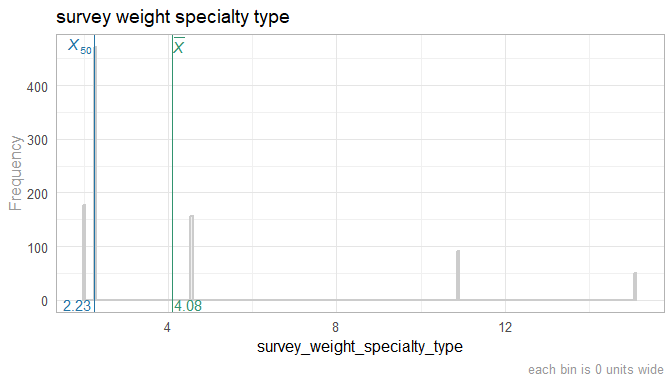
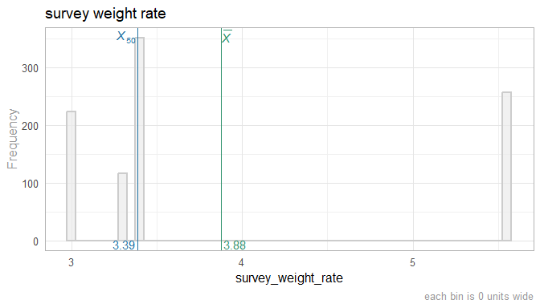
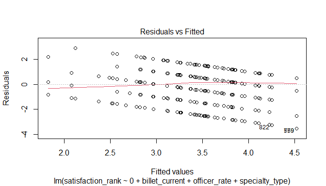
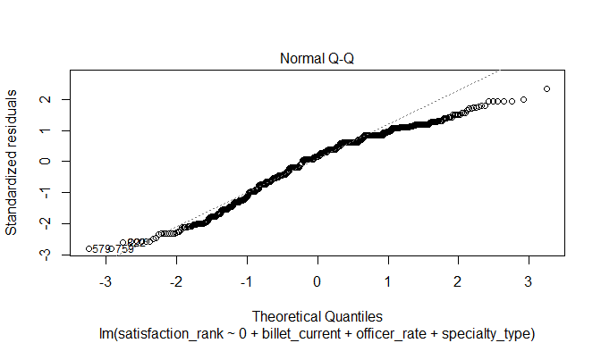
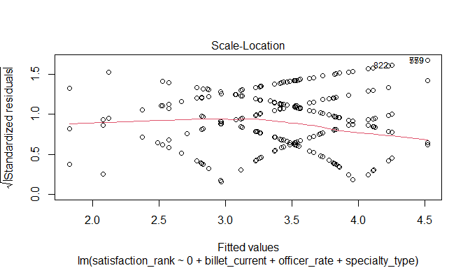
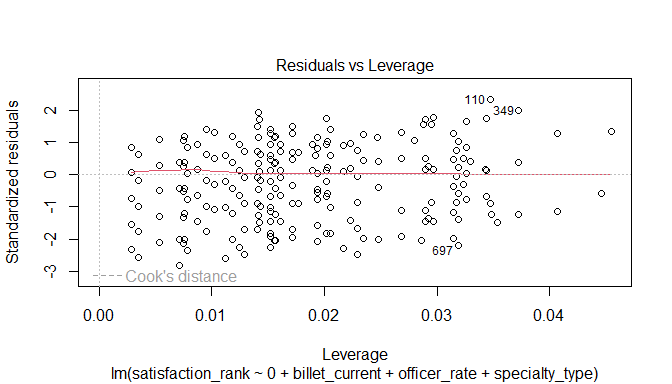

This report covers the survey about attitudes collected by Richard Childers, MD and Joel Schofer, MD.


Overall satisfaction was treated as a continuous response variable in a multiple regression.  The best fitting model included the three predictor variables of (a) specialty type, (b) officer rank, and (c) billet category, and no interaction terms.  Additional variables such as (d) bonus pay, (e) deployment rate, and (f) staffing status did not improve the model fit significantly, and therefore were removed.

Among the five levels in billet category, CONUS MTF had the highest values of satisfaction, and served as the reference group.  The CONUS Operational, OCONUS MTF, and Non-operational/non-clinical types were roughly .4 units less satisfied than CONUS MTF (after holding the other two predictors constant).  Similarly, physicians currently assigned to OCONUS operational were 1.1 units less satisfied than CONUS MTF.

Among the five levels in specialty type, the non-surgical physicians were most satisfied, and served as the reference group.  Residents were .2 units less satisfied, which was not significantly different.  However, the difference was significant between the nonsurgical type and the surgical (.3 units), family practice (.4 units) and operational (.7 units) types.

Officer rank was a continuous variable and had a significant positive slope: satisfaction increased with seniority.  Note that this does not necessarily mean an officer is expected to grow more satisfied as seniority increases; an alternate explanation is that less-satisfied officers leave the Navy while the more-satisfied officer remain and are promoted.  Longitudinal studies are needed to evaluate these competing explanations.

We were comfortable treating the 5-point Likert outcome as a continuous variable in the linear regression, after inspecting the graphs of frequencies and model diagnostics.  Thus we are making the assumption that the perceived distance between values 1 and 2 are roughly equivalent to the distance between values 4 and 5.  We performed ordered logistic regression that treats the outcome as an ordinal variable, which supported similar conclusions about the roles of the three predictors.  We chose to report the conventional regression for ease of interpretability.


<!--  Set the working directory to the repository's base directory; this assumes the report is nested inside of two directories.-->


<!-- Set the report-wide options, and point to the external code file. -->


<!-- Load 'sourced' R files.  Suppress the output when loading sources. --> 


<!-- Load packages, or at least verify they're available on the local machine.  Suppress the output when loading packages. --> 


<!-- Load any global functions and variables declared in the R file.  Suppress the output. --> 


<!-- Declare any global functions specific to a Rmd output.  Suppress the output. --> 


<!-- Load the datasets.   -->


<!-- Tweak the datasets.   -->


Summary {.tabset .tabset-fade .tabset-pills}
============================================

Notes 
-----------------------------------

1. The current report covers 951 responses.
1. We excluded 17 cases because their orders preceded the year 2012 and 26 cases because the `year_executed_order` value was missing.

Unanswered Questions
-----------------------------------

Answered Questions
-----------------------------------

Histograms
============================================

Univariate
-----------------------------------

```
Warning: `fct_explicit_na()` was deprecated in forcats 1.0.0.
ℹ Please use `fct_na_value_to_level()` instead.
ℹ The deprecated feature was likely used in the TabularManifest package.
  Please report the issue to the authors.
This warning is displayed once every 8 hours.
Call `lifecycle::last_lifecycle_warnings()` to see where this warning was generated.
```

<!-- --><!-- --><!-- --><!-- --><!-- --><!-- --><!-- --><!-- --><!-- --><!-- --><!-- --><!-- --><!-- -->

```
Satisfaction summary
```

```
   Min. 1st Qu.  Median    Mean 3rd Qu.    Max.    NA's 
   1.00    3.00    4.00    3.63    5.00    5.00      79 
```

```
Satisfaction summary (emergency medicine only)
```

```
   Min. 1st Qu.  Median    Mean 3rd Qu.    Max.    NA's 
  1.000   3.000   4.000   3.759   5.000   5.000       5 
```

```
Counts by bonus pay & specialty
```


|bonus_pay_cut4 |specialty_type |   n|
|:--------------|:--------------|---:|
|$0             |operational    |  78|
|$0             |resident       |  50|
|$20-24k        |nonsurgical    | 322|
|$20-24k        |family         | 177|
|$20-24k        |operational    |  12|
|$24-32k        |nonsurgical    |  70|
|$24-32k        |surgical       | 109|
|$24-32k        |unknown        |   6|
|32k+           |nonsurgical    |  79|
|32k+           |surgical       |  48|

Survey Response
============================================

```
Overall unweighted mean satisfaction:
```

```
[1] 3.629587
```

```
Overall weighted mean satisfaction:
```

```
                    mean    SE
satisfaction_rank 3.4141 0.056
```

```
`specialty_type` unweighted mean satisfaction:
```

```
# A tibble: 6 × 2
  specialty_type satisfaction_rank
  <fct>                      <dbl>
1 nonsurgical                 3.92
2 surgical                    3.68
3 family                      3.35
4 operational                 2.66
5 resident                    3.52
6 unknown                     3.4 
```

```
`specialty_type` weighted mean satisfaction:
```

```
# A tibble: 5 × 3
  specialty_type satisfaction_rank     se
  <fct>                      <dbl>  <dbl>
1 nonsurgical                 3.92 0.0509
2 surgical                    3.68 0.0925
3 family                      3.35 0.0963
4 operational                 2.66 0.140 
5 resident                    3.52 0.167 
```

```
`officer_rank` unweighted mean satisfaction:
```

```
# A tibble: 5 × 2
  officer_rank satisfaction_rank
  <fct>                    <dbl>
1 LT                        3.14
2 LCDR                      3.59
3 CDR                       3.93
4 CAPT or Flag              4.13
5 Unknown                   2.5 
```

```
`officer_rank` weighted mean satisfaction:
```

```
# A tibble: 5 × 3
  officer_rank satisfaction_rank     se
  <fct>                    <dbl>  <dbl>
1 LT                        2.93 0.103 
2 LCDR                      3.50 0.0868
3 CDR                       3.96 0.0771
4 CAPT or Flag              4.02 0.151 
5 Unknown                   1    0     
```

```
`billet_current` unweighted mean satisfaction:
```

```
# A tibble: 6 × 2
  billet_current     satisfaction_rank
  <fct>                          <dbl>
1 CONUS MTF                       3.85
2 Administrative                  3.65
3 OCONUS MTF                      3.41
4 CONUS Operational               3.12
5 OCONUS Operational              2.45
6 Other                           4   
```

```
`billet_current` weighted mean satisfaction:
```

```
# A tibble: 6 × 3
  billet_current     satisfaction_rank     se
  <fct>                          <dbl>  <dbl>
1 CONUS MTF                       3.70 0.0625
2 Administrative                  3.33 0.275 
3 OCONUS MTF                      3.50 0.133 
4 CONUS Operational               2.94 0.145 
5 OCONUS Operational              2.16 0.231 
6 Other                           3.78 0.418 
```

Relationships between Outcomes
============================================

|                          | satisfaction rank| transparency rank| favoritism rank| assignment current choice|
|:-------------------------|-----------------:|-----------------:|---------------:|-------------------------:|
|satisfaction_rank         |             1.000|             0.771|           0.486|                    -0.519|
|transparency_rank         |             0.771|             1.000|           0.488|                    -0.405|
|favoritism_rank           |             0.486|             0.488|           1.000|                    -0.325|
|assignment_current_choice |            -0.519|            -0.405|          -0.325|                     1.000|

<!-- --><!-- -->


Analyses - 1 Predictor
============================================

By Rank
-----------------------------------
### satisfaction_rank

```
Warning: The `fun.y` argument of `stat_summary()` is deprecated as of ggplot2 3.3.0.
ℹ Please use the `fun` argument instead.
This warning is displayed once every 8 hours.
Call `lifecycle::last_lifecycle_warnings()` to see where this warning was generated.
```

<!-- --><br/>Data:<code> ds </code><br/>Formula:<code> ~ satisfaction_rank 1 + officer_rate_f </code><table class="table table-striped table-hover table-condensed table-responsive" style="width: auto !important; ">
 <thead>
  <tr>
   <th style="text-align:left;"> term </th>
   <th style="text-align:right;"> estimate </th>
   <th style="text-align:right;"> std.error </th>
   <th style="text-align:right;"> statistic </th>
   <th style="text-align:right;"> p.value </th>
  </tr>
 </thead>
<tbody>
  <tr>
   <td style="text-align:left;"> (Intercept) </td>
   <td style="text-align:right;"> 3.1361502 </td>
   <td style="text-align:right;"> 0.0903269 </td>
   <td style="text-align:right;"> 34.720017 </td>
   <td style="text-align:right;"> 0.00e+00 </td>
  </tr>
  <tr>
   <td style="text-align:left;"> officer_rate_f4 </td>
   <td style="text-align:right;"> 0.4547589 </td>
   <td style="text-align:right;"> 0.1158670 </td>
   <td style="text-align:right;"> 3.924834 </td>
   <td style="text-align:right;"> 9.37e-05 </td>
  </tr>
  <tr>
   <td style="text-align:left;"> officer_rate_f5 </td>
   <td style="text-align:right;"> 0.7953566 </td>
   <td style="text-align:right;"> 0.1268635 </td>
   <td style="text-align:right;"> 6.269388 </td>
   <td style="text-align:right;"> 0.00e+00 </td>
  </tr>
  <tr>
   <td style="text-align:left;"> officer_rate_f6 </td>
   <td style="text-align:right;"> 0.9934794 </td>
   <td style="text-align:right;"> 0.1557247 </td>
   <td style="text-align:right;"> 6.379715 </td>
   <td style="text-align:right;"> 0.00e+00 </td>
  </tr>
</tbody>
</table>

<table class="table table-striped table-hover table-condensed table-responsive" style="width: auto !important; ">
 <thead>
  <tr>
   <th style="text-align:right;"> r.squared </th>
   <th style="text-align:right;"> adj.r.squared </th>
   <th style="text-align:right;"> sigma </th>
   <th style="text-align:right;"> statistic </th>
   <th style="text-align:right;"> p.value </th>
   <th style="text-align:right;"> df </th>
   <th style="text-align:right;"> logLik </th>
   <th style="text-align:right;"> AIC </th>
   <th style="text-align:right;"> BIC </th>
   <th style="text-align:right;"> deviance </th>
   <th style="text-align:right;"> df.residual </th>
   <th style="text-align:right;"> nobs </th>
  </tr>
 </thead>
<tbody>
  <tr>
   <td style="text-align:right;"> 0.0619066 </td>
   <td style="text-align:right;"> 0.0586569 </td>
   <td style="text-align:right;"> 1.318277 </td>
   <td style="text-align:right;"> 19.04967 </td>
   <td style="text-align:right;"> 0 </td>
   <td style="text-align:right;"> 3 </td>
   <td style="text-align:right;"> -1472.875 </td>
   <td style="text-align:right;"> 2955.751 </td>
   <td style="text-align:right;"> 2979.593 </td>
   <td style="text-align:right;"> 1504.982 </td>
   <td style="text-align:right;"> 866 </td>
   <td style="text-align:right;"> 870 </td>
  </tr>
</tbody>
</table>

By Specialty Type
-----------------------------------
### satisfaction_rank

<!-- --><br/>Data:<code> [ ds ds$specialty_type != "unknown"  </code><br/>Formula:<code> ~ satisfaction_rank 1 + specialty_type </code><table class="table table-striped table-hover table-condensed table-responsive" style="width: auto !important; ">
 <thead>
  <tr>
   <th style="text-align:left;"> term </th>
   <th style="text-align:right;"> estimate </th>
   <th style="text-align:right;"> std.error </th>
   <th style="text-align:right;"> statistic </th>
   <th style="text-align:right;"> p.value </th>
  </tr>
 </thead>
<tbody>
  <tr>
   <td style="text-align:left;"> (Intercept) </td>
   <td style="text-align:right;"> 3.9172414 </td>
   <td style="text-align:right;"> 0.0625729 </td>
   <td style="text-align:right;"> 62.602823 </td>
   <td style="text-align:right;"> 0.0000000 </td>
  </tr>
  <tr>
   <td style="text-align:left;"> specialty_typesurgical </td>
   <td style="text-align:right;"> -0.2326776 </td>
   <td style="text-align:right;"> 0.1238796 </td>
   <td style="text-align:right;"> -1.878257 </td>
   <td style="text-align:right;"> 0.0606834 </td>
  </tr>
  <tr>
   <td style="text-align:left;"> specialty_typefamily </td>
   <td style="text-align:right;"> -0.5635828 </td>
   <td style="text-align:right;"> 0.1195853 </td>
   <td style="text-align:right;"> -4.712809 </td>
   <td style="text-align:right;"> 0.0000028 </td>
  </tr>
  <tr>
   <td style="text-align:left;"> specialty_typeoperational </td>
   <td style="text-align:right;"> -1.2544507 </td>
   <td style="text-align:right;"> 0.1540125 </td>
   <td style="text-align:right;"> -8.145121 </td>
   <td style="text-align:right;"> 0.0000000 </td>
  </tr>
  <tr>
   <td style="text-align:left;"> specialty_typeresident </td>
   <td style="text-align:right;"> -0.4020899 </td>
   <td style="text-align:right;"> 0.2356418 </td>
   <td style="text-align:right;"> -1.706360 </td>
   <td style="text-align:right;"> 0.0883012 </td>
  </tr>
</tbody>
</table>

<table class="table table-striped table-hover table-condensed table-responsive" style="width: auto !important; ">
 <thead>
  <tr>
   <th style="text-align:right;"> r.squared </th>
   <th style="text-align:right;"> adj.r.squared </th>
   <th style="text-align:right;"> sigma </th>
   <th style="text-align:right;"> statistic </th>
   <th style="text-align:right;"> p.value </th>
   <th style="text-align:right;"> df </th>
   <th style="text-align:right;"> logLik </th>
   <th style="text-align:right;"> AIC </th>
   <th style="text-align:right;"> BIC </th>
   <th style="text-align:right;"> deviance </th>
   <th style="text-align:right;"> df.residual </th>
   <th style="text-align:right;"> nobs </th>
  </tr>
 </thead>
<tbody>
  <tr>
   <td style="text-align:right;"> 0.0811978 </td>
   <td style="text-align:right;"> 0.0769342 </td>
   <td style="text-align:right;"> 1.305062 </td>
   <td style="text-align:right;"> 19.04449 </td>
   <td style="text-align:right;"> 0 </td>
   <td style="text-align:right;"> 4 </td>
   <td style="text-align:right;"> -1458.551 </td>
   <td style="text-align:right;"> 2929.103 </td>
   <td style="text-align:right;"> 2957.693 </td>
   <td style="text-align:right;"> 1468.146 </td>
   <td style="text-align:right;"> 862 </td>
   <td style="text-align:right;"> 867 </td>
  </tr>
</tbody>
</table>

By Bonus Pay
-----------------------------------
### satisfaction_rank

<!-- --><br/>Data:<code> ds </code><br/>Formula:<code> ~ satisfaction_rank 1 + bonus_pay_cut4 </code><table class="table table-striped table-hover table-condensed table-responsive" style="width: auto !important; ">
 <thead>
  <tr>
   <th style="text-align:left;"> term </th>
   <th style="text-align:right;"> estimate </th>
   <th style="text-align:right;"> std.error </th>
   <th style="text-align:right;"> statistic </th>
   <th style="text-align:right;"> p.value </th>
  </tr>
 </thead>
<tbody>
  <tr>
   <td style="text-align:left;"> (Intercept) </td>
   <td style="text-align:right;"> 2.8411215 </td>
   <td style="text-align:right;"> 0.1285699 </td>
   <td style="text-align:right;"> 22.097867 </td>
   <td style="text-align:right;"> 0e+00 </td>
  </tr>
  <tr>
   <td style="text-align:left;"> bonus_pay_cut4$20-24k </td>
   <td style="text-align:right;"> 0.8846169 </td>
   <td style="text-align:right;"> 0.1423437 </td>
   <td style="text-align:right;"> 6.214653 </td>
   <td style="text-align:right;"> 0e+00 </td>
  </tr>
  <tr>
   <td style="text-align:left;"> bonus_pay_cut4$24-32k </td>
   <td style="text-align:right;"> 0.9289934 </td>
   <td style="text-align:right;"> 0.1633872 </td>
   <td style="text-align:right;"> 5.685841 </td>
   <td style="text-align:right;"> 0e+00 </td>
  </tr>
  <tr>
   <td style="text-align:left;"> bonus_pay_cut432k+ </td>
   <td style="text-align:right;"> 0.9110153 </td>
   <td style="text-align:right;"> 0.1778978 </td>
   <td style="text-align:right;"> 5.121004 </td>
   <td style="text-align:right;"> 4e-07 </td>
  </tr>
</tbody>
</table>

<table class="table table-striped table-hover table-condensed table-responsive" style="width: auto !important; ">
 <thead>
  <tr>
   <th style="text-align:right;"> r.squared </th>
   <th style="text-align:right;"> adj.r.squared </th>
   <th style="text-align:right;"> sigma </th>
   <th style="text-align:right;"> statistic </th>
   <th style="text-align:right;"> p.value </th>
   <th style="text-align:right;"> df </th>
   <th style="text-align:right;"> logLik </th>
   <th style="text-align:right;"> AIC </th>
   <th style="text-align:right;"> BIC </th>
   <th style="text-align:right;"> deviance </th>
   <th style="text-align:right;"> df.residual </th>
   <th style="text-align:right;"> nobs </th>
  </tr>
 </thead>
<tbody>
  <tr>
   <td style="text-align:right;"> 0.0472242 </td>
   <td style="text-align:right;"> 0.0439312 </td>
   <td style="text-align:right;"> 1.329938 </td>
   <td style="text-align:right;"> 14.34077 </td>
   <td style="text-align:right;"> 0 </td>
   <td style="text-align:right;"> 3 </td>
   <td style="text-align:right;"> -1483.945 </td>
   <td style="text-align:right;"> 2977.89 </td>
   <td style="text-align:right;"> 3001.744 </td>
   <td style="text-align:right;"> 1535.262 </td>
   <td style="text-align:right;"> 868 </td>
   <td style="text-align:right;"> 872 </td>
  </tr>
</tbody>
</table>

By Assignment Current Choice
-----------------------------------
### satisfaction_rank

<!-- --><br/>Data:<code> ds </code><br/>Formula:<code> ~ satisfaction_rank 1 + assignment_current_choice </code><table class="table table-striped table-hover table-condensed table-responsive" style="width: auto !important; ">
 <thead>
  <tr>
   <th style="text-align:left;"> term </th>
   <th style="text-align:right;"> estimate </th>
   <th style="text-align:right;"> std.error </th>
   <th style="text-align:right;"> statistic </th>
   <th style="text-align:right;"> p.value </th>
  </tr>
 </thead>
<tbody>
  <tr>
   <td style="text-align:left;"> (Intercept) </td>
   <td style="text-align:right;"> 4.7192430 </td>
   <td style="text-align:right;"> 0.0674241 </td>
   <td style="text-align:right;"> 69.99342 </td>
   <td style="text-align:right;"> 0 </td>
  </tr>
  <tr>
   <td style="text-align:left;"> assignment_current_choice </td>
   <td style="text-align:right;"> -0.5721764 </td>
   <td style="text-align:right;"> 0.0342102 </td>
   <td style="text-align:right;"> -16.72533 </td>
   <td style="text-align:right;"> 0 </td>
  </tr>
</tbody>
</table>

<table class="table table-striped table-hover table-condensed table-responsive" style="width: auto !important; ">
 <thead>
  <tr>
   <th style="text-align:right;"> r.squared </th>
   <th style="text-align:right;"> adj.r.squared </th>
   <th style="text-align:right;"> sigma </th>
   <th style="text-align:right;"> statistic </th>
   <th style="text-align:right;"> p.value </th>
   <th style="text-align:right;"> df </th>
   <th style="text-align:right;"> logLik </th>
   <th style="text-align:right;"> AIC </th>
   <th style="text-align:right;"> BIC </th>
   <th style="text-align:right;"> deviance </th>
   <th style="text-align:right;"> df.residual </th>
   <th style="text-align:right;"> nobs </th>
  </tr>
 </thead>
<tbody>
  <tr>
   <td style="text-align:right;"> 0.2693047 </td>
   <td style="text-align:right;"> 0.268342 </td>
   <td style="text-align:right;"> 1.074932 </td>
   <td style="text-align:right;"> 279.7366 </td>
   <td style="text-align:right;"> 0 </td>
   <td style="text-align:right;"> 1 </td>
   <td style="text-align:right;"> -1133.799 </td>
   <td style="text-align:right;"> 2273.598 </td>
   <td style="text-align:right;"> 2287.502 </td>
   <td style="text-align:right;"> 877.0091 </td>
   <td style="text-align:right;"> 759 </td>
   <td style="text-align:right;"> 761 </td>
  </tr>
</tbody>
</table>


By Manning Proportion
-----------------------------------
### manning_proportion

<!-- --><!-- -->

By Critical War
-----------------------------------
<!-- -->

By Billet Current
-----------------------------------
<!-- --><br/>Data:<code> ds </code><br/>Formula:<code> ~ satisfaction_rank 1 + billet_current </code><table class="table table-striped table-hover table-condensed table-responsive" style="width: auto !important; ">
 <thead>
  <tr>
   <th style="text-align:left;"> term </th>
   <th style="text-align:right;"> estimate </th>
   <th style="text-align:right;"> std.error </th>
   <th style="text-align:right;"> statistic </th>
   <th style="text-align:right;"> p.value </th>
  </tr>
 </thead>
<tbody>
  <tr>
   <td style="text-align:left;"> (Intercept) </td>
   <td style="text-align:right;"> 3.8472469 </td>
   <td style="text-align:right;"> 0.0553450 </td>
   <td style="text-align:right;"> 69.5139096 </td>
   <td style="text-align:right;"> 0.0000000 </td>
  </tr>
  <tr>
   <td style="text-align:left;"> billet_currentAdministrative </td>
   <td style="text-align:right;"> -0.2014136 </td>
   <td style="text-align:right;"> 0.1974596 </td>
   <td style="text-align:right;"> -1.0200240 </td>
   <td style="text-align:right;"> 0.3080020 </td>
  </tr>
  <tr>
   <td style="text-align:left;"> billet_currentOCONUS MTF </td>
   <td style="text-align:right;"> -0.4372469 </td>
   <td style="text-align:right;"> 0.1425066 </td>
   <td style="text-align:right;"> -3.0682562 </td>
   <td style="text-align:right;"> 0.0022201 </td>
  </tr>
  <tr>
   <td style="text-align:left;"> billet_currentCONUS Operational </td>
   <td style="text-align:right;"> -0.7311755 </td>
   <td style="text-align:right;"> 0.1358693 </td>
   <td style="text-align:right;"> -5.3814634 </td>
   <td style="text-align:right;"> 0.0000001 </td>
  </tr>
  <tr>
   <td style="text-align:left;"> billet_currentOCONUS Operational </td>
   <td style="text-align:right;"> -1.3972469 </td>
   <td style="text-align:right;"> 0.2148854 </td>
   <td style="text-align:right;"> -6.5022872 </td>
   <td style="text-align:right;"> 0.0000000 </td>
  </tr>
  <tr>
   <td style="text-align:left;"> billet_currentOther </td>
   <td style="text-align:right;"> 0.1527531 </td>
   <td style="text-align:right;"> 0.4412199 </td>
   <td style="text-align:right;"> 0.3462063 </td>
   <td style="text-align:right;"> 0.7292718 </td>
  </tr>
</tbody>
</table>

<table class="table table-striped table-hover table-condensed table-responsive" style="width: auto !important; ">
 <thead>
  <tr>
   <th style="text-align:right;"> r.squared </th>
   <th style="text-align:right;"> adj.r.squared </th>
   <th style="text-align:right;"> sigma </th>
   <th style="text-align:right;"> statistic </th>
   <th style="text-align:right;"> p.value </th>
   <th style="text-align:right;"> df </th>
   <th style="text-align:right;"> logLik </th>
   <th style="text-align:right;"> AIC </th>
   <th style="text-align:right;"> BIC </th>
   <th style="text-align:right;"> deviance </th>
   <th style="text-align:right;"> df.residual </th>
   <th style="text-align:right;"> nobs </th>
  </tr>
 </thead>
<tbody>
  <tr>
   <td style="text-align:right;"> 0.0731888 </td>
   <td style="text-align:right;"> 0.0678376 </td>
   <td style="text-align:right;"> 1.313205 </td>
   <td style="text-align:right;"> 13.67732 </td>
   <td style="text-align:right;"> 0 </td>
   <td style="text-align:right;"> 5 </td>
   <td style="text-align:right;"> -1471.899 </td>
   <td style="text-align:right;"> 2957.797 </td>
   <td style="text-align:right;"> 2991.193 </td>
   <td style="text-align:right;"> 1493.423 </td>
   <td style="text-align:right;"> 866 </td>
   <td style="text-align:right;"> 872 </td>
  </tr>
</tbody>
</table>


Analyses - 2 Predictors
============================================


By Rank and Specialty Type
-----------------------------------
### satisfaction_rank

<!-- --><br/>Data:<code> [ ds ds$specialty_type != "unknown"  </code><br/>Formula:<code> ~ satisfaction_rank 1 + officer_rate_f * specialty_type </code><table class="table table-striped table-hover table-condensed table-responsive" style="width: auto !important; ">
 <thead>
  <tr>
   <th style="text-align:left;"> term </th>
   <th style="text-align:right;"> estimate </th>
   <th style="text-align:right;"> std.error </th>
   <th style="text-align:right;"> statistic </th>
   <th style="text-align:right;"> p.value </th>
  </tr>
 </thead>
<tbody>
  <tr>
   <td style="text-align:left;"> (Intercept) </td>
   <td style="text-align:right;"> 3.7794118 </td>
   <td style="text-align:right;"> 0.1553781 </td>
   <td style="text-align:right;"> 24.3239628 </td>
   <td style="text-align:right;"> 0.0000000 </td>
  </tr>
  <tr>
   <td style="text-align:left;"> officer_rate_f4 </td>
   <td style="text-align:right;"> -0.0092968 </td>
   <td style="text-align:right;"> 0.1832411 </td>
   <td style="text-align:right;"> -0.0507355 </td>
   <td style="text-align:right;"> 0.9595483 </td>
  </tr>
  <tr>
   <td style="text-align:left;"> officer_rate_f5 </td>
   <td style="text-align:right;"> 0.2560492 </td>
   <td style="text-align:right;"> 0.1891705 </td>
   <td style="text-align:right;"> 1.3535366 </td>
   <td style="text-align:right;"> 0.1762449 </td>
  </tr>
  <tr>
   <td style="text-align:left;"> officer_rate_f6 </td>
   <td style="text-align:right;"> 0.5539216 </td>
   <td style="text-align:right;"> 0.2373440 </td>
   <td style="text-align:right;"> 2.3338342 </td>
   <td style="text-align:right;"> 0.0198372 </td>
  </tr>
  <tr>
   <td style="text-align:left;"> specialty_typesurgical </td>
   <td style="text-align:right;"> -0.1127451 </td>
   <td style="text-align:right;"> 0.3654966 </td>
   <td style="text-align:right;"> -0.3084710 </td>
   <td style="text-align:right;"> 0.7577997 </td>
  </tr>
  <tr>
   <td style="text-align:left;"> specialty_typefamily </td>
   <td style="text-align:right;"> -0.9315857 </td>
   <td style="text-align:right;"> 0.2446039 </td>
   <td style="text-align:right;"> -3.8085478 </td>
   <td style="text-align:right;"> 0.0001499 </td>
  </tr>
  <tr>
   <td style="text-align:left;"> specialty_typeoperational </td>
   <td style="text-align:right;"> -1.3667134 </td>
   <td style="text-align:right;"> 0.2240553 </td>
   <td style="text-align:right;"> -6.0998925 </td>
   <td style="text-align:right;"> 0.0000000 </td>
  </tr>
  <tr>
   <td style="text-align:left;"> specialty_typeresident </td>
   <td style="text-align:right;"> -0.2294118 </td>
   <td style="text-align:right;"> 0.3259239 </td>
   <td style="text-align:right;"> -0.7038814 </td>
   <td style="text-align:right;"> 0.4816999 </td>
  </tr>
  <tr>
   <td style="text-align:left;"> officer_rate_f4:specialty_typesurgical </td>
   <td style="text-align:right;"> -0.2384509 </td>
   <td style="text-align:right;"> 0.4064573 </td>
   <td style="text-align:right;"> -0.5866567 </td>
   <td style="text-align:right;"> 0.5575904 </td>
  </tr>
  <tr>
   <td style="text-align:left;"> officer_rate_f5:specialty_typesurgical </td>
   <td style="text-align:right;"> 0.0516431 </td>
   <td style="text-align:right;"> 0.4328109 </td>
   <td style="text-align:right;"> 0.1193202 </td>
   <td style="text-align:right;"> 0.9050499 </td>
  </tr>
  <tr>
   <td style="text-align:left;"> officer_rate_f6:specialty_typesurgical </td>
   <td style="text-align:right;"> -0.1253501 </td>
   <td style="text-align:right;"> 0.4939158 </td>
   <td style="text-align:right;"> -0.2537885 </td>
   <td style="text-align:right;"> 0.7997205 </td>
  </tr>
  <tr>
   <td style="text-align:left;"> officer_rate_f4:specialty_typefamily </td>
   <td style="text-align:right;"> 0.6244337 </td>
   <td style="text-align:right;"> 0.3157016 </td>
   <td style="text-align:right;"> 1.9779237 </td>
   <td style="text-align:right;"> 0.0482607 </td>
  </tr>
  <tr>
   <td style="text-align:left;"> officer_rate_f5:specialty_typefamily </td>
   <td style="text-align:right;"> 0.3285571 </td>
   <td style="text-align:right;"> 0.3403586 </td>
   <td style="text-align:right;"> 0.9653265 </td>
   <td style="text-align:right;"> 0.3346565 </td>
  </tr>
  <tr>
   <td style="text-align:left;"> officer_rate_f6:specialty_typefamily </td>
   <td style="text-align:right;"> 0.4871412 </td>
   <td style="text-align:right;"> 0.3909269 </td>
   <td style="text-align:right;"> 1.2461183 </td>
   <td style="text-align:right;"> 0.2130651 </td>
  </tr>
  <tr>
   <td style="text-align:left;"> officer_rate_f4:specialty_typeoperational </td>
   <td style="text-align:right;"> 0.6680270 </td>
   <td style="text-align:right;"> 0.4205932 </td>
   <td style="text-align:right;"> 1.5882972 </td>
   <td style="text-align:right;"> 0.1125919 </td>
  </tr>
  <tr>
   <td style="text-align:left;"> officer_rate_f5:specialty_typeoperational </td>
   <td style="text-align:right;"> 2.3312524 </td>
   <td style="text-align:right;"> 1.3051914 </td>
   <td style="text-align:right;"> 1.7861383 </td>
   <td style="text-align:right;"> 0.0744341 </td>
  </tr>
  <tr>
   <td style="text-align:left;"> officer_rate_f6:specialty_typeoperational </td>
   <td style="text-align:right;"> 0.6583800 </td>
   <td style="text-align:right;"> 0.5362841 </td>
   <td style="text-align:right;"> 1.2276701 </td>
   <td style="text-align:right;"> 0.2199115 </td>
  </tr>
  <tr>
   <td style="text-align:left;"> officer_rate_f4:specialty_typeresident </td>
   <td style="text-align:right;"> -0.0791647 </td>
   <td style="text-align:right;"> 0.4918785 </td>
   <td style="text-align:right;"> -0.1609436 </td>
   <td style="text-align:right;"> 0.8721761 </td>
  </tr>
  <tr>
   <td style="text-align:left;"> officer_rate_f5:specialty_typeresident </td>
   <td style="text-align:right;"> NA </td>
   <td style="text-align:right;"> NA </td>
   <td style="text-align:right;"> NA </td>
   <td style="text-align:right;"> NA </td>
  </tr>
  <tr>
   <td style="text-align:left;"> officer_rate_f6:specialty_typeresident </td>
   <td style="text-align:right;"> NA </td>
   <td style="text-align:right;"> NA </td>
   <td style="text-align:right;"> NA </td>
   <td style="text-align:right;"> NA </td>
  </tr>
</tbody>
</table>

<table class="table table-striped table-hover table-condensed table-responsive" style="width: auto !important; ">
 <thead>
  <tr>
   <th style="text-align:right;"> r.squared </th>
   <th style="text-align:right;"> adj.r.squared </th>
   <th style="text-align:right;"> sigma </th>
   <th style="text-align:right;"> statistic </th>
   <th style="text-align:right;"> p.value </th>
   <th style="text-align:right;"> df </th>
   <th style="text-align:right;"> logLik </th>
   <th style="text-align:right;"> AIC </th>
   <th style="text-align:right;"> BIC </th>
   <th style="text-align:right;"> deviance </th>
   <th style="text-align:right;"> df.residual </th>
   <th style="text-align:right;"> nobs </th>
  </tr>
 </thead>
<tbody>
  <tr>
   <td style="text-align:right;"> 0.1249664 </td>
   <td style="text-align:right;"> 0.1074244 </td>
   <td style="text-align:right;"> 1.281281 </td>
   <td style="text-align:right;"> 7.123859 </td>
   <td style="text-align:right;"> 0 </td>
   <td style="text-align:right;"> 17 </td>
   <td style="text-align:right;"> -1434.353 </td>
   <td style="text-align:right;"> 2906.706 </td>
   <td style="text-align:right;"> 2997.22 </td>
   <td style="text-align:right;"> 1392.145 </td>
   <td style="text-align:right;"> 848 </td>
   <td style="text-align:right;"> 866 </td>
  </tr>
</tbody>
</table><br/>Data:<code> [ ds ds$specialty_type != "unknown"  </code><br/>Formula:<code> ~ satisfaction_rank 1 + officer_rate_f + specialty_type </code><table class="table table-striped table-hover table-condensed table-responsive" style="width: auto !important; ">
 <thead>
  <tr>
   <th style="text-align:left;"> term </th>
   <th style="text-align:right;"> estimate </th>
   <th style="text-align:right;"> std.error </th>
   <th style="text-align:right;"> statistic </th>
   <th style="text-align:right;"> p.value </th>
  </tr>
 </thead>
<tbody>
  <tr>
   <td style="text-align:left;"> (Intercept) </td>
   <td style="text-align:right;"> 3.6060419 </td>
   <td style="text-align:right;"> 0.1138533 </td>
   <td style="text-align:right;"> 31.6726901 </td>
   <td style="text-align:right;"> 0.0000000 </td>
  </tr>
  <tr>
   <td style="text-align:left;"> officer_rate_f4 </td>
   <td style="text-align:right;"> 0.1894040 </td>
   <td style="text-align:right;"> 0.1227398 </td>
   <td style="text-align:right;"> 1.5431344 </td>
   <td style="text-align:right;"> 0.1231669 </td>
  </tr>
  <tr>
   <td style="text-align:left;"> officer_rate_f5 </td>
   <td style="text-align:right;"> 0.4624532 </td>
   <td style="text-align:right;"> 0.1364136 </td>
   <td style="text-align:right;"> 3.3900819 </td>
   <td style="text-align:right;"> 0.0007306 </td>
  </tr>
  <tr>
   <td style="text-align:left;"> officer_rate_f6 </td>
   <td style="text-align:right;"> 0.7806986 </td>
   <td style="text-align:right;"> 0.1587342 </td>
   <td style="text-align:right;"> 4.9182747 </td>
   <td style="text-align:right;"> 0.0000010 </td>
  </tr>
  <tr>
   <td style="text-align:left;"> specialty_typesurgical </td>
   <td style="text-align:right;"> -0.2466207 </td>
   <td style="text-align:right;"> 0.1222314 </td>
   <td style="text-align:right;"> -2.0176535 </td>
   <td style="text-align:right;"> 0.0439382 </td>
  </tr>
  <tr>
   <td style="text-align:left;"> specialty_typefamily </td>
   <td style="text-align:right;"> -0.5476117 </td>
   <td style="text-align:right;"> 0.1188297 </td>
   <td style="text-align:right;"> -4.6083747 </td>
   <td style="text-align:right;"> 0.0000047 </td>
  </tr>
  <tr>
   <td style="text-align:left;"> specialty_typeoperational </td>
   <td style="text-align:right;"> -1.0520849 </td>
   <td style="text-align:right;"> 0.1656575 </td>
   <td style="text-align:right;"> -6.3509630 </td>
   <td style="text-align:right;"> 0.0000000 </td>
  </tr>
  <tr>
   <td style="text-align:left;"> specialty_typeresident </td>
   <td style="text-align:right;"> -0.1655041 </td>
   <td style="text-align:right;"> 0.2383040 </td>
   <td style="text-align:right;"> -0.6945081 </td>
   <td style="text-align:right;"> 0.4875516 </td>
  </tr>
</tbody>
</table>

<table class="table table-striped table-hover table-condensed table-responsive" style="width: auto !important; ">
 <thead>
  <tr>
   <th style="text-align:right;"> r.squared </th>
   <th style="text-align:right;"> adj.r.squared </th>
   <th style="text-align:right;"> sigma </th>
   <th style="text-align:right;"> statistic </th>
   <th style="text-align:right;"> p.value </th>
   <th style="text-align:right;"> df </th>
   <th style="text-align:right;"> logLik </th>
   <th style="text-align:right;"> AIC </th>
   <th style="text-align:right;"> BIC </th>
   <th style="text-align:right;"> deviance </th>
   <th style="text-align:right;"> df.residual </th>
   <th style="text-align:right;"> nobs </th>
  </tr>
 </thead>
<tbody>
  <tr>
   <td style="text-align:right;"> 0.113058 </td>
   <td style="text-align:right;"> 0.1058219 </td>
   <td style="text-align:right;"> 1.282431 </td>
   <td style="text-align:right;"> 15.62411 </td>
   <td style="text-align:right;"> 0 </td>
   <td style="text-align:right;"> 7 </td>
   <td style="text-align:right;"> -1440.206 </td>
   <td style="text-align:right;"> 2898.412 </td>
   <td style="text-align:right;"> 2941.287 </td>
   <td style="text-align:right;"> 1411.091 </td>
   <td style="text-align:right;"> 858 </td>
   <td style="text-align:right;"> 866 </td>
  </tr>
</tbody>
</table>

By Rank and Assignment Current Choice
-----------------------------------


By Rank and Bonus Pay
-----------------------------------
### satisfaction_rank

<!-- --><br/>Data:<code> ds </code><br/>Formula:<code> ~ satisfaction_rank 1 + officer_rate_f + bonus_pay </code><table class="table table-striped table-hover table-condensed table-responsive" style="width: auto !important; ">
 <thead>
  <tr>
   <th style="text-align:left;"> term </th>
   <th style="text-align:right;"> estimate </th>
   <th style="text-align:right;"> std.error </th>
   <th style="text-align:right;"> statistic </th>
   <th style="text-align:right;"> p.value </th>
  </tr>
 </thead>
<tbody>
  <tr>
   <td style="text-align:left;"> (Intercept) </td>
   <td style="text-align:right;"> 2.9244122 </td>
   <td style="text-align:right;"> 0.1132714 </td>
   <td style="text-align:right;"> 25.817747 </td>
   <td style="text-align:right;"> 0.0000000 </td>
  </tr>
  <tr>
   <td style="text-align:left;"> officer_rate_f4 </td>
   <td style="text-align:right;"> 0.2934115 </td>
   <td style="text-align:right;"> 0.1267040 </td>
   <td style="text-align:right;"> 2.315724 </td>
   <td style="text-align:right;"> 0.0208064 </td>
  </tr>
  <tr>
   <td style="text-align:left;"> officer_rate_f5 </td>
   <td style="text-align:right;"> 0.6032909 </td>
   <td style="text-align:right;"> 0.1408814 </td>
   <td style="text-align:right;"> 4.282261 </td>
   <td style="text-align:right;"> 0.0000206 </td>
  </tr>
  <tr>
   <td style="text-align:left;"> officer_rate_f6 </td>
   <td style="text-align:right;"> 0.8478220 </td>
   <td style="text-align:right;"> 0.1620620 </td>
   <td style="text-align:right;"> 5.231467 </td>
   <td style="text-align:right;"> 0.0000002 </td>
  </tr>
  <tr>
   <td style="text-align:left;"> bonus_pay </td>
   <td style="text-align:right;"> 0.0000158 </td>
   <td style="text-align:right;"> 0.0000051 </td>
   <td style="text-align:right;"> 3.072155 </td>
   <td style="text-align:right;"> 0.0021917 </td>
  </tr>
</tbody>
</table>

<table class="table table-striped table-hover table-condensed table-responsive" style="width: auto !important; ">
 <thead>
  <tr>
   <th style="text-align:right;"> r.squared </th>
   <th style="text-align:right;"> adj.r.squared </th>
   <th style="text-align:right;"> sigma </th>
   <th style="text-align:right;"> statistic </th>
   <th style="text-align:right;"> p.value </th>
   <th style="text-align:right;"> df </th>
   <th style="text-align:right;"> logLik </th>
   <th style="text-align:right;"> AIC </th>
   <th style="text-align:right;"> BIC </th>
   <th style="text-align:right;"> deviance </th>
   <th style="text-align:right;"> df.residual </th>
   <th style="text-align:right;"> nobs </th>
  </tr>
 </thead>
<tbody>
  <tr>
   <td style="text-align:right;"> 0.0720318 </td>
   <td style="text-align:right;"> 0.0677406 </td>
   <td style="text-align:right;"> 1.311901 </td>
   <td style="text-align:right;"> 16.786 </td>
   <td style="text-align:right;"> 0 </td>
   <td style="text-align:right;"> 4 </td>
   <td style="text-align:right;"> -1468.155 </td>
   <td style="text-align:right;"> 2948.309 </td>
   <td style="text-align:right;"> 2976.92 </td>
   <td style="text-align:right;"> 1488.738 </td>
   <td style="text-align:right;"> 865 </td>
   <td style="text-align:right;"> 870 </td>
  </tr>
</tbody>
</table><br/>Data:<code> ds </code><br/>Formula:<code> ~ satisfaction_rank 1 + officer_rate_f * bonus_pay </code><table class="table table-striped table-hover table-condensed table-responsive" style="width: auto !important; ">
 <thead>
  <tr>
   <th style="text-align:left;"> term </th>
   <th style="text-align:right;"> estimate </th>
   <th style="text-align:right;"> std.error </th>
   <th style="text-align:right;"> statistic </th>
   <th style="text-align:right;"> p.value </th>
  </tr>
 </thead>
<tbody>
  <tr>
   <td style="text-align:left;"> (Intercept) </td>
   <td style="text-align:right;"> 2.6738295 </td>
   <td style="text-align:right;"> 0.1412220 </td>
   <td style="text-align:right;"> 18.933520 </td>
   <td style="text-align:right;"> 0.0000000 </td>
  </tr>
  <tr>
   <td style="text-align:left;"> officer_rate_f4 </td>
   <td style="text-align:right;"> 0.9876528 </td>
   <td style="text-align:right;"> 0.2498733 </td>
   <td style="text-align:right;"> 3.952615 </td>
   <td style="text-align:right;"> 0.0000836 </td>
  </tr>
  <tr>
   <td style="text-align:left;"> officer_rate_f5 </td>
   <td style="text-align:right;"> 0.8154021 </td>
   <td style="text-align:right;"> 0.3806246 </td>
   <td style="text-align:right;"> 2.142274 </td>
   <td style="text-align:right;"> 0.0324510 </td>
  </tr>
  <tr>
   <td style="text-align:left;"> officer_rate_f6 </td>
   <td style="text-align:right;"> 1.1783927 </td>
   <td style="text-align:right;"> 0.4842708 </td>
   <td style="text-align:right;"> 2.433334 </td>
   <td style="text-align:right;"> 0.0151628 </td>
  </tr>
  <tr>
   <td style="text-align:left;"> bonus_pay </td>
   <td style="text-align:right;"> 0.0000345 </td>
   <td style="text-align:right;"> 0.0000081 </td>
   <td style="text-align:right;"> 4.232110 </td>
   <td style="text-align:right;"> 0.0000256 </td>
  </tr>
  <tr>
   <td style="text-align:left;"> officer_rate_f4:bonus_pay </td>
   <td style="text-align:right;"> -0.0000374 </td>
   <td style="text-align:right;"> 0.0000115 </td>
   <td style="text-align:right;"> -3.245845 </td>
   <td style="text-align:right;"> 0.0012162 </td>
  </tr>
  <tr>
   <td style="text-align:left;"> officer_rate_f5:bonus_pay </td>
   <td style="text-align:right;"> -0.0000172 </td>
   <td style="text-align:right;"> 0.0000157 </td>
   <td style="text-align:right;"> -1.096670 </td>
   <td style="text-align:right;"> 0.2730919 </td>
  </tr>
  <tr>
   <td style="text-align:left;"> officer_rate_f6:bonus_pay </td>
   <td style="text-align:right;"> -0.0000222 </td>
   <td style="text-align:right;"> 0.0000213 </td>
   <td style="text-align:right;"> -1.042449 </td>
   <td style="text-align:right;"> 0.2974956 </td>
  </tr>
</tbody>
</table>

<table class="table table-striped table-hover table-condensed table-responsive" style="width: auto !important; ">
 <thead>
  <tr>
   <th style="text-align:right;"> r.squared </th>
   <th style="text-align:right;"> adj.r.squared </th>
   <th style="text-align:right;"> sigma </th>
   <th style="text-align:right;"> statistic </th>
   <th style="text-align:right;"> p.value </th>
   <th style="text-align:right;"> df </th>
   <th style="text-align:right;"> logLik </th>
   <th style="text-align:right;"> AIC </th>
   <th style="text-align:right;"> BIC </th>
   <th style="text-align:right;"> deviance </th>
   <th style="text-align:right;"> df.residual </th>
   <th style="text-align:right;"> nobs </th>
  </tr>
 </thead>
<tbody>
  <tr>
   <td style="text-align:right;"> 0.0832837 </td>
   <td style="text-align:right;"> 0.0758394 </td>
   <td style="text-align:right;"> 1.30619 </td>
   <td style="text-align:right;"> 11.18754 </td>
   <td style="text-align:right;"> 0 </td>
   <td style="text-align:right;"> 7 </td>
   <td style="text-align:right;"> -1462.848 </td>
   <td style="text-align:right;"> 2943.696 </td>
   <td style="text-align:right;"> 2986.612 </td>
   <td style="text-align:right;"> 1470.687 </td>
   <td style="text-align:right;"> 862 </td>
   <td style="text-align:right;"> 870 </td>
  </tr>
</tbody>
</table><br/><code>Analysis of Variance Table

Model 1: satisfaction_rank ~ 1 + officer_rate_f + bonus_pay
Model 2: satisfaction_rank ~ 1 + officer_rate_f * bonus_pay
  Res.Df    RSS Df Sum of Sq      F  Pr(>F)
1    865 1488.7                            
2    862 1470.7  3    18.052 3.5268 0.01461
</code>

By Billet Current and Critical War
-----------------------------------
### satisfaction_rank

<!-- --><br/>Data:<code> ds </code><br/>Formula:<code> ~ satisfaction_rank 1 + billet_current + critical_war </code><table class="table table-striped table-hover table-condensed table-responsive" style="width: auto !important; ">
 <thead>
  <tr>
   <th style="text-align:left;"> term </th>
   <th style="text-align:right;"> estimate </th>
   <th style="text-align:right;"> std.error </th>
   <th style="text-align:right;"> statistic </th>
   <th style="text-align:right;"> p.value </th>
  </tr>
 </thead>
<tbody>
  <tr>
   <td style="text-align:left;"> (Intercept) </td>
   <td style="text-align:right;"> 3.8377622 </td>
   <td style="text-align:right;"> 0.1180247 </td>
   <td style="text-align:right;"> 32.5166107 </td>
   <td style="text-align:right;"> 0.0000000 </td>
  </tr>
  <tr>
   <td style="text-align:left;"> billet_currentAdministrative </td>
   <td style="text-align:right;"> -0.2015313 </td>
   <td style="text-align:right;"> 0.1975770 </td>
   <td style="text-align:right;"> -1.0200137 </td>
   <td style="text-align:right;"> 0.3080071 </td>
  </tr>
  <tr>
   <td style="text-align:left;"> billet_currentOCONUS MTF </td>
   <td style="text-align:right;"> -0.4370929 </td>
   <td style="text-align:right;"> 0.1425983 </td>
   <td style="text-align:right;"> -3.0652035 </td>
   <td style="text-align:right;"> 0.0022428 </td>
  </tr>
  <tr>
   <td style="text-align:left;"> billet_currentCONUS Operational </td>
   <td style="text-align:right;"> -0.7312263 </td>
   <td style="text-align:right;"> 0.1359483 </td>
   <td style="text-align:right;"> -5.3787096 </td>
   <td style="text-align:right;"> 0.0000001 </td>
  </tr>
  <tr>
   <td style="text-align:left;"> billet_currentOCONUS Operational </td>
   <td style="text-align:right;"> -1.3975988 </td>
   <td style="text-align:right;"> 0.2150434 </td>
   <td style="text-align:right;"> -6.4991486 </td>
   <td style="text-align:right;"> 0.0000000 </td>
  </tr>
  <tr>
   <td style="text-align:left;"> billet_currentOther </td>
   <td style="text-align:right;"> 0.1509960 </td>
   <td style="text-align:right;"> 0.4418948 </td>
   <td style="text-align:right;"> 0.3417011 </td>
   <td style="text-align:right;"> 0.7326588 </td>
  </tr>
  <tr>
   <td style="text-align:left;"> critical_warLow Deployer </td>
   <td style="text-align:right;"> 0.0112418 </td>
   <td style="text-align:right;"> 0.1235363 </td>
   <td style="text-align:right;"> 0.0910001 </td>
   <td style="text-align:right;"> 0.9275136 </td>
  </tr>
</tbody>
</table>

<table class="table table-striped table-hover table-condensed table-responsive" style="width: auto !important; ">
 <thead>
  <tr>
   <th style="text-align:right;"> r.squared </th>
   <th style="text-align:right;"> adj.r.squared </th>
   <th style="text-align:right;"> sigma </th>
   <th style="text-align:right;"> statistic </th>
   <th style="text-align:right;"> p.value </th>
   <th style="text-align:right;"> df </th>
   <th style="text-align:right;"> logLik </th>
   <th style="text-align:right;"> AIC </th>
   <th style="text-align:right;"> BIC </th>
   <th style="text-align:right;"> deviance </th>
   <th style="text-align:right;"> df.residual </th>
   <th style="text-align:right;"> nobs </th>
  </tr>
 </thead>
<tbody>
  <tr>
   <td style="text-align:right;"> 0.0731976 </td>
   <td style="text-align:right;"> 0.0667689 </td>
   <td style="text-align:right;"> 1.313958 </td>
   <td style="text-align:right;"> 11.38609 </td>
   <td style="text-align:right;"> 0 </td>
   <td style="text-align:right;"> 6 </td>
   <td style="text-align:right;"> -1471.894 </td>
   <td style="text-align:right;"> 2959.789 </td>
   <td style="text-align:right;"> 2997.955 </td>
   <td style="text-align:right;"> 1493.409 </td>
   <td style="text-align:right;"> 865 </td>
   <td style="text-align:right;"> 872 </td>
  </tr>
</tbody>
</table>

By Bonus_pay and Manning_proportion
-----------------------------------
### satisfaction_rank

<!-- --><br/>Data:<code> ds </code><br/>Formula:<code> ~ satisfaction_rank 1 + manning_proportion_cut3 + bonus_pay_cut3 </code><table class="table table-striped table-hover table-condensed table-responsive" style="width: auto !important; ">
 <thead>
  <tr>
   <th style="text-align:left;"> term </th>
   <th style="text-align:right;"> estimate </th>
   <th style="text-align:right;"> std.error </th>
   <th style="text-align:right;"> statistic </th>
   <th style="text-align:right;"> p.value </th>
  </tr>
 </thead>
<tbody>
  <tr>
   <td style="text-align:left;"> (Intercept) </td>
   <td style="text-align:right;"> 2.4680836 </td>
   <td style="text-align:right;"> 0.1647969 </td>
   <td style="text-align:right;"> 14.976514 </td>
   <td style="text-align:right;"> 0.0000000 </td>
  </tr>
  <tr>
   <td style="text-align:left;"> manning_proportion_cut3Balanced </td>
   <td style="text-align:right;"> 0.3928698 </td>
   <td style="text-align:right;"> 0.1259855 </td>
   <td style="text-align:right;"> 3.118373 </td>
   <td style="text-align:right;"> 0.0018786 </td>
  </tr>
  <tr>
   <td style="text-align:left;"> manning_proportion_cut3Over </td>
   <td style="text-align:right;"> 0.4651373 </td>
   <td style="text-align:right;"> 0.1209922 </td>
   <td style="text-align:right;"> 3.844358 </td>
   <td style="text-align:right;"> 0.0001297 </td>
  </tr>
  <tr>
   <td style="text-align:left;"> bonus_pay_cut3$20-24k </td>
   <td style="text-align:right;"> 1.0172580 </td>
   <td style="text-align:right;"> 0.1493703 </td>
   <td style="text-align:right;"> 6.810311 </td>
   <td style="text-align:right;"> 0.0000000 </td>
  </tr>
  <tr>
   <td style="text-align:left;"> bonus_pay_cut3$24k+ </td>
   <td style="text-align:right;"> 0.8796862 </td>
   <td style="text-align:right;"> 0.1546106 </td>
   <td style="text-align:right;"> 5.689687 </td>
   <td style="text-align:right;"> 0.0000000 </td>
  </tr>
</tbody>
</table>

<table class="table table-striped table-hover table-condensed table-responsive" style="width: auto !important; ">
 <thead>
  <tr>
   <th style="text-align:right;"> r.squared </th>
   <th style="text-align:right;"> adj.r.squared </th>
   <th style="text-align:right;"> sigma </th>
   <th style="text-align:right;"> statistic </th>
   <th style="text-align:right;"> p.value </th>
   <th style="text-align:right;"> df </th>
   <th style="text-align:right;"> logLik </th>
   <th style="text-align:right;"> AIC </th>
   <th style="text-align:right;"> BIC </th>
   <th style="text-align:right;"> deviance </th>
   <th style="text-align:right;"> df.residual </th>
   <th style="text-align:right;"> nobs </th>
  </tr>
 </thead>
<tbody>
  <tr>
   <td style="text-align:right;"> 0.0642006 </td>
   <td style="text-align:right;"> 0.0598832 </td>
   <td style="text-align:right;"> 1.318796 </td>
   <td style="text-align:right;"> 14.87015 </td>
   <td style="text-align:right;"> 0 </td>
   <td style="text-align:right;"> 4 </td>
   <td style="text-align:right;"> -1476.106 </td>
   <td style="text-align:right;"> 2964.213 </td>
   <td style="text-align:right;"> 2992.838 </td>
   <td style="text-align:right;"> 1507.907 </td>
   <td style="text-align:right;"> 867 </td>
   <td style="text-align:right;"> 872 </td>
  </tr>
</tbody>
</table>No interaction between manning_proportion_cut3 & bonus_pay_cut3<br/><code>Analysis of Variance Table

Model 1: satisfaction_rank ~ 1 + manning_proportion_cut3 * bonus_pay_cut3
Model 2: satisfaction_rank ~ 1 + manning_proportion_cut3 + bonus_pay_cut3
  Res.Df    RSS Df Sum of Sq      F Pr(>F)
1    863 1499.7                           
2    867 1507.9 -4   -8.1779 1.1765 0.3197
</code><br/>Data:<code> ds </code><br/>Formula:<code> ~ satisfaction_rank 1 + billet_current + critical_war </code><table class="table table-striped table-hover table-condensed table-responsive" style="width: auto !important; ">
 <thead>
  <tr>
   <th style="text-align:left;"> term </th>
   <th style="text-align:right;"> estimate </th>
   <th style="text-align:right;"> std.error </th>
   <th style="text-align:right;"> statistic </th>
   <th style="text-align:right;"> p.value </th>
  </tr>
 </thead>
<tbody>
  <tr>
   <td style="text-align:left;"> (Intercept) </td>
   <td style="text-align:right;"> 3.8377622 </td>
   <td style="text-align:right;"> 0.1180247 </td>
   <td style="text-align:right;"> 32.5166107 </td>
   <td style="text-align:right;"> 0.0000000 </td>
  </tr>
  <tr>
   <td style="text-align:left;"> billet_currentAdministrative </td>
   <td style="text-align:right;"> -0.2015313 </td>
   <td style="text-align:right;"> 0.1975770 </td>
   <td style="text-align:right;"> -1.0200137 </td>
   <td style="text-align:right;"> 0.3080071 </td>
  </tr>
  <tr>
   <td style="text-align:left;"> billet_currentOCONUS MTF </td>
   <td style="text-align:right;"> -0.4370929 </td>
   <td style="text-align:right;"> 0.1425983 </td>
   <td style="text-align:right;"> -3.0652035 </td>
   <td style="text-align:right;"> 0.0022428 </td>
  </tr>
  <tr>
   <td style="text-align:left;"> billet_currentCONUS Operational </td>
   <td style="text-align:right;"> -0.7312263 </td>
   <td style="text-align:right;"> 0.1359483 </td>
   <td style="text-align:right;"> -5.3787096 </td>
   <td style="text-align:right;"> 0.0000001 </td>
  </tr>
  <tr>
   <td style="text-align:left;"> billet_currentOCONUS Operational </td>
   <td style="text-align:right;"> -1.3975988 </td>
   <td style="text-align:right;"> 0.2150434 </td>
   <td style="text-align:right;"> -6.4991486 </td>
   <td style="text-align:right;"> 0.0000000 </td>
  </tr>
  <tr>
   <td style="text-align:left;"> billet_currentOther </td>
   <td style="text-align:right;"> 0.1509960 </td>
   <td style="text-align:right;"> 0.4418948 </td>
   <td style="text-align:right;"> 0.3417011 </td>
   <td style="text-align:right;"> 0.7326588 </td>
  </tr>
  <tr>
   <td style="text-align:left;"> critical_warLow Deployer </td>
   <td style="text-align:right;"> 0.0112418 </td>
   <td style="text-align:right;"> 0.1235363 </td>
   <td style="text-align:right;"> 0.0910001 </td>
   <td style="text-align:right;"> 0.9275136 </td>
  </tr>
</tbody>
</table>

<table class="table table-striped table-hover table-condensed table-responsive" style="width: auto !important; ">
 <thead>
  <tr>
   <th style="text-align:right;"> r.squared </th>
   <th style="text-align:right;"> adj.r.squared </th>
   <th style="text-align:right;"> sigma </th>
   <th style="text-align:right;"> statistic </th>
   <th style="text-align:right;"> p.value </th>
   <th style="text-align:right;"> df </th>
   <th style="text-align:right;"> logLik </th>
   <th style="text-align:right;"> AIC </th>
   <th style="text-align:right;"> BIC </th>
   <th style="text-align:right;"> deviance </th>
   <th style="text-align:right;"> df.residual </th>
   <th style="text-align:right;"> nobs </th>
  </tr>
 </thead>
<tbody>
  <tr>
   <td style="text-align:right;"> 0.0731976 </td>
   <td style="text-align:right;"> 0.0667689 </td>
   <td style="text-align:right;"> 1.313958 </td>
   <td style="text-align:right;"> 11.38609 </td>
   <td style="text-align:right;"> 0 </td>
   <td style="text-align:right;"> 6 </td>
   <td style="text-align:right;"> -1471.894 </td>
   <td style="text-align:right;"> 2959.789 </td>
   <td style="text-align:right;"> 2997.955 </td>
   <td style="text-align:right;"> 1493.409 </td>
   <td style="text-align:right;"> 865 </td>
   <td style="text-align:right;"> 872 </td>
  </tr>
</tbody>
</table>

By Rank and Billet Type
-----------------------------------
### satisfaction_rank

**Conculsion**: `officer_rate` has a significant positive slope --sig predicting beyond `billet_current`.  But the billet levels have the same slope.<br/>Data:<code> ds_no_other_or_unknown </code><br/>Formula:<code> ~ satisfaction_rank 1 + billet_current + officer_rate </code><table class="table table-striped table-hover table-condensed table-responsive" style="width: auto !important; ">
 <thead>
  <tr>
   <th style="text-align:left;"> term </th>
   <th style="text-align:right;"> estimate </th>
   <th style="text-align:right;"> std.error </th>
   <th style="text-align:right;"> statistic </th>
   <th style="text-align:right;"> p.value </th>
  </tr>
 </thead>
<tbody>
  <tr>
   <td style="text-align:left;"> (Intercept) </td>
   <td style="text-align:right;"> 2.3990535 </td>
   <td style="text-align:right;"> 0.2023713 </td>
   <td style="text-align:right;"> 11.854711 </td>
   <td style="text-align:right;"> 0.0000000 </td>
  </tr>
  <tr>
   <td style="text-align:left;"> billet_currentAdministrative </td>
   <td style="text-align:right;"> -0.5251624 </td>
   <td style="text-align:right;"> 0.1972434 </td>
   <td style="text-align:right;"> -2.662510 </td>
   <td style="text-align:right;"> 0.0079021 </td>
  </tr>
  <tr>
   <td style="text-align:left;"> billet_currentOCONUS MTF </td>
   <td style="text-align:right;"> -0.4583431 </td>
   <td style="text-align:right;"> 0.1377637 </td>
   <td style="text-align:right;"> -3.327024 </td>
   <td style="text-align:right;"> 0.0009153 </td>
  </tr>
  <tr>
   <td style="text-align:left;"> billet_currentCONUS Operational </td>
   <td style="text-align:right;"> -0.6710109 </td>
   <td style="text-align:right;"> 0.1320160 </td>
   <td style="text-align:right;"> -5.082800 </td>
   <td style="text-align:right;"> 0.0000005 </td>
  </tr>
  <tr>
   <td style="text-align:left;"> billet_currentOCONUS Operational </td>
   <td style="text-align:right;"> -1.3770516 </td>
   <td style="text-align:right;"> 0.2076934 </td>
   <td style="text-align:right;"> -6.630213 </td>
   <td style="text-align:right;"> 0.0000000 </td>
  </tr>
  <tr>
   <td style="text-align:left;"> officer_rate </td>
   <td style="text-align:right;"> 0.3440959 </td>
   <td style="text-align:right;"> 0.0462720 </td>
   <td style="text-align:right;"> 7.436374 </td>
   <td style="text-align:right;"> 0.0000000 </td>
  </tr>
</tbody>
</table>

<table class="table table-striped table-hover table-condensed table-responsive" style="width: auto !important; ">
 <thead>
  <tr>
   <th style="text-align:right;"> r.squared </th>
   <th style="text-align:right;"> adj.r.squared </th>
   <th style="text-align:right;"> sigma </th>
   <th style="text-align:right;"> statistic </th>
   <th style="text-align:right;"> p.value </th>
   <th style="text-align:right;"> df </th>
   <th style="text-align:right;"> logLik </th>
   <th style="text-align:right;"> AIC </th>
   <th style="text-align:right;"> BIC </th>
   <th style="text-align:right;"> deviance </th>
   <th style="text-align:right;"> df.residual </th>
   <th style="text-align:right;"> nobs </th>
  </tr>
 </thead>
<tbody>
  <tr>
   <td style="text-align:right;"> 0.1298574 </td>
   <td style="text-align:right;"> 0.1247569 </td>
   <td style="text-align:right;"> 1.26896 </td>
   <td style="text-align:right;"> 25.45982 </td>
   <td style="text-align:right;"> 0 </td>
   <td style="text-align:right;"> 5 </td>
   <td style="text-align:right;"> -1420.469 </td>
   <td style="text-align:right;"> 2854.939 </td>
   <td style="text-align:right;"> 2888.229 </td>
   <td style="text-align:right;"> 1373.551 </td>
   <td style="text-align:right;"> 853 </td>
   <td style="text-align:right;"> 859 </td>
  </tr>
</tbody>
</table>Analysis of Variance Table

Model 1: satisfaction_rank ~ 1 + billet_current
Model 2: satisfaction_rank ~ 1 + billet_current + officer_rate
  Res.Df    RSS Df Sum of Sq    F    Pr(>F)
1    854 1462.6                            
2    853 1373.5  1    89.047 55.3 2.521e-13
Analysis of Variance Table

Model 1: satisfaction_rank ~ 1 + billet_current + officer_rate
Model 2: satisfaction_rank ~ 1 + billet_current * officer_rate
  Res.Df    RSS Df Sum of Sq      F Pr(>F)
1    853 1373.5                           
2    849 1365.3  4    8.2102 1.2763 0.2776
<!-- -->

Ordinal Models
===================================

-----------------------------------

## 1-predictor ordinal model: billet

<br/>Data:<code> ds_no_other_or_unknown </code><br/>Formula:<code> ~ ordered(satisfaction_rank) billet_current </code><table class="table table-striped table-hover table-condensed table-responsive" style="width: auto !important; ">
 <thead>
  <tr>
   <th style="text-align:left;"> term </th>
   <th style="text-align:right;"> estimate </th>
   <th style="text-align:right;"> std.error </th>
   <th style="text-align:right;"> statistic </th>
   <th style="text-align:left;"> coef.type </th>
  </tr>
 </thead>
<tbody>
  <tr>
   <td style="text-align:left;"> billet_currentAdministrative </td>
   <td style="text-align:right;"> -0.1598301 </td>
   <td style="text-align:right;"> 0.2847549 </td>
   <td style="text-align:right;"> -0.5612903 </td>
   <td style="text-align:left;"> coefficient </td>
  </tr>
  <tr>
   <td style="text-align:left;"> billet_currentOCONUS MTF </td>
   <td style="text-align:right;"> -0.5408170 </td>
   <td style="text-align:right;"> 0.1975592 </td>
   <td style="text-align:right;"> -2.7374939 </td>
   <td style="text-align:left;"> coefficient </td>
  </tr>
  <tr>
   <td style="text-align:left;"> billet_currentCONUS Operational </td>
   <td style="text-align:right;"> -0.9174521 </td>
   <td style="text-align:right;"> 0.1903276 </td>
   <td style="text-align:right;"> -4.8203829 </td>
   <td style="text-align:left;"> coefficient </td>
  </tr>
  <tr>
   <td style="text-align:left;"> billet_currentOCONUS Operational </td>
   <td style="text-align:right;"> -1.8141170 </td>
   <td style="text-align:right;"> 0.3021047 </td>
   <td style="text-align:right;"> -6.0049280 </td>
   <td style="text-align:left;"> coefficient </td>
  </tr>
  <tr>
   <td style="text-align:left;"> 1|2 </td>
   <td style="text-align:right;"> -2.3551770 </td>
   <td style="text-align:right;"> 0.1224293 </td>
   <td style="text-align:right;"> -19.2370433 </td>
   <td style="text-align:left;"> scale </td>
  </tr>
  <tr>
   <td style="text-align:left;"> 2|3 </td>
   <td style="text-align:right;"> -1.6150921 </td>
   <td style="text-align:right;"> 0.1001752 </td>
   <td style="text-align:right;"> -16.1226674 </td>
   <td style="text-align:left;"> scale </td>
  </tr>
  <tr>
   <td style="text-align:left;"> 3|4 </td>
   <td style="text-align:right;"> -0.7152669 </td>
   <td style="text-align:right;"> 0.0844094 </td>
   <td style="text-align:right;"> -8.4737827 </td>
   <td style="text-align:left;"> scale </td>
  </tr>
  <tr>
   <td style="text-align:left;"> 4|5 </td>
   <td style="text-align:right;"> 0.3971137 </td>
   <td style="text-align:right;"> 0.0821859 </td>
   <td style="text-align:right;"> 4.8318944 </td>
   <td style="text-align:left;"> scale </td>
  </tr>
</tbody>
</table>

<table class="table table-striped table-hover table-condensed table-responsive" style="width: auto !important; ">
 <thead>
  <tr>
   <th style="text-align:right;"> edf </th>
   <th style="text-align:right;"> logLik </th>
   <th style="text-align:right;"> AIC </th>
   <th style="text-align:right;"> BIC </th>
   <th style="text-align:right;"> deviance </th>
   <th style="text-align:right;"> df.residual </th>
   <th style="text-align:right;"> nobs </th>
  </tr>
 </thead>
<tbody>
  <tr>
   <td style="text-align:right;"> 8 </td>
   <td style="text-align:right;"> -1262.722 </td>
   <td style="text-align:right;"> 2541.445 </td>
   <td style="text-align:right;"> 2579.5 </td>
   <td style="text-align:right;"> 2525.445 </td>
   <td style="text-align:right;"> 852 </td>
   <td style="text-align:right;"> 860 </td>
  </tr>
</tbody>
</table>

## 1-predictor ordinal model: offier rate

<br/>Data:<code> ds_no_other_or_unknown </code><br/>Formula:<code> ~ ordered(satisfaction_rank) officer_rate </code><table class="table table-striped table-hover table-condensed table-responsive" style="width: auto !important; ">
 <thead>
  <tr>
   <th style="text-align:left;"> term </th>
   <th style="text-align:right;"> estimate </th>
   <th style="text-align:right;"> std.error </th>
   <th style="text-align:right;"> statistic </th>
   <th style="text-align:left;"> coef.type </th>
  </tr>
 </thead>
<tbody>
  <tr>
   <td style="text-align:left;"> officer_rate </td>
   <td style="text-align:right;"> 0.4972550 </td>
   <td style="text-align:right;"> 0.0666400 </td>
   <td style="text-align:right;"> 7.4618072 </td>
   <td style="text-align:left;"> coefficient </td>
  </tr>
  <tr>
   <td style="text-align:left;"> 1|2 </td>
   <td style="text-align:right;"> 0.0181495 </td>
   <td style="text-align:right;"> 0.2869621 </td>
   <td style="text-align:right;"> 0.0632469 </td>
   <td style="text-align:left;"> scale </td>
  </tr>
  <tr>
   <td style="text-align:left;"> 2|3 </td>
   <td style="text-align:right;"> 0.7415462 </td>
   <td style="text-align:right;"> 0.2826536 </td>
   <td style="text-align:right;"> 2.6235159 </td>
   <td style="text-align:left;"> scale </td>
  </tr>
  <tr>
   <td style="text-align:left;"> 3|4 </td>
   <td style="text-align:right;"> 1.6279511 </td>
   <td style="text-align:right;"> 0.2856359 </td>
   <td style="text-align:right;"> 5.6993933 </td>
   <td style="text-align:left;"> scale </td>
  </tr>
  <tr>
   <td style="text-align:left;"> 4|5 </td>
   <td style="text-align:right;"> 2.7581936 </td>
   <td style="text-align:right;"> 0.2963643 </td>
   <td style="text-align:right;"> 9.3067684 </td>
   <td style="text-align:left;"> scale </td>
  </tr>
</tbody>
</table>

<table class="table table-striped table-hover table-condensed table-responsive" style="width: auto !important; ">
 <thead>
  <tr>
   <th style="text-align:right;"> edf </th>
   <th style="text-align:right;"> logLik </th>
   <th style="text-align:right;"> AIC </th>
   <th style="text-align:right;"> BIC </th>
   <th style="text-align:right;"> deviance </th>
   <th style="text-align:right;"> df.residual </th>
   <th style="text-align:right;"> nobs </th>
  </tr>
 </thead>
<tbody>
  <tr>
   <td style="text-align:right;"> 5 </td>
   <td style="text-align:right;"> -1259.639 </td>
   <td style="text-align:right;"> 2529.279 </td>
   <td style="text-align:right;"> 2553.058 </td>
   <td style="text-align:right;"> 2519.279 </td>
   <td style="text-align:right;"> 854 </td>
   <td style="text-align:right;"> 859 </td>
  </tr>
</tbody>
</table>

## 1-predictor ordinal model: specialty

<br/>Data:<code> ds_no_other_or_unknown </code><br/>Formula:<code> ~ ordered(satisfaction_rank) specialty_type </code><table class="table table-striped table-hover table-condensed table-responsive" style="width: auto !important; ">
 <thead>
  <tr>
   <th style="text-align:left;"> term </th>
   <th style="text-align:right;"> estimate </th>
   <th style="text-align:right;"> std.error </th>
   <th style="text-align:right;"> statistic </th>
   <th style="text-align:left;"> coef.type </th>
  </tr>
 </thead>
<tbody>
  <tr>
   <td style="text-align:left;"> specialty_typesurgical </td>
   <td style="text-align:right;"> -0.3465013 </td>
   <td style="text-align:right;"> 0.1714193 </td>
   <td style="text-align:right;"> -2.021366 </td>
   <td style="text-align:left;"> coefficient </td>
  </tr>
  <tr>
   <td style="text-align:left;"> specialty_typefamily </td>
   <td style="text-align:right;"> -0.7839712 </td>
   <td style="text-align:right;"> 0.1673401 </td>
   <td style="text-align:right;"> -4.684897 </td>
   <td style="text-align:left;"> coefficient </td>
  </tr>
  <tr>
   <td style="text-align:left;"> specialty_typeoperational </td>
   <td style="text-align:right;"> -1.6647223 </td>
   <td style="text-align:right;"> 0.2223020 </td>
   <td style="text-align:right;"> -7.488563 </td>
   <td style="text-align:left;"> coefficient </td>
  </tr>
  <tr>
   <td style="text-align:left;"> specialty_typeresident </td>
   <td style="text-align:right;"> -0.6376696 </td>
   <td style="text-align:right;"> 0.3092219 </td>
   <td style="text-align:right;"> -2.062175 </td>
   <td style="text-align:left;"> coefficient </td>
  </tr>
  <tr>
   <td style="text-align:left;"> 1|2 </td>
   <td style="text-align:right;"> -2.4995064 </td>
   <td style="text-align:right;"> 0.1323535 </td>
   <td style="text-align:right;"> -18.885079 </td>
   <td style="text-align:left;"> scale </td>
  </tr>
  <tr>
   <td style="text-align:left;"> 2|3 </td>
   <td style="text-align:right;"> -1.7510557 </td>
   <td style="text-align:right;"> 0.1114135 </td>
   <td style="text-align:right;"> -15.716735 </td>
   <td style="text-align:left;"> scale </td>
  </tr>
  <tr>
   <td style="text-align:left;"> 3|4 </td>
   <td style="text-align:right;"> -0.8437125 </td>
   <td style="text-align:right;"> 0.0965107 </td>
   <td style="text-align:right;"> -8.742168 </td>
   <td style="text-align:left;"> scale </td>
  </tr>
  <tr>
   <td style="text-align:left;"> 4|5 </td>
   <td style="text-align:right;"> 0.2778043 </td>
   <td style="text-align:right;"> 0.0924397 </td>
   <td style="text-align:right;"> 3.005250 </td>
   <td style="text-align:left;"> scale </td>
  </tr>
</tbody>
</table>

<table class="table table-striped table-hover table-condensed table-responsive" style="width: auto !important; ">
 <thead>
  <tr>
   <th style="text-align:right;"> edf </th>
   <th style="text-align:right;"> logLik </th>
   <th style="text-align:right;"> AIC </th>
   <th style="text-align:right;"> BIC </th>
   <th style="text-align:right;"> deviance </th>
   <th style="text-align:right;"> df.residual </th>
   <th style="text-align:right;"> nobs </th>
  </tr>
 </thead>
<tbody>
  <tr>
   <td style="text-align:right;"> 8 </td>
   <td style="text-align:right;"> -1257.197 </td>
   <td style="text-align:right;"> 2530.395 </td>
   <td style="text-align:right;"> 2568.45 </td>
   <td style="text-align:right;"> 2514.395 </td>
   <td style="text-align:right;"> 852 </td>
   <td style="text-align:right;"> 860 </td>
  </tr>
</tbody>
</table>

## 3-predictor ordinal model

<pre>Call:
MASS::polr(formula = ordered(satisfaction_rank) ~ billet_current + 
    officer_rate + specialty_type, data = ds_no_other_or_unknown)

Coefficients:
                                   Value Std. Error t value
billet_currentAdministrative     -0.6155    0.29779  -2.067
billet_currentOCONUS MTF         -0.5507    0.20021  -2.751
billet_currentCONUS Operational  -0.5241    0.23051  -2.274
billet_currentOCONUS Operational -1.6041    0.31659  -5.067
officer_rate                      0.4628    0.07274   6.363
specialty_typesurgical           -0.3982    0.17324  -2.299
specialty_typefamily             -0.5966    0.17200  -3.469
specialty_typeoperational        -0.8514    0.27879  -3.054
specialty_typeresident           -0.3633    0.32237  -1.127

Intercepts:
    Value   Std. Error t value
1|2 -0.7832  0.3277    -2.3899
2|3  0.0048  0.3214     0.0149
3|4  0.9711  0.3213     3.0225
4|5  2.1614  0.3285     6.5795

Residual Deviance: 2442.231 
AIC: 2468.231 
(77 observations deleted due to missingness)
</pre><br/>Data:<code> ds_no_other_or_unknown </code><br/>Formula:<code> ~ ordered(satisfaction_rank) billet_current + officer_rate + specialty_type </code><table class="table table-striped table-hover table-condensed table-responsive" style="width: auto !important; ">
 <thead>
  <tr>
   <th style="text-align:left;"> term </th>
   <th style="text-align:right;"> estimate </th>
   <th style="text-align:right;"> std.error </th>
   <th style="text-align:right;"> statistic </th>
   <th style="text-align:left;"> coef.type </th>
  </tr>
 </thead>
<tbody>
  <tr>
   <td style="text-align:left;"> billet_currentAdministrative </td>
   <td style="text-align:right;"> -0.6155252 </td>
   <td style="text-align:right;"> 0.2977934 </td>
   <td style="text-align:right;"> -2.0669541 </td>
   <td style="text-align:left;"> coefficient </td>
  </tr>
  <tr>
   <td style="text-align:left;"> billet_currentOCONUS MTF </td>
   <td style="text-align:right;"> -0.5507024 </td>
   <td style="text-align:right;"> 0.2002124 </td>
   <td style="text-align:right;"> -2.7505908 </td>
   <td style="text-align:left;"> coefficient </td>
  </tr>
  <tr>
   <td style="text-align:left;"> billet_currentCONUS Operational </td>
   <td style="text-align:right;"> -0.5240958 </td>
   <td style="text-align:right;"> 0.2305119 </td>
   <td style="text-align:right;"> -2.2736173 </td>
   <td style="text-align:left;"> coefficient </td>
  </tr>
  <tr>
   <td style="text-align:left;"> billet_currentOCONUS Operational </td>
   <td style="text-align:right;"> -1.6041125 </td>
   <td style="text-align:right;"> 0.3165904 </td>
   <td style="text-align:right;"> -5.0668382 </td>
   <td style="text-align:left;"> coefficient </td>
  </tr>
  <tr>
   <td style="text-align:left;"> officer_rate </td>
   <td style="text-align:right;"> 0.4628157 </td>
   <td style="text-align:right;"> 0.0727351 </td>
   <td style="text-align:right;"> 6.3630323 </td>
   <td style="text-align:left;"> coefficient </td>
  </tr>
  <tr>
   <td style="text-align:left;"> specialty_typesurgical </td>
   <td style="text-align:right;"> -0.3982413 </td>
   <td style="text-align:right;"> 0.1732421 </td>
   <td style="text-align:right;"> -2.2987560 </td>
   <td style="text-align:left;"> coefficient </td>
  </tr>
  <tr>
   <td style="text-align:left;"> specialty_typefamily </td>
   <td style="text-align:right;"> -0.5965928 </td>
   <td style="text-align:right;"> 0.1719977 </td>
   <td style="text-align:right;"> -3.4686098 </td>
   <td style="text-align:left;"> coefficient </td>
  </tr>
  <tr>
   <td style="text-align:left;"> specialty_typeoperational </td>
   <td style="text-align:right;"> -0.8513858 </td>
   <td style="text-align:right;"> 0.2787879 </td>
   <td style="text-align:right;"> -3.0538833 </td>
   <td style="text-align:left;"> coefficient </td>
  </tr>
  <tr>
   <td style="text-align:left;"> specialty_typeresident </td>
   <td style="text-align:right;"> -0.3633346 </td>
   <td style="text-align:right;"> 0.3223665 </td>
   <td style="text-align:right;"> -1.1270854 </td>
   <td style="text-align:left;"> coefficient </td>
  </tr>
  <tr>
   <td style="text-align:left;"> 1|2 </td>
   <td style="text-align:right;"> -0.7831514 </td>
   <td style="text-align:right;"> 0.3276899 </td>
   <td style="text-align:right;"> -2.3899166 </td>
   <td style="text-align:left;"> scale </td>
  </tr>
  <tr>
   <td style="text-align:left;"> 2|3 </td>
   <td style="text-align:right;"> 0.0047825 </td>
   <td style="text-align:right;"> 0.3214328 </td>
   <td style="text-align:right;"> 0.0148786 </td>
   <td style="text-align:left;"> scale </td>
  </tr>
  <tr>
   <td style="text-align:left;"> 3|4 </td>
   <td style="text-align:right;"> 0.9710647 </td>
   <td style="text-align:right;"> 0.3212775 </td>
   <td style="text-align:right;"> 3.0225112 </td>
   <td style="text-align:left;"> scale </td>
  </tr>
  <tr>
   <td style="text-align:left;"> 4|5 </td>
   <td style="text-align:right;"> 2.1613841 </td>
   <td style="text-align:right;"> 0.3285025 </td>
   <td style="text-align:right;"> 6.5795063 </td>
   <td style="text-align:left;"> scale </td>
  </tr>
</tbody>
</table>

<table class="table table-striped table-hover table-condensed table-responsive" style="width: auto !important; ">
 <thead>
  <tr>
   <th style="text-align:right;"> edf </th>
   <th style="text-align:right;"> logLik </th>
   <th style="text-align:right;"> AIC </th>
   <th style="text-align:right;"> BIC </th>
   <th style="text-align:right;"> deviance </th>
   <th style="text-align:right;"> df.residual </th>
   <th style="text-align:right;"> nobs </th>
  </tr>
 </thead>
<tbody>
  <tr>
   <td style="text-align:right;"> 13 </td>
   <td style="text-align:right;"> -1221.116 </td>
   <td style="text-align:right;"> 2468.231 </td>
   <td style="text-align:right;"> 2530.056 </td>
   <td style="text-align:right;"> 2442.231 </td>
   <td style="text-align:right;"> 846 </td>
   <td style="text-align:right;"> 859 </td>
  </tr>
</tbody>
</table>

Models to Publish
===================================

3-predictor (and final) model
-----------------------------------
<br/>Data:<code> ds_no_other_or_unknown </code><br/>Formula:<code> ~ satisfaction_rank 1 + billet_current + officer_rate + specialty_type </code><table class="table table-striped table-hover table-condensed table-responsive" style="width: auto !important; ">
 <thead>
  <tr>
   <th style="text-align:left;"> term </th>
   <th style="text-align:right;"> estimate </th>
   <th style="text-align:right;"> std.error </th>
   <th style="text-align:right;"> statistic </th>
   <th style="text-align:right;"> p.value </th>
  </tr>
 </thead>
<tbody>
  <tr>
   <td style="text-align:left;"> (Intercept) </td>
   <td style="text-align:right;"> 2.7449416 </td>
   <td style="text-align:right;"> 0.2216697 </td>
   <td style="text-align:right;"> 12.3830259 </td>
   <td style="text-align:right;"> 0.0000000 </td>
  </tr>
  <tr>
   <td style="text-align:left;"> billet_currentAdministrative </td>
   <td style="text-align:right;"> -0.4449198 </td>
   <td style="text-align:right;"> 0.1985010 </td>
   <td style="text-align:right;"> -2.2413979 </td>
   <td style="text-align:right;"> 0.0252580 </td>
  </tr>
  <tr>
   <td style="text-align:left;"> billet_currentOCONUS MTF </td>
   <td style="text-align:right;"> -0.4035686 </td>
   <td style="text-align:right;"> 0.1380693 </td>
   <td style="text-align:right;"> -2.9229432 </td>
   <td style="text-align:right;"> 0.0035595 </td>
  </tr>
  <tr>
   <td style="text-align:left;"> billet_currentCONUS Operational </td>
   <td style="text-align:right;"> -0.3935332 </td>
   <td style="text-align:right;"> 0.1549743 </td>
   <td style="text-align:right;"> -2.5393446 </td>
   <td style="text-align:right;"> 0.0112834 </td>
  </tr>
  <tr>
   <td style="text-align:left;"> billet_currentOCONUS Operational </td>
   <td style="text-align:right;"> -1.1452059 </td>
   <td style="text-align:right;"> 0.2149465 </td>
   <td style="text-align:right;"> -5.3278645 </td>
   <td style="text-align:right;"> 0.0000001 </td>
  </tr>
  <tr>
   <td style="text-align:left;"> officer_rate </td>
   <td style="text-align:right;"> 0.2955084 </td>
   <td style="text-align:right;"> 0.0491857 </td>
   <td style="text-align:right;"> 6.0080167 </td>
   <td style="text-align:right;"> 0.0000000 </td>
  </tr>
  <tr>
   <td style="text-align:left;"> specialty_typesurgical </td>
   <td style="text-align:right;"> -0.2655425 </td>
   <td style="text-align:right;"> 0.1202900 </td>
   <td style="text-align:right;"> -2.2075190 </td>
   <td style="text-align:right;"> 0.0275446 </td>
  </tr>
  <tr>
   <td style="text-align:left;"> specialty_typefamily </td>
   <td style="text-align:right;"> -0.4094283 </td>
   <td style="text-align:right;"> 0.1188588 </td>
   <td style="text-align:right;"> -3.4446620 </td>
   <td style="text-align:right;"> 0.0005998 </td>
  </tr>
  <tr>
   <td style="text-align:left;"> specialty_typeoperational </td>
   <td style="text-align:right;"> -0.6634897 </td>
   <td style="text-align:right;"> 0.1855377 </td>
   <td style="text-align:right;"> -3.5760380 </td>
   <td style="text-align:right;"> 0.0003686 </td>
  </tr>
  <tr>
   <td style="text-align:left;"> specialty_typeresident </td>
   <td style="text-align:right;"> -0.1987343 </td>
   <td style="text-align:right;"> 0.2359798 </td>
   <td style="text-align:right;"> -0.8421669 </td>
   <td style="text-align:right;"> 0.3999317 </td>
  </tr>
</tbody>
</table>

<table class="table table-striped table-hover table-condensed table-responsive" style="width: auto !important; ">
 <thead>
  <tr>
   <th style="text-align:right;"> r.squared </th>
   <th style="text-align:right;"> adj.r.squared </th>
   <th style="text-align:right;"> sigma </th>
   <th style="text-align:right;"> statistic </th>
   <th style="text-align:right;"> p.value </th>
   <th style="text-align:right;"> df </th>
   <th style="text-align:right;"> logLik </th>
   <th style="text-align:right;"> AIC </th>
   <th style="text-align:right;"> BIC </th>
   <th style="text-align:right;"> deviance </th>
   <th style="text-align:right;"> df.residual </th>
   <th style="text-align:right;"> nobs </th>
  </tr>
 </thead>
<tbody>
  <tr>
   <td style="text-align:right;"> 0.1506291 </td>
   <td style="text-align:right;"> 0.1416252 </td>
   <td style="text-align:right;"> 1.256672 </td>
   <td style="text-align:right;"> 16.72926 </td>
   <td style="text-align:right;"> 0 </td>
   <td style="text-align:right;"> 9 </td>
   <td style="text-align:right;"> -1410.092 </td>
   <td style="text-align:right;"> 2842.184 </td>
   <td style="text-align:right;"> 2894.498 </td>
   <td style="text-align:right;"> 1340.762 </td>
   <td style="text-align:right;"> 849 </td>
   <td style="text-align:right;"> 859 </td>
  </tr>
</tbody>
</table>Analysis of Variance Table

Model 1: satisfaction_rank ~ 1 + billet_current + officer_rate
Model 2: satisfaction_rank ~ 1 + billet_current + officer_rate + specialty_type
  Res.Df    RSS Df Sum of Sq      F    Pr(>F)
1    853 1373.5                              
2    849 1340.8  4    32.789 5.1907 0.0003911
<!-- --><!-- --><!-- --><!-- -->

3-predictor model weight sampling weights
-----------------------------------
<br/>Data:<code> ds_no_other_or_unknown </code><br/>Formula:<code> ~ satisfaction_rank 1 + billet_current + officer_rate + specialty_type </code><table class="table table-striped table-hover table-condensed table-responsive" style="width: auto !important; ">
 <thead>
  <tr>
   <th style="text-align:left;"> term </th>
   <th style="text-align:right;"> estimate </th>
   <th style="text-align:right;"> std.error </th>
   <th style="text-align:right;"> statistic </th>
   <th style="text-align:right;"> p.value </th>
  </tr>
 </thead>
<tbody>
  <tr>
   <td style="text-align:left;"> (Intercept) </td>
   <td style="text-align:right;"> 2.5672108 </td>
   <td style="text-align:right;"> 0.2427369 </td>
   <td style="text-align:right;"> 10.5761050 </td>
   <td style="text-align:right;"> 0.0000000 </td>
  </tr>
  <tr>
   <td style="text-align:left;"> billet_currentAdministrative </td>
   <td style="text-align:right;"> -0.4852311 </td>
   <td style="text-align:right;"> 0.2196834 </td>
   <td style="text-align:right;"> -2.2087744 </td>
   <td style="text-align:right;"> 0.0274568 </td>
  </tr>
  <tr>
   <td style="text-align:left;"> billet_currentOCONUS MTF </td>
   <td style="text-align:right;"> -0.2645507 </td>
   <td style="text-align:right;"> 0.1663384 </td>
   <td style="text-align:right;"> -1.5904370 </td>
   <td style="text-align:right;"> 0.1121086 </td>
  </tr>
  <tr>
   <td style="text-align:left;"> billet_currentCONUS Operational </td>
   <td style="text-align:right;"> -0.2267988 </td>
   <td style="text-align:right;"> 0.1489326 </td>
   <td style="text-align:right;"> -1.5228285 </td>
   <td style="text-align:right;"> 0.1281740 </td>
  </tr>
  <tr>
   <td style="text-align:left;"> billet_currentOCONUS Operational </td>
   <td style="text-align:right;"> -1.0832312 </td>
   <td style="text-align:right;"> 0.2116975 </td>
   <td style="text-align:right;"> -5.1168828 </td>
   <td style="text-align:right;"> 0.0000004 </td>
  </tr>
  <tr>
   <td style="text-align:left;"> officer_rate </td>
   <td style="text-align:right;"> 0.3307020 </td>
   <td style="text-align:right;"> 0.0525848 </td>
   <td style="text-align:right;"> 6.2889212 </td>
   <td style="text-align:right;"> 0.0000000 </td>
  </tr>
  <tr>
   <td style="text-align:left;"> specialty_typesurgical </td>
   <td style="text-align:right;"> -0.2780756 </td>
   <td style="text-align:right;"> 0.1284607 </td>
   <td style="text-align:right;"> -2.1646746 </td>
   <td style="text-align:right;"> 0.0306907 </td>
  </tr>
  <tr>
   <td style="text-align:left;"> specialty_typefamily </td>
   <td style="text-align:right;"> -0.4330843 </td>
   <td style="text-align:right;"> 0.1660709 </td>
   <td style="text-align:right;"> -2.6078272 </td>
   <td style="text-align:right;"> 0.0092719 </td>
  </tr>
  <tr>
   <td style="text-align:left;"> specialty_typeoperational </td>
   <td style="text-align:right;"> -0.7198543 </td>
   <td style="text-align:right;"> 0.1616156 </td>
   <td style="text-align:right;"> -4.4541130 </td>
   <td style="text-align:right;"> 0.0000096 </td>
  </tr>
  <tr>
   <td style="text-align:left;"> specialty_typeresident </td>
   <td style="text-align:right;"> -0.1449924 </td>
   <td style="text-align:right;"> 0.1527102 </td>
   <td style="text-align:right;"> -0.9494615 </td>
   <td style="text-align:right;"> 0.3426561 </td>
  </tr>
</tbody>
</table>

<table class="table table-striped table-hover table-condensed table-responsive" style="width: auto !important; ">
 <thead>
  <tr>
   <th style="text-align:right;"> r.squared </th>
   <th style="text-align:right;"> adj.r.squared </th>
   <th style="text-align:right;"> sigma </th>
   <th style="text-align:right;"> statistic </th>
   <th style="text-align:right;"> p.value </th>
   <th style="text-align:right;"> df </th>
   <th style="text-align:right;"> logLik </th>
   <th style="text-align:right;"> AIC </th>
   <th style="text-align:right;"> BIC </th>
   <th style="text-align:right;"> deviance </th>
   <th style="text-align:right;"> df.residual </th>
   <th style="text-align:right;"> nobs </th>
  </tr>
 </thead>
<tbody>
  <tr>
   <td style="text-align:right;"> 0.1853017 </td>
   <td style="text-align:right;"> 0.1766653 </td>
   <td style="text-align:right;"> 2.545062 </td>
   <td style="text-align:right;"> 21.45595 </td>
   <td style="text-align:right;"> 0 </td>
   <td style="text-align:right;"> 9 </td>
   <td style="text-align:right;"> -1528.984 </td>
   <td style="text-align:right;"> 3079.968 </td>
   <td style="text-align:right;"> 3132.282 </td>
   <td style="text-align:right;"> 5499.261 </td>
   <td style="text-align:right;"> 849 </td>
   <td style="text-align:right;"> 859 </td>
  </tr>
</tbody>
</table>


Billet Intercepts
-----------------------------------

```
Warning: Using `size` aesthetic for lines was deprecated in ggplot2 3.4.0.
ℹ Please use `linewidth` instead.
This warning is displayed once every 8 hours.
Call `lifecycle::last_lifecycle_warnings()` to see where this warning was generated.
```

<!-- -->

Specialty Intercepts
-----------------------------------
<!-- -->


Nonsignificant Additions
-----------------------------------

```
The `officer_rate * specialty_type`  interaction doesn't sig improve the fit of the model
```

```
Analysis of Variance Table

Model 1: satisfaction_rank ~ 1 + billet_current + officer_rate + specialty_type
Model 2: satisfaction_rank ~ 1 + billet_current + officer_rate * specialty_type
  Res.Df    RSS Df Sum of Sq      F Pr(>F)
1    849 1340.8                           
2    845 1336.7  4    4.0491 0.6399 0.6341
```

```
`manning_proportion_cut3` doesn't sig improve the fit of the model
```

```
Analysis of Variance Table

Model 1: satisfaction_rank ~ 1 + billet_current + officer_rate + specialty_type
Model 2: satisfaction_rank ~ 1 + billet_current + officer_rate + specialty_type + 
    manning_proportion_cut3
  Res.Df    RSS Df Sum of Sq      F Pr(>F)
1    849 1340.8                           
2    847 1339.9  2   0.88131 0.2786 0.7569
```

```
`bonus_pay_cut4` doesn't sig improve the fit of the model
```

```
Analysis of Variance Table

Model 1: satisfaction_rank ~ 1 + billet_current + officer_rate + specialty_type
Model 2: satisfaction_rank ~ 1 + billet_current + officer_rate + specialty_type + 
    bonus_pay_cut4
  Res.Df    RSS Df Sum of Sq    F Pr(>F)
1    849 1340.8                         
2    846 1336.5  3    4.2181 0.89 0.4458
```


Session Information
============================================

For the sake of documentation and reproducibility, the current report was rendered in the following environment.  Click the line below to expand.

<details>
  <summary>Environment <span class="glyphicon glyphicon-plus-sign"></span></summary>

```
─ Session info ───────────────────────────────────────────────────────────────────────────────────
 setting  value
 version  R version 4.2.3 Patched (2023-03-29 r84127 ucrt)
 os       Windows 10 x64 (build 22621)
 system   x86_64, mingw32
 ui       RTerm
 language (EN)
 collate  English_United States.utf8
 ctype    English_United States.utf8
 tz       America/Chicago
 date     2023-04-06
 pandoc   2.19.2 @ C:/Program Files/RStudio/resources/app/bin/quarto/bin/tools/ (via rmarkdown)

─ Packages ───────────────────────────────────────────────────────────────────────────────────────
 package         * version     date (UTC) lib source
 backports         1.4.1       2021-12-13 [1] CRAN (R 4.2.0)
 broom             1.0.4       2023-03-11 [1] CRAN (R 4.2.3)
 bslib             0.4.2       2022-12-16 [1] CRAN (R 4.2.2)
 cachem            1.0.7       2023-02-24 [1] CRAN (R 4.2.2)
 callr             3.7.3       2022-11-02 [1] CRAN (R 4.2.2)
 cli               3.6.1       2023-03-23 [1] CRAN (R 4.2.2)
 colorspace        2.1-0       2023-01-23 [1] CRAN (R 4.2.2)
 config            0.3.1       2020-12-17 [1] CRAN (R 4.2.2)
 corrplot          0.92        2021-11-18 [1] CRAN (R 4.2.2)
 crayon            1.5.2       2022-09-29 [1] CRAN (R 4.2.2)
 DBI               1.1.3       2022-06-18 [1] CRAN (R 4.2.2)
 devtools          2.4.5       2022-10-11 [1] CRAN (R 4.2.2)
 digest            0.6.31      2022-12-11 [1] CRAN (R 4.2.2)
 dplyr             1.1.1       2023-03-22 [1] CRAN (R 4.2.3)
 ellipsis          0.3.2       2021-04-29 [1] CRAN (R 4.2.2)
 evaluate          0.20        2023-01-17 [1] CRAN (R 4.2.2)
 fansi             1.0.4       2023-01-22 [1] CRAN (R 4.2.2)
 farver            2.1.1       2022-07-06 [1] CRAN (R 4.2.2)
 fastmap           1.1.1       2023-02-24 [1] CRAN (R 4.2.2)
 forcats           1.0.0       2023-01-29 [1] CRAN (R 4.2.2)
 fs                1.6.1       2023-02-06 [1] CRAN (R 4.2.2)
 generics          0.1.3       2022-07-05 [1] CRAN (R 4.2.2)
 ggplot2         * 3.4.2       2023-04-03 [1] CRAN (R 4.2.3)
 glue              1.6.2       2022-02-24 [1] CRAN (R 4.2.2)
 gtable            0.3.3       2023-03-21 [1] CRAN (R 4.2.2)
 highr             0.10        2022-12-22 [1] CRAN (R 4.2.2)
 hms               1.1.3       2023-03-21 [1] CRAN (R 4.2.3)
 htmltools         0.5.5       2023-03-23 [1] CRAN (R 4.2.2)
 htmlwidgets       1.6.2       2023-03-17 [1] CRAN (R 4.2.3)
 httpuv            1.6.9       2023-02-14 [1] CRAN (R 4.2.2)
 httr              1.4.5       2023-02-24 [1] CRAN (R 4.2.2)
 import            1.3.0       2022-05-23 [1] CRAN (R 4.2.2)
 jquerylib         0.1.4       2021-04-26 [1] CRAN (R 4.2.2)
 jsonlite          1.8.4       2022-12-06 [1] CRAN (R 4.2.2)
 kableExtra        1.3.4       2021-02-20 [1] CRAN (R 4.2.2)
 knitr           * 1.42        2023-01-25 [1] CRAN (R 4.2.2)
 labeling          0.4.2       2020-10-20 [1] CRAN (R 4.2.0)
 later             1.3.0       2021-08-18 [1] CRAN (R 4.2.2)
 lattice           0.20-45     2021-09-22 [2] CRAN (R 4.2.3)
 lifecycle         1.0.3       2022-10-07 [1] CRAN (R 4.2.2)
 magrittr          2.0.3       2022-03-30 [1] CRAN (R 4.2.2)
 MASS              7.3-58.2    2023-01-23 [2] CRAN (R 4.2.3)
 Matrix            1.5-3       2022-11-11 [2] CRAN (R 4.2.3)
 memoise           2.0.1       2021-11-26 [1] CRAN (R 4.2.2)
 mgcv              1.8-42      2023-03-02 [2] CRAN (R 4.2.3)
 mime              0.12        2021-09-28 [1] CRAN (R 4.2.0)
 miniUI            0.1.1.1     2018-05-18 [1] CRAN (R 4.2.2)
 mitools           2.4         2019-04-26 [1] CRAN (R 4.2.2)
 munsell           0.5.0       2018-06-12 [1] CRAN (R 4.2.2)
 nlme              3.1-162     2023-01-31 [2] CRAN (R 4.2.3)
 pillar            1.9.0       2023-03-22 [1] CRAN (R 4.2.3)
 pkgbuild          1.4.0       2022-11-27 [1] CRAN (R 4.2.2)
 pkgconfig         2.0.3       2019-09-22 [1] CRAN (R 4.2.2)
 pkgload           1.3.2       2022-11-16 [1] CRAN (R 4.2.2)
 prettyunits       1.1.1       2020-01-24 [1] CRAN (R 4.2.2)
 processx          3.8.0       2022-10-26 [1] CRAN (R 4.2.2)
 profvis           0.3.7       2020-11-02 [1] CRAN (R 4.2.2)
 promises          1.2.0.1     2021-02-11 [1] CRAN (R 4.2.2)
 ps                1.7.4       2023-04-02 [1] CRAN (R 4.2.3)
 purrr             1.0.1       2023-01-10 [1] CRAN (R 4.2.2)
 R6                2.5.1       2021-08-19 [1] CRAN (R 4.2.2)
 Rcpp              1.0.10      2023-01-22 [1] CRAN (R 4.2.2)
 readr             2.1.4       2023-02-10 [1] CRAN (R 4.2.2)
 remotes           2.4.2       2021-11-30 [1] CRAN (R 4.2.2)
 rlang             1.1.0       2023-03-14 [1] CRAN (R 4.2.3)
 rmarkdown         2.21        2023-03-26 [1] CRAN (R 4.2.3)
 rstudioapi        0.14        2022-08-22 [1] CRAN (R 4.2.2)
 rvest             1.0.3       2022-08-19 [1] CRAN (R 4.2.2)
 sass              0.4.5       2023-01-24 [1] CRAN (R 4.2.2)
 scales            1.2.1       2022-08-20 [1] CRAN (R 4.2.2)
 sessioninfo       1.2.2       2021-12-06 [1] CRAN (R 4.2.2)
 shiny             1.7.4       2022-12-15 [1] CRAN (R 4.2.2)
 stringi           1.7.12      2023-01-11 [1] CRAN (R 4.2.2)
 stringr           1.5.0       2022-12-02 [1] CRAN (R 4.2.2)
 survey            4.1-1       2021-07-19 [1] CRAN (R 4.2.2)
 survival          3.5-3       2023-02-12 [2] CRAN (R 4.2.3)
 svglite           2.1.1       2023-01-10 [1] CRAN (R 4.2.2)
 systemfonts       1.0.4       2022-02-11 [1] CRAN (R 4.2.2)
 TabularManifest   0.1-16.9003 2022-12-11 [1] Github (Melinae/TabularManifest@b966a2b)
 tibble            3.2.1       2023-03-20 [1] CRAN (R 4.2.2)
 tidyr             1.3.0       2023-01-24 [1] CRAN (R 4.2.2)
 tidyselect        1.2.0       2022-10-10 [1] CRAN (R 4.2.2)
 tzdb              0.3.0       2022-03-28 [1] CRAN (R 4.2.2)
 urlchecker        1.0.1       2021-11-30 [1] CRAN (R 4.2.2)
 usethis           2.1.6       2022-05-25 [1] CRAN (R 4.2.2)
 utf8              1.2.3       2023-01-31 [1] CRAN (R 4.2.2)
 vctrs             0.6.1       2023-03-22 [1] CRAN (R 4.2.3)
 viridisLite       0.4.1       2022-08-22 [1] CRAN (R 4.2.2)
 webshot           0.5.4       2022-09-26 [1] CRAN (R 4.2.2)
 withr             2.5.0       2022-03-03 [1] CRAN (R 4.2.2)
 xfun              0.38        2023-03-24 [1] CRAN (R 4.2.3)
 xml2              1.3.3       2021-11-30 [1] CRAN (R 4.2.2)
 xtable            1.8-4       2019-04-21 [1] CRAN (R 4.2.2)
 yaml              2.3.7       2023-01-23 [1] CRAN (R 4.2.2)

 [1] C:/Users/wibea/AppData/Local/R/win-library/4.2
 [2] C:/Program Files/R/R-4.2.3patched/library

──────────────────────────────────────────────────────────────────────────────────────────────────
```
</details>


Report rendered by wibea at 2023-04-06, 18:04 -0500 in 7 seconds.
