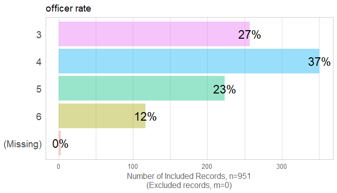
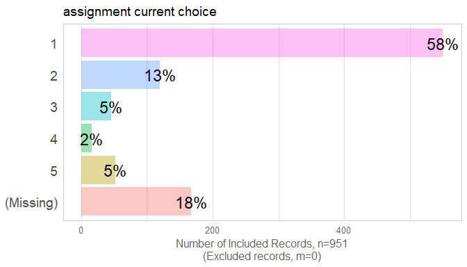
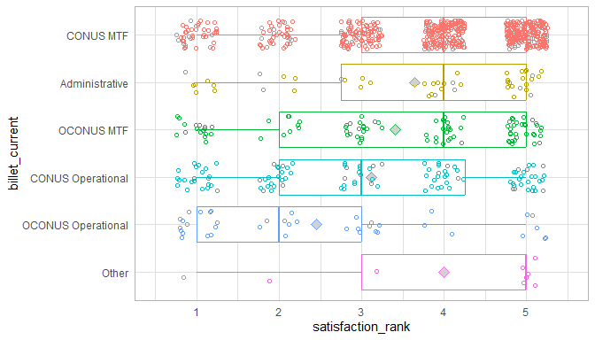
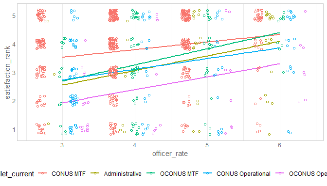
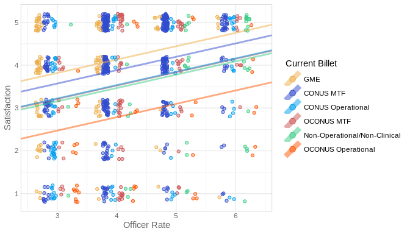

This report covers the survey about attitudes collected by Richard Childers, MD and Joel Schofer, MD.

<!--  Set the working directory to the repository's base directory; this assumes the report is nested inside of two directories.-->


<!-- Set the report-wide options, and point to the external code file. -->


<!-- Load 'sourced' R files.  Suppress the output when loading sources. --> 


<!-- Load packages, or at least verify they're available on the local machine.  Suppress the output when loading packages. --> 


<!-- Load any global functions and variables declared in the R file.  Suppress the output. --> 


<!-- Declare any global functions specific to a Rmd output.  Suppress the output. --> 


<!-- Load the datasets.   -->


<!-- Tweak the datasets.   -->


Summary {.tabset .tabset-fade .tabset-pills}
============================================

Notes 
-----------------------------------

1. The current report covers 951 responses.
1. We excluded 17 cases because their orders preceded the year 2012 and 26 cases because the `year_executed_order` value was missing.

Unanswered Questions
-----------------------------------

Answered Questions
-----------------------------------

Histograms
============================================

Univariate
-----------------------------------
<!-- --><!-- -->

```
Warning: Factor `iv` contains implicit NA, consider using `forcats::fct_explicit_na`
```

<!-- --><!-- --><!-- -->

```
Warning: Factor `iv` contains implicit NA, consider using `forcats::fct_explicit_na`
```

<!-- --><!-- --><!-- --><!-- --><!-- --><!-- -->

Relationships between Outcomes
============================================

                             satisfaction rank   transparency rank   favoritism rank   assignment current choice
--------------------------  ------------------  ------------------  ----------------  --------------------------
satisfaction_rank                        1.000               0.771             0.486                      -0.519
transparency_rank                        0.771               1.000             0.488                      -0.405
favoritism_rank                          0.486               0.488             1.000                      -0.325
assignment_current_choice               -0.519              -0.405            -0.325                       1.000

<!-- --><!-- -->


Analyses - 1 Predictor
============================================

By Rank
-----------------------------------
### satisfaction_rank

<!-- --><br/>Data:<code> ds </code><br/>Formula:<code> ~ satisfaction_rank 1 + officer_rate_f </code><table class="table table-striped table-hover table-condensed table-responsive" style="width: auto !important; ">
 <thead>
  <tr>
   <th style="text-align:left;"> term </th>
   <th style="text-align:right;"> estimate </th>
   <th style="text-align:right;"> std.error </th>
   <th style="text-align:right;"> statistic </th>
   <th style="text-align:right;"> p.value </th>
  </tr>
 </thead>
<tbody>
  <tr>
   <td style="text-align:left;"> (Intercept) </td>
   <td style="text-align:right;"> 3.1361502 </td>
   <td style="text-align:right;"> 0.0903269 </td>
   <td style="text-align:right;"> 34.720017 </td>
   <td style="text-align:right;"> 0.00e+00 </td>
  </tr>
  <tr>
   <td style="text-align:left;"> officer_rate_f4 </td>
   <td style="text-align:right;"> 0.4547589 </td>
   <td style="text-align:right;"> 0.1158670 </td>
   <td style="text-align:right;"> 3.924834 </td>
   <td style="text-align:right;"> 9.37e-05 </td>
  </tr>
  <tr>
   <td style="text-align:left;"> officer_rate_f5 </td>
   <td style="text-align:right;"> 0.7953566 </td>
   <td style="text-align:right;"> 0.1268635 </td>
   <td style="text-align:right;"> 6.269388 </td>
   <td style="text-align:right;"> 0.00e+00 </td>
  </tr>
  <tr>
   <td style="text-align:left;"> officer_rate_f6 </td>
   <td style="text-align:right;"> 0.9934794 </td>
   <td style="text-align:right;"> 0.1557247 </td>
   <td style="text-align:right;"> 6.379715 </td>
   <td style="text-align:right;"> 0.00e+00 </td>
  </tr>
</tbody>
</table>

<table class="table table-striped table-hover table-condensed table-responsive" style="width: auto !important; ">
 <thead>
  <tr>
   <th style="text-align:right;"> r.squared </th>
   <th style="text-align:right;"> adj.r.squared </th>
   <th style="text-align:right;"> sigma </th>
   <th style="text-align:right;"> statistic </th>
   <th style="text-align:right;"> p.value </th>
   <th style="text-align:right;"> df </th>
   <th style="text-align:right;"> logLik </th>
   <th style="text-align:right;"> AIC </th>
   <th style="text-align:right;"> BIC </th>
   <th style="text-align:right;"> deviance </th>
   <th style="text-align:right;"> df.residual </th>
  </tr>
 </thead>
<tbody>
  <tr>
   <td style="text-align:right;"> 0.0619066 </td>
   <td style="text-align:right;"> 0.0586569 </td>
   <td style="text-align:right;"> 1.318277 </td>
   <td style="text-align:right;"> 19.04967 </td>
   <td style="text-align:right;"> 0 </td>
   <td style="text-align:right;"> 4 </td>
   <td style="text-align:right;"> -1472.875 </td>
   <td style="text-align:right;"> 2955.751 </td>
   <td style="text-align:right;"> 2979.593 </td>
   <td style="text-align:right;"> 1504.982 </td>
   <td style="text-align:right;"> 866 </td>
  </tr>
</tbody>
</table>

By Specialty Type
-----------------------------------
### satisfaction_rank

<!-- --><br/>Data:<code> [ ds ds$specialty_type != "unknown"  </code><br/>Formula:<code> ~ satisfaction_rank 1 + specialty_type </code><table class="table table-striped table-hover table-condensed table-responsive" style="width: auto !important; ">
 <thead>
  <tr>
   <th style="text-align:left;"> term </th>
   <th style="text-align:right;"> estimate </th>
   <th style="text-align:right;"> std.error </th>
   <th style="text-align:right;"> statistic </th>
   <th style="text-align:right;"> p.value </th>
  </tr>
 </thead>
<tbody>
  <tr>
   <td style="text-align:left;"> (Intercept) </td>
   <td style="text-align:right;"> 3.9172414 </td>
   <td style="text-align:right;"> 0.0625729 </td>
   <td style="text-align:right;"> 62.602823 </td>
   <td style="text-align:right;"> 0.0000000 </td>
  </tr>
  <tr>
   <td style="text-align:left;"> specialty_typesurgical </td>
   <td style="text-align:right;"> -0.2326776 </td>
   <td style="text-align:right;"> 0.1238796 </td>
   <td style="text-align:right;"> -1.878257 </td>
   <td style="text-align:right;"> 0.0606834 </td>
  </tr>
  <tr>
   <td style="text-align:left;"> specialty_typefamily </td>
   <td style="text-align:right;"> -0.5635828 </td>
   <td style="text-align:right;"> 0.1195853 </td>
   <td style="text-align:right;"> -4.712809 </td>
   <td style="text-align:right;"> 0.0000028 </td>
  </tr>
  <tr>
   <td style="text-align:left;"> specialty_typeoperational </td>
   <td style="text-align:right;"> -1.2544507 </td>
   <td style="text-align:right;"> 0.1540125 </td>
   <td style="text-align:right;"> -8.145121 </td>
   <td style="text-align:right;"> 0.0000000 </td>
  </tr>
  <tr>
   <td style="text-align:left;"> specialty_typeresident </td>
   <td style="text-align:right;"> -0.4020899 </td>
   <td style="text-align:right;"> 0.2356418 </td>
   <td style="text-align:right;"> -1.706360 </td>
   <td style="text-align:right;"> 0.0883012 </td>
  </tr>
</tbody>
</table>

<table class="table table-striped table-hover table-condensed table-responsive" style="width: auto !important; ">
 <thead>
  <tr>
   <th style="text-align:right;"> r.squared </th>
   <th style="text-align:right;"> adj.r.squared </th>
   <th style="text-align:right;"> sigma </th>
   <th style="text-align:right;"> statistic </th>
   <th style="text-align:right;"> p.value </th>
   <th style="text-align:right;"> df </th>
   <th style="text-align:right;"> logLik </th>
   <th style="text-align:right;"> AIC </th>
   <th style="text-align:right;"> BIC </th>
   <th style="text-align:right;"> deviance </th>
   <th style="text-align:right;"> df.residual </th>
  </tr>
 </thead>
<tbody>
  <tr>
   <td style="text-align:right;"> 0.0811978 </td>
   <td style="text-align:right;"> 0.0769342 </td>
   <td style="text-align:right;"> 1.305062 </td>
   <td style="text-align:right;"> 19.04449 </td>
   <td style="text-align:right;"> 0 </td>
   <td style="text-align:right;"> 5 </td>
   <td style="text-align:right;"> -1458.551 </td>
   <td style="text-align:right;"> 2929.103 </td>
   <td style="text-align:right;"> 2957.693 </td>
   <td style="text-align:right;"> 1468.146 </td>
   <td style="text-align:right;"> 862 </td>
  </tr>
</tbody>
</table>

By Bonus Pay
-----------------------------------
### satisfaction_rank

<!-- --><br/>Data:<code> ds </code><br/>Formula:<code> ~ satisfaction_rank 1 + bonus_pay_cut4 </code><table class="table table-striped table-hover table-condensed table-responsive" style="width: auto !important; ">
 <thead>
  <tr>
   <th style="text-align:left;"> term </th>
   <th style="text-align:right;"> estimate </th>
   <th style="text-align:right;"> std.error </th>
   <th style="text-align:right;"> statistic </th>
   <th style="text-align:right;"> p.value </th>
  </tr>
 </thead>
<tbody>
  <tr>
   <td style="text-align:left;"> (Intercept) </td>
   <td style="text-align:right;"> 2.8411215 </td>
   <td style="text-align:right;"> 0.1285699 </td>
   <td style="text-align:right;"> 22.097867 </td>
   <td style="text-align:right;"> 0e+00 </td>
  </tr>
  <tr>
   <td style="text-align:left;"> bonus_pay_cut4$20-24k </td>
   <td style="text-align:right;"> 0.8846169 </td>
   <td style="text-align:right;"> 0.1423437 </td>
   <td style="text-align:right;"> 6.214653 </td>
   <td style="text-align:right;"> 0e+00 </td>
  </tr>
  <tr>
   <td style="text-align:left;"> bonus_pay_cut4$24-32k </td>
   <td style="text-align:right;"> 0.9289934 </td>
   <td style="text-align:right;"> 0.1633872 </td>
   <td style="text-align:right;"> 5.685841 </td>
   <td style="text-align:right;"> 0e+00 </td>
  </tr>
  <tr>
   <td style="text-align:left;"> bonus_pay_cut432k+ </td>
   <td style="text-align:right;"> 0.9110153 </td>
   <td style="text-align:right;"> 0.1778978 </td>
   <td style="text-align:right;"> 5.121004 </td>
   <td style="text-align:right;"> 4e-07 </td>
  </tr>
</tbody>
</table>

<table class="table table-striped table-hover table-condensed table-responsive" style="width: auto !important; ">
 <thead>
  <tr>
   <th style="text-align:right;"> r.squared </th>
   <th style="text-align:right;"> adj.r.squared </th>
   <th style="text-align:right;"> sigma </th>
   <th style="text-align:right;"> statistic </th>
   <th style="text-align:right;"> p.value </th>
   <th style="text-align:right;"> df </th>
   <th style="text-align:right;"> logLik </th>
   <th style="text-align:right;"> AIC </th>
   <th style="text-align:right;"> BIC </th>
   <th style="text-align:right;"> deviance </th>
   <th style="text-align:right;"> df.residual </th>
  </tr>
 </thead>
<tbody>
  <tr>
   <td style="text-align:right;"> 0.0472242 </td>
   <td style="text-align:right;"> 0.0439312 </td>
   <td style="text-align:right;"> 1.329938 </td>
   <td style="text-align:right;"> 14.34077 </td>
   <td style="text-align:right;"> 0 </td>
   <td style="text-align:right;"> 4 </td>
   <td style="text-align:right;"> -1483.945 </td>
   <td style="text-align:right;"> 2977.89 </td>
   <td style="text-align:right;"> 3001.744 </td>
   <td style="text-align:right;"> 1535.262 </td>
   <td style="text-align:right;"> 868 </td>
  </tr>
</tbody>
</table>

By Assignment Current Choice
-----------------------------------
### satisfaction_rank

<!-- --><br/>Data:<code> ds </code><br/>Formula:<code> ~ satisfaction_rank 1 + assignment_current_choice </code><table class="table table-striped table-hover table-condensed table-responsive" style="width: auto !important; ">
 <thead>
  <tr>
   <th style="text-align:left;"> term </th>
   <th style="text-align:right;"> estimate </th>
   <th style="text-align:right;"> std.error </th>
   <th style="text-align:right;"> statistic </th>
   <th style="text-align:right;"> p.value </th>
  </tr>
 </thead>
<tbody>
  <tr>
   <td style="text-align:left;"> (Intercept) </td>
   <td style="text-align:right;"> 4.7192430 </td>
   <td style="text-align:right;"> 0.0674241 </td>
   <td style="text-align:right;"> 69.99342 </td>
   <td style="text-align:right;"> 0 </td>
  </tr>
  <tr>
   <td style="text-align:left;"> assignment_current_choice </td>
   <td style="text-align:right;"> -0.5721764 </td>
   <td style="text-align:right;"> 0.0342102 </td>
   <td style="text-align:right;"> -16.72533 </td>
   <td style="text-align:right;"> 0 </td>
  </tr>
</tbody>
</table>

<table class="table table-striped table-hover table-condensed table-responsive" style="width: auto !important; ">
 <thead>
  <tr>
   <th style="text-align:right;"> r.squared </th>
   <th style="text-align:right;"> adj.r.squared </th>
   <th style="text-align:right;"> sigma </th>
   <th style="text-align:right;"> statistic </th>
   <th style="text-align:right;"> p.value </th>
   <th style="text-align:right;"> df </th>
   <th style="text-align:right;"> logLik </th>
   <th style="text-align:right;"> AIC </th>
   <th style="text-align:right;"> BIC </th>
   <th style="text-align:right;"> deviance </th>
   <th style="text-align:right;"> df.residual </th>
  </tr>
 </thead>
<tbody>
  <tr>
   <td style="text-align:right;"> 0.2693047 </td>
   <td style="text-align:right;"> 0.268342 </td>
   <td style="text-align:right;"> 1.074932 </td>
   <td style="text-align:right;"> 279.7366 </td>
   <td style="text-align:right;"> 0 </td>
   <td style="text-align:right;"> 2 </td>
   <td style="text-align:right;"> -1133.799 </td>
   <td style="text-align:right;"> 2273.598 </td>
   <td style="text-align:right;"> 2287.502 </td>
   <td style="text-align:right;"> 877.0091 </td>
   <td style="text-align:right;"> 759 </td>
  </tr>
</tbody>
</table>

By Year
-----------------------------------


By Survey Lag
-----------------------------------


By Manning Proportion
-----------------------------------
### manning_proportion

<!-- --><!-- -->

By Crtical War
-----------------------------------
<!-- -->

By Billet Current
-----------------------------------
<!-- --><br/>Data:<code> ds </code><br/>Formula:<code> ~ satisfaction_rank 1 + billet_current </code><table class="table table-striped table-hover table-condensed table-responsive" style="width: auto !important; ">
 <thead>
  <tr>
   <th style="text-align:left;"> term </th>
   <th style="text-align:right;"> estimate </th>
   <th style="text-align:right;"> std.error </th>
   <th style="text-align:right;"> statistic </th>
   <th style="text-align:right;"> p.value </th>
  </tr>
 </thead>
<tbody>
  <tr>
   <td style="text-align:left;"> (Intercept) </td>
   <td style="text-align:right;"> 3.8565121 </td>
   <td style="text-align:right;"> 0.0617313 </td>
   <td style="text-align:right;"> 62.4725615 </td>
   <td style="text-align:right;"> 0.0000000 </td>
  </tr>
  <tr>
   <td style="text-align:left;"> billet_currentGME </td>
   <td style="text-align:right;"> -0.0474212 </td>
   <td style="text-align:right;"> 0.1396572 </td>
   <td style="text-align:right;"> -0.3395546 </td>
   <td style="text-align:right;"> 0.7342744 </td>
  </tr>
  <tr>
   <td style="text-align:left;"> billet_currentNon-Operational/Non-Clinical </td>
   <td style="text-align:right;"> -0.2106788 </td>
   <td style="text-align:right;"> 0.1994360 </td>
   <td style="text-align:right;"> -1.0563728 </td>
   <td style="text-align:right;"> 0.2910929 </td>
  </tr>
  <tr>
   <td style="text-align:left;"> billet_currentOCONUS MTF </td>
   <td style="text-align:right;"> -0.4465121 </td>
   <td style="text-align:right;"> 0.1451670 </td>
   <td style="text-align:right;"> -3.0758512 </td>
   <td style="text-align:right;"> 0.0021651 </td>
  </tr>
  <tr>
   <td style="text-align:left;"> billet_currentCONUS Operational </td>
   <td style="text-align:right;"> -0.7404407 </td>
   <td style="text-align:right;"> 0.1386502 </td>
   <td style="text-align:right;"> -5.3403496 </td>
   <td style="text-align:right;"> 0.0000001 </td>
  </tr>
  <tr>
   <td style="text-align:left;"> billet_currentOCONUS Operational </td>
   <td style="text-align:right;"> -1.4065121 </td>
   <td style="text-align:right;"> 0.2167199 </td>
   <td style="text-align:right;"> -6.4899990 </td>
   <td style="text-align:right;"> 0.0000000 </td>
  </tr>
  <tr>
   <td style="text-align:left;"> billet_currentOther </td>
   <td style="text-align:right;"> 0.1434879 </td>
   <td style="text-align:right;"> 0.4422880 </td>
   <td style="text-align:right;"> 0.3244218 </td>
   <td style="text-align:right;"> 0.7456972 </td>
  </tr>
</tbody>
</table>

<table class="table table-striped table-hover table-condensed table-responsive" style="width: auto !important; ">
 <thead>
  <tr>
   <th style="text-align:right;"> r.squared </th>
   <th style="text-align:right;"> adj.r.squared </th>
   <th style="text-align:right;"> sigma </th>
   <th style="text-align:right;"> statistic </th>
   <th style="text-align:right;"> p.value </th>
   <th style="text-align:right;"> df </th>
   <th style="text-align:right;"> logLik </th>
   <th style="text-align:right;"> AIC </th>
   <th style="text-align:right;"> BIC </th>
   <th style="text-align:right;"> deviance </th>
   <th style="text-align:right;"> df.residual </th>
  </tr>
 </thead>
<tbody>
  <tr>
   <td style="text-align:right;"> 0.0733123 </td>
   <td style="text-align:right;"> 0.0668844 </td>
   <td style="text-align:right;"> 1.313876 </td>
   <td style="text-align:right;"> 11.40534 </td>
   <td style="text-align:right;"> 0 </td>
   <td style="text-align:right;"> 7 </td>
   <td style="text-align:right;"> -1471.84 </td>
   <td style="text-align:right;"> 2959.681 </td>
   <td style="text-align:right;"> 2997.847 </td>
   <td style="text-align:right;"> 1493.224 </td>
   <td style="text-align:right;"> 865 </td>
  </tr>
</tbody>
</table>

By Geographic Preference
-----------------------------------


Analyses - 2 Predictors
============================================


By Rank and Specialty Type
-----------------------------------
### satisfaction_rank

<!-- --><br/>Data:<code> [ ds ds$specialty_type != "unknown"  </code><br/>Formula:<code> ~ satisfaction_rank 1 + officer_rate_f * specialty_type </code><table class="table table-striped table-hover table-condensed table-responsive" style="width: auto !important; ">
 <thead>
  <tr>
   <th style="text-align:left;"> term </th>
   <th style="text-align:right;"> estimate </th>
   <th style="text-align:right;"> std.error </th>
   <th style="text-align:right;"> statistic </th>
   <th style="text-align:right;"> p.value </th>
  </tr>
 </thead>
<tbody>
  <tr>
   <td style="text-align:left;"> (Intercept) </td>
   <td style="text-align:right;"> 3.7794118 </td>
   <td style="text-align:right;"> 0.1553781 </td>
   <td style="text-align:right;"> 24.3239628 </td>
   <td style="text-align:right;"> 0.0000000 </td>
  </tr>
  <tr>
   <td style="text-align:left;"> officer_rate_f4 </td>
   <td style="text-align:right;"> -0.0092968 </td>
   <td style="text-align:right;"> 0.1832411 </td>
   <td style="text-align:right;"> -0.0507355 </td>
   <td style="text-align:right;"> 0.9595483 </td>
  </tr>
  <tr>
   <td style="text-align:left;"> officer_rate_f5 </td>
   <td style="text-align:right;"> 0.2560492 </td>
   <td style="text-align:right;"> 0.1891705 </td>
   <td style="text-align:right;"> 1.3535366 </td>
   <td style="text-align:right;"> 0.1762449 </td>
  </tr>
  <tr>
   <td style="text-align:left;"> officer_rate_f6 </td>
   <td style="text-align:right;"> 0.5539216 </td>
   <td style="text-align:right;"> 0.2373440 </td>
   <td style="text-align:right;"> 2.3338342 </td>
   <td style="text-align:right;"> 0.0198372 </td>
  </tr>
  <tr>
   <td style="text-align:left;"> specialty_typesurgical </td>
   <td style="text-align:right;"> -0.1127451 </td>
   <td style="text-align:right;"> 0.3654966 </td>
   <td style="text-align:right;"> -0.3084710 </td>
   <td style="text-align:right;"> 0.7577997 </td>
  </tr>
  <tr>
   <td style="text-align:left;"> specialty_typefamily </td>
   <td style="text-align:right;"> -0.9315857 </td>
   <td style="text-align:right;"> 0.2446039 </td>
   <td style="text-align:right;"> -3.8085478 </td>
   <td style="text-align:right;"> 0.0001499 </td>
  </tr>
  <tr>
   <td style="text-align:left;"> specialty_typeoperational </td>
   <td style="text-align:right;"> -1.3667134 </td>
   <td style="text-align:right;"> 0.2240553 </td>
   <td style="text-align:right;"> -6.0998925 </td>
   <td style="text-align:right;"> 0.0000000 </td>
  </tr>
  <tr>
   <td style="text-align:left;"> specialty_typeresident </td>
   <td style="text-align:right;"> -0.2294118 </td>
   <td style="text-align:right;"> 0.3259239 </td>
   <td style="text-align:right;"> -0.7038814 </td>
   <td style="text-align:right;"> 0.4816999 </td>
  </tr>
  <tr>
   <td style="text-align:left;"> officer_rate_f4:specialty_typesurgical </td>
   <td style="text-align:right;"> -0.2384509 </td>
   <td style="text-align:right;"> 0.4064573 </td>
   <td style="text-align:right;"> -0.5866567 </td>
   <td style="text-align:right;"> 0.5575904 </td>
  </tr>
  <tr>
   <td style="text-align:left;"> officer_rate_f5:specialty_typesurgical </td>
   <td style="text-align:right;"> 0.0516431 </td>
   <td style="text-align:right;"> 0.4328109 </td>
   <td style="text-align:right;"> 0.1193202 </td>
   <td style="text-align:right;"> 0.9050499 </td>
  </tr>
  <tr>
   <td style="text-align:left;"> officer_rate_f6:specialty_typesurgical </td>
   <td style="text-align:right;"> -0.1253501 </td>
   <td style="text-align:right;"> 0.4939158 </td>
   <td style="text-align:right;"> -0.2537885 </td>
   <td style="text-align:right;"> 0.7997205 </td>
  </tr>
  <tr>
   <td style="text-align:left;"> officer_rate_f4:specialty_typefamily </td>
   <td style="text-align:right;"> 0.6244337 </td>
   <td style="text-align:right;"> 0.3157016 </td>
   <td style="text-align:right;"> 1.9779237 </td>
   <td style="text-align:right;"> 0.0482607 </td>
  </tr>
  <tr>
   <td style="text-align:left;"> officer_rate_f5:specialty_typefamily </td>
   <td style="text-align:right;"> 0.3285571 </td>
   <td style="text-align:right;"> 0.3403586 </td>
   <td style="text-align:right;"> 0.9653265 </td>
   <td style="text-align:right;"> 0.3346565 </td>
  </tr>
  <tr>
   <td style="text-align:left;"> officer_rate_f6:specialty_typefamily </td>
   <td style="text-align:right;"> 0.4871412 </td>
   <td style="text-align:right;"> 0.3909269 </td>
   <td style="text-align:right;"> 1.2461183 </td>
   <td style="text-align:right;"> 0.2130651 </td>
  </tr>
  <tr>
   <td style="text-align:left;"> officer_rate_f4:specialty_typeoperational </td>
   <td style="text-align:right;"> 0.6680270 </td>
   <td style="text-align:right;"> 0.4205932 </td>
   <td style="text-align:right;"> 1.5882972 </td>
   <td style="text-align:right;"> 0.1125919 </td>
  </tr>
  <tr>
   <td style="text-align:left;"> officer_rate_f5:specialty_typeoperational </td>
   <td style="text-align:right;"> 2.3312524 </td>
   <td style="text-align:right;"> 1.3051914 </td>
   <td style="text-align:right;"> 1.7861383 </td>
   <td style="text-align:right;"> 0.0744341 </td>
  </tr>
  <tr>
   <td style="text-align:left;"> officer_rate_f6:specialty_typeoperational </td>
   <td style="text-align:right;"> 0.6583800 </td>
   <td style="text-align:right;"> 0.5362841 </td>
   <td style="text-align:right;"> 1.2276701 </td>
   <td style="text-align:right;"> 0.2199115 </td>
  </tr>
  <tr>
   <td style="text-align:left;"> officer_rate_f4:specialty_typeresident </td>
   <td style="text-align:right;"> -0.0791647 </td>
   <td style="text-align:right;"> 0.4918785 </td>
   <td style="text-align:right;"> -0.1609436 </td>
   <td style="text-align:right;"> 0.8721761 </td>
  </tr>
</tbody>
</table>

<table class="table table-striped table-hover table-condensed table-responsive" style="width: auto !important; ">
 <thead>
  <tr>
   <th style="text-align:right;"> r.squared </th>
   <th style="text-align:right;"> adj.r.squared </th>
   <th style="text-align:right;"> sigma </th>
   <th style="text-align:right;"> statistic </th>
   <th style="text-align:right;"> p.value </th>
   <th style="text-align:right;"> df </th>
   <th style="text-align:right;"> logLik </th>
   <th style="text-align:right;"> AIC </th>
   <th style="text-align:right;"> BIC </th>
   <th style="text-align:right;"> deviance </th>
   <th style="text-align:right;"> df.residual </th>
  </tr>
 </thead>
<tbody>
  <tr>
   <td style="text-align:right;"> 0.1249664 </td>
   <td style="text-align:right;"> 0.1074244 </td>
   <td style="text-align:right;"> 1.281281 </td>
   <td style="text-align:right;"> 7.123859 </td>
   <td style="text-align:right;"> 0 </td>
   <td style="text-align:right;"> 18 </td>
   <td style="text-align:right;"> -1434.353 </td>
   <td style="text-align:right;"> 2906.706 </td>
   <td style="text-align:right;"> 2997.22 </td>
   <td style="text-align:right;"> 1392.145 </td>
   <td style="text-align:right;"> 848 </td>
  </tr>
</tbody>
</table><br/>Data:<code> [ ds ds$specialty_type != "unknown"  </code><br/>Formula:<code> ~ satisfaction_rank 1 + officer_rate_f + specialty_type </code><table class="table table-striped table-hover table-condensed table-responsive" style="width: auto !important; ">
 <thead>
  <tr>
   <th style="text-align:left;"> term </th>
   <th style="text-align:right;"> estimate </th>
   <th style="text-align:right;"> std.error </th>
   <th style="text-align:right;"> statistic </th>
   <th style="text-align:right;"> p.value </th>
  </tr>
 </thead>
<tbody>
  <tr>
   <td style="text-align:left;"> (Intercept) </td>
   <td style="text-align:right;"> 3.6060419 </td>
   <td style="text-align:right;"> 0.1138533 </td>
   <td style="text-align:right;"> 31.6726901 </td>
   <td style="text-align:right;"> 0.0000000 </td>
  </tr>
  <tr>
   <td style="text-align:left;"> officer_rate_f4 </td>
   <td style="text-align:right;"> 0.1894040 </td>
   <td style="text-align:right;"> 0.1227398 </td>
   <td style="text-align:right;"> 1.5431344 </td>
   <td style="text-align:right;"> 0.1231669 </td>
  </tr>
  <tr>
   <td style="text-align:left;"> officer_rate_f5 </td>
   <td style="text-align:right;"> 0.4624532 </td>
   <td style="text-align:right;"> 0.1364136 </td>
   <td style="text-align:right;"> 3.3900819 </td>
   <td style="text-align:right;"> 0.0007306 </td>
  </tr>
  <tr>
   <td style="text-align:left;"> officer_rate_f6 </td>
   <td style="text-align:right;"> 0.7806986 </td>
   <td style="text-align:right;"> 0.1587342 </td>
   <td style="text-align:right;"> 4.9182747 </td>
   <td style="text-align:right;"> 0.0000010 </td>
  </tr>
  <tr>
   <td style="text-align:left;"> specialty_typesurgical </td>
   <td style="text-align:right;"> -0.2466207 </td>
   <td style="text-align:right;"> 0.1222314 </td>
   <td style="text-align:right;"> -2.0176535 </td>
   <td style="text-align:right;"> 0.0439382 </td>
  </tr>
  <tr>
   <td style="text-align:left;"> specialty_typefamily </td>
   <td style="text-align:right;"> -0.5476117 </td>
   <td style="text-align:right;"> 0.1188297 </td>
   <td style="text-align:right;"> -4.6083747 </td>
   <td style="text-align:right;"> 0.0000047 </td>
  </tr>
  <tr>
   <td style="text-align:left;"> specialty_typeoperational </td>
   <td style="text-align:right;"> -1.0520849 </td>
   <td style="text-align:right;"> 0.1656575 </td>
   <td style="text-align:right;"> -6.3509630 </td>
   <td style="text-align:right;"> 0.0000000 </td>
  </tr>
  <tr>
   <td style="text-align:left;"> specialty_typeresident </td>
   <td style="text-align:right;"> -0.1655041 </td>
   <td style="text-align:right;"> 0.2383040 </td>
   <td style="text-align:right;"> -0.6945081 </td>
   <td style="text-align:right;"> 0.4875516 </td>
  </tr>
</tbody>
</table>

<table class="table table-striped table-hover table-condensed table-responsive" style="width: auto !important; ">
 <thead>
  <tr>
   <th style="text-align:right;"> r.squared </th>
   <th style="text-align:right;"> adj.r.squared </th>
   <th style="text-align:right;"> sigma </th>
   <th style="text-align:right;"> statistic </th>
   <th style="text-align:right;"> p.value </th>
   <th style="text-align:right;"> df </th>
   <th style="text-align:right;"> logLik </th>
   <th style="text-align:right;"> AIC </th>
   <th style="text-align:right;"> BIC </th>
   <th style="text-align:right;"> deviance </th>
   <th style="text-align:right;"> df.residual </th>
  </tr>
 </thead>
<tbody>
  <tr>
   <td style="text-align:right;"> 0.113058 </td>
   <td style="text-align:right;"> 0.1058219 </td>
   <td style="text-align:right;"> 1.282431 </td>
   <td style="text-align:right;"> 15.62411 </td>
   <td style="text-align:right;"> 0 </td>
   <td style="text-align:right;"> 8 </td>
   <td style="text-align:right;"> -1440.206 </td>
   <td style="text-align:right;"> 2898.412 </td>
   <td style="text-align:right;"> 2941.287 </td>
   <td style="text-align:right;"> 1411.091 </td>
   <td style="text-align:right;"> 858 </td>
  </tr>
</tbody>
</table>

By Rank and Assignment Current Choice
-----------------------------------


By Rank and Bonus Pay
-----------------------------------
### satisfaction_rank

<!-- --><br/>Data:<code> ds </code><br/>Formula:<code> ~ satisfaction_rank 1 + officer_rate_f + bonus_pay </code><table class="table table-striped table-hover table-condensed table-responsive" style="width: auto !important; ">
 <thead>
  <tr>
   <th style="text-align:left;"> term </th>
   <th style="text-align:right;"> estimate </th>
   <th style="text-align:right;"> std.error </th>
   <th style="text-align:right;"> statistic </th>
   <th style="text-align:right;"> p.value </th>
  </tr>
 </thead>
<tbody>
  <tr>
   <td style="text-align:left;"> (Intercept) </td>
   <td style="text-align:right;"> 2.9244122 </td>
   <td style="text-align:right;"> 0.1132714 </td>
   <td style="text-align:right;"> 25.817747 </td>
   <td style="text-align:right;"> 0.0000000 </td>
  </tr>
  <tr>
   <td style="text-align:left;"> officer_rate_f4 </td>
   <td style="text-align:right;"> 0.2934115 </td>
   <td style="text-align:right;"> 0.1267040 </td>
   <td style="text-align:right;"> 2.315724 </td>
   <td style="text-align:right;"> 0.0208064 </td>
  </tr>
  <tr>
   <td style="text-align:left;"> officer_rate_f5 </td>
   <td style="text-align:right;"> 0.6032909 </td>
   <td style="text-align:right;"> 0.1408814 </td>
   <td style="text-align:right;"> 4.282261 </td>
   <td style="text-align:right;"> 0.0000206 </td>
  </tr>
  <tr>
   <td style="text-align:left;"> officer_rate_f6 </td>
   <td style="text-align:right;"> 0.8478220 </td>
   <td style="text-align:right;"> 0.1620620 </td>
   <td style="text-align:right;"> 5.231467 </td>
   <td style="text-align:right;"> 0.0000002 </td>
  </tr>
  <tr>
   <td style="text-align:left;"> bonus_pay </td>
   <td style="text-align:right;"> 0.0000158 </td>
   <td style="text-align:right;"> 0.0000051 </td>
   <td style="text-align:right;"> 3.072155 </td>
   <td style="text-align:right;"> 0.0021917 </td>
  </tr>
</tbody>
</table>

<table class="table table-striped table-hover table-condensed table-responsive" style="width: auto !important; ">
 <thead>
  <tr>
   <th style="text-align:right;"> r.squared </th>
   <th style="text-align:right;"> adj.r.squared </th>
   <th style="text-align:right;"> sigma </th>
   <th style="text-align:right;"> statistic </th>
   <th style="text-align:right;"> p.value </th>
   <th style="text-align:right;"> df </th>
   <th style="text-align:right;"> logLik </th>
   <th style="text-align:right;"> AIC </th>
   <th style="text-align:right;"> BIC </th>
   <th style="text-align:right;"> deviance </th>
   <th style="text-align:right;"> df.residual </th>
  </tr>
 </thead>
<tbody>
  <tr>
   <td style="text-align:right;"> 0.0720318 </td>
   <td style="text-align:right;"> 0.0677406 </td>
   <td style="text-align:right;"> 1.311901 </td>
   <td style="text-align:right;"> 16.786 </td>
   <td style="text-align:right;"> 0 </td>
   <td style="text-align:right;"> 5 </td>
   <td style="text-align:right;"> -1468.155 </td>
   <td style="text-align:right;"> 2948.309 </td>
   <td style="text-align:right;"> 2976.92 </td>
   <td style="text-align:right;"> 1488.738 </td>
   <td style="text-align:right;"> 865 </td>
  </tr>
</tbody>
</table><br/>Data:<code> ds </code><br/>Formula:<code> ~ satisfaction_rank 1 + officer_rate_f * bonus_pay </code><table class="table table-striped table-hover table-condensed table-responsive" style="width: auto !important; ">
 <thead>
  <tr>
   <th style="text-align:left;"> term </th>
   <th style="text-align:right;"> estimate </th>
   <th style="text-align:right;"> std.error </th>
   <th style="text-align:right;"> statistic </th>
   <th style="text-align:right;"> p.value </th>
  </tr>
 </thead>
<tbody>
  <tr>
   <td style="text-align:left;"> (Intercept) </td>
   <td style="text-align:right;"> 2.6738295 </td>
   <td style="text-align:right;"> 0.1412220 </td>
   <td style="text-align:right;"> 18.933520 </td>
   <td style="text-align:right;"> 0.0000000 </td>
  </tr>
  <tr>
   <td style="text-align:left;"> officer_rate_f4 </td>
   <td style="text-align:right;"> 0.9876528 </td>
   <td style="text-align:right;"> 0.2498733 </td>
   <td style="text-align:right;"> 3.952615 </td>
   <td style="text-align:right;"> 0.0000836 </td>
  </tr>
  <tr>
   <td style="text-align:left;"> officer_rate_f5 </td>
   <td style="text-align:right;"> 0.8154021 </td>
   <td style="text-align:right;"> 0.3806246 </td>
   <td style="text-align:right;"> 2.142274 </td>
   <td style="text-align:right;"> 0.0324510 </td>
  </tr>
  <tr>
   <td style="text-align:left;"> officer_rate_f6 </td>
   <td style="text-align:right;"> 1.1783927 </td>
   <td style="text-align:right;"> 0.4842708 </td>
   <td style="text-align:right;"> 2.433334 </td>
   <td style="text-align:right;"> 0.0151628 </td>
  </tr>
  <tr>
   <td style="text-align:left;"> bonus_pay </td>
   <td style="text-align:right;"> 0.0000345 </td>
   <td style="text-align:right;"> 0.0000081 </td>
   <td style="text-align:right;"> 4.232110 </td>
   <td style="text-align:right;"> 0.0000256 </td>
  </tr>
  <tr>
   <td style="text-align:left;"> officer_rate_f4:bonus_pay </td>
   <td style="text-align:right;"> -0.0000374 </td>
   <td style="text-align:right;"> 0.0000115 </td>
   <td style="text-align:right;"> -3.245845 </td>
   <td style="text-align:right;"> 0.0012162 </td>
  </tr>
  <tr>
   <td style="text-align:left;"> officer_rate_f5:bonus_pay </td>
   <td style="text-align:right;"> -0.0000172 </td>
   <td style="text-align:right;"> 0.0000157 </td>
   <td style="text-align:right;"> -1.096670 </td>
   <td style="text-align:right;"> 0.2730919 </td>
  </tr>
  <tr>
   <td style="text-align:left;"> officer_rate_f6:bonus_pay </td>
   <td style="text-align:right;"> -0.0000222 </td>
   <td style="text-align:right;"> 0.0000213 </td>
   <td style="text-align:right;"> -1.042449 </td>
   <td style="text-align:right;"> 0.2974956 </td>
  </tr>
</tbody>
</table>

<table class="table table-striped table-hover table-condensed table-responsive" style="width: auto !important; ">
 <thead>
  <tr>
   <th style="text-align:right;"> r.squared </th>
   <th style="text-align:right;"> adj.r.squared </th>
   <th style="text-align:right;"> sigma </th>
   <th style="text-align:right;"> statistic </th>
   <th style="text-align:right;"> p.value </th>
   <th style="text-align:right;"> df </th>
   <th style="text-align:right;"> logLik </th>
   <th style="text-align:right;"> AIC </th>
   <th style="text-align:right;"> BIC </th>
   <th style="text-align:right;"> deviance </th>
   <th style="text-align:right;"> df.residual </th>
  </tr>
 </thead>
<tbody>
  <tr>
   <td style="text-align:right;"> 0.0832837 </td>
   <td style="text-align:right;"> 0.0758394 </td>
   <td style="text-align:right;"> 1.30619 </td>
   <td style="text-align:right;"> 11.18754 </td>
   <td style="text-align:right;"> 0 </td>
   <td style="text-align:right;"> 8 </td>
   <td style="text-align:right;"> -1462.848 </td>
   <td style="text-align:right;"> 2943.696 </td>
   <td style="text-align:right;"> 2986.612 </td>
   <td style="text-align:right;"> 1470.687 </td>
   <td style="text-align:right;"> 862 </td>
  </tr>
</tbody>
</table><br/><code>Analysis of Variance Table

Model 1: satisfaction_rank ~ 1 + officer_rate_f + bonus_pay
Model 2: satisfaction_rank ~ 1 + officer_rate_f * bonus_pay
  Res.Df    RSS Df Sum of Sq      F  Pr(>F)
1    865 1488.7                            
2    862 1470.7  3    18.052 3.5268 0.01461
</code>

By Billet Current and Critical War
-----------------------------------
### satisfaction_rank

<!-- --><br/>Data:<code> ds </code><br/>Formula:<code> ~ satisfaction_rank 1 + billet_current + critical_war </code><table class="table table-striped table-hover table-condensed table-responsive" style="width: auto !important; ">
 <thead>
  <tr>
   <th style="text-align:left;"> term </th>
   <th style="text-align:right;"> estimate </th>
   <th style="text-align:right;"> std.error </th>
   <th style="text-align:right;"> statistic </th>
   <th style="text-align:right;"> p.value </th>
  </tr>
 </thead>
<tbody>
  <tr>
   <td style="text-align:left;"> (Intercept) </td>
   <td style="text-align:right;"> 3.8482807 </td>
   <td style="text-align:right;"> 0.1221609 </td>
   <td style="text-align:right;"> 31.5017379 </td>
   <td style="text-align:right;"> 0.0000000 </td>
  </tr>
  <tr>
   <td style="text-align:left;"> billet_currentGME </td>
   <td style="text-align:right;"> -0.0470058 </td>
   <td style="text-align:right;"> 0.1398387 </td>
   <td style="text-align:right;"> -0.3361429 </td>
   <td style="text-align:right;"> 0.7368447 </td>
  </tr>
  <tr>
   <td style="text-align:left;"> billet_currentNon-Operational/Non-Clinical </td>
   <td style="text-align:right;"> -0.2106988 </td>
   <td style="text-align:right;"> 0.1995509 </td>
   <td style="text-align:right;"> -1.0558651 </td>
   <td style="text-align:right;"> 0.2913250 </td>
  </tr>
  <tr>
   <td style="text-align:left;"> billet_currentOCONUS MTF </td>
   <td style="text-align:right;"> -0.4462987 </td>
   <td style="text-align:right;"> 0.1452762 </td>
   <td style="text-align:right;"> -3.0720701 </td>
   <td style="text-align:right;"> 0.0021924 </td>
  </tr>
  <tr>
   <td style="text-align:left;"> billet_currentCONUS Operational </td>
   <td style="text-align:right;"> -0.7404032 </td>
   <td style="text-align:right;"> 0.1387308 </td>
   <td style="text-align:right;"> -5.3369783 </td>
   <td style="text-align:right;"> 0.0000001 </td>
  </tr>
  <tr>
   <td style="text-align:left;"> billet_currentOCONUS Operational </td>
   <td style="text-align:right;"> -1.4067334 </td>
   <td style="text-align:right;"> 0.2168630 </td>
   <td style="text-align:right;"> -6.4867362 </td>
   <td style="text-align:right;"> 0.0000000 </td>
  </tr>
  <tr>
   <td style="text-align:left;"> billet_currentOther </td>
   <td style="text-align:right;"> 0.1420591 </td>
   <td style="text-align:right;"> 0.4429202 </td>
   <td style="text-align:right;"> 0.3207329 </td>
   <td style="text-align:right;"> 0.7484904 </td>
  </tr>
  <tr>
   <td style="text-align:left;"> critical_warLow Deployer </td>
   <td style="text-align:right;"> 0.0096602 </td>
   <td style="text-align:right;"> 0.1236892 </td>
   <td style="text-align:right;"> 0.0781008 </td>
   <td style="text-align:right;"> 0.9377659 </td>
  </tr>
</tbody>
</table>

<table class="table table-striped table-hover table-condensed table-responsive" style="width: auto !important; ">
 <thead>
  <tr>
   <th style="text-align:right;"> r.squared </th>
   <th style="text-align:right;"> adj.r.squared </th>
   <th style="text-align:right;"> sigma </th>
   <th style="text-align:right;"> statistic </th>
   <th style="text-align:right;"> p.value </th>
   <th style="text-align:right;"> df </th>
   <th style="text-align:right;"> logLik </th>
   <th style="text-align:right;"> AIC </th>
   <th style="text-align:right;"> BIC </th>
   <th style="text-align:right;"> deviance </th>
   <th style="text-align:right;"> df.residual </th>
  </tr>
 </thead>
<tbody>
  <tr>
   <td style="text-align:right;"> 0.0733188 </td>
   <td style="text-align:right;"> 0.065811 </td>
   <td style="text-align:right;"> 1.314632 </td>
   <td style="text-align:right;"> 9.765642 </td>
   <td style="text-align:right;"> 0 </td>
   <td style="text-align:right;"> 8 </td>
   <td style="text-align:right;"> -1471.837 </td>
   <td style="text-align:right;"> 2961.675 </td>
   <td style="text-align:right;"> 3004.612 </td>
   <td style="text-align:right;"> 1493.214 </td>
   <td style="text-align:right;"> 864 </td>
  </tr>
</tbody>
</table>

By Bonus_pay and Manning_proportion
-----------------------------------
### satisfaction_rank

<!-- --><br/>Data:<code> ds </code><br/>Formula:<code> ~ satisfaction_rank 1 + manning_proportion_cut3 + bonus_pay_cut3 </code><table class="table table-striped table-hover table-condensed table-responsive" style="width: auto !important; ">
 <thead>
  <tr>
   <th style="text-align:left;"> term </th>
   <th style="text-align:right;"> estimate </th>
   <th style="text-align:right;"> std.error </th>
   <th style="text-align:right;"> statistic </th>
   <th style="text-align:right;"> p.value </th>
  </tr>
 </thead>
<tbody>
  <tr>
   <td style="text-align:left;"> (Intercept) </td>
   <td style="text-align:right;"> 2.4680836 </td>
   <td style="text-align:right;"> 0.1647969 </td>
   <td style="text-align:right;"> 14.976514 </td>
   <td style="text-align:right;"> 0.0000000 </td>
  </tr>
  <tr>
   <td style="text-align:left;"> manning_proportion_cut3Balanced </td>
   <td style="text-align:right;"> 0.3928698 </td>
   <td style="text-align:right;"> 0.1259855 </td>
   <td style="text-align:right;"> 3.118373 </td>
   <td style="text-align:right;"> 0.0018786 </td>
  </tr>
  <tr>
   <td style="text-align:left;"> manning_proportion_cut3Over </td>
   <td style="text-align:right;"> 0.4651373 </td>
   <td style="text-align:right;"> 0.1209922 </td>
   <td style="text-align:right;"> 3.844358 </td>
   <td style="text-align:right;"> 0.0001297 </td>
  </tr>
  <tr>
   <td style="text-align:left;"> bonus_pay_cut3$20-24k </td>
   <td style="text-align:right;"> 1.0172580 </td>
   <td style="text-align:right;"> 0.1493703 </td>
   <td style="text-align:right;"> 6.810311 </td>
   <td style="text-align:right;"> 0.0000000 </td>
  </tr>
  <tr>
   <td style="text-align:left;"> bonus_pay_cut3$24k+ </td>
   <td style="text-align:right;"> 0.8796862 </td>
   <td style="text-align:right;"> 0.1546106 </td>
   <td style="text-align:right;"> 5.689687 </td>
   <td style="text-align:right;"> 0.0000000 </td>
  </tr>
</tbody>
</table>

<table class="table table-striped table-hover table-condensed table-responsive" style="width: auto !important; ">
 <thead>
  <tr>
   <th style="text-align:right;"> r.squared </th>
   <th style="text-align:right;"> adj.r.squared </th>
   <th style="text-align:right;"> sigma </th>
   <th style="text-align:right;"> statistic </th>
   <th style="text-align:right;"> p.value </th>
   <th style="text-align:right;"> df </th>
   <th style="text-align:right;"> logLik </th>
   <th style="text-align:right;"> AIC </th>
   <th style="text-align:right;"> BIC </th>
   <th style="text-align:right;"> deviance </th>
   <th style="text-align:right;"> df.residual </th>
  </tr>
 </thead>
<tbody>
  <tr>
   <td style="text-align:right;"> 0.0642006 </td>
   <td style="text-align:right;"> 0.0598832 </td>
   <td style="text-align:right;"> 1.318796 </td>
   <td style="text-align:right;"> 14.87015 </td>
   <td style="text-align:right;"> 0 </td>
   <td style="text-align:right;"> 5 </td>
   <td style="text-align:right;"> -1476.106 </td>
   <td style="text-align:right;"> 2964.213 </td>
   <td style="text-align:right;"> 2992.838 </td>
   <td style="text-align:right;"> 1507.907 </td>
   <td style="text-align:right;"> 867 </td>
  </tr>
</tbody>
</table>No interaction between manning_proportion_cut3 & bonus_pay_cut3<br/><code>Analysis of Variance Table

Model 1: satisfaction_rank ~ 1 + manning_proportion_cut3 * bonus_pay_cut3
Model 2: satisfaction_rank ~ 1 + manning_proportion_cut3 + bonus_pay_cut3
  Res.Df    RSS Df Sum of Sq      F Pr(>F)
1    863 1499.7                           
2    867 1507.9 -4   -8.1779 1.1765 0.3197
</code><br/>Data:<code> ds </code><br/>Formula:<code> ~ satisfaction_rank 1 + billet_current + critical_war </code><table class="table table-striped table-hover table-condensed table-responsive" style="width: auto !important; ">
 <thead>
  <tr>
   <th style="text-align:left;"> term </th>
   <th style="text-align:right;"> estimate </th>
   <th style="text-align:right;"> std.error </th>
   <th style="text-align:right;"> statistic </th>
   <th style="text-align:right;"> p.value </th>
  </tr>
 </thead>
<tbody>
  <tr>
   <td style="text-align:left;"> (Intercept) </td>
   <td style="text-align:right;"> 3.8482807 </td>
   <td style="text-align:right;"> 0.1221609 </td>
   <td style="text-align:right;"> 31.5017379 </td>
   <td style="text-align:right;"> 0.0000000 </td>
  </tr>
  <tr>
   <td style="text-align:left;"> billet_currentGME </td>
   <td style="text-align:right;"> -0.0470058 </td>
   <td style="text-align:right;"> 0.1398387 </td>
   <td style="text-align:right;"> -0.3361429 </td>
   <td style="text-align:right;"> 0.7368447 </td>
  </tr>
  <tr>
   <td style="text-align:left;"> billet_currentNon-Operational/Non-Clinical </td>
   <td style="text-align:right;"> -0.2106988 </td>
   <td style="text-align:right;"> 0.1995509 </td>
   <td style="text-align:right;"> -1.0558651 </td>
   <td style="text-align:right;"> 0.2913250 </td>
  </tr>
  <tr>
   <td style="text-align:left;"> billet_currentOCONUS MTF </td>
   <td style="text-align:right;"> -0.4462987 </td>
   <td style="text-align:right;"> 0.1452762 </td>
   <td style="text-align:right;"> -3.0720701 </td>
   <td style="text-align:right;"> 0.0021924 </td>
  </tr>
  <tr>
   <td style="text-align:left;"> billet_currentCONUS Operational </td>
   <td style="text-align:right;"> -0.7404032 </td>
   <td style="text-align:right;"> 0.1387308 </td>
   <td style="text-align:right;"> -5.3369783 </td>
   <td style="text-align:right;"> 0.0000001 </td>
  </tr>
  <tr>
   <td style="text-align:left;"> billet_currentOCONUS Operational </td>
   <td style="text-align:right;"> -1.4067334 </td>
   <td style="text-align:right;"> 0.2168630 </td>
   <td style="text-align:right;"> -6.4867362 </td>
   <td style="text-align:right;"> 0.0000000 </td>
  </tr>
  <tr>
   <td style="text-align:left;"> billet_currentOther </td>
   <td style="text-align:right;"> 0.1420591 </td>
   <td style="text-align:right;"> 0.4429202 </td>
   <td style="text-align:right;"> 0.3207329 </td>
   <td style="text-align:right;"> 0.7484904 </td>
  </tr>
  <tr>
   <td style="text-align:left;"> critical_warLow Deployer </td>
   <td style="text-align:right;"> 0.0096602 </td>
   <td style="text-align:right;"> 0.1236892 </td>
   <td style="text-align:right;"> 0.0781008 </td>
   <td style="text-align:right;"> 0.9377659 </td>
  </tr>
</tbody>
</table>

<table class="table table-striped table-hover table-condensed table-responsive" style="width: auto !important; ">
 <thead>
  <tr>
   <th style="text-align:right;"> r.squared </th>
   <th style="text-align:right;"> adj.r.squared </th>
   <th style="text-align:right;"> sigma </th>
   <th style="text-align:right;"> statistic </th>
   <th style="text-align:right;"> p.value </th>
   <th style="text-align:right;"> df </th>
   <th style="text-align:right;"> logLik </th>
   <th style="text-align:right;"> AIC </th>
   <th style="text-align:right;"> BIC </th>
   <th style="text-align:right;"> deviance </th>
   <th style="text-align:right;"> df.residual </th>
  </tr>
 </thead>
<tbody>
  <tr>
   <td style="text-align:right;"> 0.0733188 </td>
   <td style="text-align:right;"> 0.065811 </td>
   <td style="text-align:right;"> 1.314632 </td>
   <td style="text-align:right;"> 9.765642 </td>
   <td style="text-align:right;"> 0 </td>
   <td style="text-align:right;"> 8 </td>
   <td style="text-align:right;"> -1471.837 </td>
   <td style="text-align:right;"> 2961.675 </td>
   <td style="text-align:right;"> 3004.612 </td>
   <td style="text-align:right;"> 1493.214 </td>
   <td style="text-align:right;"> 864 </td>
  </tr>
</tbody>
</table>

By Rank and Billet Type
-----------------------------------
### satisfaction_rank

**Conculsion**: `officer_rate` has a significant positive slope --sig predicting beyond `billet_current`.  But the billet levels have the same slope.<br/>Data:<code> ds_no_other </code><br/>Formula:<code> ~ satisfaction_rank 1 + billet_current + officer_rate </code><table class="table table-striped table-hover table-condensed table-responsive" style="width: auto !important; ">
 <thead>
  <tr>
   <th style="text-align:left;"> term </th>
   <th style="text-align:right;"> estimate </th>
   <th style="text-align:right;"> std.error </th>
   <th style="text-align:right;"> statistic </th>
   <th style="text-align:right;"> p.value </th>
  </tr>
 </thead>
<tbody>
  <tr>
   <td style="text-align:left;"> (Intercept) </td>
   <td style="text-align:right;"> 2.2806025 </td>
   <td style="text-align:right;"> 0.2152925 </td>
   <td style="text-align:right;"> 10.593044 </td>
   <td style="text-align:right;"> 0.0000000 </td>
  </tr>
  <tr>
   <td style="text-align:left;"> billet_currentGME </td>
   <td style="text-align:right;"> 0.2017814 </td>
   <td style="text-align:right;"> 0.1387897 </td>
   <td style="text-align:right;"> 1.453865 </td>
   <td style="text-align:right;"> 0.1463512 </td>
  </tr>
  <tr>
   <td style="text-align:left;"> billet_currentNon-Operational/Non-Clinical </td>
   <td style="text-align:right;"> -0.5037952 </td>
   <td style="text-align:right;"> 0.1975918 </td>
   <td style="text-align:right;"> -2.549676 </td>
   <td style="text-align:right;"> 0.0109560 </td>
  </tr>
  <tr>
   <td style="text-align:left;"> billet_currentOCONUS MTF </td>
   <td style="text-align:right;"> -0.4207375 </td>
   <td style="text-align:right;"> 0.1400836 </td>
   <td style="text-align:right;"> -3.003475 </td>
   <td style="text-align:right;"> 0.0027470 </td>
  </tr>
  <tr>
   <td style="text-align:left;"> billet_currentCONUS Operational </td>
   <td style="text-align:right;"> -0.6360962 </td>
   <td style="text-align:right;"> 0.1345180 </td>
   <td style="text-align:right;"> -4.728707 </td>
   <td style="text-align:right;"> 0.0000026 </td>
  </tr>
  <tr>
   <td style="text-align:left;"> billet_currentOCONUS Operational </td>
   <td style="text-align:right;"> -1.3371740 </td>
   <td style="text-align:right;"> 0.2092479 </td>
   <td style="text-align:right;"> -6.390381 </td>
   <td style="text-align:right;"> 0.0000000 </td>
  </tr>
  <tr>
   <td style="text-align:left;"> officer_rate </td>
   <td style="text-align:right;"> 0.3630293 </td>
   <td style="text-align:right;"> 0.0474667 </td>
   <td style="text-align:right;"> 7.648078 </td>
   <td style="text-align:right;"> 0.0000000 </td>
  </tr>
</tbody>
</table>

<table class="table table-striped table-hover table-condensed table-responsive" style="width: auto !important; ">
 <thead>
  <tr>
   <th style="text-align:right;"> r.squared </th>
   <th style="text-align:right;"> adj.r.squared </th>
   <th style="text-align:right;"> sigma </th>
   <th style="text-align:right;"> statistic </th>
   <th style="text-align:right;"> p.value </th>
   <th style="text-align:right;"> df </th>
   <th style="text-align:right;"> logLik </th>
   <th style="text-align:right;"> AIC </th>
   <th style="text-align:right;"> BIC </th>
   <th style="text-align:right;"> deviance </th>
   <th style="text-align:right;"> df.residual </th>
  </tr>
 </thead>
<tbody>
  <tr>
   <td style="text-align:right;"> 0.1339518 </td>
   <td style="text-align:right;"> 0.1278671 </td>
   <td style="text-align:right;"> 1.267045 </td>
   <td style="text-align:right;"> 22.01471 </td>
   <td style="text-align:right;"> 0 </td>
   <td style="text-align:right;"> 7 </td>
   <td style="text-align:right;"> -1421.979 </td>
   <td style="text-align:right;"> 2859.959 </td>
   <td style="text-align:right;"> 2898.024 </td>
   <td style="text-align:right;"> 1371.014 </td>
   <td style="text-align:right;"> 854 </td>
  </tr>
</tbody>
</table>Analysis of Variance Table

Model 1: satisfaction_rank ~ 1 + billet_current
Model 2: satisfaction_rank ~ 1 + billet_current + officer_rate
  Res.Df    RSS Df Sum of Sq      F    Pr(>F)
1    855 1464.9                              
2    854 1371.0  1    93.905 58.493 5.496e-14
Analysis of Variance Table

Model 1: satisfaction_rank ~ 1 + billet_current + officer_rate
Model 2: satisfaction_rank ~ 1 + billet_current * officer_rate
  Res.Df    RSS Df Sum of Sq      F Pr(>F)
1    854 1371.0                           
2    849 1361.5  5    9.5562 1.1918 0.3112
<!-- -->


Experimental
-----------------------------------
<!-- -->


Session Information
============================================

For the sake of documentation and reproducibility, the current report was rendered in the following environment.  Click the line below to expand.

<details>
  <summary>Environment <span class="glyphicon glyphicon-plus-sign"></span></summary>

```
 Session info 
 setting  value                       
 version  R version 3.6.1 (2019-07-05)
 os       Ubuntu 19.10                
 system   x86_64, linux-gnu           
 ui       X11                         
 language (EN)                        
 collate  en_US.UTF-8                 
 ctype    en_US.UTF-8                 
 tz       America/Chicago             
 date     2019-11-20                  

 Packages 
 package         * version     date       lib source                                  
 assertthat        0.2.1       2019-03-21 [1] CRAN (R 3.6.1)                          
 backports         1.1.5       2019-10-02 [1] CRAN (R 3.6.1)                          
 broom             0.5.2       2019-04-07 [1] CRAN (R 3.6.1)                          
 callr             3.3.2       2019-09-22 [1] CRAN (R 3.6.1)                          
 cli               1.1.0       2019-03-19 [1] CRAN (R 3.6.1)                          
 colorspace        1.4-1       2019-03-18 [1] CRAN (R 3.6.1)                          
 corrplot          0.84        2017-10-16 [1] CRAN (R 3.6.1)                          
 crayon            1.3.4       2017-09-16 [1] CRAN (R 3.6.1)                          
 desc              1.2.0       2018-05-01 [1] CRAN (R 3.6.1)                          
 devtools          2.2.1       2019-09-24 [1] CRAN (R 3.6.1)                          
 digest            0.6.22      2019-10-21 [1] CRAN (R 3.6.1)                          
 dplyr             0.8.3       2019-07-04 [1] CRAN (R 3.6.1)                          
 ellipsis          0.3.0       2019-09-20 [1] CRAN (R 3.6.1)                          
 evaluate          0.14        2019-05-28 [1] CRAN (R 3.6.1)                          
 farver            2.0.1       2019-11-13 [1] CRAN (R 3.6.1)                          
 fs                1.3.1       2019-05-06 [1] CRAN (R 3.6.1)                          
 generics          0.0.2       2018-11-29 [1] CRAN (R 3.6.1)                          
 ggplot2         * 3.2.1       2019-08-10 [1] CRAN (R 3.6.1)                          
 glue              1.3.1       2019-03-12 [1] CRAN (R 3.6.1)                          
 gtable            0.3.0       2019-03-25 [1] CRAN (R 3.6.1)                          
 highr             0.8         2019-03-20 [1] CRAN (R 3.6.1)                          
 hms               0.5.2       2019-10-30 [1] CRAN (R 3.6.1)                          
 htmltools         0.4.0       2019-10-04 [1] CRAN (R 3.6.1)                          
 httr              1.4.1       2019-08-05 [1] CRAN (R 3.6.1)                          
 kableExtra        1.1.0       2019-03-16 [1] CRAN (R 3.6.1)                          
 knitr           * 1.26        2019-11-12 [1] CRAN (R 3.6.1)                          
 labeling          0.3         2014-08-23 [1] CRAN (R 3.6.1)                          
 lattice           0.20-38     2018-11-04 [1] CRAN (R 3.6.1)                          
 lazyeval          0.2.2       2019-03-15 [1] CRAN (R 3.6.1)                          
 lifecycle         0.1.0       2019-08-01 [1] CRAN (R 3.6.1)                          
 magrittr        * 1.5         2014-11-22 [1] CRAN (R 3.6.1)                          
 memoise           1.1.0       2017-04-21 [1] CRAN (R 3.6.1)                          
 munsell           0.5.0       2018-06-12 [1] CRAN (R 3.6.1)                          
 nlme              3.1-142     2019-11-07 [1] CRAN (R 3.6.1)                          
 pillar            1.4.2       2019-06-29 [1] CRAN (R 3.6.1)                          
 pkgbuild          1.0.6       2019-10-09 [1] CRAN (R 3.6.1)                          
 pkgconfig         2.0.3       2019-09-22 [1] CRAN (R 3.6.1)                          
 pkgload           1.0.2       2018-10-29 [1] CRAN (R 3.6.1)                          
 prettyunits       1.0.2       2015-07-13 [1] CRAN (R 3.6.1)                          
 processx          3.4.1       2019-07-18 [1] CRAN (R 3.6.1)                          
 ps                1.3.0       2018-12-21 [1] CRAN (R 3.6.1)                          
 purrr             0.3.3       2019-10-18 [1] CRAN (R 3.6.1)                          
 R6                2.4.1       2019-11-12 [1] CRAN (R 3.6.1)                          
 Rcpp              1.0.3       2019-11-08 [1] CRAN (R 3.6.1)                          
 readr             1.3.1       2018-12-21 [1] CRAN (R 3.6.1)                          
 remotes           2.1.0       2019-06-24 [1] CRAN (R 3.6.1)                          
 rlang             0.4.1       2019-10-24 [1] CRAN (R 3.6.1)                          
 rmarkdown         1.17        2019-11-13 [1] CRAN (R 3.6.1)                          
 rprojroot         1.3-2       2018-01-03 [1] CRAN (R 3.6.1)                          
 rstudioapi        0.10        2019-03-19 [1] CRAN (R 3.6.1)                          
 rvest             0.3.5       2019-11-08 [1] CRAN (R 3.6.1)                          
 scales            1.1.0       2019-11-18 [1] CRAN (R 3.6.1)                          
 sessioninfo       1.1.1       2018-11-05 [1] CRAN (R 3.6.1)                          
 stringi           1.4.3       2019-03-12 [1] CRAN (R 3.6.1)                          
 stringr           1.4.0       2019-02-10 [1] CRAN (R 3.6.1)                          
 TabularManifest   0.1-16.9003 2019-11-16 [1] Github (Melinae/TabularManifest@4cbc21c)
 testthat          2.3.0       2019-11-05 [1] CRAN (R 3.6.1)                          
 tibble            2.1.3       2019-06-06 [1] CRAN (R 3.6.1)                          
 tidyr             1.0.0       2019-09-11 [1] CRAN (R 3.6.1)                          
 tidyselect        0.2.5       2018-10-11 [1] CRAN (R 3.6.1)                          
 usethis           1.5.1       2019-07-04 [1] CRAN (R 3.6.1)                          
 vctrs             0.2.0       2019-07-05 [1] CRAN (R 3.6.1)                          
 viridisLite       0.3.0       2018-02-01 [1] CRAN (R 3.6.1)                          
 webshot           0.5.1       2018-09-28 [1] CRAN (R 3.6.1)                          
 withr             2.1.2       2018-03-15 [1] CRAN (R 3.6.1)                          
 xfun              0.11        2019-11-12 [1] CRAN (R 3.6.1)                          
 xml2              1.2.2       2019-08-09 [1] CRAN (R 3.6.1)                          
 yaml              2.2.0       2018-07-25 [1] CRAN (R 3.6.1)                          
 zeallot           0.1.0       2018-01-28 [1] CRAN (R 3.6.1)                          

[1] /home/wibeasley/R/x86_64-pc-linux-gnu-library/3.6
[2] /usr/local/lib/R/site-library
[3] /usr/lib/R/site-library
[4] /usr/lib/R/library
```
</details>


Report rendered by wibeasley at 2019-11-20, 16:50 -0600 in 71 seconds.
